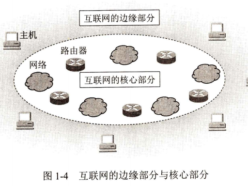
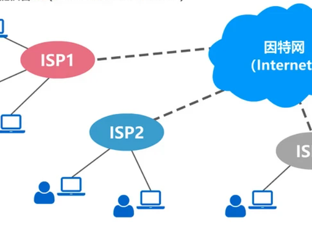

# 1.1 互联网概述

> 章级精读：[../study.md#ch1-1](../study.md#ch1-1) · 图：[边缘/核心](../assets/internet_edge_and_core.png) · [ISP 层级](../assets/isp_hierarchy.png)

## 本节核心目标

建立对互联网整体架构、基本概念的全局认知。

---

## 1）internet 与 Internet 的区别

| | internet（小写 i） | Internet（大写 I） |
|--|-------------------|-------------------|
| 含义 | **互连网**（通用名词） | **互联网 / 因特网**（专用名词） |
| 范围 | 任意多个网络互连，协议不限 | 全球最大、基于 **TCP/IP** 的网络 |
| 关系 | 上位概念 | internet 的特例（前身 ARPANET） |

一句话：**Internet 是 internet 的一个特例（全球 TCP/IP 互联网）**。

---

## 2）互联网的基本组成（四大件）

**互联网 = 端系统 + 通信链路 + 分组交换机 + 网络协议**

| 组成 | 作用 | 位置 |
|------|------|------|
| **端系统（主机）** | 收发数据、跑应用 | **边缘** |
| **通信链路** | 传比特流（光纤/铜线/无线） | 边缘—核心之间 |
| **分组交换机** | 转发分组（路由器、交换机） | **核心** |
| **网络协议** | 规定格式与规则（TCP/IP、HTTP…） | 全程 |

| 部分 | 又叫 | 含什么 |
|------|------|--------|
| **边缘部分** | 资源子网 | **主机**（PC、手机、服务器、IoT） |
| **核心部分** | 通信子网 | **路由器 + 链路** 组成的网络云 |

---

## 3）ISP 层级结构（三级）

1. **本地 ISP**：小区/校园/企业接入 → 用户**直接接入**
2. **区域 ISP**：城市/省级，连接多个本地 ISP
3. **主干 ISP**：国家/国际骨干，连接各区域 ISP

特点：**层层接入、对等互联、冗余备份** → 全球互联底座。

---

## 4）网络通信两大模式

| 模式 | 代表 | 特点 |
|------|------|------|
| **面向连接** | TCP | 先建连 → 传数据 → 释放；可靠、有序 |
| **无连接** | UDP | 直接发；不保证可靠；开销小、实时性好 |

**应用架构（常一起考）**

- **C/S**：客户端请求、服务器响应（网页、网盘）
- **P2P**：对等通信（BT、部分直播）

---

## 5）标准制定与管理组织

| 组织 | 负责 |
|------|------|
| **IETF** | TCP/IP、HTTP 等；文档 **RFC** |
| **IEEE** | 局域网/无线：**802.3 以太网、802.11 Wi‑Fi** |
| **ISOC / ICANN** | 互联网架构、**域名与 IP 分配** |

---

## 易错点清单

| 易混 | 纠正 |
|------|------|
| internet = Internet？ | 小写泛指；大写特指全球 TCP/IP 网 |
| 路由器在边缘？ | **核心**转发；主机在**边缘** |
| 交换机 = 路由器？ | 交换机多二层/LAN；路由器三层/跨网 |
| ISP 只有一家？ | **本地→区域→主干** 多级 |
| 无连接 = 不可靠？ | UDP **无连接**且**不保证可靠**；TCP **面向连接**且可靠 |

---

## 个人总结（背）

互联网本质是**海量异构网络通过统一 TCP/IP 协议互联互通，分层协作（边缘 + 核心）实现全球数据交付**。
