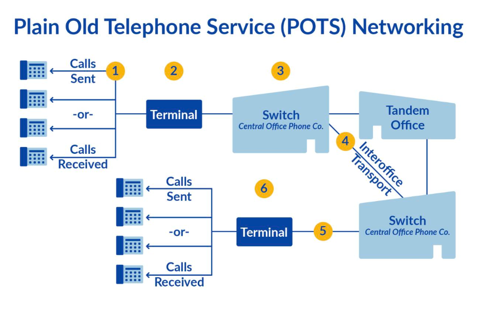
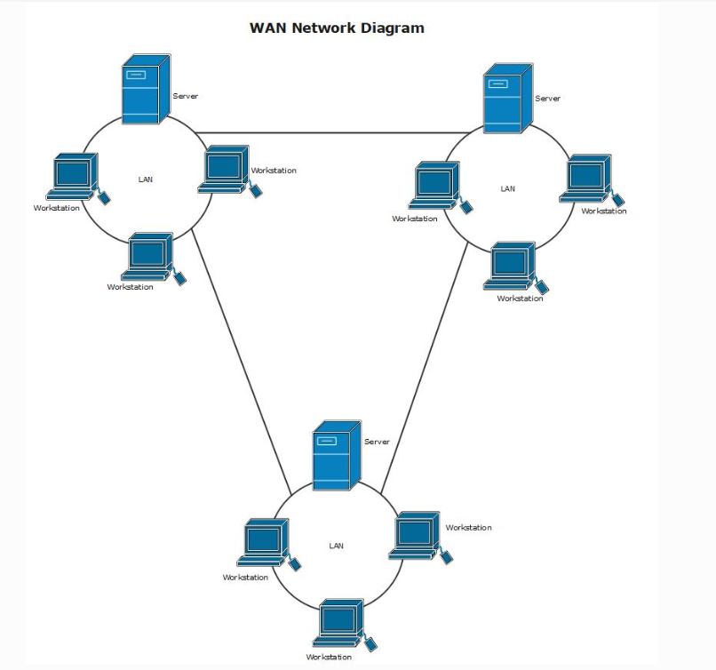
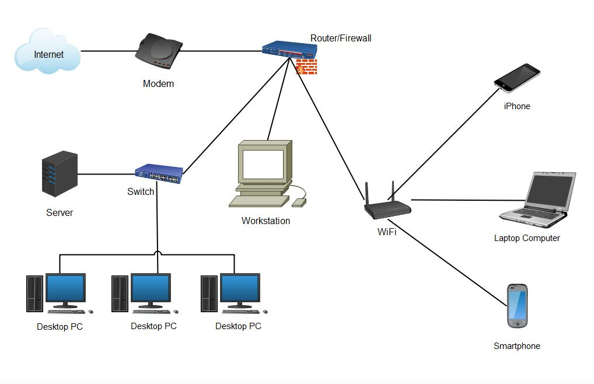
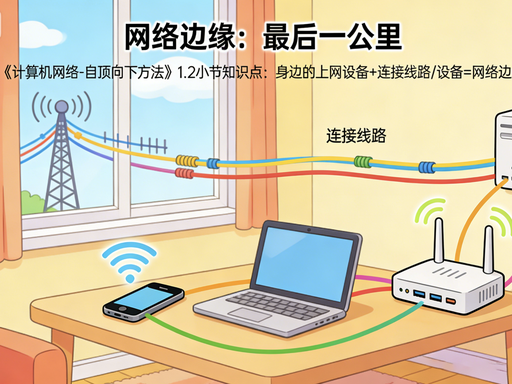
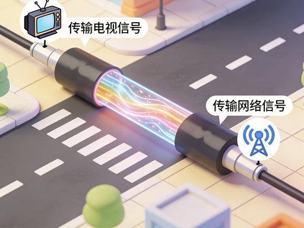
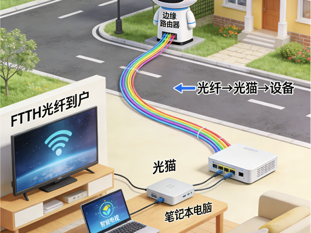

# 1.2 网络边缘与接入

> 章级精读：[../study.md#ch1-2](../study.md#ch1-2) · **什么是 LAN/WAN**：[#ch1-2-lan-wan-def](#ch1-2-lan-wan-def) · [完整路径](#ch1-2-lan-wan-path) · [家用一体机](#ch1-2-home-gateway)

## 本节核心目标

理解**网络边缘（终端侧）**如何通过**接入网**连接到互联网核心；掌握常见接入方式、传输介质与应用架构。

---

<a id="ch1-2-intuition"></a>

## 〇、超通俗拆解（边缘 · 端系统 · 接入网 · 边缘路由器）

### 1）整体怎么分

| 部分 | 是什么 | 一句话 |
|------|--------|--------|
| **网络边缘** | 最外侧、面向用户 | **端系统**所在的一侧 |
| **网络核心** | 中间骨干 | 大量路由器 + 高速链路，**远距离转发** |

→ 衔接 [1.3 网络核心](../1.3_network_core_switching/study.md)

### 2）端系统三类（能收发数据的设备）

| 类型 | 干什么 | 例子 |
|------|--------|------|
| **客户端** | **主动**发请求、要数据 | 手机、电脑、平板；刷视频、开网页 |
| **服务端** | **被动**等请求、提供资源 | 云主机、网站/游戏服务器 |
| **边缘路由器** | **边缘与核心的分界** | 光猫、小区网关、园区出口路由器 |

边缘路由器特点：

- 一边接各类**主机**（经接入网）
- 一边接**运营商骨干**（网络核心）
- 教材常称：主机到互联网路径上的**第一台路由器**

### 3）接入网是什么

**接入网** = **端系统 → 边缘路由器** 之间的那一段（线路 + 设备）

作用：把分散的终端**汇到**边缘路由器，再送入骨干网。俗称 **「最后一公里」**。

### 4）一条完整链路（家用）

```
电脑(客户端) ──网线/Wi‑Fi──► 光猫(边缘路由器) ──► 运营商骨干(网络核心) ──► … ──► 云端服务器(服务端)
     └──────────── 接入网 ────────────┘
```

- **电脑**：端系统 · 客户端  
- **云端服务器**：端系统 · 服务端  
- **光猫**：边缘路由器（分界）  
- **电脑 ↔ 光猫**：**接入网**（DSL/同轴/光纤/Wi‑Fi 等见下文）  
- 家宽 **WiFi + 光猫路由一体机** 细拆 → [家用实景专节](#ch1-2-home-gateway)

### 5）四句话记住关系

1. **网络边缘** = 用户侧；核心是中间的转发骨干  
2. **端系统** 主要指 **客户端 + 服务端**（主机）；**边缘路由器**是边缘上的**分界设备**  
3. **接入网** = 主机连到边缘路由器的那段  
4. **边缘路由器** = 接入网与核心网的**中转站**

### 简易结构图

```
  客户端 ──┐
           ├── 接入网 ──► 边缘路由器 ──► 网络核心（骨干路由器群）
  服务端 ──┘      ▲
                  └── 分界：再往里就是核心，不是「你家局域网」了
```

> **考试口径**：严格说 **端系统（end system）= 主机**（客户机/服务器）；边缘路由器算**边缘侧设备/第一台路由器**，不叫应用主机。通俗记「光猫是分界」即可。→ [易错表](#ch1-2-exam)

---

<a id="ch1-2-home-gateway"></a>

## 〇·二、家用实景：WiFi + 光猫路由一体机（课本 + 实物）

### 1）先分清「概念」和「盒子」

| | 是什么 | 说明 |
|--|--------|------|
| **Wi‑Fi** | **无线接入方式**（不是一台机器） | 属于**无线接入网**；用无线电波传数据；链路层常用 802.11 |
| **带天线的家用盒子** | **光猫路由一体机**（常见） | 机身里 **光猫模块（ONT）+ 无线路由模块** 集成；外表一台，功能两套 |

课本仍按逻辑拆：**接入网 = 主机 → 边缘路由器**；一体机只是把「路由 + 光猫」装进了同一个外壳。

### 2）接入网对应到家里

**接入网** = **端系统 → 边缘路由器** 的最后一段：

| 角色 | 家里是谁 |
|------|----------|
| **端系统** | 手机、电脑等**客户端** |
| **边缘路由器** | 一体机里的 **光猫模块**（光电转换 + 连运营商光纤） |
| **接入网通路** | 主机到光猫模块这一段 |

| 连法 | 接入网形态 |
|------|------------|
| 手机连天线 | **Wi‑Fi 无线接入网**（家里短途无线） |
| 电脑插 LAN 口 | **有线接入网**（双绞线以太网） |

> 运营商光纤（小区 → 你家光猫）属于 **FTTH 接入** 的馈线部分；光猫再往里才是你家局域网。

### 3）完整数据流（手机上网）

1. **手机**（端系统 · 客户端）产生数据  
2. **Wi‑Fi**（无线接入网）→ 一体机的 **天线路由模块**  
3. 路由模块在设备**内部**把帧交给 **光猫模块**（NAT/转发）  
4. **光猫模块**作 **边缘路由器**：信号转换，送出家庭内网 → **运营商线路**  
5. 进入 **网络核心**（骨干路由器集群）  
6. 核心转发至远端 **服务器** 或其他网络  

### 4）一体机内部分工

| 模块 | 干什么 |
|------|--------|
| **天线 / 路由模块** | 收发 Wi‑Fi；接家里终端；家庭局域网侧 |
| **光猫模块** | **内网 ↔ 外网分界**；光电转换；数据送上运营商骨干 |

### 5）易混纠正

1. **Wi‑Fi 不直接进网络核心**——只管家里到盒子这一段无线  
2. 无线数据须经一体机 **光猫模块** 才能上外网  
3. **老式**：无线路由器 ─网线─ 独立光猫（两台）；**现在**：一台集成，**链路逻辑不变**  
4. **接入网**包含 Wi‑Fi、网线等所有「主机→边缘路由器」通路；Wi‑Fi 只是其中一种形态  

### 6）极简流程图

```
手机（客户端）
    ↓  Wi‑Fi（无线接入网）
一体机 · 天线路由模块
    ↓  设备内部转发
一体机 · 光猫模块（边缘路由器）
    ↓
网络核心（运营商骨干网）
    ↓
远端服务器 / 其他网络
```

**一句话**：Wi‑Fi 是终端连盒子的无线通道；一体机兼无线接入与边缘路由；终端经 Wi‑Fi 完成接入，再由机内光猫打通去核心的路。

---

<a id="ch1-2-lan-wan-def"></a>

## 〇·三、什么是 LAN？什么是 WAN？

> **LAN = 家门口/公司里的「小局域网」；WAN = 跨城跨国的「大广域网」（互联网骨干就是最大的 WAN）。**

### LAN（Local Area Network，局域网）

**是什么**：地理范围**很小**的计算机网络——一个房间、一栋楼、一个园区、一个机房。

**通俗类比**：像**同一个小区里的内部道路**——住户（电脑、手机）之间串门很快，路短、车少、自己人管。

| 项 | 说明 |
|----|------|
| **范围** | 通常 **几百米～几公里** |
| **谁在用** | 家里 Wi‑Fi、公司办公网、机房内网 |
| **典型设备** | **交换机**、路由器 **LAN 口**、Wi‑Fi 热点 |
| **怎么找设备** | 主要靠 **MAC 地址**（二层）；同网段用 **私有 IP** |
| **常见地址** | `192.168.x.x`、`10.x.x.x`、`172.16~31.x.x` |
| **速度** | 百兆 / 千兆 / 万兆，一般**又快又便宜** |
| **谁拥有** | **你自己或公司**（私网，外人默认进不来） |

**你家 LAN 长什么样**：手机、电脑连 Wi‑Fi → 家用路由器 → 大家 IP 都是 `192.168.1.x`，互相 ping 得通。

→ 家庭拓扑图：[#ch1-2-lan-wan](#ch1-2-lan-wan) · 链路层本跳：[6.1 MAC 逐跳](../../06_link_layer_and_lan/6.1_link_layer_service/study.md#ch6-1-simple)

---

### WAN（Wide Area Network，广域网）

**是什么**：地理范围**很大**的计算机网络——跨城市、跨省份、跨国家。

**通俗类比**：像**连接全国的高速公路/铁路网**——把无数个「小区」（LAN）远距离连起来；路长、要经过很多「收费站」（路由器）。

| 项 | 说明 |
|----|------|
| **范围** | **几十～几千公里**，甚至全球 |
| **谁在用** | 运营商骨干网、**互联网**、跨省专线 |
| **典型设备** | **路由器** + 光纤/专线 |
| **怎么找下一跳** | 靠 **IP 地址**（三层路由） |
| **地址** | 跨网通信需要 **公网 IP**（或由 NAT 转换） |
| **速度** | 看套餐和链路，通常**比 LAN 慢、更贵** |
| **谁拥有** | **运营商**或大型机构（电信、移动、联通骨干） |

**互联网**：可以看作把全球无数 LAN **用 WAN 串起来**的超级网络。

→ 多 LAN 互联图：[#ch1-2-lan-wan](#ch1-2-lan-wan) · 网络核心：[1.3](../1.3_network_core_switching/study.md)

---

### 一句区分 + 怎么连

| | **LAN** | **WAN** |
|---|---------|---------|
| **中文** | 局域网 | 广域网 |
| **范围** | 小（室内/园区） | 大（跨城/跨国） |
| **比喻** | 小区内部路 | 全国高速网 |
| **核心设备** | 交换机 | 路由器 |
| **寻址** | MAC 为主 | IP 路由 |
| **关系** | 无数个 LAN | 用 WAN **把 LAN 连起来** |

```text
  [你家 LAN] ──接入网──► [运营商 WAN / 互联网] ──► [公司 LAN]
   192.168.x.x              公网 IP 路由              10.x.x.x
```

**易混**：路由器上的 **LAN 口** = 接家里小网；**WAN 口** = 接外面大网（光猫/运营商）。名字里就写着 LAN/WAN。

→ 完整四段路径：[#ch1-2-lan-wan-path](#ch1-2-lan-wan-path) · 对照表：[#ch1-2-lan-wan](#ch1-2-lan-wan)

---

<a id="ch1-2-lan-wan-path"></a>

## 〇·四、标准说法：接入网 → LAN → WAN → LAN

> **通俗「电话网 → LAN → WAN → LAN」= 标准「用户终端 → 本地 LAN → 接入网 → WAN/互联网 → 远端 LAN → 目标主机」。**

### 1）这句话在说什么？

描述**早期家庭/企业经电话网（现多为光纤）接入互联网，再连到对方局域网**的完整路径：

```text
用户终端 → 本地局域网(LAN) → 接入网(电话线/ADSL/光纤) → 广域网(WAN/互联网) → 远端局域网(LAN) → 目标主机
```

**历史典型**：PC → 家里 LAN → 电话线（Modem/ADSL）→ 运营商骨干（WAN）→ 公司/网站机房 LAN → 服务器。

→ 衔接 [1.3 网络核心](../1.3_network_core_switching/study.md) · NAT 私网出公网：[4.3 NAT](../../04_network_layer_data_plane/4.3_ipv4_ipv6_nat/study.md#ch4-3-nat-simple)

---

<a id="ch1-2-pstn-access"></a>

### 2）电话网 / 接入网（PSTN · Modem · ADSL）

| 项 | 说明 |
|----|------|
| **标准名** | **接入网（Access Network）**；早期载体常是 **PSTN**（公共交换电话网） |
| **性质** | 原为**电路交换**打电话用的网；后被复用传数据 |
| **Modem** | 调制解调器：数字 ↔ 模拟语音，走电话线；早期几十 Kbps |
| **ADSL** | 同电话线**频分**：语音 + 数据并行；几 Mbps 级 |
| **现代** | 多数已换 **FTTH 光纤**；逻辑仍是 **接入网**，只是物理介质变了 |
| **角色** | **最后一公里**——把用户从家门口接到运营商网络 |



---

<a id="ch1-2-lan-wan"></a>

### 3）LAN 与 WAN 对照

| | **LAN（局域网）** | **WAN（广域网）** |
|---|-------------------|-------------------|
| **范围** | 房间 / 楼 / 园区，**数百米级** | 跨城 / 省 / 国，**几十～几千公里** |
| **典型设备** | 交换机、家用路由器**内网口** | **路由器** + 光纤骨干 |
| **转发依据** | **MAC 地址**（二层交换机） | **IP 地址**（三层路由） |
| **地址** | **私有 IP**（192.168.x.x、10.x.x.x） | 跨网需 **公网 IP** |
| **速率** | 百兆 / 千兆 / 万兆 | 取决于链路与运营商 |
| **例子** | 家内网、公司内网、机房内网 | 运营商骨干、**互联网核心** |
| **角色** | **家门口的小网络** | **远距离大网络**，把无数 LAN 互联 |





---

<a id="ch1-2-full-path"></a>

### 4）完整串起来（实例：在家访问公司服务器）

| 步骤 | 位置 | 发生什么 |
|------|------|----------|
| **①** | **家庭 LAN** | 电脑 `192.168.1.100` → Wi‑Fi/网线 → 家用路由器 LAN 口 |
| **②** | **LAN → 接入网** | 路由器 **WAN 口** → 光猫/ADSL Modem → 电话线/光纤 → 运营商 |
| **③** | **接入网 → WAN** | 数据走光纤骨干，跨城/跨省路由，到公司所在运营商节点 |
| **④** | **WAN → 公司 LAN** | 公司防火墙/路由器：公网 IP → 内网 `10.0.0.0/8` → 交换机 → 服务器 |

**返程**：公司 LAN → WAN → 接入网 → 家庭 LAN → 你的电脑（对称路径）。

### 5）极简拓扑图（设备 · 接口 · IP/MAC 分工）

```text
┌──────────── 家庭 LAN（私有 IP · MAC 二层转发）─────────────┐
│  PC 192.168.1.100 ──WiFi/网线──► 家用路由器 LAN 口         │
│         │ MAC 寻址（交换机/WiFi）                           │
└─────────┼──────────────────────────────────────────────────┘
          │ 路由器 WAN 口（NAT：私网→公网）
          ▼
┌──────────── 接入网（Modem/光猫 · 边缘路由器）──────────────┐
│  光猫/ADSL Modem ──电话线/光纤──► 运营商接入节点(DSLAM/OLT) │
└─────────┼──────────────────────────────────────────────────┘
          ▼
┌──────────── WAN / 互联网骨干（公网 IP · IP 三层路由）──────┐
│  运营商路由器群 ──光纤──► 跨城路由 ──► 公司所在 POP         │
└─────────┼──────────────────────────────────────────────────┘
          ▼
┌──────────── 公司 LAN（私有 IP · MAC 二层转发）─────────────┐
│  防火墙/路由器 ──► 交换机 ──► 服务器 10.0.0.50              │
└────────────────────────────────────────────────────────────┘
```

| 段 | 转发靠什么 | 典型地址 |
|----|------------|----------|
| 家庭 LAN | **MAC**（交换机/Wi‑Fi） | 192.168.1.x |
| 接入网 | 调制/光电转换 + 第一跳路由 | 运营商分配公网/动态 IP |
| WAN | **IP 路由**（路由器） | 公网 IP |
| 公司 LAN | **MAC** + 内网 **IP** | 10.x / 172.16 / 192.168 |

### 6）一句话总结

| 概念 | 记住 |
|------|------|
| **电话网/接入网** | 早期用 PSTN/ADSL 把用户**接入**互联网；现多为光纤，角色不变 |
| **LAN** | 家/公司/机房的**小网络**，MAC 转发、私有 IP |
| **WAN** | **互联网骨干**，IP 路由、连接全世界 LAN |

**本质**：**用户内网 → 接入网 → 互联网骨干 → 目标内网** 的经典模型。

---

## 一、网络边缘（Edge）

### 定义

**网络边缘**位于互联网**边缘/末端**，直接面向用户和应用；主要由**端系统（主机）**及连接它们的**接入网**构成，经**边缘路由器**进入核心。

### 端系统分类

| 类型 | 例子 |
|------|------|
| **客户端 Client** | 手机、电脑、平板、IoT |
| **服务器 Server** | Web/邮件/数据库（多在数据中心） |
| **边缘路由器** | 接入网与核心的**分界**；光猫、园区出口等（见 [〇、通俗拆解](#ch1-2-intuition)） |

一句话：**边缘 = 主机（客户+服务）+ 接入网 + 边缘路由器（分界）**。



---

## 二、接入网（Access Network）——「最后一公里」

**定义**：把**端系统 → 边缘路由器**连起来的网络；决定带宽、时延、稳定性。

### 1）家庭接入（主流三种）

#### DSL（数字用户线）

| 项 | 内容 |
|----|------|
| 介质 | **电话线（双绞线）** |
| 特点 | **不对称**（下行快、上行慢）；电话与上网可同时进行 |
| 设备 | DSL Modem → 机房 **DSLAM** |

#### 同轴电缆（Cable / HFC）



| 项 | 内容 |
|----|------|
| 介质 | **有线电视同轴**；常 **HFC**（光纤到小区 + 同轴入户） |
| 特点 | **共享带宽**（邻居多易变慢）；速率常高于 DSL |
| 设备 | Cable Modem → 机房 **CMTS** |

#### 光纤接入（FTTH 光纤到户）



| 项 | 内容 |
|----|------|
| 介质 | **单模光纤**（目前家用最优） |
| 特点 | **高速、低时延、抗干扰**；可上下行对称 |
| 设备 | **光猫 ONT** → 分光器 → 局端 **OLT** |
| 类型 | **PON**（无源，家用主流）、AON（有源，企业） |

**路径**：边缘路由器 → 光纤 → **光猫** → 家用路由器 → 电脑/电视

### 2）企业/园区接入

- **有线以太网 LAN**：双绞线/光纤 → 交换机 → 企业路由器
- 典型：**终端 → 接入交换机 → 汇聚 → 核心路由器 → 互联网**

### 3）无线接入

| 方式 | 要点 |
|------|------|
| **Wi‑Fi（802.11）** | 短距、共享信道；家庭/办公室热点 |
| **4G/5G** | 广覆盖、移动；5G 低时延、大带宽 |
| 其他 | 卫星、蓝牙、NFC（特殊场景） |

---

## 三、传输介质（物理媒体）

| 介质 | 用途 | 特点 |
|------|------|------|
| **双绞线** | DSL、以太网 | 便宜、易受干扰 |
| **同轴电缆** | Cable/HFC | 抗干扰优于双绞线 |
| **光纤** | FTTH、骨干 | **高速、低损耗、抗电磁干扰** |
| **无线信道** | Wi‑Fi/4G/5G | 灵活、移动；易受环境影响 |

---

## 四、两种应用通信架构

### C/S 客户端-服务器（主流）

- **模式**：客户端请求 → 服务器响应
- **特点**：集中管理、易维护、可扩展
- **例子**：HTTP 网页、网盘、游戏服务器

### P2P 对等网络

- **模式**：无中心；节点既下载又上传
- **特点**：去中心化、带宽利用好、容错强
- **例子**：BT、部分直播、区块链

---

<a id="ch1-2-exam"></a>

## 易错点对比表（可打印）

### 家庭接入：DSL vs 同轴 vs 光纤

| 对比项 | DSL | 同轴 Cable/HFC | 光纤 FTTH |
|--------|-----|----------------|-----------|
| 介质 | 电话双绞线 | 有线电视同轴 | 单模光纤 |
| 带宽 | 不对称 | **共享**、常较快 | **高、可对称** |
| 典型设备 | Modem+DSLAM | Modem+CMTS | ONT+OLT |
| 干扰 | 距离敏感 | 共享拖慢 | 最优 |

### C/S vs P2P

| | C/S | P2P |
|--|-----|-----|
| 中心 | **有**服务器 | **无**严格中心 |
| 扩展 | 加服务器 | 用户越多可能越快（BT） |
| 例子 | 网页、微信后台 | BT 下载 |

### 其他易混

| 易混 | 纠正 |
|------|------|
| 接入网 = 核心网？ | 接入是**最后一公里**；核心是路由器骨干 |
| 边缘路由器 = 端系统？ | **严格**：端系统=**主机**；边缘路由器是**分界/第一台路由器** |
| 接入网到哪为止？ | 到**边缘路由器**为止，不是到骨干核心 |
| Wi‑Fi = 互联网？ | Wi‑Fi 只是**接入网里的一种无线方式**，不是骨干网 |
| Wi‑Fi 直连核心？ | **否**；须经光猫/边缘路由器上运营商网 |
| 光猫 = 路由器？ | **光猫**：ONT、连光纤、分界；**路由**：NAT、Wi‑Fi、局域网（常一体机） |
| 一体机 = 一个功能？ | **两套**：无线路由模块 + 光猫模块（见 [#ch1-2-home-gateway](#ch1-2-home-gateway)） |
| 电话网 = WAN？ | **否**；电话网/PSTN/ADSL 是**接入网**；WAN 是运营商**骨干/互联网** → [#ch1-2-lan-wan-path](#ch1-2-lan-wan-path) |
| LAN 用 IP 路由？ | LAN 内**二层 MAC 转发**为主；跨网段/出网才经**路由器用 IP** |

---

## 锚点索引

| 锚点 | 内容 |
|------|------|
| [#ch1-2-intuition](#ch1-2-intuition) | 边缘 · 接入网 · 边缘路由器 |
| [#ch1-2-home-gateway](#ch1-2-home-gateway) | WiFi + 光猫一体机 |
| [#ch1-2-lan-wan-def](#ch1-2-lan-wan-def) | 什么是 LAN / WAN |
| [#ch1-2-lan-wan-path](#ch1-2-lan-wan-path) | 接入网→LAN→WAN→LAN 总览 |
| [#ch1-2-pstn-access](#ch1-2-pstn-access) | PSTN / Modem / ADSL |
| [#ch1-2-lan-wan](#ch1-2-lan-wan) | LAN vs WAN 对照 |
| [#ch1-2-full-path](#ch1-2-full-path) | 完整实例 + 拓扑图 |
| [#ch1-2-exam](#ch1-2-exam) | 易错表 |

---

## 个人总结（背诵版）

**边缘=主机+接入网+边缘路由器（分界）；核心是骨干转发。接入网=主机到边缘路由器（Wi‑Fi/网线都算）。路径：用户LAN→接入网(电话/光纤)→WAN骨干→远端LAN。家宽：Wi‑Fi→一体机→光猫→核心。端系统=客户机+服务器。接入：DSL/同轴/光纤/Wi‑Fi/5G；架构：C/S 与 P2P。**
