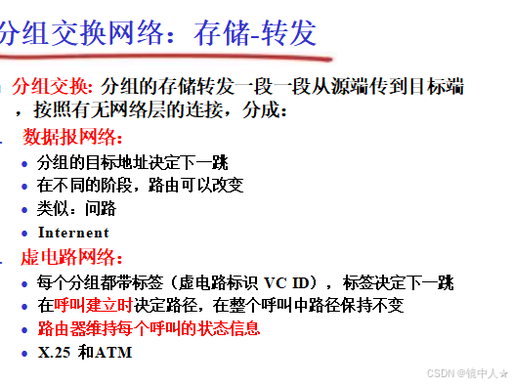
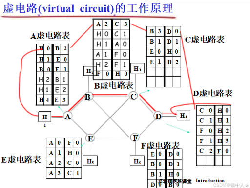
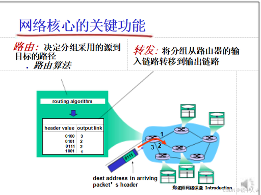

# 1.3 网络核心与交换技术

> 章级精读：[../study.md#ch1-3](../study.md#ch1-3)  
> 深化：**转发表/FIB** → [第 4 章 §4.4](../../04_network_layer_data_plane/study.md#ch4-fib) · **路由协议/RIB** → [第 5 章控制平面](../../05_network_layer_control_plane/study.md#ch5-control-plane-basics)

## 本节核心目标

弄懂网络核心的数据转发原理，分清**电路交换 / 分组交换**，理解**路由 vs 转发**，以及分组交换下的**数据报 vs 虚电路**。

> FDM/TDM → [通俗深拆](#ch1-3-switching-intuition) · **考试背诵**（三种交换+公式）→ [#ch1-3-exam-switching](#ch1-3-exam-switching)

---

## 〇、电路交换 & 分组交换通俗梳理

### 1）电路交换的两种复用（FDM / TDM）

#### 频分复用 FDM

- 把链路**总带宽**切成多个**互不重叠的频段**
- 每路通信**独占一个频段**，多路信号**同时**传输、互不干扰
- 接收端用**滤波 / 解调**按频段拆出各自数据
- **例子**：老式有线电视——多频道共用一根线，每频道对应不同频率

#### 时分复用 TDM

- 整条链路**同一频段**，不再划频率
- 时间切成**固定时隙**，每路通信**预先分配**专属时隙
- 只在**自己的时隙**发送，其余时间**空等**
- 链路表面「多人共用」，实质是**按时间轮流**；通信期间该时隙相当于**独占**
- **类比**：多人**排队轮流**用同一条通道，轮到你才能传

| | FDM | TDM |
|--|-----|-----|
| 切分维度 | **频率** | **时间** |
| 并行性 | 多信号**同时**、不同频 | 多信号**轮流**、同频 |
| 静默时 | 频段仍被占用 | 时隙仍被预留 → **浪费** |

> **TDM 属于电路交换**：呼叫建立后通路/时隙**全程保持**，不是互联网的分组交换。

---

### 2）分组与 IP 报文、以太网帧（层级）

自上而下**逐层加头**（与 [1.5 封装](../1.5_protocol_layer_architecture/study.md#ch1-5-exam)、[第 4 章](../../04_network_layer_data_plane/study.md#ch4-encapsulation) 一致）：

1. 上层数据拆成**分组**，携带源/目的地址等信息  
2. 网络层封装 → **IP 报文**（IP 头：源 IP、目的 IP）  
3. 链路层封装 → **以太网帧**（帧头：源/目的 **MAC**）

**口诀**：**分组**是统称；落地传输时是 **IP 包 ⊂ 以太网帧**（再经物理层发比特）。

---

### 3）分组交换的链路占用 vs TDM（易混！）

| 现象 | 说明 |
|------|------|
| 链路上「一次传一个分组」 | 输出链路上**同一时刻通常只发一个分组**，看起来也像「轮流」 |
| 与 TDM 的本质区别 | 见下表 |

| 对比 | **TDM（电路交换）** | **分组交换** |
|------|---------------------|--------------|
| 时隙 | **固定分配**，不用也空着 | **无固定时隙** |
| 谁先发 | 轮到你时隙才能发 | **有包就抢**信道（排队调度） |
| 连接 | 通信前**建立电路**，全程保持 | **无固定电路**（数据报）；包**独立寻址转发** |
| 利用率 | 静默期浪费 | 空闲链路立刻给别的流用 → **统计复用** |
| 类比 | 固定配额分资源 | 像 **CPU 时间片轮转**：按需调度、动态抢占 |

**补充**：TDM 是**电路交换的资源复用手段**；分组交换即便「轮流发」，调度逻辑仍是**动态、按需**，这是**电话网 vs 互联网**的设计分水岭。

---

### 4）一句话对比（电路 vs 分组）

| | **电路交换** | **分组交换** |
|--|--------------|--------------|
| FDM | 同时、不同频**并行** | — |
| TDM | 轮流、同频**串行**时隙 | — |
| 资源 | **全程预留独占** | **动态共享**，无固定预留 |
| 时延 | 稳定，适合**语音** | 可变（排队），适合**突发数据** |
| 数据形态 | 连续比特流 | 带地址的**小包** + 多层封装 |

---

## 一、网络核心（Network Core）

### 1）定义

由大量**路由器 + 交换机 + 高速光纤链路**组成的**全球转发骨干网**，负责把数据从源主机转发到目标主机。

### 2）核心功能

| 功能 | 含义 |
|------|------|
| **转发（Forwarding）** | 本地把分组从**入接口**换到**出接口** |
| **路由（Routing）** | 全局计算路径，生成/更新路由表 |
| **互联** | 连接无数异构网络，形成 Internet |

一句话：**边缘是主机，核心是路由器转发网。**

---

## 二、两种交换技术（重点对比）

### 1）电路交换（Circuit Switching）

**典型：传统电话网、程控电话、专线**

**核心三步（必考）**

1. **连接建立**：拨号 → 交换机选路 → **独占物理链路**
2. **数据传输**：全程占带宽，**别人不能抢**
3. **连接释放**：挂断 → 释放资源

**特点**

- ✅ 实时性强、时延小、抖动小（主要为**传播时延**）
- ✅ 按序到达、链路正常时**无乱序、无丢包**
- ❌ **资源独占、利用率极低**（沉默也占带宽）
- ❌ 不适合**突发数据、短报文**

类比：**专属私人车道**——通畅但贵、利用率低。

| 复用方式 | 要点 |
|----------|------|
| **FDM** | 频谱划频段，连接期间独占该频段（[通俗](#ch1-3-switching-intuition)） |
| **TDM** | 固定时隙轮流；静默也占时隙 → 浪费（**≠ 分组动态调度**） |

---

### 2）分组交换（Packet Switching）——互联网主流

**典型：Internet、4G/5G、Wi‑Fi、TCP/IP**

**核心机制**

- 数据切成**小分组**，含**目的地址 + 控制信息**（或 VCI，见虚电路）
- **存储‑转发（必考）**：路由器 **收齐整组比特** → 暂存 → 查表 → 转发（**不能边收边发**）
- **统计复用**：多用户**动态共享**带宽，利用率高

**特点**

- ✅ 灵活、高效，适合**突发数据**；带宽利用率**最高**
- ❌ **排队时延**、抖动大；可能**乱序、丢包**（队列满）

**时延公式（必考）**——单分组、**N** 段链路速率均为 **R**，忽略传播/处理：

`d_end-end ≈ N × (L / R)`

- **L**：分组长度（bit）  
- **R**：链路速率（bps）  
- **N**：链路段数  

→ 衔接 [1.4 四大时延](../1.4_delay_loss_throughput/study.md#ch1-4-exam)

类比：**快递分包裹**——共享公路网，便宜高效，可能迟到/乱序。

#### 分组交换的两种形态

| | **数据报（Datagram）** | **虚电路（Virtual Circuit）** |
|--|------------------------|-------------------------------|
| 连接性 | **无连接**（每包独立选路） | **面向连接**（呼叫建立时定路径） |
| 转发依据 | 分组头 **目的地址** | **VCI 标签**（本地有效，每跳可改） |
| 路径 | 各包路径**可不同** | 建立后路径**固定** |
| 路由器状态 | 一般**无** per-flow 状态 | 须维护**虚电路表** |
| 类比 | 每路口**问路** | 先订好**专属通道号** |
| 代表 | **Internet（IP）** | X.25、**ATM** |

---

## 三、考试背诵版：三种交换 + 终极对比

### 1）报文交换 Message Switching（补充常考）

- **不切分**：**整个报文** 存储‑转发
- **时延**：通常**最大**（须收齐整份报文再转）
- **利用率**：中等
- **典型**：早期**电报网**
- 与分组对比：分组 = 切小块；报文 = **整包搬**

---

### 2）三种交换一眼对比

| 对比项 | 电路交换 | 报文交换 | 分组交换 |
|--------|----------|----------|----------|
| **单元** | 比特流（电路） | 整份报文 | **分组** |
| **连接** | 面向连接、独占 | 无连接 | 数据报无连接 / 虚电路面向连接 |
| **转发** | 电路传送 | 存储转发整报文 | **存储转发**分组 |
| **利用率** | **极低** | 中等 | **极高**（统计复用） |
| **时延** | 极小、稳定 | 大 | 较大、**抖动**（排队） |
| **乱序/丢包** | 无（链路好） | 可能 | 可能 |
| **代表** | 电话网 | 电报 | **互联网** |

---

### 3）电路 vs 分组（终极表，必背）

| 对比项 | 电路交换 | 分组交换 |
|--------|----------|----------|
| **连接方式** | 面向连接（**物理独占**） | 无连接（数据报）/ 面向连接（虚电路） |
| **资源分配** | 静态预留、独占 | 动态**统计复用**、共享 |
| **时延** | 极小、稳定 | 较大、抖动大（排队） |
| **利用率** | **极低** | **极高** |
| **可靠性** | 按序、无乱序（链路正常） | 可能乱序、丢包 |
| **适用场景** | 语音、实时视频 | 数据、网页、文件（突发） |
| **代表网络** | 传统电话网 | 互联网、4G/5G |

---

### 4）考试必背三句话

1. **电路交换**：面向连接、独占资源、时延小、**利用率低**（电话网）  
2. **分组交换**：存储转发、共享带宽、时延大、**利用率高**（互联网）  
3. **公式**：N 段同速率链路，单分组时延 **≈ N×(L/R)**（忽略传播/处理）

### 5）口诀

**电话用电路，互联网用分组；存储转发收齐再发；La/R 大了会丢包（见 1.4）。**

---

## 四、路由 vs 转发（必考）

### 1）转发（Forwarding）——本地动作

- 发生在**单个路由器**
- 依据**转发表（FIB）**：查分组头（如目的前缀）→ **出接口**
- **把分组从入接口送到出接口**
- 快、偏硬件、毫秒级

### 2）路由（Routing）——全局计算

- 发生在**整个网络**（分布式算法）
- 依靠**路由协议**（如 OSPF、BGP）
- **计算源到目的的最优路径，生成/更新路由表（RIB）**，再下发到 FIB
- 慢、软件计算、秒级～分钟级

### 一句话区分

**路由 = 选路（全局）；转发 = 送货（本地）**

---

## 五、易错对比（考试速记）

| 易混 | 纠正 |
|------|------|
| 路由 = 转发？ | **路由**算路填表；**转发**按表换接口 |
| 分组交换 = 一定无连接？ | **数据报**无连接；**虚电路**在网层面向连接 |
| 电路交换一定更快？ | 时延稳定，但**静默期浪费带宽**；突发数据不如分组 |
| 存储转发 = 边收边发？ | 须**收齐整组**再查表转发（增加每跳时延） |
| Internet 用虚电路？ | 主流是 **IP 数据报**；VC 见于 ATM 等历史/专网 |
| TDM = 分组轮流？ | **否**；TDM **固定时隙+电路**；分组 **动态排队、无固定电路** |
| FDM vs TDM | FDM **同时不同频**；TDM **轮流同时隙** |
| 分组 = 帧？ | 分组是统称；传输时多为 **IP 报文 + 以太网帧** 封装 |
| 报文交换 vs 分组？ | 报文=**整包**转发；分组=**切块**+统计复用 |
| 三种交换利用率？ | 电路**最低**；分组**最高**；报文居中 |
| 电路时延公式？ | 电路侧重**传播时延**；分组考试常考 **N×L/R** |

---

## 六、网络的网络（提纲）

因特网 = 多层级 ISP + IXP 对等 + 内容提供商自建网「靠近用户」。详见 [1.1](../1.1_internet_overview/study.md) ISP 层级与 [章级 §1.3.3](../study.md#ch1-3)。

---

## 个人总结（直接背）

**三种交换：电路(独占/电话)、报文(整包/电报)、分组(存储转发/互联网)。公式 d≈N×L/R。电路三步建立-传输-释放；分组统计复用可丢包乱序。路由选路，转发送货。电话电路，互联网分组。**
