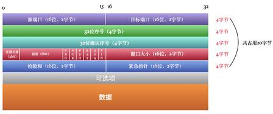
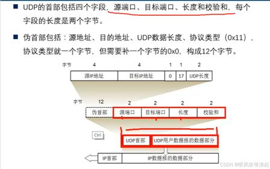
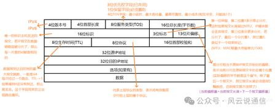
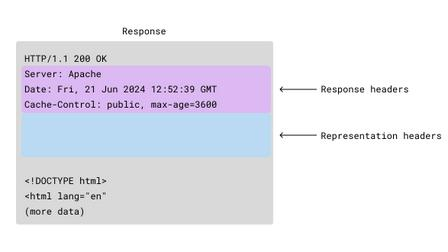
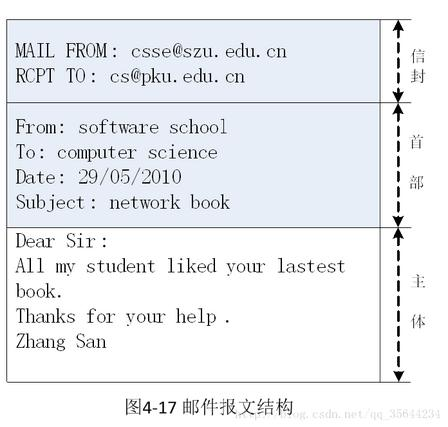
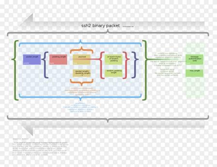

# 1.5 协议分层与体系结构

> 章级精读：[../study.md#ch1-5](../study.md#ch1-5) · **1.6–1.8**（安全/历史/小结）见 [章级 §1.6–1.8](../study.md#ch1-6)  
> 封装实图：[第 4 章](../../04_network_layer_data_plane/study.md#ch4-encapsulation) · Wireshark 树：[#ch4-encapsulation-wireshark](../../04_network_layer_data_plane/study.md#ch4-encapsulation-wireshark) · 以太网帧：[第 6 章](../../06_link_layer_and_lan/study.md#ch6-ethernet-frame)

## 本节核心目标

掌握 **TCP/IP 五层模型**、分层优点、**对等层通信**，以及**封装 / 解封装**流程（考试画图：**MAC 最外，应用数据最内**）。

> PDU：[报文→段→包→帧→比特](#ch1-5-pdu) · TCP/UDP：[#ch1-5-tcp-udp](#ch1-5-tcp-udp) · IP/以太网帧：[#ch1-5-ip-frame](#ch1-5-ip-frame) · 应用层：[HTTP/SMTP/SSH](#ch1-5-app-messages) · 总封装图：[第 4 章](../../04_network_layer_data_plane/study.md#ch4-encapsulation-diagram)

---

## 一、TCP/IP 五层模型（自上而下，必考）

**应用层 → 运输层 → 网络层 → 数据链路层 → 物理层**

| 层 | 功能 | 典型协议 | PDU（数据单位） | 一句话 |
|----|------|----------|-----------------|--------|
| **应用** Application | 用户服务、应用协议 | HTTP/HTTPS、FTP、SMTP、DNS、SSH | **报文 Message** | 用户能直接用的服务 |
| **运输** Transport | 端到端**进程**通信、端口、可靠/不可靠 | **TCP**（可靠）、**UDP**（尽力而为） | **段 Segment** | 送到对方**某个程序（端口）** |
| **网络** Network | **主机**寻址、路由、跨网转发 | **IP**（v4/v6）、ICMP、**ARP** | **包 Packet**（数据报） | 送到对方**电脑（IP）** |
| **链路** Link | 相邻节点、帧封装、MAC、差错检测 | **以太网**、PPP、Wi‑Fi | **帧 Frame** | 相邻节点间传**帧（MAC）** |
| **物理** Physical | 比特流、电气/光信号、介质 | （无统一“协议名”） | **比特 bit** | 只传 0/1，不管语义 |

记忆口诀：**应运网链物**（从上到下越来越“靠近硬件”）。

---

### 各层展开（背诵用）

#### 1）应用层

- 功能：**提供用户服务、定义应用协议**
- 典型：**HTTP、HTTPS、FTP、SMTP、DNS、SSH**
- PDU：**报文（Message）**

#### 2）运输层

- 功能：**端到端进程通信**、端口寻址、可靠/不可靠传输
- 典型：**TCP**（可靠、面向连接）、**UDP**（尽力而为、无连接）
- PDU：**段（Segment）**

#### 3）网络层

- 功能：**主机寻址（IP）**、路由选择、跨网转发
- 典型：**IP**、ICMP、**ARP**（IP→MAC 解析，属网络层配套）
- PDU：**数据包 / 数据报（Packet / Datagram）**

#### 4）数据链路层

- 功能：**帧封装**、**MAC 寻址**、差错检测、**局域网/相邻链路**传输
- 典型：**以太网（Ethernet）**、PPP
- PDU：**帧（Frame）**

#### 5）物理层

- 功能：比特流传输、电气/光学信号
- 介质：双绞线、光纤、无线电（Wi‑Fi/5G 的**射频**属物理范畴）
- PDU：**比特（bit）**

---

<a id="ch1-5-pdu"></a>

## 一·二、各层 PDU 详解（报文 → 段 → 包 → 帧 → 比特）

| 层 | PDU（数据单元） | 核心标识 | 核心作用 |
|----|-----------------|----------|----------|
| **应用** | **报文** Message | 业务数据 | 生成完整业务数据 |
| **运输** | **段** Segment（TCP）/ **用户数据报**（UDP） | **端口号** | 进程对接、可靠/差错控制 |
| **网络** | **包** Packet（IP 数据报） | **IP 地址** | 跨网段路由、转发 |
| **链路** | **帧** Frame | **MAC 地址** | 相邻节点转发、差错校验 |
| **物理** | **比特** bit | 0/1 信号 | 介质上传输 |

---

### 1）应用层：报文

HTTP、SMTP、SSH 等应用层数据，整体叫**报文**。

- **例子**：一次 `GET /index.html` 的**请求行 + 头 + 体**，合起来是一份 **HTTP 报文**（见 [#ch1-5-app-messages](#ch1-5-app-messages)）
- **大小**：无固定上限，可长可短
- **拆分**：应用层**不**负责把报文切成网络包；生成**完整报文**后交给运输层
- **一句话**：应用层只产出完整报文，**切块由下层做**

---

### 2）运输层：段（TCP）/ 用户数据报（UDP）

| 协议 | PDU 名称 |
|------|----------|
| **TCP** | **段** Segment |
| **UDP** | **用户数据报** User Datagram |

- 收到应用层**完整报文**后，若数据量大，TCP 会**分段**，每段加**运输层首部**（源/目的**端口**、序号、确认号、校验等）→ **段**
- **例子**：大网页的 HTTP 报文 → TCP 切成多个段发送 → 接收端 TCP **按序重组**为原始报文
- **小报文**：体积小则**不必拆**，一份报文可对应**一个段**一次发完
- 首部字段图 → [#ch1-5-tcp-udp](#ch1-5-tcp-udp) · 深化 → [第 3 章运输层](../../03_transport_layer/study.md)

---

### 3）网络层：包（IP 数据报）

- 核心协议 **IP**；PDU 常称 **IP 包 / 数据报**
- 给运输层**段**加 **IP 首部**（源 IP、目的 IP、协议类型等）→ **包**
- **路由器**按目的 IP **跨网转发**
- 若包长度超过链路 **MTU**，IP 可能**分片**（各片仍属网络层）；接收端再重组

---

### 4）数据链路层：帧

- 在 IP 包外添加 **帧首部 + 帧尾部** → **帧**
- 帧头：**源/目的 MAC**；帧尾：常 **FCS 校验**
- **交换机**按 MAC 在局域网内转发；网线/光纤上传的是**帧**

---

### 5）物理层：比特

- 不识别 HTTP/TCP/IP 含义，只传 **0/1 比特流**
- 帧 → 电信号 / 光信号在线路上传播

---

### 6）封装全过程示例（HTTP 请求）

```
应用层    完整 HTTP 报文
   ↓      （大则 TCP 可拆成多段）
运输层    TCP 段 = TCP 头 + 载荷
   ↓
网络层    IP 包 = IP 头 + TCP 段
   ↓
链路层    以太网帧 = 帧头(MAC) + IP 包 + 帧尾(FCS)
   ↓
物理层    比特流 0/1
```

与 [§四 封装表](#ch1-5-encap)、[第 4 章](../../04_network_layer_data_plane/study.md#ch4-encapsulation) 一致。

---

### 7）常见疑问：HTTP 报文能一次传完吗？

| 情况 | 说明 |
|------|------|
| **小请求/小响应** | 报文小 → 往往 **1 个 TCP 段**（甚至一次交互）即可 |
| **大文件/长内容** | 报文大 → TCP **多个段** 分次发；对端 **重组** 还原完整 HTTP 报文 |

**记住**：「一次 HTTP 事务」≠「一定只有一个段」；由 **TCP 按大小拆分**，应用层仍看到完整报文。

五层串起来 → 见上文 [§6 封装示例](#ch1-5-pdu) 与 [§四 封装表](#ch1-5-encap)；教材叠层图 → [第 4 章](../../04_network_layer_data_plane/study.md#ch4-encapsulation-diagram)。

---

<a id="ch1-5-tcp-udp"></a>

## 一·三、TCP 段 vs UDP 用户数据报（结构 + 人话）

| | **TCP 段** | **UDP 用户数据报** |
|--|------------|-------------------|
| 头部大小 | **20～60 字节**（含选项） | **固定 8 字节** |
| 连接 | **面向连接**（三次握手） | **无连接** |
| 服务 | **可靠、有序、流量控制** | **尽力而为**，不保证到、不保证序 |
| 类比 | **打电话**（接通、确认、不乱序） | **寄平信**（扔出去就完事） |

---

### 1）TCP 报文段（Segment）



**特点**：头部大、字段多，为**可靠传输**服务。

| 字段（从左到右） | 位数 | 作用 |
|------------------|------|------|
| **源端口** | 16 | 发送进程 |
| **目的端口** | 16 | 接收进程（如 HTTP **80**、HTTPS **443**） |
| **序号** | 32 | 字节流编号；**排序、重传** |
| **确认号** | 32 | 期望收到的下一个序号 |
| **数据偏移** | 4 | 首部长度（以 4 字节为单位） |
| **保留 + 标志位** | 6+6 | **URG ACK PSH RST SYN FIN**（握手、挥手、推送、复位等） |
| **窗口** | 16 | **流量控制**：接收方还能收多少 |
| **校验和** | 16 | 检错（含**伪首部**） |
| **紧急指针** | 16 | 带 URG 时紧急数据位置 |
| **选项 + 填充** | 变长 | MSS、时间戳等；首部最长 **60 字节** |

**下面**：**数据（Payload）** = 交给 TCP 的应用层数据（如 **HTTP 报文**片段）。

一句话：**TCP 头复杂，为可靠、有序、不丢包。**

---

### 2）UDP 用户数据报（Datagram）



**特点**：头部极小，**无连接、不保证可靠**。

| 字段 | 位数 | 作用 |
|------|------|------|
| **源端口** | 16 | 发送进程 |
| **目的端口** | 16 | 接收进程（DNS **53**、QUIC 等） |
| **长度** | 16 | **整个 UDP**（头 + 数据）长度 |
| **校验和** | 16 | 检错（计算时用 **12 字节伪首部**：源/目的 IP、协议号 0x11、UDP 长度等，**不随包发送**） |

**下面**：直接是 **Payload**（如 DNS 查询、实时音视频块）。

一句话：**UDP 头 8 字节，只管发出去，不管顺序和丢包。**

---

### 3）TCP vs UDP 超简对比

| 对比 | TCP | UDP |
|------|-----|-----|
| 头部 | 20～60 B，字段多 | **固定 8 B** |
| 可靠性 | 确认、重传、排序 | 无 |
| 连接 | 要握手 | 无 |
| 典型应用 | HTTP、HTTPS、SSH、邮件 | DNS、视频会议、游戏 |

---

### 4）和 HTTP / 封装的关系（复习）

1. **HTTP 报文**（应用层）交给 **TCP**
2. 报文**小** → 常 **1 个 TCP 段**装下
3. 报文**大** → TCP 切成**多段**（序号/确认/重传）→ 对端拼回完整 HTTP
4. TCP 段再封装进 **IP 包 → 帧 → 比特**（[PDU 全流程](#ch1-5-pdu)）→ 下文 [#ch1-5-ip-frame](#ch1-5-ip-frame)

---

<a id="ch1-5-ip-frame"></a>

## 一·四、IPv4 包 + 以太网帧（Ethernet II）

深化 → [第 4 章 IPv4 首部](../../04_network_layer_data_plane/study.md#ch4-ipv4-header) · [第 6 章以太网帧](../../06_link_layer_and_lan/study.md#ch6-ethernet-frame)

---

### 1）IPv4 数据包（IP 包）



**一句话**：**IP 包 = IP 首部（最少 20 B）+ TCP/UDP 段（载荷）**

| 字段 | 大小 | 人话 |
|------|------|------|
| **版本** | 4 bit | IPv4=**4**，IPv6=**6** |
| **首部长度** | 4 bit | IP 头多长；**最小 20 B**（以 4 B 为单位） |
| **服务类型 TOS** | 8 bit | 优先级、时延、吞吐量偏好 |
| **总长度** | 16 bit | **整个 IP 包**（头 + 数据）字节数 |
| **标识** | 16 bit | 分片时**同一报文各片相同 ID** |
| **标志 + 片偏移** | 3 + 13 bit | 能否分片（DF）、是否还有片（MF）、本片位置 |
| **TTL** | 8 bit | 每经**一跳路由器减 1**；到 0 丢弃，防环路 |
| **协议** | 8 bit | 上层协议：**TCP=6**，**UDP=17**，ICMP=1… |
| **首部校验和** | 16 bit | 只校验 **IP 头** |
| **源 IP** | 32 bit | 谁发的（逻辑地址） |
| **目的 IP** | 32 bit | 发给谁 |
| **选项 + 填充** | 0～40 B | 少用；补齐 4 B 边界 |
| **数据区** | 变长 | 装 **TCP 段** 或 **UDP 用户数据报** |

**路由器**只看 IP 头里的**目的 IP** 做转发。

---

### 2）以太网帧（Ethernet II，最常用）


> 上图含 **IEEE 802.3** 字段名（「长度」）；**Ethernet II** 把该 2 字节当作 **类型 Type**（如 **0x0800 = IPv4**）。前导码 + SFD 用于同步，**常不计入**教材里的「帧有效长度」统计。

**Ethernet II 人话版**（线上完整一帧）：

| 字段 | 字节 | 作用 |
|------|------|------|
| **前导码 Preamble** | 7 | `10101010…` 时钟同步 |
| **帧起始符 SFD** | 1 | `10101011` → **帧开始了** |
| **目的 MAC** | 6 | 发给哪块网卡 |
| **源 MAC** | 6 | 谁发的 |
| **类型 Type** | 2 | **0x0800** = 里面是 **IPv4 包**；0x0806=ARP |
| **数据** | 46～1500 | 装 **整个 IP 包**（不足 46 要 **Padding** 补齐） |
| **FCS** | 4 | **CRC** 差错校验 |

**常背尺寸**：

- 载荷（IP 包）最大 **1500 B** → **MTU**
- 以太网帧（不含前导/SFD）约 **14 + 数据 + 4**；**最小 64 B**、**最大 1518 B**（含 FCS）

一句话：**帧 = MAC 头（14 B）+ IP 包 + FCS（4 B）**（另有前导/SFD 在链路上）。

---

### 3）封装链串起来（HTTP 为例）

```
应用层     HTTP 报文
   ↓
运输层     + TCP 头  →  TCP 段
   ↓
网络层     + IP 头   →  IP 包（源/目的 IP）
   ↓
链路层     + MAC 头 + FCS  →  以太网帧（源/目的 MAC）
   ↓
物理层     比特流 0/1  →  网线 / 光纤
```

**嵌套关系**：`HTTP ⊂ TCP段 ⊂ IP包 ⊂ 以太网帧`（**MAC 最外**）

总图 → [第 4 章封装叠层](../../04_network_layer_data_plane/study.md#ch4-encapsulation-diagram) · Wireshark → [#ch4-encapsulation-wireshark](../../04_network_layer_data_plane/study.md#ch4-encapsulation-wireshark)

---

## 二、分层设计优点（必背）

1. **模块化、解耦**：层间接口固定，改一层尽量不影响其他层  
2. **易于开发、测试、排错**：每层只做一件事  
3. **协议复用**：同一运输层可承载多种应用；同一网络层可承载多种运输层  
4. **标准化、可互操作**：不同厂商按同一标准互通  

一句话：**分层 = 分工明确、好维护、好扩展**。

---

## 三、对等层通信（核心概念）

- **对等层（peer layer）**：通信双方**同一层级**（如 A 的应用层 ↔ B 的应用层）
- **规则**：逻辑上**同层只和同层对话**，使用**本层协议**（HTTP 对 HTTP、TCP 对 TCP）
- **实际传递**：数据在每台主机上 **向下逐层封装** → 经网络传输 → 对端 **向上逐层解封装**
- **下层为上层提供服务**：运输层向应用层提供「端到端交付」；网络层向运输层提供「主机到主机」等

一句话：**对等层虚拟对话，下层提供服务**。

> **Payload 思想**：对网络层而言，运输层整段 `[TCP头|数据]` 都是 IP 的**载荷**；对链路层而言，整个 IP 包都是帧的**载荷**（见 [章级 §1.5.2](../study.md#ch1-5)）。

---

<a id="ch1-5-encap"></a>

## 四、封装与解封装（重中之重）

### 1）发送：封装（从上到下，**加首部**）

| 步骤 | 层 | 动作 | 结果 |
|------|-----|------|------|
| 1 | 应用 | 产生 **应用数据** | Message |
| 2 | 运输 | 加 **TCP/UDP 头** | **段** Segment |
| 3 | 网络 | 加 **IP 头** | **包** Packet |
| 4 | 链路 | 加 **MAC 头**（+ 常带 **FCS 尾**） | **帧** Frame |
| 5 | 物理 | 转为 **比特流** 发送 | bit 流 |

### 2）接收：解封装（从下到上，**剥首部**）

| 步骤 | 层 | 动作 |
|------|-----|------|
| 1 | 物理 | 比特流 → 识别帧边界 |
| 2 | 链路 | 剥 **MAC 头/尾** → 得上层 **IP 包** |
| 3 | 网络 | 剥 **IP 头** → 得上层 **TCP/UDP 段** |
| 4 | 运输 | 剥 **TCP/UDP 头** → 得 **应用数据** |
| 5 | 应用 | 交给对应进程（端口） |

### 3）完整嵌套（考试画图必对）

**应用数据 → TCP 段 → IP 包 → 以太网帧**

- **最内层**：应用数据（+ TCP 头紧贴其外）
- **最外层**：**以太网 MAC 帧**（链路层）
- 正确顺序：**TCP ⊂ IP ⊂ 以太网帧**（**MAC 最外，TCP 最内**）

```
┌─────────────────────────────────────────┐
│ 以太网头 │      IP 头 │ TCP头 │ 应用数据 │  ← 发送方向：由内向外加头
└─────────────────────────────────────────┘
```

详解与抓包对照 → [第 4 章封装专节](../../04_network_layer_data_plane/study.md#ch4-encapsulation) · [HTTP 四层展开](../../04_network_layer_data_plane/study.md#ch4-encapsulation-http)

一句话：**从上到下层层加头，从下到上层层剥头**。

---

<a id="ch1-5-exam"></a>

## 五、易错点（考试速记）

| 易混 | 纠正 |
|------|------|
| 封装方向 | **发送**：应用→物理，**加头**；**接收**：物理→应用，**剥头** |
| 谁在最外？ | **链路层帧（MAC）最外**；不是 TCP 或 IP 在最外 |
| 运输层 vs 网络层 | 运输：**进程/端口**；网络：**主机/IP** |
| 传输时延算在哪层？ | 属**链路/网络**行为概念；分层模型本身不替代 1.4 公式 |
| ARP 在哪层？ | 教材自顶向下常归**网络层**（为 IP 服务） |
| OSI 七层 vs TCP/IP 五层 | 考试以 **五层** 为主；会话/表示/应用合并到 TCP/IP **应用层** |
| Wi‑Fi 属哪层？ | **链路层**协议（802.11）；射频在**物理层** |
| HTTP 有 Body 吗？ | **GET** 常无；**POST** 有；结构都是 **行+头+空行+体** |
| SMTP 结束标志？ | **DATA** 后正文以 **单独一行的 `.`** 结束 |
| SSH 能直接读明文？ | **否**；**加密二进制** + MAC，抓包也看不懂 |
| 应用层会分包？ | **否**；完整**报文**交给 TCP；**段/包/帧**由下层加头、拆分 |
| TCP 段 vs IP 包？ | **段**=运输层+端口；**包**=网络层+IP |
| UDP 的 PDU？ | **用户数据报**（不是「段」） |
| TCP 首部多长？ | 最少 **20 B**，最多 **60 B**（含选项） |
| UDP 首部多长？ | **固定 8 B**（4 个字段） |
| UDP 伪首部？ | 仅**算校验和**用，**不随包发送** |
| IP 头最少多长？ | **20 B**；协议字段 **TCP=6、UDP=17** |
| 以太网 Type？ | **0x0800** = 里面是 IPv4 |
| 802.3「长度」vs Ethernet II？ | 同 2 字节：802.3 表**长度**；Ethernet II 表**类型** |
| MTU？ | 以太网数据区常 **1500 B**（最大 IP 包载荷） |

---

<a id="ch1-5-app-messages"></a>

## 六、应用层报文长相：HTTP / SMTP / SSH

三种都是**应用层 PDU**，但格式不同：**HTTP、SMTP 是纯文本**；**SSH 是加密二进制**。深化 HTTP → [第 2 章 §2.2](../../02_application_layer/2.2_http_and_web/study.md)。

---

### 1）HTTP（纯文本，人能直接读）

分 **请求（Request）** 与 **响应（Response）**，结构相同：**行 + 头 + 空行 + 体**。

#### 请求报文

| 部分 | 内容 | 例子 |
|------|------|------|
| **请求行** | 方法 + URL + 版本 | `GET /index.html HTTP/1.1` |
| **请求头** | 键值对 | `Host: www.example.com`、`User-Agent: …` |
| **空行** | `\r\n`（**必须有**） | 分隔头与体 |
| **请求体** | POST 表单/JSON 等 | `username=xxx&password=xxx`（**GET 一般无**） |

#### 响应报文



| 部分 | 内容 | 例子 |
|------|------|------|
| **状态行** | 版本 + 状态码 + 短语 | `HTTP/1.1 200 OK` |
| **响应头** | 服务器、缓存等 | `Server: Apache`、`Cache-Control: …` |
| **表示头** | 资源元数据 | `Content-Type: text/html`、`Content-Length: …` |
| **空行** | `\r\n` | — |
| **响应体** | 实际资源 | HTML、JSON、图片字节 |

一句话：**HTTP = 行 + 头 + 空行 + 体** 的纯文本。**HTTPS**：HTTP 明文经 **TLS 加密** 后进入 TCP 载荷（**密文**）→ [2.2 专节](../../02_application_layer/2.2_http_and_web/study.md#ch2-http-tls-payload)

---

### 2）SMTP（邮件，纯文本命令 + 应答）

**命令-应答**模式，用于**发邮件**（收信常用 POP3/IMAP，另议）。典型会话：

```
客户端 → HELO mycomputer
服务端 ← 250 OK

客户端 → MAIL FROM:<sender@xxx.com>
服务端 ← 250 OK

客户端 → RCPT TO:<rec@xxx.com>
服务端 ← 250 OK

客户端 → DATA
服务端 ← 354 开始发邮件内容

客户端 → From: 发件人
客户端 → To: 收件人
客户端 → Subject: 标题
客户端 → （空行）
客户端 → 邮件正文……
客户端 → .          ← 单独一行点号表示结束
服务端 ← 250 已接收

客户端 → QUIT
服务端 ← 221 再见
```

#### 邮件内容三段（DATA 之后）



| 段 | 作用 | 例子 |
|----|------|------|
| **信封 Envelope** | MTA 路由用（SMTP 命令） | `MAIL FROM:`、`RCPT TO:` |
| **首部 Header** | 用户可见元数据 | `From:`、`To:`、`Subject:`、`Date:` |
| **主体 Body** | 正文 | 信函内容 |

要点：全 **ASCII 文本行**，行尾 `\r\n`；**DATA** 后正文以 **单独一行的 `.`** 结束。

---

### 3）SSH（加密二进制，RFC 4253）

**安全外壳**：远程登录、SFTP、端口转发等；基于 **TCP 端口 22**；抓包**看不到明文**。



| 字段 | 长度 | 作用 |
|------|------|------|
| **Packet Length** | 4 字节 | 包长（不含本字段与 MAC） |
| **Padding Length** | 1 字节 | 随机填充长度 |
| **Payload** | 变长 | 真正 SSH 消息（密钥交换/通道数据等） |
| **Random Padding** | ≥4 字节 | 对齐块大小、增强安全 |
| **MAC** | 变长 | 消息认证码，**防篡改** |

特点：**全加密二进制**；MAC 对序列号 + 包内容计算。

---

### 4）三协议对比表（快速记忆）

| | **HTTP** | **SMTP** | **SSH** |
|--|----------|----------|---------|
| **格式** | 纯文本 | 纯文本命令 + 邮件文本 | **加密二进制** |
| **结构** | 行 + 头 + 空行 + 体 | HELO/MAIL/RCPT/**DATA** + 信封/首/体 | Length + Padding + Payload + **MAC** |
| **典型端口** | 80 / 443（HTTPS） | 25（发信） | **22** |
| **运输层** | TCP | TCP | TCP |
| **用途** | 网页、API | **发**电子邮件 | 安全远程登录 / SFTP |
| **抓包** | 明文可读（HTTPS 除外） | 命令阶段常可读 | **不可读** |

**一眼分清**：HTTP 行头体网页；SMTP 命令发邮件；SSH 二进制加密登录。

---

## 七、五层 vs 职责速查（考前 30 秒）

| 问题 | 看哪层 |
|------|--------|
| 网页用什么协议？ | **应用**（HTTP） |
| 可靠传输、端口号？ | **运输**（TCP + 端口） |
| 源/目的 IP、路由？ | **网络**（IP） |
| MAC 地址、交换机/以太网？ | **链路** |
| 光纤里传的是 bit？ | **物理** |

---

## 个人总结（直接背）

**PDU：报文→段/UDP→IP包(20B头,TCP=6/UDP=17)→以太帧(MAC+0x0800+FCS,MTU1500)→比特。HTTP⊂TCP⊂IP⊂帧。总图见ch4。应用不拆分，TCP可分段。**
