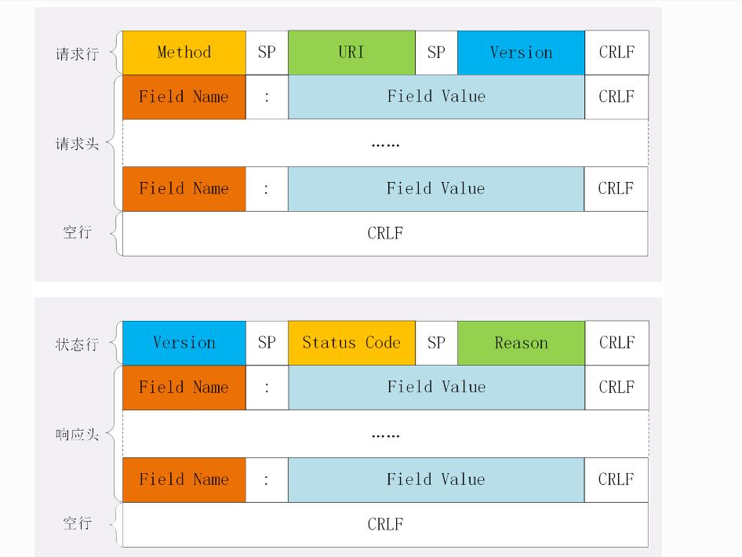
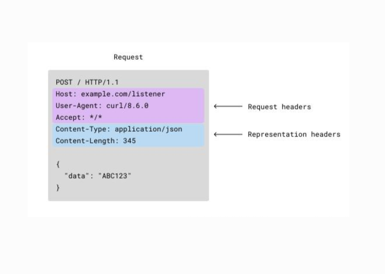
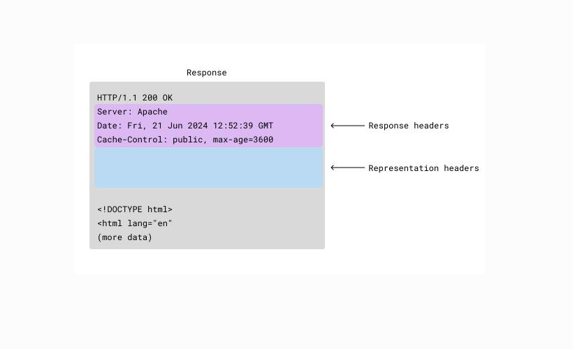

# 2.2 HTTP 与 Web

> 章级精读：[../study.md#ch2-2](../study.md#ch2-2) · 报文结构：[#ch2-http-message](#ch2-http-message) · [KV/Body 解析](#ch2-http-kv-body) · [文本 vs IP](#ch2-http-message-diagram) · **TCP 载荷**：[#ch2-http-tls-payload](#ch2-http-tls-payload)

## 本节核心目标

掌握万维网与 HTTP 协议工作原理，以及 HTTP 在 TCP/IP 栈中的位置。

## 核心知识点

1. Web 组成：浏览器、Web 服务器、HTML、URL
2. HTTP 核心特点：无状态、基于 TCP
3. HTTP 连接类型：非持久连接、持久连接
4. HTTP 请求报文、响应报文结构
5. Cookie 状态管理、代理缓存加速原理

---

<a id="ch2-http-stack"></a>

## 完整层级嵌套总览

**以太网帧 → IP 数据报 → TCP 报文段 → HTTP 报文**

HTTP 属于**应用层**，放在 **TCP 的数据载荷（Payload）**里，分**请求报文**与**响应报文**两种。

```text
以太网帧
└── IP 数据报
    └── TCP 报文段
        ├── TCP 首部（端口、Seq、Ack…）
        └── TCP 数据区
            └── HTTP 报文（请求/响应文本）
```

| 层 | PDU | 本例谁变、谁不变 |
|----|-----|------------------|
| 链路 | 以太网帧 | MAC **每跳换** |
| 网络 | IP 数据报 | 源/目 IP **端到端不变** |
| 运输 | TCP 段 | 四元组固定；序号/ACK 逐段变化 |
| 应用 | HTTP 报文 | 在 TCP 载荷里，**明文文本**（HTTPS 再套 TLS） |

→ 封装详解：[第 4 章 TCP⊂IP⊂MAC](../../04_network_layer_data_plane/study.md#ch4-encapsulation) · [以太网帧](../../06_link_layer_and_lan/study.md#ch6-ethernet-frame) · [Wireshark 树](../../04_network_layer_data_plane/study.md#ch4-encapsulation-wireshark)

---

<a id="ch2-http-tls-payload"></a>

## HTTP vs HTTPS：TCP 载荷是明文还是密文？

### 1）普通 HTTP：TCP 载荷 = **明文文本**

HTTP **直接**跑在 TCP 上：

```
┌──────────── TCP 段 ────────────┐
│ TCP 首部（20～60 B）           │
├──────────────────────────────┤
│ TCP 载荷 = 整个 HTTP 报文（明文）│
│ GET /path HTTP/1.1           │
│ Host: example.com            │
│ ...                          │
└──────────────────────────────┘
```

抓包 **TCP 数据区** 可直接读出：

```http
GET /shturl.cc/ HTTP/1.1
Host: shturl.cc
User-Agent: ...
```

**结论：HTTP → TCP 载荷 = 明文（裸奔，中间人可读）**

---

### 2）HTTPS = HTTP + **TLS**（套在 TCP 之上）

**逻辑分层（自下而上）**：

```text
TCP
 └── TLS（加密记录层）
      └── HTTP（应用层明文，仅在两端进程内）
```

**发送方向数据流**

1. **应用层**：HTTP **明文**（浏览器 / 服务器内部处理）  
2. **TLS 层**：把 HTTP 明文 **整体加密** → **TLS 密文记录**  
3. **TCP 层**：把 **TLS 密文** 放进 **TCP 载荷** 发出  

**抓包看到什么**

| 层级 | 抓包可见 |
|------|----------|
| TCP 首部 | 源/目的端口、序号等（**明文**） |
| **TCP 载荷** | **TLS 密文**（乱码，**不可直接读 HTTP**） |
| 中间路由器/Wi‑Fi/运营商 | 只见 TCP 头 + 密文，**看不到 URL、Cookie、正文** |

**结论：HTTPS → TCP 载荷 = TLS 密文（不是 HTTP 明文）**

---

### 3）抓包对比（一眼分清）

```text
【HTTP  端口 80】  Ethernet → IP → TCP → 载荷里直接是 GET / HTTP/1.1 ...

【HTTPS 端口 443】 Ethernet → IP → TCP → 载荷里是 TLS Application Data（密文）
                                    └── Wireshark 配密钥才可解密出 HTTP
```

> **HTTP/3**：HTTP 跑在 **QUIC（UDP）** 上，仍经 TLS 加密；载荷在 **UDP 包**里而非传统「TCP 载荷」，但**网络上仍是密文**。

---

### 4）考试 / 面试一句话

- **HTTP**：TCP 载荷里是 **明文 HTTP 文本**  
- **HTTPS**：HTTP 先经 **TLS 加密**，TCP 载荷里是 **密文**  

### 5）易混澄清

| ❌ 错误 | ✅ 正确 |
|--------|--------|
| HTTPS 的 TCP 载荷里还有明文 HTTP | 网上（TCP 载荷）**全程密文**；HTTP 明文只在**两端应用层** |
| TLS 在 IP 层 | TLS 在 **TCP 之上、HTTP 之下**（常称「介于应用与运输之间」） |
| 加密后 TCP 头也看不见 | **TCP/IP 首部仍明文**；加密的是 **载荷（TLS 记录）** |

→ HTTP 报文格式：[#ch2-http-message](#ch2-http-message) · 首部结构图：[第 1 章](../01_network_basics/1.5_protocol_layer_architecture/study.md#ch1-5-app-messages)

---

<a id="ch2-http-message"></a>

## HTTP 报文统一结构（四部分，必背）

### 关键点（先建立正确直觉）

| | **HTTP/1.1** | **IP / TCP** |
|--|--------------|--------------|
| 编码 | **文本协议**（可读字符串） | **二进制**，固定位段 |
| 怎么找字段 | **一行一行**；**空格**分请求行/状态行；**冒号**分首部名值；**空行**分头与体 | **固定偏移**（如 IP 版本在第 0～3 bit） |
| 版本在哪 | 第一行**文本**里的 `HTTP/1.1` | 不是「前 4 字节」，而是首部**指定位** |

- **没有**「HTTP 报文前 4 字节是版本」这种说法。
- 结构很固定：**起始行 + 若干头字段 + 空行（CRLF）+ 可选实体体**。



<a id="ch2-http-message-diagram"></a>

### 整体框图（请求 / 响应通用）

| 块 | 请求 | 响应 |
|----|------|------|
| **起始行** | **请求行**（方法 SP URI SP 版本 CRLF） | **状态行**（版本 SP 状态码 SP 短语 CRLF） |
| **首部** | 多行 `字段名: 值` + CRLF | 同上 |
| **空行** | 单独 **CRLF**（必须有） | 同上 |
| **实体体** | 可选（GET 常无） | 网页 / JSON / 文件等 |

**首部可粗分（读图用）**

| 类型 | 含义 | 例子 |
|------|------|------|
| **Request / Response headers** | 报文级元数据 | Host、User-Agent、Server、Date、Cache-Control |
| **Representation headers** | 描述**实体体**格式与长度 | **Content-Type**、**Content-Length**、Content-Encoding |

→ 下图紫/蓝分区即此划分。





### HTTP vs IP：为何没有「前几位是版本」

```text
【IP 首部】二进制固定布局
  0–3 bit：版本  4–7 bit：首部长度  …（按位/按字节偏移读）

【HTTP/1.1】文本，按行解析
  第 1 行：GET /index.html HTTP/1.1   ← 版本是字符串，不是前 4 字节
  后续行：Host: …
  空行
  体（若有）
```

→ IP 框图：[第 4 章 IPv4 首部](../../04_network_layer_data_plane/study.md#ch4-ipv4-header) · [第 1 章五层 PDU](../01_network_basics/1.5_protocol_layer_architecture/study.md#ch1-5-pdu)

---

请求与响应**格式对称**，都分 **4 部分**：

| # | 请求报文 | 响应报文 |
|---|----------|----------|
| 1 | **请求行** | **状态行** |
| 2 | **请求头**（Header） | **响应头** |
| 3 | **空行**（必须有） | **空行** |
| 4 | **请求体**（Body） | **响应体** |

```text
【请求】 方法 URL HTTP版本 → 请求头… → 空行 → 请求体
【响应】 HTTP版本 状态码 短语 → 响应头… → 空行 → 响应体
```

**核心区分**

| | 谁说话 | 装什么 |
|--|--------|--------|
| **请求头** | 浏览器（客户端） | 我是谁、要什么、Cookie… |
| **响应头** | 服务器 | 返回类型、长度、Set-Cookie… |
| **请求体** | 客户端提交 | 表单、JSON、文件（**GET 通常无**） |
| **响应体** | 服务器返回 | HTML、JSON、图片等**真实内容** |

---

## 一、HTTP 请求报文（浏览器 → 服务器）

### 完整格式

```http
请求方法  URL  HTTP版本
请求头字段1: 值
请求头字段2: 值
...
（空行）
请求体内容
```

### 1.1 第一行：请求行（3 项）

格式：`方法 资源路径 HTTP/1.1`

| 字段 | 说明 | 常见值 |
|------|------|--------|
| **请求方法** | 要对资源做什么 | GET、POST、PUT、DELETE、HEAD… |
| **请求 URL** | 路径（+ 可选查询串） | `/index.html`、`/api/user?name=test` |
| **HTTP 版本** | 协议版本 | **HTTP/1.1**（最常用） |

示例：

```http
GET /index.html HTTP/1.1
```

**结构拆解（树状）**

```text
GET /index.html HTTP/1.1
├── 方法（GET）
├── 路径（/index.html）
└── 版本（HTTP/1.1）
```

### 1.2 请求头（Request Headers）

客户端告诉服务器：**我是谁、要什么、浏览器信息、Cookie、缓存**等（多行 `名: 值`）。

| 字段 | 作用 |
|------|------|
| **Host** | 目标**域名/主机**（HTTP/1.1 几乎必带） |
| **User-Agent** | 浏览器、设备、系统信息 |
| **Accept** | 客户端能接收的**数据格式** |
| **Accept-Encoding** | 支持的压缩（如 **gzip**） |
| **Cookie** | 本地保存的**用户凭证/会话** |
| **Content-Type** | 请求体格式（**POST 常必带**） |
| **Content-Length** | 请求体**字节长度** |
| **Referer** | 从哪个页面**跳转**过来 |

### 1.3 空行

**必须有一行空行**（`\r\n\r\n` 中的后一半），标志**头部结束**，下面才是请求体。

### 1.4 请求体（Request Body）

| 方法 | 请求体 |
|------|--------|
| **GET** | **一般没有**；参数放在 **URL 查询串**（`?key=value`） |
| **POST / PUT** | **有**；表单、`application/json`、文件上传等 |

### 真实示例：GET

```http
GET /api/user?name=test HTTP/1.1
Host: www.xxx.com
User-Agent: Mozilla/5.0 Chrome/120.0
Accept: text/html,image/*
Cookie: token=123456

```

（空行后**无请求体**）

### 真实示例：POST（JSON 体）

```http
POST /api/login HTTP/1.1
Host: www.xxx.com
Content-Type: application/json
Content-Length: 36
User-Agent: Chrome/120.0

{"username":"admin","pwd":"123456"}
```

---

## 二、HTTP 响应报文（服务器 → 浏览器）

### 完整格式

```http
HTTP版本 状态码 状态描述
响应头字段1: 值
响应头字段2: 值
...
（空行）
响应体（网页/数据/图片）
```

### 2.1 第一行：状态行（3 项）

格式：`HTTP/1.1 状态码 状态短语`

| 字段 | 说明 |
|------|------|
| HTTP 版本 | 如 HTTP/1.1 |
| **状态码** | **1xx～5xx**（考试高频） |
| 状态短语 | 文字说明，如 OK、Not Found |

示例：

```http
HTTP/1.1 200 OK
```

**结构拆解（树状）**

```text
HTTP/1.1 200 OK
├── 版本（HTTP/1.1）
├── 状态码（200）
└── 状态短语（OK）
```

**常见状态码**：`200` 成功 · `301/302` 重定向 · `404` 未找到 · `500` 服务器错误

### 2.2 响应头（Response Headers）

| 字段 | 作用 |
|------|------|
| **Server** | 服务器软件（Nginx、Apache…） |
| **Content-Type** | 返回类型（html、json、图片…） |
| **Content-Length** | 响应体**大小**（字节） |
| **Set-Cookie** | 服务器**种下** Cookie |
| **Cache-Control** | **缓存**策略 |
| **Location** | **重定向**地址（301/302） |
| **Date** | 服务器时间 |

### 2.3 空行 · 2.4 响应体

空行分隔头与体。**响应体** = 浏览器真正拿到的内容：HTML、JSON、图片、文件等。

### 真实示例：200 成功

```http
HTTP/1.1 200 OK
Server: nginx
Content-Type: text/html;charset=utf-8
Content-Length: 1500
Date: Wed, 20 May 2026

<!DOCTYPE html>
<html>
<body>首页内容</body>
</html>
```

### 真实示例：404

```http
HTTP/1.1 404 Not Found
Server: nginx
Content-Type: text/html

<h1>页面不存在</h1>
```

---

<a id="ch2-http-kv-body"></a>

## 附：首部 KV 分隔规则 + Body 格式（数据流视角）

### 一、头字段 Key / Value 怎么分开

**固定分隔符：英文冒号 `:` + 一个空格**

```text
键: 值
Key: Value
```

| 规则 | 说明 |
|------|------|
| **冒号左边** | **Key**（字段名） |
| **冒号右边（空格后）** | **Value**（值） |
| 无冒号 | **不是**首部字段 |

示例：

```http
Host: www.baidu.com
     Key=Host          Value=www.baidu.com

User-Agent: chrome browser
     Key=User-Agent    Value=chrome browser
```

**易错**：必须是 **`:` + 空格**；`Host:www.baidu.com`（无空格）不规范。

### 二、一行一组 KV；头部何时结束

| 规则 | 说明 |
|------|------|
| **一行 = 一条首部** | 换行 **`\r\n`** 分隔不同 KV |
| **头部结束** | 连续 **两个换行** → **`\r\n\r\n`**（**空行**） |
| **空行之后** | 全部是 **Body（实体）** |

**最简数据流**

```text
请求行
KV头1: 值1
KV头2: 值2
（空行 ← \r\n\r\n）
{JSON 或 HTML…}  ← Body
```

### 三、整体报文拆分（解析顺序）

**请求**

1. **第一行**：**请求行**（**不是 KV**）  
2. **往后每行**：`key: value` 首部  
3. 读到**空行** → 首部结束  
4. 空行后**所有字节** = **请求体**

**响应**（逻辑相同）

1. **第一行**：**状态行**（**不是 KV**）  
2. 多行 `key: value` 响应头  
3. **空行**截断首部  
4. 剩余 = **响应体**

### 四、Body 里是什么？由 Content-Type 决定

Body **没有固定二进制格式**；看首部：

```http
Content-Type: xxx
```

| Content-Type | 用途 | Body 形态 |
|--------------|------|-----------|
| **application/json** | 接口最常见（约九成 REST） | `{"键":"值","age":20}` · `{}` 对象 · 键值用**双引号**+冒号 · 逗号分隔 |
| **application/x-www-form-urlencoded** | 普通表单 | `username=admin&password=123456`（**键=值**，`&` 连接） |
| **multipart/form-data** | **上传文件**、图片 | 多段，用 **boundary** 分隔 |
| **text/html** | 网页 | 直接是 **HTML 源码** |

**JSON Body 规则（应用层语法，≠ HTTP 首部语法）**

```json
{"name":"张三","age":20}
```

- 字符串键/值常用**双引号**；内部仍是 **键: 值**（JSON 冒号两侧规则见 JSON 规范）

**GET**：通常**无 Body**；参数在 URL `?key=value`（不是 `key: value` 首部格式）。

### 五、核心规则一句话

1. **首部 KV**：**冒号+空格** 分键值；**换行**分多条头  
2. **头与体**：**空行**（`\r\n\r\n`）切开  
3. **Body 格式**：由 **`Content-Type`** 决定；接口多为 **JSON**  
4. **JSON 体内**：双引号键 + 冒号 + 值（与 HTTP 首部 `Key: Value` 是两层语法）

→ 结构框图：[#ch2-http-message-diagram](#ch2-http-message-diagram)

---

## 三、Wireshark 里「真实长什么样」

TCP 载荷里就是下面这段文本（`\r\n` = 回车换行）：

```text
GET / HTTP/1.1\r\n
Host: baidu.com\r\n
User-Agent: Mozilla/5.0\r\n
Accept: */*\r\n
\r\n
```

展开顺序：**Ethernet II → IPv4 → TCP → [HTTP 明文]**（HTTPS：**TCP 载荷 = TLS 密文**，见 [#ch2-http-tls-payload](#ch2-http-tls-payload)）

---

<a id="ch2-2-exam"></a>

## 四、考试 / 面试速记

### 最简口诀

1. **HTTP/1.1 = 文本按行解析**，不是 IP 那种固定 bit 偏移  
2. **首部 KV**：**`:` + 空格** 分键值；**`\r\n\r\n` 空行** 分头与体  
3. **请求**：请求行 + 头 + 空行 + 体 · **GET 无体，POST 有体**  
4. **响应**：状态行 + 头 + 空行 + 体 · **状态码定结果，体是真实数据**  
5. **Body**：看 **Content-Type**（json / form / html）

### 易错点

| 易混 | 纠正 |
|------|------|
| HTTPS TCP 载荷 | **TLS 密文**，不是明文 HTTP |
| HTTP 在哪层明文？ | **仅两端应用进程内**；链路上 HTTP 裸奔、HTTPS 加密 |
| 端口 | HTTP **80**；HTTPS **443** |
| 空行 | **不能省略**；**`\r\n\r\n`** 分隔头与体 |
| 首部分隔符 | **`:` + 空格**，不是单独冒号或无空格 |
| 第一行 | 请求行/状态行**不是** `key: value` |
| GET 带大数据 | URL 查询串或 **POST + Body**；文件用 **multipart/form-data** |

---

## 个人总结

HTTP 在 **TCP 载荷里明文**；**HTTPS = TLS 加密后再进 TCP 载荷（密文）**。必会**四段结构**、**GET/POST 有无请求体**、常用首部与 **200/404**。无状态靠 Cookie。
