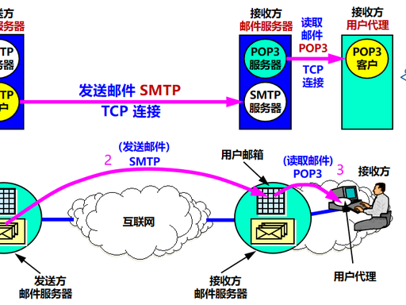

# 2.3 电子邮件系统

> 章级精读：[../study.md#ch2-3](../study.md#ch2-3) · SMTP 报文三段图：[第 1 章 §1.5](../../01_network_basics/1.5_protocol_layer_architecture/study.md#ch1-5-app-messages)

## 本节核心目标

搞懂邮件**三大组件**、**收发全流程**，以及 **SMTP / POP3 / IMAP / MIME** 分工（推 vs 拉、端口、多设备同步）。

---

## 一、电子邮件系统整体架构（3 大组件）

| 组件 | 是什么 | 干什么 |
|------|--------|--------|
| **MUA** 用户代理 | Outlook、手机邮箱、**网页邮箱** | **写/读/回复**；不负责跨网转发 |
| **邮件服务器** | 24h 在线的「互联网邮局」 | **MTA** 转发 + **MDA** 投递进邮箱 |
| **协议** | SMTP、POP3、IMAP、MIME | 发（推）、收（拉）、非 ASCII/附件 |

- **MTA（Mail Transfer Agent）**：**SMTP** 在服务器间**转发**邮件  
- **MDA（Mail Delivery Agent）**：把信放进用户邮箱（配合 POP3/IMAP）

### 收发全过程（5 步，必背）

1. 你在 **MUA** 写邮件 → 发送  
2. MUA 用 **SMTP** → **你的发件服务器**  
3. 发件服务器用 **SMTP** → **对方收件服务器**（可经多台 MTA 中继）  
4. 收件服务器把信存入 **对方邮箱**  
5. 对方 **MUA** 用 **POP3 / IMAP**（或 **HTTP** 网页邮箱）读取  

**口诀**：**发用 SMTP 推，收用 POP3/IMAP 拉；MIME 让中文附件能上路。**

---

## 二、SMTP（Simple Mail Transfer Protocol）——只负责「发」

### 作用 · 模式

- **发送** + **服务器之间转发**（**不管**用户怎么读信）  
- **推（Push）**：客户端/上游服务器把邮件**推**给下一跳  

### 端口（必背）

| 端口 | 说明 |
|------|------|
| **25** | 标准 SMTP（常服务器间；明文） |
| **587** | 提交端口（客户端发信，常 **STARTTLS** + 认证） |
| **465** | **SMTPS**（SSL/TLS 加密） |

**运输层**：**TCP**

### 发送过程（命令 + 响应）

| 步骤 | 客户端 | 服务器典型响应 |
|------|--------|----------------|
| 连接 | 连 25/587 | **220** Ready |
| 握手 | **HELO** / **EHLO** | **250** OK |
| 发件人 | **MAIL FROM:**\<addr\> | **250** OK |
| 收件人 | **RCPT TO:**\<addr\>（可多个） | **250** OK |
| 内容 | **DATA** | **354** Start mail input |
| 结束 | 正文 + **单独一行 `.`** | **250** Message accepted |
| 断开 | **QUIT** | **221** Bye |

→ 会话示例与邮件**信封/首部/主体**：[第 1 章 SMTP 专节](../../01_network_basics/1.5_protocol_layer_architecture/study.md#ch1-5-app-messages)

### SMTP 局限（必考）

- 早期载荷偏 **7 位 ASCII**（不能原生传中文、二进制附件）  
- 早期**弱认证** → 易伪造、垃圾邮件 → 现网靠 **认证 + TLS + 反垃圾（SPF/DKIM 等，工程扩展）**  
- **必须配合 MIME** 传中文/附件/HTML  

---

## 三、POP3（Post Office Protocol v3）——简单收信

### 作用 · 模式

- 从服务器**拉（Pull）**邮件到本地  
- **TCP**：**110**（明文）、**995**（POP3S）

### 两种模式（重点）

| 模式 | 行为 | 多设备 |
|------|------|--------|
| **下载并删除**（常见默认） | 下到本地后服务器**删原件** | **差**（换设备可能没了） |
| **下载并保留** | 服务器**仍保留**副本 | 可多设备看，占服务器空间 |

### 特点

- ✅ 简单、省服务器空间  
- ❌ **多设备同步差**；难在服务器上统一管理（移文件夹、标记已读等）  

---

## 四、IMAP——高级收信（现网主流）

### 作用 · 端口

- **在服务器上管理邮件**，多设备**实时同步**  
- **TCP**：**143**（明文）、**993**（IMAPS）

### 核心（与 POP3 最大区别）

- 邮件**默认留在服务器**（除非你删）  
- **读/删/移/标记已读** 等操作在**服务器**完成  
- **多设备一致**：手机删 → 电脑也没了；电脑已读 → 手机已读  
- 可只拉**邮件头**再决定是否下全文；支持文件夹、服务器端搜索  

---

## 五、POP3 vs IMAP（终极对比，必背）

| 特性 | **POP3** | **IMAP** |
|------|----------|----------|
| 邮件主要存在 | **本地**（默认删服务器） | **服务器** |
| 多设备同步 | ❌ 差 | ✅ 好 |
| 服务器端管理 | ❌ | ✅ 删/移/标记/文件夹 |
| 离线阅读 | ✅ 好（全在本地） | 一般（常需联网取全文） |
| 现状 | 少用 | **主流**（QQ/网易/Gmail） |

**Web 邮箱**：浏览器 **HTTP/HTTPS** 访问页面；后端仍靠 SMTP/POP3/IMAP，HTTP 是**入口**。

---

## 六、MIME（多用途互联网邮件扩展）

### 为什么需要？

SMTP **不能原生传**中文、图片、PDF 等 → **MIME 扩展 SMTP**（**不替代** SMTP）

### 做什么？

- 规定**非 ASCII 文本**编码（如 **UTF-8**）  
- 规定**二进制附件**编码：**Base64**、**Quoted-Printable**  
- 在邮件头说明类型与编码  

### 常用首部

| 首部 | 作用 |
|------|------|
| **MIME-Version: 1.0** | 声明使用 MIME |
| **Content-Type** | text/plain、text/html、multipart/mixed… |
| **Content-Transfer-Encoding** | base64、quoted-printable |

### 结构

- **Header**：From、To、Subject、Date + MIME 相关字段  
- **Body**：纯文本段 + 附件段（多段用 **multipart**）  

| 编码 | 适用 |
|------|------|
| **Base64** | 图片、大附件、任意二进制 |
| **Quoted-Printable** | 少量非 ASCII 的文本 |

---

## 七、考试速记 + 易错

### 超简背诵

| 协议 | 角色 | 端口 | 模式 |
|------|------|------|------|
| **MUA** | 客户端 UI | — | — |
| **SMTP** | **发**、中转 | 25 / 587 / 465 | **推** |
| **POP3** | **收**（简单） | 110 / 995 | **拉**（常删服务器） |
| **IMAP** | **收**（高级） | 143 / 993 | **拉**（留服务器、同步） |
| **MIME** | 扩展内容 | — | 配合 SMTP |

### 三句话

1. **SMTP 只负责发和中继，Push，TCP。**  
2. **POP3 拉到本地常删服务器；IMAP 邮件在服务器、多设备同步。**  
3. **MIME 让 SMTP 能发中文和附件，不是独立传输协议。**

### 易错

| 易混 | 纠正 |
|------|------|
| SMTP 能收信？ | **否**；收靠 POP3/IMAP/HTTP |
| MIME 替代 SMTP？ | **否**；MIME **扩展** SMTP 载荷 |
| IMAP 把信都下到本地删服务器？ | **否**；默认**留服务器**（POP3 才常删） |
| 网页邮箱不用 SMTP？ | 发信仍用 **SMTP**；浏览器用 **HTTP** 看信 |

---

## 个人总结（直接背）

**MUA 写读信；SMTP 推送到对方服务器；POP3 简单拉取常删服务器；IMAP 服务器留存多设备同步；MIME 编码中文与附件。发 SMTP，收 POP3/IMAP，内容靠 MIME。**
