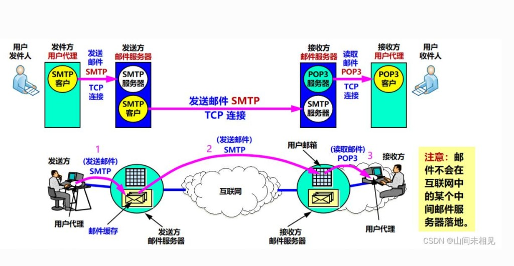
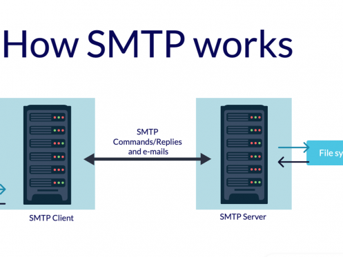
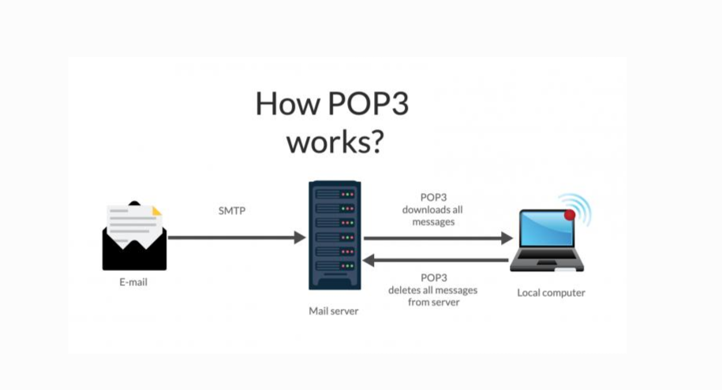
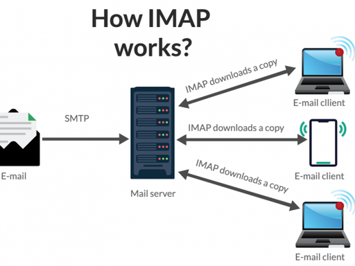

# 2.3 电子邮件系统

> 章级精读：[../study.md#ch2-3](../study.md#ch2-3) · **SMTP**：[报文](#ch2-3-smtp-message) · [CLI 逐条](#ch2-3-smtp-cli) · **IMAP**：[报文](#ch2-3-imap-message) · 三段图：[第 1 章 §1.5](../../01_network_basics/1.5_protocol_layer_architecture/study.md#ch1-5-app-messages)

## 本节核心目标

搞懂邮件**三大组件**、**收发全流程**，以及 **SMTP / POP3 / IMAP / MIME** 分工（推 vs 拉、端口、多设备同步）。

---

## 一、电子邮件系统整体架构（3 大组件）



> 简图备选：[email_system_smtp_pop3.png](../assets/email_system_smtp_pop3.png)

| 组件 | 是什么 | 干什么 |
|------|--------|--------|
| **MUA** 用户代理 | Outlook、手机邮箱、**网页邮箱** | **写/读/回复**；不负责跨网转发 |
| **邮件服务器** | 24h 在线的「互联网邮局」 | **MTA** 转发 + **MDA** 投递进邮箱 |
| **协议** | SMTP、POP3、IMAP、MIME | 发（推）、收（拉）、非 ASCII/附件 |

### 协议实体角色（上图上半部分）

| 位置 | 组件 | 协议角色 |
|------|------|----------|
| 发件方 | **发件 MUA** | **SMTP 客户机** → TCP 连发件服务器 |
| 发件方 | **发件邮件服务器** | **SMTP 服务器**（收 UA 的信）+ **SMTP 客户机**（再转发） |
| 收件方 | **收件邮件服务器** | **SMTP 服务器**（收外来信）+ **POP3/IMAP 服务器**（供用户读） |
| 收件方 | **收件 MUA** | **POP3/IMAP 客户机** → TCP 拉信 |

- **MTA**：靠 **SMTP** 在**邮件服务器之间**转发  
- **MDA**：把信放进**用户邮箱**（磁盘上的信箱）

### 三步流程（上图下半部分，必背）

| 步 | 动作 | 协议 |
|----|------|------|
| **1** | 发件人 UA → 发件服务器（**邮件缓存**） | **SMTP**（推） |
| **2** | 发件服务器 → 经互联网 → 收件服务器（**用户邮箱**） | **SMTP**（推） |
| **3** | 收件人 UA ← 从邮箱**读信** | **POP3 / IMAP**（拉） |

### 收发全过程（5 步，与三步对应）

1. 你在 **MUA** 写邮件 → 发送  
2. MUA 用 **SMTP** → **你的发件服务器**（= 步 1）  
3. 发件服务器用 **SMTP** → **对方收件服务器**（= 步 2；见下「考点」）  
4. 收件服务器把信存入 **对方邮箱**  
5. 对方 **MUA** 用 **POP3 / IMAP**（或 **HTTP** 网页邮箱）读取（= 步 3）  

> **考点（易错）**：邮件在**互联网路由器/链路上不会「落地」存成信箱**；只在**两端及中继的邮件服务器（MTA）**上存储转发。中间是普通 **IP 分组转发**，不是「随便一台互联网主机当邮局」。

**口诀**：**发用 SMTP 推，收用 POP3/IMAP 拉；MIME 让中文附件能上路。**

---

## 二、SMTP（Simple Mail Transfer Protocol）——只负责「发」



### 读图（与 MUA / MTA / MDA 对应）

| 图中 | 对应概念 |
|------|----------|
| **User + 笔记本** | **MUA**（用户通过客户端发信） |
| 左侧 **File system** | 本地草稿/已发件箱；邮件内容从这里读出 |
| **SMTP Client**（机架） | 发件方 **MTA**（你的邮件服务器） |
| 中间双向箭头 | **SMTP 命令/响应 + 邮件正文**（TCP，如 25/587） |
| **SMTP Server**（机架） | 收件方 **MTA** |
| 右侧 **File system** | **MDA** 把信写入收件人**邮箱目录** |

### 作用 · 模式

- **发送** + **服务器之间转发**（**不管**用户怎么读信）  
- **推（Push）**：客户端/上游服务器把邮件**推**给下一跳  

### 端口（必背）

| 端口 | 说明 |
|------|------|
| **25** | 标准 SMTP（常服务器间；明文） |
| **587** | 提交端口（客户端发信，常 **STARTTLS** + 认证） |
| **465** | **SMTPS**（SSL/TLS 加密） |

**运输层**：**TCP**

### 发送过程（命令 + 响应）

| 步骤 | 客户端 | 服务器典型响应 |
|------|--------|----------------|
| 连接 | 连 25/587 | **220** Ready |
| 握手 | **HELO** / **EHLO** | **250** OK |
| 发件人 | **MAIL FROM:**\<addr\> | **250** OK |
| 收件人 | **RCPT TO:**\<addr\>（可多个） | **250** OK |
| 内容 | **DATA** | **354** Start mail input |
| 结束 | 正文 + **单独一行 `.`** | **250** Message accepted |
| 断开 | **QUIT** | **221** Bye |

→ 信封/首部/主体示意图：[第 1 章 SMTP 专节](../../01_network_basics/1.5_protocol_layer_architecture/study.md#ch1-5-app-messages)

<a id="ch2-3-smtp-message"></a>

### SMTP 报文完整格式（必背）

#### 通信模式（先记一句）

**SMTP = 网络版 CLI：一问一答、逐条发命令；不是像 HTTP 那样一次性发完整大报文。**

均为**纯文本**，依托 **TCP**；与 [HTTP](../2.2_http_and_web/study.md#ch2-http-message) 都是文本，**交互方式完全不同**。

<a id="ch2-3-smtp-cli"></a>

#### SMTP vs HTTP：发送方式（必考，易混）

| | **HTTP** | **SMTP** |
|--|----------|----------|
| 交互 | 通常**一次请求—一次响应** | **逐条命令—逐条响应** |
| 客户端发什么 | **一整份**请求：请求行 + 全部首部 + 空行 + 体，**一次性拼好发出** | **EHLO、MAIL FROM…** 各是**单行命令**，**发一条等 250/354 再发下一条** |
| 类比 | 像把**整封信**一次塞进邮筒 | 像 **cmd/终端**：你敲一行，系统回一行 |

**一句话**：SMTP **完全等同于 CLI 命令行交互**；**≠** HTTP 一次性打包完整请求报文。

##### HTTP 模式（对照）

客户端把 **请求行 + 所有请求头 + 空行 + 请求体** 拼成**一份完整报文**，**一次性**发给服务器 → **单次批量发送**。

→ 详见 [2.2 四段结构](../2.2_http_and_web/study.md#ch2-http-message)

##### SMTP 模式（逐条交互）

1. 客户端发**一条命令** → **等**服务器响应  
2. 成功（常 **250**）→ 再发**下一条**  
3. 顺序典型：**EHLO → MAIL FROM → RCPT TO → DATA →（邮件块）→ `.` → QUIT**  

```text
# 终端类比（程序自动替你敲）
EHLO localhost          →  250 OK
MAIL FROM:<a@163.com>   →  250 OK
RCPT TO:<b@qq.com>      →  250 OK
DATA                    →  354 Start mail input
（整块邮件实体）
.                       →  250 Message accepted
QUIT                    →  221 Bye
```

**EHLO / MAIL FROM 是什么？** → **SMTP 专属命令行指令**，与 Windows **cmd**、Linux **终端**逻辑一样；MUA/MTA 程序**按序自动执行**。

##### 只有 DATA 后是「整块报文」

| 阶段 | 发送形式 |
|------|----------|
| **EHLO、MAIL FROM、RCPT TO、QUIT** 等 | **单行独立命令**，逐条交互 |
| **DATA 之后** | **邮件首部 + 空行 + 正文** 才像 HTTP 那样**合成一块**连续发送；以单独一行 **`.`** 结束 |

#### 1）客户端命令报文

**基础命令行**（单行）：

```text
命令  参数
```

| 示例 | 含义 |
|------|------|
| `EHLO localhost` | 扩展握手 |
| `MAIL FROM:<send@163.com>` | 发件人 |
| `RCPT TO:<recv@qq.com>` | 收件人 |
| `DATA` | 开始传邮件实体 |
| `QUIT` | 退出 |

#### 2）邮件实体报文（DATA 阶段）

收到 **354** 后发送；结构：

```text
首部字段名:  字段值
首部字段名:  字段值
……
（空行 \r\n\r\n）
邮件正文
.
```

| 规则 | 说明 |
|------|------|
| **邮件首部 KV** | 与 HTTP 相同：**冒号 + 空格** 分键值；**换行**分多条 |
| **头与正文** | **空行** 分隔 |
| **结束** | **单独一行只有一个 `.`** → 正文结束（SMTP 协议结束符，不是 HTTP 的 Body 边界以外的概念） |

**标准邮件首部（常考）**

| 首部 | 含义 |
|------|------|
| **From:** | 发件人邮箱 |
| **To:** | 收件人邮箱 |
| **Subject:** | 主题 |
| **Date:** | 发送时间 |
| **Content-Type:** | 正文/MIME 类型 |

→ 首部 KV 详解：[2.2 HTTP/SMTP 冒号规则](../2.2_http_and_web/study.md#ch2-http-kv-body)

**完整实体示例（原样）**

```http
From: student@test.com
To: teacher@test.com
Subject: 网络学习总结
Content-Type: text/plain;charset=utf-8

今天吃透了SMTP报文结构，和HTTP头部规则一致。
.
```

#### 3）服务端响应报文

固定格式：**三位状态码 + 空格 + 描述**

```text
220  服务就绪
250  操作成功
354  可开始传输邮件内容
500  命令错误
```

| 码 | 典型场景 |
|----|----------|
| **220** | 连接就绪 |
| **250** | 命令成功 |
| **354** | 可输入 DATA 邮件体 |
| **500** | 命令/语法错误 |

#### 极简结构总结

1. **EHLO 等** = **CLI 单行命令**，**逐条一问一答**（≠ HTTP 一次发整包）  
2. **仅 DATA 后**：邮件首部 + 空行 + 正文 + **`.`** = **整块实体**  
3. **响应**：三位状态码 + 说明

### SMTP 局限（必考）

- 早期载荷偏 **7 位 ASCII**（不能原生传中文、二进制附件）  
- 早期**弱认证** → 易伪造、垃圾邮件 → 现网靠 **认证 + TLS + 反垃圾（SPF/DKIM 等，工程扩展）**  
- **必须配合 MIME** 传中文/附件/HTML  

---

## 三、POP3（Post Office Protocol v3）——简单收信



### 读图（发 vs 收）

| 图中 | 含义 |
|------|------|
| 信封 → **Mail server**（**SMTP** 箭头） | **发信阶段**：与 §二 相同，用 SMTP **推**到服务器（不是 POP3 发的） |
| **Mail server** ↔ **Local computer** | **收信阶段**：POP3 **拉** |
| 上箭头 **POP3 downloads all messages** | 客户端把邮箱里邮件**全部下载**到本地 |
| 下箭头 **POP3 deletes all messages from server** | 默认：**服务器上删除**已下载邮件 → 多设备不同步 |

### 作用 · 模式

- 从服务器**拉（Pull）**邮件到本地  
- **TCP**：**110**（明文）、**995**（POP3S）

### 两种模式（重点）

| 模式 | 行为 | 多设备 |
|------|------|--------|
| **下载并删除**（常见默认） | 下到本地后服务器**删原件** | **差**（换设备可能没了） |
| **下载并保留** | 服务器**仍保留**副本 | 可多设备看，占服务器空间 |

### 特点

- ✅ 简单、省服务器空间  
- ❌ **多设备同步差**；难在服务器上统一管理（移文件夹、标记已读等）  

---

## 四、IMAP——高级收信（现网主流）



| 项 | 说明 |
|----|------|
| **全称** | **Internet Message Access Protocol**（互联网消息访问协议） |
| **作用** | **收邮件**；在服务器上**远程管理**邮箱（读/搜/删/文件夹） |
| **端口** | **143**（明文）、**993**（IMAPS） |
| **底层** | **TCP**，**纯文本** |

### 核心（与 POP3 最大区别）

- 邮件**默认留在服务器**（除非你删）  
- **读/删/移/标记已读** 等操作在**服务器**完成  
- **多设备一致**：手机删 → 电脑也没了；电脑已读 → 手机已读  
- 可只拉**邮件头**再决定是否下全文；支持文件夹、服务器端搜索  

<a id="ch2-3-imap-message"></a>

### IMAP 纯报文讲解（必背）

#### 一、核心通信特点

与 [SMTP](#ch2-3-smtp-cli) 相同：**交互式命令行模式**

- 客户端发**一条命令** → 服务器回**一条响应** → 再发下一条  
- **逐条收发**，**不是** [HTTP 一次性整包](../2.2_http_and_web/study.md#ch2-http-message)

#### 二、IMAP 命令格式

```text
标签  命令  参数
```

| 部分 | 说明 |
|------|------|
| **标签** | 客户端自定义编号（`A1`、`A2`…），**配对**请求与响应 |
| **命令** | IMAP 内置指令 |
| **参数** | 账号、邮箱名、搜索条件等 |

**常用命令（示例）**

```text
A1 LOGIN 账号 密码          // 登录
A2 LIST "" *                // 列出邮箱文件夹
A3 SELECT INBOX             // 进入收件箱
A4 FETCH 1 ALL              // 取第 1 封邮件全文
A5 SEARCH SUBJECT 学习      // 按主题搜索
A6 LOGOUT                   // 退出
```

#### 三、服务器响应格式

```text
标签 状态码 结果内容
*  推送信息（服务器主动通知，无标签）
```

| 状态码 | 含义 |
|--------|------|
| **OK** | 成功 |
| **NO** | 失败（逻辑错误，如密码错） |
| **BAD** | 命令**格式错误** |

示例：`A1 OK LOGIN completed` · `* 12 EXISTS`（收件箱有 12 封）

#### 四、FETCH 拿到的邮件实体（重点）

**FETCH 返回的邮件正文**，内部格式与 **SMTP DATA 阶段发出的邮件实体完全一致**：

```http
From: 发件人邮箱
To: 收件人邮箱
Subject: 邮件标题
Date: 发送时间

（空行）
邮件正文内容
```

| 规则 | 说明 |
|------|------|
| KV 分隔 | **`键: 空格 值`** — 与 [HTTP](../2.2_http_and_web/study.md#ch2-http-kv-body)、[SMTP 邮件首部](#ch2-3-smtp-message) **统一** |
| 头与正文 | **空行** 分隔（无 SMTP 的单独 `.` 行 —— 那是 SMTP 会话结束符，不是邮件格式本身） |

#### 五、SMTP / IMAP / HTTP 一句话区分

> 上述 **25 / 143 / 993** 等 = [TCP 首部目的端口](../2.1_network_application_principle/study.md#ch2-1-ports-tcp)，应用层仅**约定**该号。

| 协议 | 交互方式 | 角色 | 邮件本体格式 |
|------|----------|------|--------------|
| **SMTP** | CLI **逐条**问答 | **发**、中转 | 首部 `Key: Value` + 空行 + 正文 |
| **IMAP** | CLI **逐条**问答 | **收/管理**（信在服务器） | **与 SMTP 相同** |
| **HTTP** | **整份请求/响应一次发** | Web/API | 同类首部规则，语法不同 |

1. **SMTP**：CLI 交互 → 往外**发**邮件  
2. **IMAP**：CLI 交互 → 从服务器**收/管理**邮件  
3. 二者都**不像 HTTP** 一次性发完整大报文  
4. **邮件实体**（From/To/Subject/正文）三者**通用同一套首部规则**

---

## 五、POP3 vs IMAP（终极对比，必背）

| 特性 | **POP3** | **IMAP** |
|------|----------|----------|
| 邮件主要存在 | **本地**（默认删服务器） | **服务器** |
| 多设备同步 | ❌ 差 | ✅ 好 |
| 服务器端管理 | ❌ | ✅ 删/移/标记/文件夹 |
| 离线阅读 | ✅ 好（全在本地） | 一般（常需联网取全文） |
| 现状 | 少用 | **主流**（QQ/网易/Gmail） |

**Web 邮箱**：浏览器 **HTTP/HTTPS** 访问页面；后端仍靠 SMTP/POP3/IMAP，HTTP 是**入口**。

---

## 六、MIME（多用途互联网邮件扩展）

### 为什么需要？

SMTP **不能原生传**中文、图片、PDF 等 → **MIME 扩展 SMTP**（**不替代** SMTP）

### 做什么？

- 规定**非 ASCII 文本**编码（如 **UTF-8**）  
- 规定**二进制附件**编码：**Base64**、**Quoted-Printable**  
- 在邮件头说明类型与编码  

### 常用首部

| 首部 | 作用 |
|------|------|
| **MIME-Version: 1.0** | 声明使用 MIME |
| **Content-Type** | text/plain、text/html、multipart/mixed… |
| **Content-Transfer-Encoding** | base64、quoted-printable |

### 结构

- **Header**：From、To、Subject、Date + MIME 相关字段  
- **Body**：纯文本段 + 附件段（多段用 **multipart**）  

| 编码 | 适用 |
|------|------|
| **Base64** | 图片、大附件、任意二进制 |
| **Quoted-Printable** | 少量非 ASCII 的文本 |

---

<a id="ch2-3-exam"></a>

## 七、考试速记 + 易错

### 超简背诵

| 协议 | 角色 | 端口 | 模式 |
|------|------|------|------|
| **MUA** | 客户端 UI | — | — |
| **SMTP** | **发**、中转 | 25 / 587 / 465 | **推** |
| **POP3** | **收**（简单） | 110 / 995 | **拉**（常删服务器） |
| **IMAP** | **收**（高级） | 143 / 993 | **拉**（留服务器、同步） |
| **MIME** | 扩展内容 | — | 配合 SMTP |

### 三句话

1. **SMTP 只负责发和中继，Push，TCP。**  
2. **POP3 拉到本地常删服务器；IMAP 邮件在服务器、多设备同步。**  
3. **MIME 让 SMTP 能发中文和附件，不是独立传输协议。**

### SMTP 报文口诀

**CLI逐条问答复，非HTTP整包发；仅DATA后整块邮件；首部同HTTP冒号空行点结束。**

### IMAP 报文口诀

**标签+命令逐条交互；143/993收信管服务器；FETCH邮件体同SMTP首部格式。**

### 易错

| 易混 | 纠正 |
|------|------|
| SMTP 能收信？ | **否**；收靠 POP3/IMAP/HTTP |
| MIME 替代 SMTP？ | **否**；MIME **扩展** SMTP 载荷 |
| IMAP 把信都下到本地删服务器？ | **否**；默认**留服务器**（POP3 才常删） |
| 网页邮箱不用 SMTP？ | 发信仍用 **SMTP**；浏览器用 **HTTP** 看信 |
| 邮件在互联网中间落地？ | **否**；只在**邮件服务器**存；互联网只做分组转发 |
| 发件服务器角色？ | 既是 **SMTP 服务器**（收 UA）又是 **SMTP 客户机**（转发） |
| SMTP 一次发完所有命令？ | **否**；**逐条**发、等响应；仅 **DATA 后**邮件实体是整块 |
| SMTP vs HTTP 发送？ | HTTP **整份请求一次发**；SMTP **CLI 交互** |
| IMAP 一次发完？ | **否**；与 SMTP 一样 **标签+命令逐条**；FETCH 内容格式同 SMTP 邮件实体 |
| IMAP vs POP3 协议层？ | 都是 TCP 文本；IMAP **标签**配对；POP3 也多为逐条命令（简化版） |

---

## 个人总结（直接背）

**MUA 写读信；SMTP 推送到对方服务器；POP3 简单拉取常删服务器；IMAP 服务器留存多设备同步；MIME 编码中文与附件。发 SMTP，收 POP3/IMAP，内容靠 MIME。**
