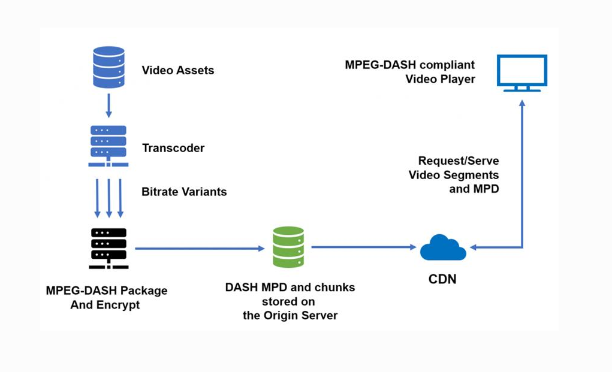

# 2.6 视频流媒体

> 章级精读：[../study.md#ch2-6](../study.md#ch2-6) · **DASH 精编**：[#ch2-6-dash](#ch2-6-dash) · [架构读图](#ch2-6-dash-diagram) · [播放流程](#ch2-6-flow) · DNS/CDN：[2.4](../2.4_dns_service/study.md) · HTTP：[2.2](../2.2_http_and_web/study.md#ch2-http-tls-payload)

## 本节核心目标

了解**在线直播、点播**的网络实现：**边下边播**、**自适应码率（DASH）**、**CDN 加速**、**TCP/UDP 取舍**。

---

## 一、流媒体基本概念（必背）

**流媒体（Streaming Media）**

- **边下载边播放**，**不必等整文件下完**
- 服务器把视频切成**小片段**（常 **2～10 秒**）持续推送
- 客户端先**缓冲**一小段 → **边收边解码播放**
- 核心：**分段传输 + 缓冲播放 + 实时解码**

一句话：**像流水一样，边流边看。**

---

<a id="ch2-6-dash"></a>

## 二、DASH 动态码率自适应（必考 · 精编完整版）

**DASH（MPEG-DASH）**：**Dynamic Adaptive Streaming over HTTP** —— 基于 HTTP 的**动态自适应流**；国际标准 **ABR（自适应比特率）** 技术，与 **HLS** 同类思路、**更通用**。

### 1）核心定义（必背）

| 项 | 说明 |
|----|------|
| **全称** | 动态自适应流媒体传输（MPEG-DASH） |
| **定位** | **应用层**方案，跑在 **HTTP(S) / TCP** 上 |
| **核心思想** | **多码率预编码 + 等长切片 + MPD 清单 + 客户端自适应** |

一句话：**网快看高清，网慢看标清，全程尽量不卡。**



<a id="ch2-6-dash-diagram"></a>

### 读图（端到端架构）

| 阶段 | 图中 | 对应 DASH 概念 |
|------|------|----------------|
| **Video Assets** | 原始素材库 | 源视频文件 |
| **Transcoder** | 转码服务器 | 生成**多码率**版本 |
| **Bitrate Variants** | 向下三路 | **480p / 720p / 1080p** 等 |
| **Package and Encrypt** | 打包加密 | **切片（chunks）** + 生成 **MPD**（可 DRM） |
| **Origin Server** | 绿色存储 | **MPD + 各码率 chunks** 存**源站** |
| **CDN** | 云 | 边缘**缓存** MPD 与片段，就近分发 |
| **DASH Player** | 显示器 | **Request/Serve**：拉 **MPD** + 按网络**自适应选片段** |

**播放侧**：播放器 ↔ CDN 为 **HTTP 请求/响应**（[2.2 HTTP](../2.2_http_and_web/study.md)），非专用流媒体协议。

### 2）四大核心要点（逐条背）

#### ① 多码率（多种质量版本）

同一视频预先编码多档：

- 例：**480p / 720p / 1080p / 4K**
- 各档对应不同带宽（如 **500 kbps～8 Mbps**）

#### ② 切片（Segment）

- 切成**等时长小片段**（通常 **2～10 秒**，常用 **4 秒**）
- **每个码率**各有一套切片
- 片段为普通 **HTTP 文件**（MP4 / **fMP4**）→ **可缓存、CDN 友好**

#### ③ MPD（Media Presentation Description）

- DASH 的**清单/索引**（类比 HLS 的 **m3u8**）
- **XML**，含：
  - 可用**码率/分辨率**列表
  - 每片段 **URL、时长、字节范围**
  - 编解码、DRM 等元数据
- 客户端**先下 MPD**，再按清单拉片段

#### ④ 自适应（客户端 ABR）

实时监测：

| 信号 | 用途 |
|------|------|
| **带宽** | 当前下载速率 |
| **缓冲区水位** | 高 → 可升清；低 → 须降清 |
| 时延/抖动 | 辅助判断 |

**决策**

- 网好、缓冲足 → **最高可用码率**
- 网差、缓冲将空 → **降码率**防卡
- 切换力求**平滑**，不中断播放

### 3）工作流程

**源站侧（上图左→下→中）**

1. **转码** → 多 **Bitrate Variants**  
2. **打包（+ 可选加密）** → 切片 + **MPD**  
3. 存入 **Origin Server** → 同步到 **CDN**

**客户端侧（5 步，必考顺序）**

1. 向 CDN **请求 MPD**  
2. 解析 MPD → 各码率与片段 **URL**  
3. 测带宽/缓冲 → **选初始码率**  
4. **HTTP 拉取**并播放首个 **segment**  
5. 持续监测 → **动态换码率**，循环请求后续片  

### 4）关键特点（对比传统单文件流）

- **HTTP/TCP**：穿防火墙、**CDN 友好**、无需专用流媒体服务器
- **客户端自适应**：服务器**无状态**、易扩展
- **多终端**：手机/PC/TV 自动匹配清晰度
- **抗抖动**：弱网自动降清，**卡顿率↓**
- 支持**点播 + 直播**

### 5）DASH vs HLS（高频对比 · 默写表）

| 对比项 | **DASH（MPEG-DASH）** | **HLS（Apple）** |
|--------|------------------------|------------------|
| 标准 | **国际标准（MPEG）** | 苹果主导（已开放） |
| 清单 | **MPD（XML）** | **m3u8** |
| 封装 | **MP4 / fMP4**、也可 TS | 常见 **TS** |
| 兼容性 | **全平台**（Android/PC/TV） | 苹果生态优先 |
| 复杂度 | 功能全、较复杂 | 相对简单 |
| 典型应用 | YouTube、Netflix、**B 站** | 苹果设备、部分短视频 |

**传输**：二者片段多走 **HTTP(S) over TCP**（与 [2.2](../2.2_http_and_web/study.md) 一致）。

### 6）考试超简口诀（6 行）

1. **DASH = HTTP 自适应，MPEG 标准最通用**  
2. **多码率：480/720/1080，一网多备**  
3. **切小片：2～10 秒一段，HTTP 可缓存**  
4. **MPD：XML 清单，记清所有片段 URL**  
5. **客户端：测带宽、看缓冲，网好升清、网差降**  
6. **流畅优先，动态适配，不卡为先**

---

## 三、CDN 边缘缓存（核心保障）

**CDN（Content Delivery Network，内容分发网络）**

- 把热门内容**预先复制**到全国/全球**边缘节点**（离用户近）
- 用户请求经 **DNS / HTTP 调度（GSLB）** 导向**最近/负载低**的节点
- **不回远源站**取片（命中时）

| | 无 CDN | 有 CDN |
|--|--------|--------|
| 路径 | 用户 → **千里外源站** | 用户 → **同城/近邻边缘** |
| 体验 | 时延大、易卡、源站压力大 | **低时延、稳、抗并发** |

教材两种部署思路（了解）：**Enter Deep**（深入接入网大量边缘）vs **Bring Home**（IXP 等大 PoP 集中）。

一句话：**把内容搬到你家门口，就近观看。**

→ 与 [2.4 DNS](../2.4_dns_service/study.md) 调度、[2.5 P2P](../2.5_p2p_file_distribution/study.md) 分发对比：CDN **中心化边缘缓存**，P2P **用户互传**。

---

## 四、TCP vs UDP 在流媒体（必背）

| | **TCP** | **UDP** |
|--|---------|---------|
| 特点 | 可靠、有序、**重传** | 无连接、**不重传**、低延迟 |
| 优点 | 数据完整、兼容性好 | **超低延迟**、实时性强 |
| 缺点 | **延迟高**、重传易卡顿 | 丢包可能花屏/马赛克 |
| 适用 | **点播**（DASH/HLS）、电影（**稳**优先） | **直播**、视频会议、互动（**快**优先） |

**补充**：**HTTP/3（QUIC over UDP）** 也在改善点播/直播的队头阻塞等问题。

一句话：**点播用 TCP（HTTP）求稳；直播常用 UDP 求快。**

---

<a id="ch2-6-flow"></a>

## 五、完整播放流程（DASH + CDN）

1. 源站：**多码率编码 + 切片 + 生成 MPD**  
2. 内容同步到 **CDN 边缘节点**  
3. 用户点播 → **DNS/GSLB** 解析到**最近 CDN**  
4. 客户端下载 **MPD**（各清晰度片段地址）  
5. **测带宽** → 选码率，**HTTP 拉取**片段  
6. 缓冲达到阈值 → **开始播放**，后台继续拉后续片  
7. 带宽变化 → **动态切换码率**，减少卡顿  

```text
用户 → DNS(CDN) → 边缘节点 → MPD + 分片(HTTP/TCP) → 播放器缓冲解码
```

---

<a id="ch2-6-exam"></a>

## 六、考试 / 面试速记

| 点 | 一句 |
|----|------|
| 流媒体 | 分段 + 缓冲 + 边下边播 |
| DASH | [#ch2-6-dash](#ch2-6-dash) 六句口诀；MPD+ABR |
| CDN | 边缘缓存、就近、降时延 |
| TCP/UDP | 点播稳 / 直播快 |

### 易错

| 易混 | 纠正 |
|------|------|
| DASH = 传整部电影一个文件？ | **否**；**分片 + MPD 索引** |
| DASH vs HLS | DASH：**MPD/XML/国际标准**；HLS：**m3u8/TS** |
| MPD 是什么？ | **清单文件**，不是视频本身 |
| 谁决定换清晰度？ | **客户端**（测带宽+缓冲），非服务器推一种流 |
| CDN = P2P？ | **否**；CDN **专业边缘节点**；P2P **用户互传** |
| 直播一定 TCP？ | 常 **UDP/WebRTC**；点播常 **HTTP/TCP** |

### 30 字终极版

**流媒体边下边播；DASH+MPD自适应码率；CDN就近；点播TCP稳、直播UDP快。**

---

## 个人总结（直接背）

**CDN + 自适应码率，是现在高清视频流畅播放的核心保障。**
