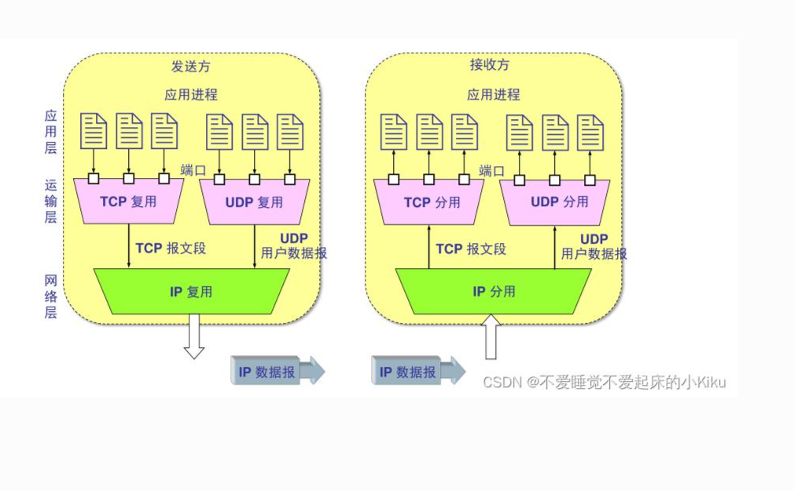

# 3.2 复用与分用

> 章级精读：[../study.md#ch3-2](../study.md#ch3-2) · 总览图：[3.1 配图](../assets/transport_multiplexing_demultiplexing.png) · 深化：[章级 §3.2 UDP/TCP 分用](../study.md#ch3-2-udp-tcp)

## 本节核心目标

弄懂：**一台主机上多个应用同时上网，数据如何互不干扰、准确送到各自程序**。

---

## 一、复用（Multiplexing）—— 发送端

**定义**：发送端把**多个应用进程的数据**交给运输层（TCP/UDP），封装成报文段，再交给网络层（IP）。

| 步骤 | 动作 |
|------|------|
| 1 | 浏览器、微信、视频等 → 各自产生数据 |
| 2 | 运输层加首部：**源端口、目的端口** 等 |
| 3 | 形成 TCP 段 / UDP 用户数据报 → **IP 复用** 发出 |

一句话：**多进一** —— 多个应用共用一条网络路径。

### 读图（教材 §3.2）

| 图例 | 含义 |
|------|------|
| 浅蓝椭圆 **P1～P4** | 应用**进程** |
| 黄色矩形 | **套接字**（应用 ↔ 运输层接口） |
| 堆叠方框 | 五层：**应用 → 运输 → 网络 → 链路 → 物理** |

| 主机 | 角色 |
|------|------|
| **主机 1**（左） | 进程 **P3** → 经套接字、协议栈 → 网络 → **主机 2** |
| **主机 3**（右） | 进程 **P4** → 同上 → **主机 2** |
| **主机 2**（中） | 同时跑 **P1、P2**；演示**复用 + 解复用** |

| 红框文字 | 对应背诵 |
|----------|----------|
| **发送方多路复用** | 多 socket 来的报文 → 运输层加首部（**IP、端口**等）→ **多进一** 交给网络层 |
| **接收方多路解复用** | 运输层按首部 **IP、端口** → **一进多** 投递到正确 socket → 对应进程 |

→ 与 [3.1 概述](../3.1_transport_service_intro/study.md#ch3-1-exam) 衔接

---

## 二、分用（Demultiplexing）—— 接收端

**定义**：收到 IP 包后，运输层根据**端口号**（及协议）把数据交给对应应用进程。

| 步骤 | 动作 |
|------|------|
| 1 | 网络层交付 → 剥 IP 头 → 运输层 |
| 2 | 查**目的端口号**（TCP 还要匹配连接） |
| 3 | 交给绑定该端口的进程 |

| 目的端口 | 常见应用 |
|----------|----------|
| **80** | HTTP |
| **443** | HTTPS |
| **53** | DNS |
| **22** | SSH |

一句话：**一进多** —— 一份网络数据，分到正确程序。

---

## 三、端口号：进程的「门牌号」

- **端口号**：**16 位**（0～65535），标识主机内**应用进程**
- **Socket（套接字）** = **IP + 端口** → 全网通信端点（**TCP 段首部无 IP**，见 [通俗精简版](#ch3-2-tcp-mux-simple)）
- **源端口**：标识**发送**进程；**目的端口**：标识**接收**进程  
- **四元组**（TCP）：`源IP, 源端口, 目的IP, 目的端口` → 唯一标识一条连接

一句话：**IP 找电脑，端口找程序。**

→ 应用层「HTTP 80、SMTP 25」等默认端口 = 填入 **TCP 首部** 的 16 位端口字段：[2.1 附节](../../02_application_layer/2.1_network_application_principle/study.md#ch2-1-ports-tcp)

| 端口范围（了解） | 用途 |
|------------------|------|
| 0～1023 | 周知端口（HTTP 80 等） |
| 49152～65535 | 客户端常分配的**临时源端口** |

---

## 附：TCP 复用通俗精简版（只讲端口）

> **先建立直觉**：本节**刻意不引入 IP / 四元组**；考试分用、多连接区分见 [第四节](#ch3-2-tcp-exam)。

### 1）先明确事实

**TCP 报文段首部里只有源端口、目的端口，没有 IP 地址。**

- IP 地址在**下层 IP 数据报首部**，与 TCP 段本身无关。
- 因此讲「**TCP 如何复用**」时，可以**只从端口出发**理解发送端行为。

### 2）TCP 复用本质

**复用**：一台主机上**多个应用进程**，都通过 TCP 向外发数据，**共用**下层网络通路同时传输（发送端 **多进一**）。

### 3）TCP 两种复用情况（发送端）

| 情况 | 做法 | 例子 |
|------|------|------|
| **访问对方不同进程** | 各进程填**不同目的端口** | 浏览器 → 对方 **443**，SSH 客户端 → 对方 **22** |
| **访问对方同一进程** | **目的端口相同**（如都连 **80**），本机用**不同源端口**区分自己 | 多标签页同时访问同一 Web 服务器 |

第二种里：多条连接**目的端口一样**，靠**源端口不同**让本机区分「哪条流是我发的」。

### 4）简单总结（端口视角）

| 方向 | 靠什么 |
|------|--------|
| **复用（发）** | **源端口 + 目的端口** 组合，区分本机各进程发出的流 |
| **分用（收）** | 先看 **目的端口**，把段交给绑定该端口的应用（单连接时足够） |

一句话：**讲 TCP 段本身时，复用/分用核心就是端口；IP 是网络层的事。**

**与考试衔接**：同一台服务器 **80 端口**上往往有**成千上万条 TCP 连接**同时存在，接收端必须用 **四元组** 才能分清是哪一条连接 → [TCP 分用（必考）](#ch3-2-tcp-exam)。

---

## 四、UDP 与 TCP 分用（必考）

### UDP 分用（无连接）

- **依据**：主要看 **目的端口号**（套接字常绑 **目的 IP + 目的端口**）
- **特点**：
  - 一个端口通常 **bind 一个进程**
  - **不同源 IP/源端口**，只要**目的端口相同** → 同一 UDP 套接字接收
  - 无连接、无状态、简单

### TCP 分用（面向连接）

- **依据**：**四元组**全匹配
- **特点**：
  - 服务器 **80/443** 可**同时**服务海量客户端（每连接四元组不同）
  - 内核用四元组区分连接 → 交给对应套接字
  - `listen` 端口 vs `accept` 后的**连接套接字**（一对多）

### 对比表（背诵）

| 特性 | **UDP 分用** | **TCP 分用** |
|------|--------------|--------------|
| 连接 | 无连接 | 面向连接 |
| 分用依据 | **目的端口**（+ 目的 IP） | **四元组** |
| 端口与进程 | 常 **一对一** 绑定 | **一对多**（一端口多连接） |
| 复杂度 | 简单 | 复杂 |

**易错**：TCP **不能**只看目的端口；必须四元组都匹配。

→ 章级详图与套接字 API：[§3.2](../study.md#ch3-2-compare)

---

## 五、考试 / 面试速记

| 点 | 口诀 |
|----|------|
| 复用 | 发端 **多进一** |
| 分用 | 收端 **一进多** |
| UDP | **目的端口** |
| TCP | **四元组** |

### 30 字终极版

**复用多进一分用一进多；UDP看目的端口，TCP看四元组；端口定进程。**

---

## 个人总结（直接背）

**端口号 + 分用机制，让一台主机可以同时跑成千上万个网络应用。**
