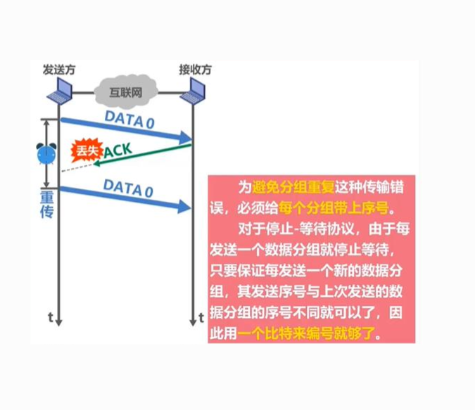
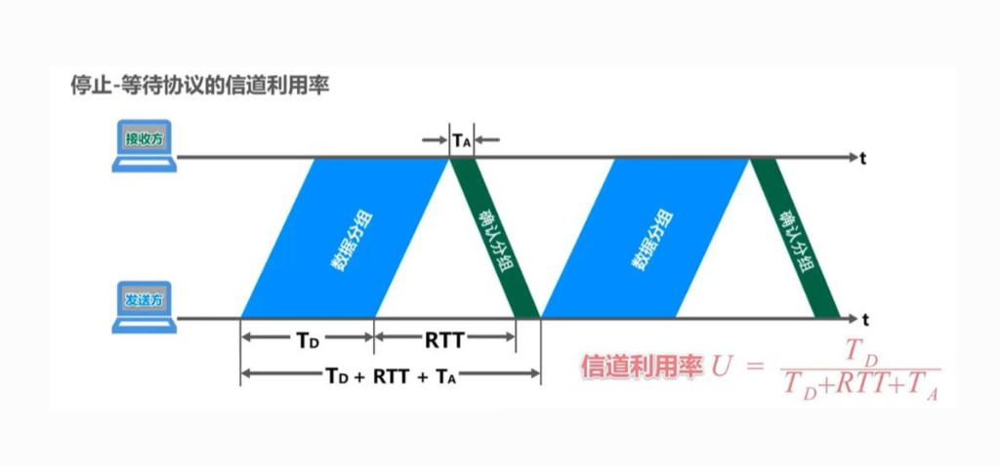
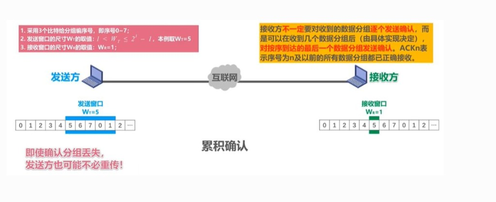
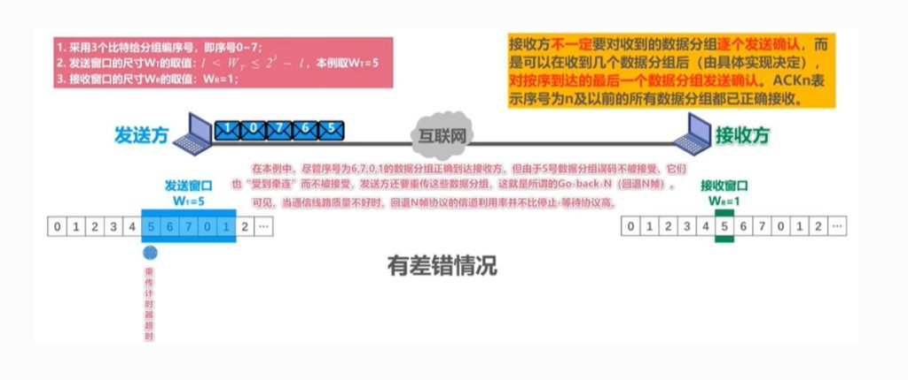

# 3.4 可靠数据传输原理

> 章级精读：[../study.md#ch3-4](../study.md#ch3-4) · SR 窗口约束：[章级 §3.4](../study.md#ch3-4)

## 本节核心目标

掌握**可靠传输的通用底层算法**：从理想信道到不可靠信道，逐步引入 **ACK、超时重传、序号、窗口**，理解 **停等、GBN、SR** —— **TCP 可靠能力全部建立在此之上**。

---

## 一、理想可靠信道 vs 实际不可靠信道

### 1）理想可靠信道（rdt1.0）

- 无差错、不丢包、按序到达
- 发送方：发一个，不用等，直接发下一个
- 接收方：收到就上交
- **无确认、无重传、无序号**

→ **现实不存在，仅作理论基准**。

### 2）实际不可靠信道（三大问题）

| 问题 | 表现 |
|------|------|
| **比特差错** | 数据在传输中被篡改 |
| **分组丢失** | 数据或 ACK 半路丢了 |
| **乱序** | 后发的包先到 |

→ 必须用 **ACK、超时重传、序号、滑动窗口** 解决。

---

## 二、核心可靠机制（必背 4 件事）

### 1）确认 ACK（Positive Acknowledgment）

- 接收方收到**正确、按序**数据 → 回 **ACK（常带序号）**
- 发送方收到 ACK → 确认已送达，可发新包

### 2）超时重传（Timeout & Retransmission）

- 发完包 → **启动定时器**
- 超时未收到 ACK → 认为丢包 → **重传**

→ 解决**丢包**（含 ACK 丢失）。

### 3）序号（Sequence Number）

- 每包唯一序号（0, 1, 2, …）
- **区分新包 / 重传包**、**按序排序**、**避免重复上交**

### 4）滑动窗口（Sliding Window）

- **发送窗口**：可连续发送、尚未确认的包数（如 N=5）
- **接收窗口**：允许接收的序号范围

→ 提高利用率，不必「发一个等一个」。

---

## 三、RDT 协议演化（从简单到实用）

| 版本 | 信道假设 | 机制 |
|------|----------|------|
| **rdt1.0** | 完全可靠 | 发即走；无 ACK/重传/序号 |
| **rdt2.0** | 仅比特差错 | **校验和**；对 → ACK，错 → **NAK**；NAK 则重传 |
| **rdt2.1** | 比特差错 + ACK 可能坏 | **1 bit 序号**；**只用 ACK（带序号）**，不用 NAK；重复 ACK → 重传 |
| **rdt3.0** | 差错 + **丢包** | rdt2.1 + **定时器**；超时未 ACK → 重传（**停等**） |

**rdt3.0 = 停等 + 超时**，能处理差错、丢包、ACK 丢失，但**效率极低**。

### 读图：ACK 丢失与 1 bit 序号

| 步骤 | 含义 |
|------|------|
| 发 **DATA 0** | 接收方正确收到 |
| 回 **ACK** | 途中**丢失**（图中爆炸标记） |
| 发送方**定时器超时** | 未收到 ACK → **重传 DATA 0** |
| **1 bit 序号** | 停等每次最多 1 个未确认包；序号 **0/1 交替** 即可区分新包与重复 |

**考点**：停等下 **1 bit 序号足够**；接收方对重复序号丢弃并**再发 ACK**。

---

## 四、三大可靠协议（必考）

### 1）停等 Stop-and-Wait（SW）

| 项 | 内容 |
|----|------|
| 规则 | **发 1 个，等 1 个 ACK，再发下一个** |
| 窗口 | 发送 = **1**，接收 = **1** |
| 序号 | **1 bit（0/1）** |
| 优点 | 最简单 |
| 缺点 | **信道利用率极低**（RTT 大时尤甚） |

**利用率**（记结论即可）：

$$U = \frac{T_D}{T_D + RTT + T_A}$$

- \(T_D\)：发数据分组时间；\(T_A\)：发 ACK 时间；**RTT**：往返传播等
- 分子只有 \(T_D\) 在传数据 → RTT 大则 **U → 0** → 必须**流水线（GBN/SR）**

教材等价式：\(U \approx \frac{L/R}{RTT + L/R}\)（\(L/R\) 即发送时延）。

---

### 2）回退 N 步 Go-Back-N（GBN）

| 项 | 内容 |
|----|------|
| 规则 | 连续发 **N** 个；**累积确认**；丢包则重传**丢包及之后全部** |
| 窗口 | 发送 = **N**，接收 = **1**（只收按序） |
| 确认 | **ACK n** = n 及之前**全部**正确收到 |
| 乱序 | **丢弃**，不缓存 |
| 重传 | 超时后从**最早未确认**起**回退重传一串** |

### 读图：累积确认

| 要素 | 图中示例 |
|------|----------|
| 序号 | **3 bit** → 0～7 循环 |
| \(W_T=5\) | 发送窗口可含 5 个未确认包（如 5,6,7,0,1） |
| \(W_R=1\) | 接收方只等**下一个按序**包（如等 5） |
| **累积 ACK** | 不必每个包都 ACK；**ACK n** = 0～n 均已收到 |
| 约束 | \(1 < W_T \le 2^k - 1\)（k 为序号位数） |

| 差错场景 | 行为 |
|----------|------|
| **包 5 丢失** | 6,7,0,1 虽可能到达 → 接收方**全部丢弃**（只收按序） |
| 发送方 | **重传计时器超时** → **从 5 起重传窗口内所有包** |
| 效率 | 信道差时 GBN 可能**不比停问好多少**（大量重复传） |

**考点**：即使 ACK 丢失，**后续累积 ACK** 可能让发送方不必重传（图中粉框说明）。

---

### 3）选择重传 Selective Repeat（SR）

| 项 | 内容 |
|----|------|
| 规则 | 连续发 **N** 个；**逐个确认**；只重传**丢失/出错的那一个** |
| 窗口 | 发送 = **N**，接收 = **N**（**缓存乱序**） |
| 乱序 | **缓存**，缺包补齐后**按序上交** |
| 重传 | **单包**重传，带宽利用**最高** |
| 代价 | 实现复杂（缓存、排序、序号空间管理） |

**易错（SR 窗口）**：序号 k 位时，常要求  
\(W_s + W_r \le 2^k\)，或取 **\(W \le 2^{k-1}\)** 防新旧序号混淆。  
→ [章级推导](../study.md#ch3-4)

---

### 三大协议对比表（必背）

| 特性 | **停等 SW** | **GBN** | **SR** |
|------|-------------|---------|--------|
| 发送窗口 | 1 | N | N |
| 接收窗口 | 1 | 1 | N |
| 确认方式 | 逐个 | **累积** | 逐个 |
| 乱序处理 | 不允许 | **丢弃** | **缓存** |
| 丢包重传 | 1 个 | **N 个（回退）** | **1 个** |
| 效率 | 最低 | 中等 | 最高 |
| 复杂度 | 最简单 | 中等 | 最复杂 |

---

## 五、考试 / 面试速记

| 点 | 口诀 |
|----|------|
| 四机制 | **ACK、超时、序号、窗口** |
| rdt3 | **停等 + 1bit + 超时** |
| GBN | **发 N 收 1，累积 ACK，丢包回退** |
| SR | **发 N 收 N，缓存乱序，单包重传** |
| 利用率 | \(U = T_D/(T_D+RTT+T_A)\)，RTT 大 → 要流水线 |

### 50 字终极版

**不可靠三问题；ACK超时序号窗口四机制。rdt3停等1bit。GBN发N收1累积ACK丢包回退N个。SR发N收N缓存乱序只重传1个。TCP可靠根基。**

---

## 个人总结（直接背）

**TCP 的可靠能力（确认、重传、序号、窗口、流量控制、拥塞控制），全部建立在这些基础可靠传输算法之上。**
