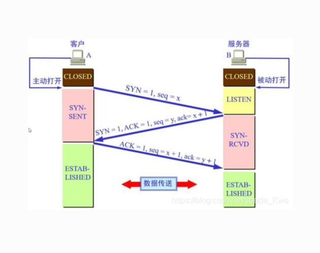
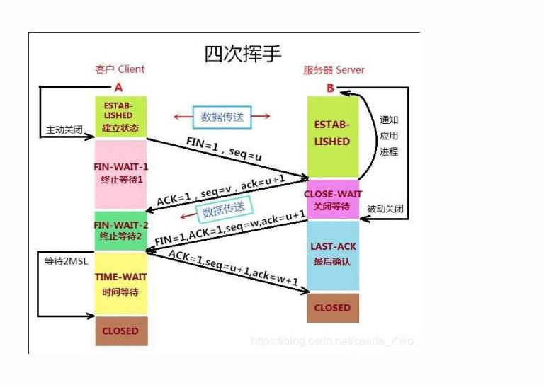

# 3.5 TCP 连接与传输

> 章级精读：[../study.md#ch3-5](../study.md#ch3-5) · 可靠基础：[3.4](../3.4_reliable_data_transfer_principle/study.md) · 流量控制 rwnd：[章级 #ch3-5-flow](../study.md#ch3-5-flow)

## 本节核心目标

彻底搞懂 **TCP 三次握手（建连接）、四次挥手（断连接）、序号 / 确认号、可靠传输**。

---

## 一、TCP 核心特性（先记 4 句）

1. **面向连接**：传输前必须先建立连接（三次握手）。
2. **可靠交付**：不丢、不乱、不错（序号、ACK、重传保障）。
3. **有序字节流**：数据视为连续字节流，**无消息边界**。
4. **全双工**：双方可同时收发数据。

→ 与 [3.4 SR](../3.4_reliable_data_transfer_principle/study.md) 思想一脉相承，TCP 在连接上实现可靠 + 字节流语义。

---

## 二、TCP 连接建立：三次握手（必考）

### 1）流程（客户端主动，服务器被动）

| 次 | 方向 | 报文 | 含义 | 状态变化 |
|----|------|------|------|----------|
| **①** | C→S | `SYN=1, seq=x` | 请求建连；客户端 ISN = **x** | C：**CLOSED→SYN_SENT**；S：**LISTEN→SYN_RCVD** |
| **②** | S→C | `SYN=1, ACK=1, seq=y, ack=x+1` | 同意建连；确认 x；服务器 ISN = **y** | — |
| **③** | C→S | `ACK=1, seq=x+1, ack=y+1` | 确认 y；连接建立 | 双方 → **ESTABLISHED** |

**读图要点**

| 颜色 / 元素 | 含义 |
|-------------|------|
| **LISTEN**（黄） | 服务器被动打开，等待连接 |
| **SYN_SENT / SYN_RCVD**（粉） | 握手进行中 |
| **ESTABLISHED**（绿） | 连接就绪，可**数据传送** |
| **主动打开 / 被动打开** | 客户端 vs 服务器角色 |

### 2）关键公式（必背）

| 规则 | 说明 |
|------|------|
| **SYN / FIN 各占 1 序号** | 即使无数据，也消耗序号 |
| 控制段 | `ack = 对方 seq + 1` |
| 数据段 | `ack = 对方 seq + 本次数据长度` |
| 确认语义 | **ack = 期望收到的下一个字节序号**（累积确认） |

### 3）为什么是三次？

| 次数 | 问题 |
|------|------|
| 1 次 | 只证明客户端**能发**，不够 |
| 2 次 | 服务器知收发正常，但**客户端不知服务器收发是否正常** |
| **3 次** | 双方都确认：**自己能发、对方能收；对方能发、自己能收** |

**易错**：第三次握手可**携带数据**（实现相关）；考试常考**序号 ack 计算**。

---

## 三、TCP 可靠传输：序号、确认、重传

### 1）序号（Seq）

- 对**每个字节**编 **32 位**序号（0～4G 循环）。
- **防乱序、防重复、标识字节位置**（非「第几个包」）。

### 2）确认号（Ack）

- `ack` = **期望收到的下一个字节序号**。
- **累积确认**：`ack=1000` → 字节 0～999 全部正确收到。

### 3）丢包重传（两种）

| 机制 | 触发 | 特点 |
|------|------|------|
| **超时重传** | 定时器到期仍无 ACK | 基础手段 |
| **快速重传** | 收到 **3 个重复 ACK** | 不等超时，立即重传 |

→ RTT 估计与超时公式：[章级 §3.5](../study.md#ch3-5)

### 4）按序交付

- 接收方**缓存乱序段**，缺包补齐后**按序上交**应用层（类似 SR）。

---

## 四、TCP 连接关闭：四次挥手（必考）

TCP **全双工** → 两个方向**分别关闭**。

### 1）流程（客户端主动关闭）

| 次 | 方向 | 报文 | 含义 | 状态变化 |
|----|------|------|------|----------|
| **①** | C→S | `FIN=1, seq=u` | 客户端不再发（关 C→S） | C：**ESTABLISHED→FIN_WAIT_1** |
| **②** | S→C | `ACK=1, seq=v, ack=u+1` | 确认 FIN；服务器**还可发** | S：**ESTABLISHED→CLOSE_WAIT**；C：**FIN_WAIT_2** |
| **③** | S→C | `FIN=1, …, ack=u+1` | 服务器发完，关 S→C | S：**CLOSE_WAIT→LAST_ACK** |
| **④** | C→S | `ACK=1, seq=u+1, ack=w+1` | 确认服务器 FIN | C：**TIME_WAIT**；S：**CLOSED** |
| **等待** | C | **2MSL** 后 | 最后 ACK 可能重传；旧报文过期 | C：**CLOSED** |

**读图要点**

| 阶段 | 含义 |
|------|------|
| **半关闭** | ② 之后仅 **S→C** 仍可传数据（图中单向「数据传送」） |
| **CLOSE_WAIT** | 服务器收到 FIN 后应**尽快 close**，否则堆积 |
| **TIME_WAIT** | 主动关闭方等 **2MSL** 再 CLOSED |

### 2）为什么是四次？

- ② 的 ACK：**确认**客户端 FIN；
- ③ 的 FIN：服务器**发完数据后**再关自己的发送方向；
- **确认与关闭发送方向分开** → 需要四次。

### 3）TIME_WAIT（2MSL）

1. 确保**最后一个 ACK** 能到达服务器（丢了服务器会重传 FIN，客户端可再 ACK）。
2. 让本连接**迟到的旧报文**在网络中消失，避免干扰**同四元组新连接**。

**易错**：`TIME_WAIT` 在**主动关闭方**（常为客户端，也可服务器主动关）。

---

## 五、考试 / 面试速记

| 点 | 口诀 |
|----|------|
| 特性 | **连接、可靠、字节流、全双工** |
| 握手 | **SYN seq=x → SYN+ACK y ack=x+1 → ACK ack=y+1** |
| 挥手 | **FIN → ACK → FIN → ACK；半关闭** |
| 可靠 | **字节序号、累积 ACK、超时 + 快重传** |
| 公式 | **SYN/FIN 占 1 序号；ack=seq+1（或+数据长）** |

### 50 字终极版

**面向连接可靠字节流全双工。三次握手SYN序x ack加一建连。四次挥手FIN半关闭TIME_WAIT等2MSL。序号累积ACK超时与三重复ACK快重传按序交付。**

---

## 个人总结（直接背）

**三次握手建连接，四次挥手断连接，TCP 保障数据不出错、不乱序。**
