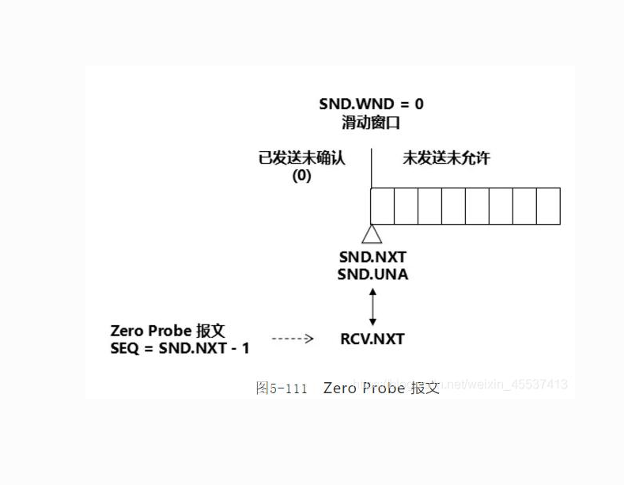

# 3.6 TCP 流量控制

> 章级精读：[../study.md#ch3-5-flow](../study.md#ch3-5-flow) · [零窗口/探测/对比表](#ch3-6-compare) · [Probe 读图](#ch3-6-persist-diagram) · [三窗一页背](#ch3-6-all-windows) · [背诵](#ch3-6-exam)

## 本节核心目标

理解 TCP 如何**防止发送方把接收方冲爆**（接收缓冲区溢出）。

---

## 一、流量控制定义（必背）

**流量控制（Flow Control）**：  
**接收方限制发送方发送速率**，使发送速率 ≤ 接收方处理能力，避免接收缓冲区满而丢包。

| 维度 | 说明 |
|------|------|
| 解决 | **点对点（端到端）** 速度不匹配 |
| 手段 | TCP 首部 **Window** 字段通告 **rwnd** |
| **≠ 拥塞控制** | 拥塞控制解决**网络链路拥堵**（[3.7](../3.7_tcp_congestion_control/study.md) 的 **cwnd**） |

**易错**：丢包原因要分清——接收方满（rwnd）vs 路由器堵（cwnd）。

---

## 二、核心机制：滑动窗口 + 接收窗口 rwnd

### 1）接收窗口 rwnd（receiver window）

- **rwnd = 接收缓冲区剩余可用空间（字节）**
- 写在 TCP 首部 **16 位 Window 字段**（可配合**窗口扩大选项**），**随 ACK** 动态通告
- **有效发送上限**：

$$\text{发送窗口} = \min(\text{rwnd},\ \text{cwnd})$$

（**cwnd** 为拥塞窗口，属拥塞控制。）

### 2）滑动窗口工作流程（通俗）

| 步骤 | 动作 |
|------|------|
| 1 | 连接建立时双方通告/协商窗口能力（握手中可带选项） |
| 2 | 传输中接收方**每个 ACK** 都带**当前 rwnd** |
| 3 | 发送方**已发送未确认字节数 ≤ rwnd**（且 ≤ cwnd） |
| 4 | 接收慢 → **rwnd 变小** → 发送方减速 |
| 5 | 应用读走数据 → **rwnd 变大** → 发送方可加速 |

### 3）数值示例（一眼看懂）

| 事件 | rwnd 含义 |
|------|-----------|
| 接收缓冲区 **4000 B**，刚建立 | 可通告 rwnd≈4000 |
| 收到 **1000 B** 数据并 ACK | **rwnd=3000**（还剩 3000 可收） |
| 再收 **2000 B** 并 ACK | **rwnd=1000** |
| 缓冲区将满 | **rwnd=0** → 发送方**停发** |

---

<a id="ch3-6-zero-window"></a>

## 三、零窗口（rwnd=0）与窗口更新（必考精读）

### 1）零窗口（Zero Window）

| 项 | 说明 |
|----|------|
| **触发** | 接收方应用 **read() 慢** → **接收缓冲区满** → ACK 中 **rwnd = 0** |
| **发送方** | **立即停止发送新数据**（避免溢出丢包） |
| **本质** | **流量控制** — 「接收方收不下」，**不是**网络拥塞（≠ cwnd） |

```text
接收慢 → 缓冲满 → ACK(rwnd=0) → 发送方停发（除探测外）
```

**易错**：rwnd=0 时停发是**流控**；路由器堵看 **cwnd**（[3.7](../3.7_tcp_congestion_control/study.md)）。

---

<a id="ch3-6-persist"></a>

### 2）零窗口探测（Persist Probe / Zero Probe，必考）

#### 核心机制（RFC / 教材 · 可直接背）

| 项 | 内容 |
|----|------|
| **触发** | 收到 **rwnd = 0** → **停发新数据** → 启动 **Persist Timer（坚持/持续计时器）** |
| **探测** | 计时器超时 → 发 **1 字节 Probe**；序号 **SEQ = SND.UNA − 1**（已确认序号，**不占新序号**） |
| **目的** | 强制接收方回 **ACK**，**带回最新 rwnd**；防**窗口更新 ACK 丢失**死锁 |
| **间隔** | 仍为 0 则继续探，间隔常 **指数退避**（RTO → 2RTO → 4RTO…），避免风暴 |
| **恢复** | 探测 ACK 中 **rwnd > 0** → 正常发送 |

**一句话**：**rwnd=0 后启坚持计时器，定时发 1 字节 Probe，强制对方返回窗口更新，防更新 ACK 丢导致死锁。**



<a id="ch3-6-persist-diagram"></a>

**读图**

| 图中 | 含义 |
|------|------|
| **SND.WND = 0** | 滑动窗口关闭，**未发送未允许** |
| **SND.UNA / SND.NXT** | 零窗且已确认完时，常**重合**于同一边界 |
| **Zero Probe** | 指向 **RCV.NXT** 方向；**SEQ = SND.NXT − 1**（教材亦写 **SND.UNA − 1**，此时二者相同） |
| 载荷 | **1 字节**，只为换 ACK 里的 **Window(rwnd)** |

#### 为什么会死锁（必背 4 步）

1. 接收方缓存腾出 → 发**窗口更新 ACK（rwnd > 0）**  
2. 该 ACK **丢失**（TCP **不确认**纯 ACK）  
3. 发送方一直等窗口更新**不发数据**；接收方一直等数据 → **双方永久等待**  
4. **零窗口探测** = 发送方**主动打破死锁**

```text
rwnd=0 → 停发 + Persist Timer → 1B Probe(SEQ=UNA-1) → ACK(新rwnd)
```

**易错**：探测不是硬灌业务数据；Persist Timer **≠** 重传定时器（重传管丢段，Persist 管零窗）。

---

<a id="ch3-6-window-update"></a>

### 3）窗口更新（Window Update）

| 项 | 说明 |
|----|------|
| **触发** | 应用 **read()** 取走数据 → 缓冲区释放 → **rwnd 变大** |
| **发送** | 接收方可发**纯 ACK**（无应用数据），仅通告新 **rwnd** |
| **作用** | 通知发送方**恢复 / 加快**发送 |
| **特点** | 不消耗新序号、载荷小；但 ACK **会丢** → **必须配合零窗口探测** |

```text
read() 释放缓冲 → ACK(Window=新rwnd) → 发送方加大可发量
（若该 ACK 丢失 → 依赖 Persist Probe 发现 rwnd 已恢复）
```

---

<a id="ch3-6-compare"></a>

### 4）零窗口 · 探测 · 更新 — 极简对比表

| 概念 | 谁触发 | 做什么 | 可靠性 | 防什么 |
|------|--------|--------|--------|--------|
| **零窗口** | 接收方缓冲满 | ACK 里 **rwnd=0**；发送方**停发** | — | 接收溢出 |
| **窗口更新** | 接收方 read 释放缓冲 | **纯 ACK** 通告 **rwnd>0** | ACK **会丢** | 通知可加速 |
| **零窗口探测** | 发送方（Persist Timer） | **1B Probe**，SEQ=**UNA−1** | 逼对端回 ACK | **更新 ACK 丢 → 死锁** |

**Persist Timer** 专用于零窗探测；与 **RTO 重传** 分工不同。

---

### 5）考试一句话（§三）

- **零窗口**：接收缓存满，**rwnd=0**，发送方**停发**。  
- **零窗口探测**：**坚持计时器** + **1 字节 Probe**，防**窗口更新 ACK 丢失**死锁。  
- **窗口更新**：缓冲有空，**ACK 通告新 rwnd**，恢复传输（须配合探测）。  

---

<a id="ch3-6-all-windows"></a>

## 附、流量控制 + 拥塞控制 — 一页速记（rwnd · cwnd · ssthresh）

> 与 [3.7 三窗联动](../3.7_tcp_congestion_control/study.md#ch3-7-three-windows) 合背。

$$\boxed{\text{可发未确认量} \le \min(\text{rwnd},\ \text{cwnd})}$$

| 量 | 层/问题 | 谁给 | 典型事件 |
|----|---------|------|----------|
| **rwnd** | **流控** · 接收方满 | 接收方 **Window** | 变小/ **=0 零窗口** / read 后**窗口更新** |
| **cwnd** | **拥塞** · 网络堵 | 发送方自维护 | 慢启动指数 / 拥塞避免线性 / 超时回 1 |
| **ssthresh** | cwnd 阶段切换 | 发送方 | **初值很大**；拥塞后 **max(cwnd/2, 2 MSS)** |

| 机制 | 解决什么 | 关键字 |
|------|----------|--------|
| **零窗口** | rwnd=0 停发 | 接收缓冲满 |
| **Persist Probe** | 更新 ACK 丢 → 死锁 | **1 字节探测** |
| **窗口更新** | 缓冲释放通告 rwnd | 纯 ACK，不可靠 |
| **慢启动/拥塞避免** | 网络容量 | cwnd、ssthresh |
| **超时 / 3 dup ACK** | 拥塞信号 | cwnd、ssthresh 更新 |

**分流控 vs 拥塞（必背）**

| | 流控 rwnd | 拥塞 cwnd |
|--|-----------|-----------|
| 原因 | **接收方**处理慢 | **网络**过载 |
| rwnd=0 | 停发 + **探测** | — |
| 丢包后 | 等窗口更新/探测 | **ssthresh、cwnd** 重算 |

---

## 四、流量控制 vs 拥塞控制（对照）

| | **流量控制** | **拥塞控制** |
|--|--------------|--------------|
| 问题 | 接收方**处理不过来** | **网络**承载不足 |
| 信号 | **rwnd**（接收方通告） | **cwnd**（发送方根据丢包/时延等调节） |
| 字段/对象 | 首部 **Window** | 发送方维护 **cwnd** |
| 谁主导 | **接收方** | **发送方**（+ 网络反馈） |

→ 详读拥塞算法：[章级 #ch3-6](../study.md#ch3-6) · [3.7 小节](../3.7_tcp_congestion_control/study.md)

---

<a id="ch3-6-exam"></a>

## 五、考试 / 面试速记

### 3 行口诀

1. **流量控制 = 接收方限发送，防缓冲区满；≠ 拥塞控制（网络用 cwnd）**  
2. **rwnd 随 ACK 通告；发送有效窗口 = min(rwnd, cwnd)**  
3. **rwnd=0 停发；Persist 探 1 字节防死锁；窗口更新 ACK 恢复**

### 零窗口三句

```text
零窗rwnd零，发送立刻停
探测一问rwnd，防ACK丢死锁
read释放发更新，配合探测才稳
```

### 30 字终极版

**rwnd限发送防接收溢出；窗口min(rwnd,cwnd)；零窗口停发探测恢复；区别于拥塞cwnd。**

---

## 个人总结（直接背）

**滑动窗口流量控制，接收窗口 rwnd 动态反馈，零窗口停发+探测，保证发送永远不超过接收处理上限。**
