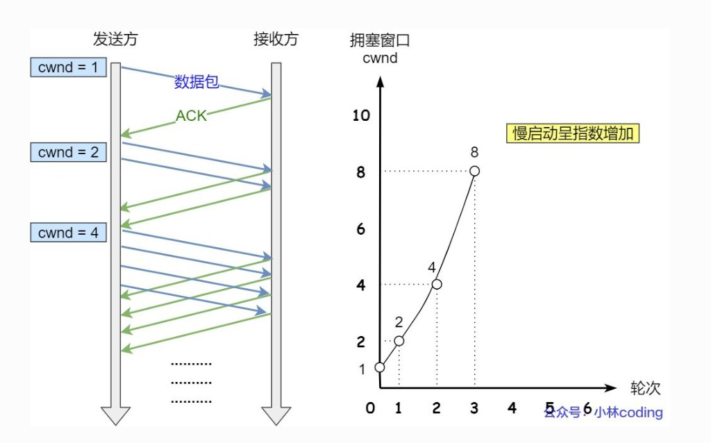
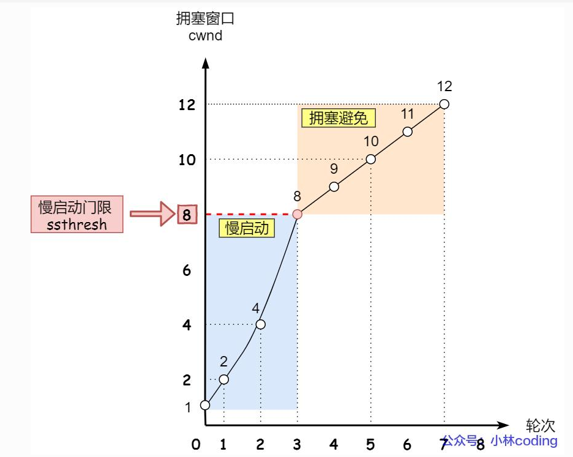
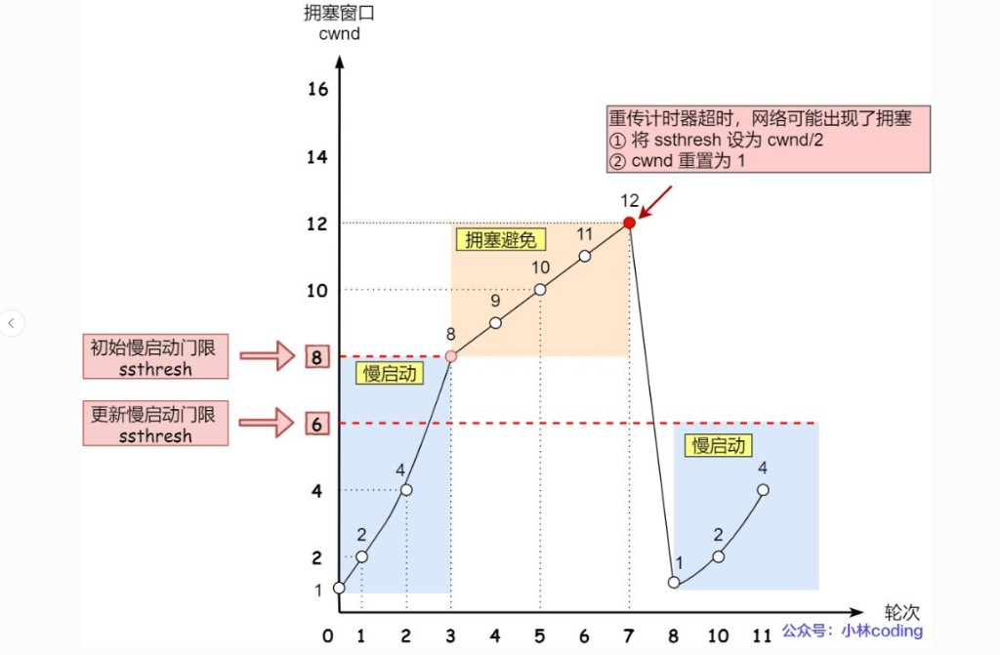

# 3.7 TCP 拥塞控制

> 章级精读：[../study.md#ch3-6](../study.md#ch3-6) · [cwnd=1](#ch3-7-cwnd-1) · [ssthresh 精读](#ch3-7-ssthresh) · [cwnd/ssthresh/rwnd 联动](#ch3-7-three-windows) · [四阶段表](#ch3-7-cheat-sheet) · [背诵](#ch3-7-exam)

## 本节核心目标

弄懂 TCP **避免网络整体拥堵**的核心算法（**cwnd** 与四大阶段）。

---

## 一、拥塞控制是什么（必背）

| 概念 | 说明 |
|------|------|
| **拥塞** | 路由器缓存满、排队时延激增、大量丢包 → 全网性能**雪崩** |
| **拥塞控制** | **发送方主动降速**，避免把网络堵死 |
| 解决 | **全网链路过载**（非单台主机接收能力） |

### 与流量控制区别（易考）

| | **流量控制** | **拥塞控制** |
|--|--------------|--------------|
| 范围 | **端到端** | **全网** |
| 防什么 | 接收方被冲爆 | 路由器 / 链路被冲爆 |
| 窗口 | **rwnd**（接收方通告） | **cwnd**（发送方维护） |

→ [3.6 流量控制](../3.6_tcp_flow_control/study.md#ch3-6-exam)

---

## 二、核心：拥塞窗口 cwnd（必背公式）

- **cwnd（congestion window）**：发送方维护，表示**网络当前能承受的最大未确认数据量**（常以 **MSS** 为单位）。
- **发送有效窗口**：

$$\text{发送窗口} = \min(\text{cwnd},\ \text{rwnd})$$

发送速率同时受**网络能力（cwnd）**与**接收能力（rwnd）**限制。

**ssthresh（slow start threshold）**：慢启动与拥塞避免的**分界阈值** → 详读 [#ch3-7-ssthresh](#ch3-7-ssthresh)。

---

<a id="ch3-7-ssthresh"></a>

## 附、ssthresh 精读（初始较大 · 来自上次事件）

### 1）是什么

**ssthresh（slow start threshold，慢启动阈值）**

| 条件 | 阶段 |
|------|------|
| **cwnd < ssthresh** | **慢启动**（指数增长） |
| **cwnd ≥ ssthresh** | **拥塞避免**（线性 +1 MSS/RTT） |

### 2）初始为什么「较大」（第一次建连）

**RFC 5681**（考试按教材表述）：

| 变量 | 初值 |
|------|------|
| **cwnd** | **1 MSS**（现代实现可能 2～4 MSS，考试常写 **1**） |
| **ssthresh** | **很大**（传统如 **65535 字节**；Linux 等可视为「无穷大」/接收窗口上限） |

**目的**

- 建连时**不知带宽**，不能过早把 cwnd 挡在拥塞避免；
- 让 cwnd **充分指数增长**，尽快探测网络承载能力；
- **初始 ssthresh 很大** ≈ 前期**几乎不限制慢启动**，直到发生拥塞才更新。

一句话：**初始 ssthresh 很大 → 前期一直慢启动，不轻易进拥塞避免。**

### 3）「来自上次事件」— ssthresh 有记忆

| 时机 | ssthresh |
|------|----------|
| **第一次** | 大初始值 |
| **之后每次拥塞** | 由**超时**或 **3 dup ACK** 更新，**不再是**初始大值 |

**RFC 5681 常用更新（记结论）**

```text
ssthresh = max(cwnd/2, 2×MSS)
```

#### 超时（严重拥塞）

```text
ssthresh = max(cwnd/2, 2 MSS)
cwnd = 1 MSS
```

→ 把「上次能跑的一半」记为新阈值；再慢启动时 **ssthresh 来自上次拥塞**，非初始大值。

#### 3 个重复 ACK（轻度 · Reno）

```text
ssthresh = max(cwnd/2, 2 MSS)
cwnd = ssthresh   （快恢复，不回 1）
```

同样：**新 ssthresh = 事件前 cwnd 的一半**（有下限 2 MSS）。

### 4）典型例题（考试最爱）

**初始**：cwnd=**1**，ssthresh=**8**（较大初始）

| RTT | cwnd | 阶段 |
|-----|------|------|
| 1 | 1 | 慢启动 |
| 2 | 2 | 慢启动 |
| 3 | 4 | 慢启动 |
| 4 | **8** | 达到 ssthresh → **拥塞避免** |
| 5 | 9 | 拥塞避免 |
| 6 | **10** | 拥塞避免 → **超时** |

**超时后**

- **ssthresh = 10/2 = 5**（**来自上次事件**）
- **cwnd = 1**

**再慢启动**

| RTT | cwnd |
|-----|------|
| 7 | 1 |
| 8 | 2 |
| 9 | 4 |
| 10 | **5** → 达到新 ssthresh → 拥塞避免 |

**要点**：第一次 ssthresh 是**大初值**；之后都来自**上次拥塞时 cwnd 的一半**。

### 5）背诵两句

- **初始 ssthresh 很大**：让慢启动充分探路，不提前线性增。  
- **之后 ssthresh = 上次 cwnd/2**：超时或 3 dup ACK 后记住历史、保守恢复。

---

<a id="ch3-7-three-windows"></a>

## 附、cwnd · ssthresh · rwnd 联动（一页）

| 量 | 谁维护 | 限制什么 | 典型变化 |
|----|--------|----------|----------|
| **rwnd** | **接收方**通告 | 接收缓冲区还能收多少 | 随 ACK **Window** 字段变 |
| **cwnd** | **发送方** | 网络还能扛多少未确认数据 | 慢启动指数 / 拥塞避免线性 / 事件后重置 |
| **ssthresh** | **发送方** | cwnd 何时从指数改线性 | 初值**很大**；拥塞后 **max(cwnd/2, 2 MSS)** |

**有效发送（字节）**

$$\text{可发未确认量} \le \min(\text{cwnd},\ \text{rwnd})$$

| 场景 | 谁主导 |
|------|--------|
| 建连初期 cwnd=1，rwnd 很大 | **cwnd**（网络探测） |
| 高速链路，rwnd 变小 | **rwnd**（接收方满） |
| 超时后 cwnd=1 | **cwnd**；**ssthresh** 已降为上次一半 |

**计算题套路**

1. 画 RTT 行，标 **cwnd** 每轮变化（慢启动 ×2 直到 ≥ ssthresh，再 +1/RTT）  
2. 遇**超时**：ssthresh=事件前 cwnd/2，cwnd=1，重新表  
3. 遇 **3 dup ACK**：ssthresh=事件前 cwnd/2，cwnd=ssthresh，进拥塞避免  
4. 每轮可发量再与 **rwnd** 取 min（题目给 rwnd 时）

→ 四阶段事件表：[#ch3-7-cheat-sheet](#ch3-7-cheat-sheet) · rwnd/零窗口：[3.6 流控一页](../3.6_tcp_flow_control/study.md#ch3-6-all-windows)

---

<a id="ch3-7-cwnd-1"></a>

## 附、cwnd = 1 MSS（慢启动初始 · 必背）

### 1）术语

| 术语 | 含义 |
|------|------|
| **cwnd** | **拥塞窗口** — 发送方维护，限制**网络能承受**的最大未确认数据量，单位常为 **MSS** |
| **MSS** | **最大报文段长度** — 单段 TCP **数据载荷**上限（不含 TCP/IP 头），典型 **1460 B** |
| **cwnd = 1 MSS** | 当前最多再发 **1 个**满载荷段，再发须等 ACK |

### 2）何时 cwnd = 1 MSS

1. **TCP 连接刚建立**（传统 **RFC 5681** 初值；现代实现可能更大，**考试按 1 MSS**）  
2. **超时重传** — 判定严重拥塞后**重置**  
3. **慢启动起点** — 谨慎探测，避免一上来灌满队列  

### 3）为什么是 1 MSS

- 建连时**不知**带宽与瓶颈容量 → **最小保守值**  
- 防止瞬间大量分组 → 路由器队列溢出、**全网拥塞**

### 4）慢启动增长（1 → 2 → 4 → 8…）

| 步骤 | cwnd / 行为 |
|------|-------------|
| 初值 | **cwnd = 1 MSS** → 发 **1** 段 |
| 每收到 1 ACK | **cwnd += 1 MSS**（如 1→2） |
| 每 RTT（近似） | 未确认段数约**翻倍** → **指数增长** |
| 直到 | **cwnd ≥ ssthresh** → 进入**拥塞避免**（线性 +1 MSS/RTT） |

### 5）与 rwnd

$$\text{实际发送窗口} = \min(\text{cwnd},\ \text{rwnd})$$

- **cwnd = 1** 时，速率常由**拥塞控制**卡住，而非接收缓冲区（rwnd 仍可能很大）。

### 6）一句话

**cwnd=1 MSS** 是慢启动的**初始保守值**：建连或超时后只发 1 个满段，随 ACK **指数探测**网络容量，避免拥塞。

---

<a id="ch3-7-cheat-sheet"></a>

## 附、慢启动 / 拥塞避免 / 快恢复 — 一页速记表

| 阶段/事件 | 触发 | cwnd 变化 | ssthresh | 下一步 |
|-----------|------|-----------|----------|--------|
| **慢启动** | 建连 / 超时后 | 从 **1 MSS** 起；**每 ACK +1 MSS**（≈每 RTT **×2**） | 不变（直至事件） | cwnd **≥ ssthresh** → 拥塞避免 |
| **拥塞避免** | cwnd ≥ ssthresh | **每 RTT +1 MSS**（**线性**） | 不变 | 丢包 → 下表 |
| **快重传** | **3 个重复 ACK** | （立即**重传**丢失段，不等超时） | — | 触发快恢复 |
| **快恢复** | 3 dup ACK 后 | **cwnd = ssthresh**（**不回 1**） | **max(cwnd/2, 2 MSS)** | **拥塞避免** |
| **超时** | 计时器超时 | **cwnd = 1 MSS** | **max(cwnd/2, 2 MSS)** | **慢启动** |

```text
正常：慢启动(指数) ──≥ssthresh──► 拥塞避免(线性)
轻度：3 dup ACK ──► ssthresh=max(cwnd/2,2MSS), cwnd=ssthresh ──► 拥塞避免
重度：超时 ──► ssthresh=max(cwnd/2,2MSS), cwnd=1 ──► 慢启动
```

**对比记忆**：**超时回 1**；**3 dup ACK 只减半到 ssthresh，不回 1**。

---

## 三、四大阶段（必考 · 详述）

### 1）慢启动 Slow Start

| 项 | 内容 |
|----|------|
| 场景 | **连接刚建立** / **超时丢包后** |
| 初值 | **cwnd = 1 MSS**；**ssthresh** 初值很大 / 拥塞后来自上次事件 → [#ch3-7-ssthresh](#ch3-7-ssthresh) |
| 增长 | 每收到 **1 个 ACK**，cwnd **+1 MSS** → **每 RTT 约翻倍**（指数）：1→2→4→8… |
| 结束 | cwnd **≥ ssthresh** → **拥塞避免**；中途**超时** → 见第四节 |



<a id="ch3-7-diagram-ss"></a>

**读图**：左图每 RTT 发包数随 cwnd 增；右图 **轮次–cwnd** 曲线标注「**慢启动呈指数增加**」。

---

### 2）拥塞避免 Congestion Avoidance

| 项 | 内容 |
|----|------|
| 场景 | **cwnd ≥ ssthresh**，网络相对平稳 |
| 增长 | **每 RTT cwnd += 1 MSS** → **线性**（加性增 AIMD 的「增」） |
| 结束 | **3 个重复 ACK** → 快重传 + 快恢复；**超时** → cwnd=1 慢启动 |



| 轮次 | cwnd | 阶段 |
|------|------|------|
| 0～3 | 1→2→4→**8** | 慢启动（蓝） |
| 3 | 8 = **ssthresh** | 拐点 |
| 4～7 | 9→10→11→**12** | 拥塞避免（橙），每 RTT +1 |

---

### 3）快重传 Fast Retransmit

| 项 | 内容 |
|----|------|
| 触发 | **连续 3 个相同（重复）ACK** |
| 含义 | 某段可能丢了，但链路**未必完全堵死** |
| 动作 | **不等超时**，**立即重传**丢失段 |
| 优点 | 减少等待，时延更小 |

→ 与 [3.5 可靠传输](../3.5_tcp_connection_and_transmission/study.md) 中「3 重复 ACK」一致。

---

### 4）快恢复 Fast Recovery（TCP Reno）

| 项 | 内容 |
|----|------|
| 触发 | **3 个重复 ACK 之后**（**轻度拥塞**） |
| 动作 | ① **ssthresh = max(cwnd/2, 2 MSS)** ② **cwnd = ssthresh**（**不回 1**）③ 进入**拥塞避免** |
| 逻辑 | 轻度丢包**不一刀切**，保留带宽、平稳恢复 |

**易错**：快恢复后 cwnd **不是** 1；**超时**才会 cwnd=1。

---

## 四、丢包处理对比（必背）



<a id="ch3-7-diagram-timeout"></a>

### 读图：超时事件（轮次 7）

| 事件 | 处理 |
|------|------|
| cwnd=**12** 时**重传计时器超时** | 判定**可能重度拥塞** |
| **ssthresh** | 更新为 **max(cwnd/2, 2 MSS) = 6**（红虚线） |
| **cwnd** | **重置为 1** |
| 之后 | 重新**慢启动**（1→2→4…直至再遇 ssthresh=6） |

### 对照表（考试默写）

→ 与 [#ch3-7-cheat-sheet](#ch3-7-cheat-sheet) 同一套结论。

| 信号 | 拥塞程度 | ssthresh | cwnd 之后 | 进入 |
|------|----------|----------|-----------|------|
| **超时丢包** | **重度** | **max(cwnd/2, 2 MSS)** | **1 MSS** | **慢启动** |
| **3 个重复 ACK** | **轻度** | **max(cwnd/2, 2 MSS)** | **= ssthresh** | **快恢复 → 拥塞避免** |

---

<a id="ch3-7-exam"></a>

## 五、考试 / 面试速记

| 点 | 口诀 |
|----|------|
| 公式 | **min(cwnd, rwnd)** |
| 慢启动 | **指数**，至 **ssthresh** |
| 拥塞避免 | **线性 +1/RTT** |
| ssthresh | **初值很大**；事件后 **max(cwnd/2, 2 MSS)** |
| 超时 | **ssthresh 减半阈，cwnd=1** |
| 3 dup ACK | **ssthresh 减半阈，cwnd=ssthresh**（快恢复） |

### 50 字终极版

**拥塞用cwnd防全网堵，区别于rwnd。慢启动指数到ssthresh后线性避。超时cwnd归一半阈再回一。三重复ACK快传快恢复减半不归一。**

---

## 六、延伸（了解）

- **AIMD**：加性增、乘性减（拥塞避免 + 事件减半）。
- 现代：**CUBIC**、**BBR** 等 → [章级 #ch3-7](../study.md#ch3-7)

---

## 个人总结（直接背）

拥塞控制是 TCP 保障整个互联网稳定不崩溃的关键核心。  
**慢启动探路、拥塞避免稳走、快重传救急、快恢复止损。**
