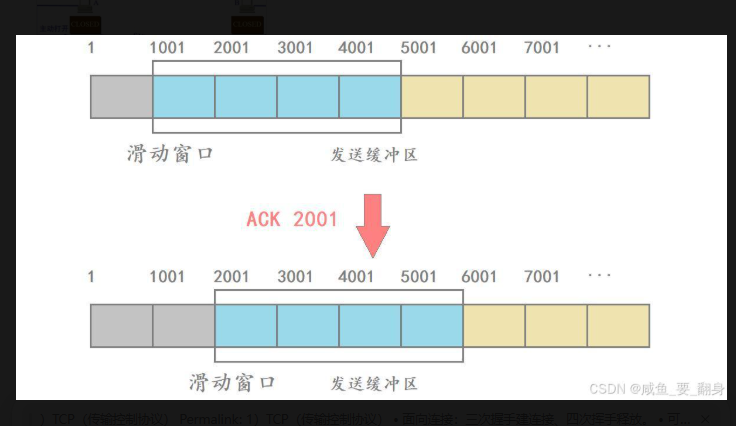
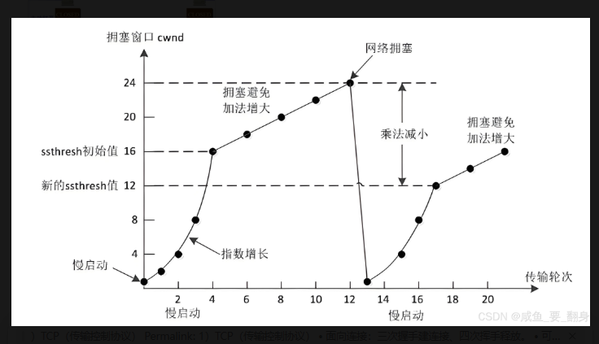
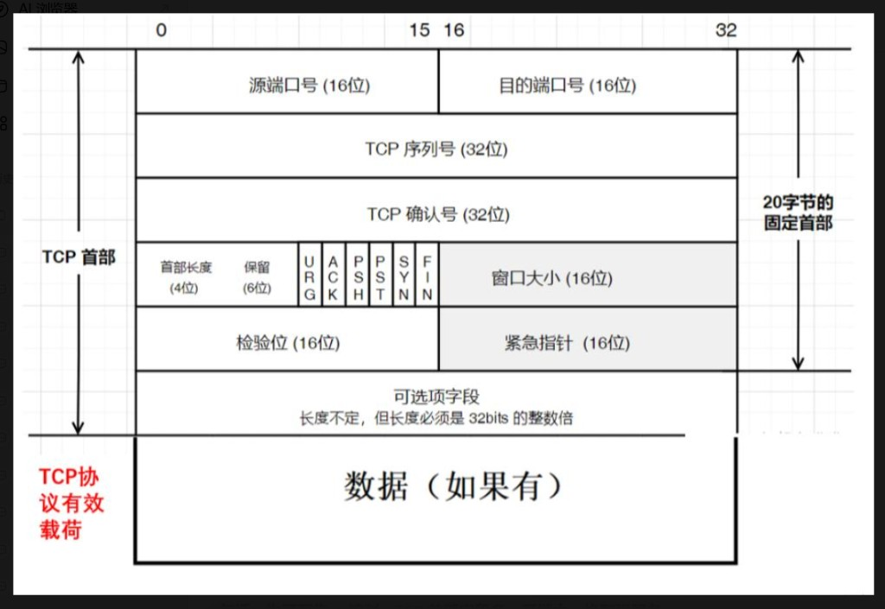
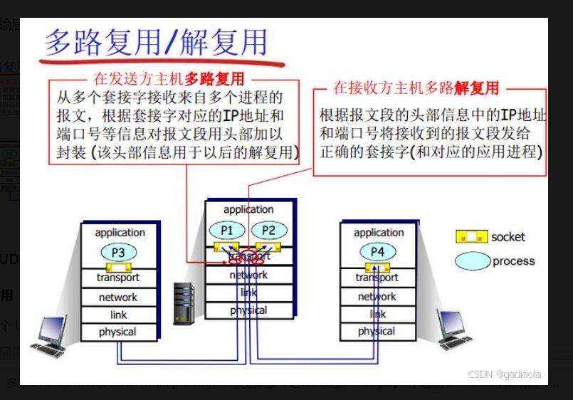
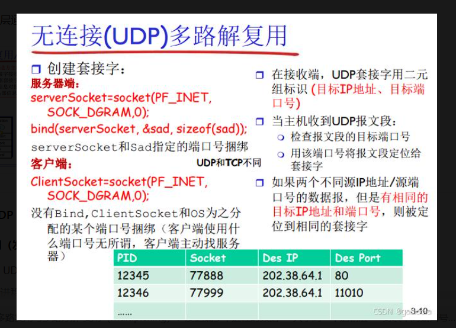
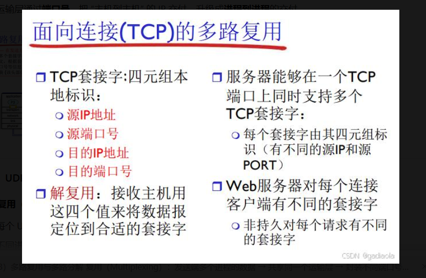
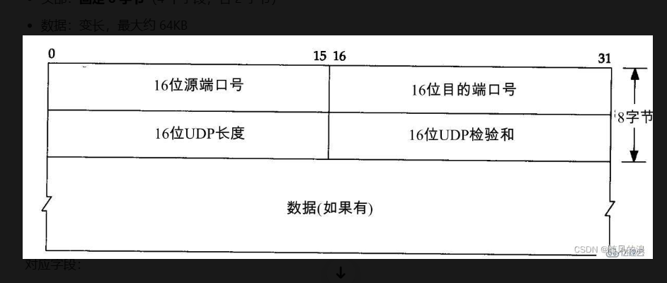
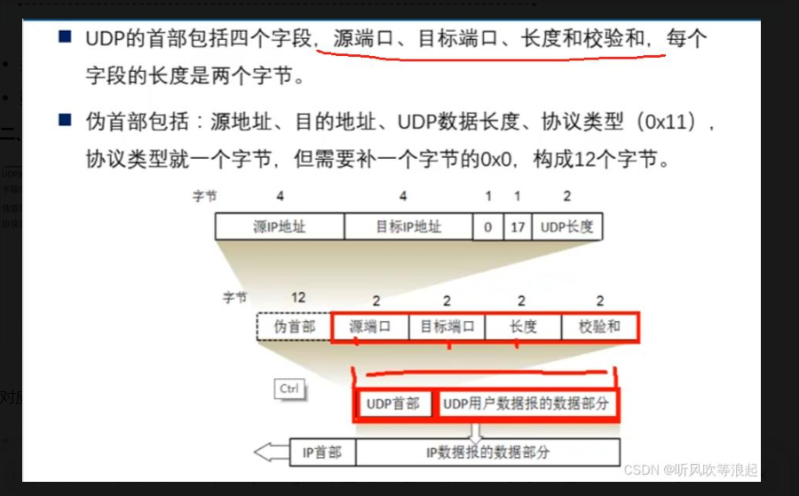

# 第3章：运输层（The Transport Layer）全景深度解析

在分层协议栈中，运输层承上启下：向上为应用进程提供**逻辑通信**，向下使用网络层**主机到主机**的尽力而为交付。本章从多路复用/分解、UDP、可靠传输原理，到 TCP 的连接与窗口、拥塞控制，再到 **QUIC / HTTP/3** 的演化，串起现代互联网传输的主线。

---

<a id="ch3-1"></a>

## 3.1 运输层服务及其与网络层的关系

### 一、运输层的战略地位

运输层位于**应用层与网络层之间**，是协议栈中的**关键枢纽/核心层**。

- **网络层**：提供 **主机到主机（Host-to-Host）** 的逻辑通信（靠 IP 地址）。
- **运输层**：通过 **端口/套接字** 标识进程，提供 **进程到进程（Process-to-Process）** 的逻辑通信。
- 运输层**只存在于端系统（主机）**，路由器一般不处理运输层头部。

一句话：**IP 管「哪台机器」，端口管「哪个程序」**，合起来是套接字 `(IP:端口)`。

---

### 二、核心定义与对标（必背）

- **报文段（Segment）**：运输层把应用报文分段、加上运输层首部后形成的 PDU（TCP 叫报文段，UDP 叫用户数据报）。
- **逻辑通信**：对应用进程屏蔽路由器、链路类型、路由变化等细节；仿佛两端之间直接有一条端到端信道。
- **与网络层的关系（核心考点）**
  - **网络层（IP）**：**不可靠、无连接、尽力而为**交付 → 会丢包、乱序、可能位错。
  - **运输层（TCP/UDP）**：**在 IP 之上**提供增强服务：
    - **TCP**：用**序号、确认、重传、流量控制、拥塞控制**实现**有序、可靠、全双工字节流**。
    - **UDP**：**尽量简单**，仅**端口寻址 + 校验和**，不保证可靠。
  - 本质：**网络层解决「可达」，运输层解决「好用/可靠」**。

---

### 三、因特网运输层概览（TCP vs UDP）

#### 1）TCP（传输控制协议）｜完整版

> 在不可靠 IP 之上提供**面向连接、可靠、全双工字节流**；六大机制是考试/面试主线。

<a id="ch3-1-tcp-conn"></a>

**（1）面向连接：三次握手建连接、四次挥手释放**

**核心**：通信前必须先「约好」，结束要「礼貌分手」，全程有**状态机**。

**三次握手（建立连接）**

| 次序 | 方向 | 关键字段 | 含义 |
|------|------|----------|------|
| ① | C → S | **SYN=1，seq=x** | 我想连，初始序号 x |
| ② | S → C | **SYN=1, ACK=1, ack=x+1, seq=y** | 同意连，确认 x，我初始序号 y |
| ③ | C → S | **SEQ=x+1, ACK=1, ack=y+1** | 确认 y；本端 SYN 已消耗，连接建立 |


<a id="ch3-1-tcp-seq"></a>

**SEQ = x 里的 x 是什么？（易错考点）**

> **x 是系统随机生成的 32 位无符号整数（ISN）** — ✅ 纯数字；❌ 不是 ASCII/Unicode/字符/字符串；❌ 与文本编码无关。

| 概念 | 说明 |
|------|------|
| **SEQ** | **32 bit 无符号整数**，范围 **0 ~ 4,294,967,295** |
| **ISN** | 建立连接时双方各自随机选的**初始序列号**（第一次握手的 `seq=x`） |
| **作用** | 给**字节流**编号 → 排序、去重、确认、重传 |
| **规则** | TCP 为发送的**每一个字节**分配序号；随已发送字节数**累加**（模 2³² 回绕） |

**三次握手序列号逻辑（与上表对照）**

| 次序 | 报文 | 字段 | 含义 |
|------|------|------|------|
| ① | C → S | `SEQ = x` | x = 客户端随机 **ISN** |
| ② | S → C | `SEQ = y`，**ACK=1**，`ack = x+1` | y = 服务端 **ISN**；标志位开启确认，期望下一字节 **x+1** |
| ③ | C → S | **ACK=1**，`ack = y+1`（常 `seq = x+1`） | 期望下一字节 **y+1** → 连接建立 |

**SEQ 序号 vs ASCII/Unicode（彻底分清）**

| | **SEQ（运输层）** | **ASCII/Unicode（应用层）** |
|--|-------------------|---------------------------|
| 本质 | 二进制**数值**，无文本含义 | **字符编码**，文字 ↔ 字节 |
| 谁用 | TCP 给字节流编号 | HTTP/邮件等**载荷**里的文字 |
| 关系 | 应用数据转成字节放进 TCP 后，TCP **只按字节位置用数字编号**，不识别「这是汉字还是字母」 |

**直观例子**

- 客户端 ISN：`x = 13,528,967` → 第一次握手发 **`SEQ = 13528967`**。
- 服务端第二次握手：**ACK=1**（标志位），**`ack = 13528968`**（确认号数值）。
- 之后发送网页/HTML/JSON 等字符串，字符先被编成字节，序号从该连接的字节流位置**继续递增**；TCP **全程只认数字**。

**补充**

- ISN **随机**：降低旧连接**迟滞报文**误绑新连接的风险（与 TIME_WAIT、四元组等机制配合）。
- **四次挥手**的 FIN 也占用序号（`FIN=1, seq=u` 等），规则与数据段一致。

<a id="ch3-1-tcp-ack"></a>

**一眼分清 ACK / ack / SEQ（教材标准写法）**

| 写法 | 是什么 | 说明 |
|------|--------|------|
| **大写 ACK** | TCP 首部**标志位**（6 位之一：URG/PSH/**ACK**/RST/**SYN**/FIN） | **ACK=1**：本段是**确认报文**（携带有效确认号）；**ACK=0**：不携带确认信息 |
| **小写 ack** | **确认序号**（32 bit 整数） | `ack = 已收到连续字节后的下一序号`；含义：**前面都已收到，下次请从 ack 号字节开始发** |
| **SEQ / seq** | **本段发送**的第一个字节序号（32 bit） | 第一次握手常为随机 **ISN**（`SEQ=x`） |

-  SYN 握手阶段常用写法：`ack = 对端 SEQ + 1`（SYN 占用一个序号）。
-  有数据时：`ack = 对端 seq + 本段已正确接收的字节数`（**累积确认**）。

**结合三次握手**

| 次序 | 标志位 ACK | 确认号 ack | 发送序号 SEQ |
|------|------------|------------|--------------|
| ① C→S | **0**（无确认） | （无） | `SEQ = x` |
| ② S→C | **1** | `ack = x+1` | `SEQ = y` |
| ③ C→S | **1** | `ack = y+1` | 常 `seq = x+1` |

**极简总结**

- **大写 ACK**：报文是不是「确认包」的**开关**。
- **小写 ack**：告诉对方**下一个该发第几号字节**的**数字**。
- **SEQ**：本段发出的数据从**第几号字节**开始。

<a id="ch3-1-tcp-seq-full"></a>

**序号 + 确认号全程串通（握手 → 传数据）**

**先记约定**

| 符号 | 含义 |
|------|------|
| **ISN_client = x** | 客户端随机初始序列号 |
| **ISN_server = y** | 服务端随机初始序列号 |
| **SYN / FIN** | 控制报文**各占 1 个序号**，通常**无业务数据** |

---

#### 三次握手完整复盘

| 步 | 方向 | 报文要点 | 含义 |
|----|------|----------|------|
| ① | C → S | `SEQ=x`，**ACK=0**（无有效 ack） | 发起连接，本端字节流从 **x** 开始 |
| ② | S → C | `SEQ=y`，**ACK=1**，`ack=x+1` | 确认收到客户端 **SYN（占序号 x）**；下次期望 **x+1**；本端从 **y** 开始 |
| ③ | C → S | `SEQ=x+1`，**ACK=1**，`ack=y+1` | 客户端 SYN 已消耗 → 下次发送从 **x+1**；确认服务端 **SYN（占 y）** → 期望 **y+1** |

**为何是 x+1 / y+1？**  
对端发来的 **SYN** 虽无数据，仍占用**一个序号**。收到 `SEQ=y` 的 SYN 后，编号 **y** 已被消耗，故 **ack = y+1**（同理服务端 **ack = x+1**）。

→ **连接建立完成**；此后只传业务数据，不再握手。

**握手收尾基准（传数据起点）**

| 端 | 下一次发送起始 SEQ |
|----|-------------------|
| 客户端 | **x+1**（SYN 占用了 x） |
| 服务端 | **y+1**（SYN 占用了 y） |

---

#### 核心总结（四条）

1. 发数据后，对端确认：**ack = 本段收到的 SEQ + 本次数据字节数**（下一期望字节号）。
2. TCP **全双工**：客户端、服务端各有一套**独立**序号，只累加自己的 SEQ。
3. 客户端只看服务端发来的 **ack** 推进 **x** 线；服务端只看客户端 **ack** 推进 **y** 线，**互不干扰**。
4. 确认可**单独发 ACK 包**，也可**捎带**在本端数据报文里（piggyback），不必每次单独回包。

---

#### 单向传数据

**客户端 → 服务端（200 字节）**

1. 客发包：`SEQ = x+1`，200 字节  
2. 服收齐后：`ack = (x+1) + 200 = **x+201**`（已收 x+1～x+200，下次请发 **x+201**）

**服务端 → 客户端（150 字节）**

1. 服发包：`SEQ = **y+1**`，150 字节  
2. 客收齐后：`ack = (y+1) + 150 = **y+151**`（已收 y+1～y+150，下次请发 **y+151**）

> 易错：握手后服务端**首包数据**从 **y+1** 起，不是 y（y 已被 SYN 消耗）。

---

#### 全双工并行 + 捎带确认

- 两端可**同时**互发数据，两套序号**独立递增**。
- **捎带 ACK**：刚收到对端数据、正要发自己的数据时，把 **ack** 写进**本次上行数据包**，无需单独发一个纯确认包 → 省带宽。

---

#### 连续数据流完整示例

| 步 | 报文 | 说明 |
|----|------|------|
| 1–3 | 三次握手 | 基准锁定：**客 x+1、服 y+1** |
| 4 | 客→服：`SEQ=x+1`，200 字节 | |
| 5 | 服→客：`ack=x+201` | 可单独 ACK，也可与下步合并 |
| 6 | 服→客：`SEQ=y+1`，150 字节 | 可捎带 `ack=x+201` |
| 7 | 客→服：`ack=y+151` | |
| 8+ | 客续发 | 下一包 **`SEQ=x+201`** 起 |
| 8+ | 服续发 | 下一包 **`SEQ=y+151`** 起 |

**极简七步（考场速记）**

| 步 | 报文 |
|----|------|
| 1–3 | 握手 → 基准 **x+1 / y+1** |
| 4 | 客 `SEQ=x+1`，50B |
| 5 | 服 `ack=x+51` |
| 6 | 服 `SEQ=y+1`，80B |
| 7 | 客 `ack=y+81` |

---

#### 关键要点复盘

| 项 | 要点 |
|----|------|
| **ACK=1** | 标志位：本段带确认信息 |
| **ack** | 数值：对方下一待收字节 = 对方 SEQ + 已收字节数 |
| **全双工** | 两条字节流独立，序号互不影响 |
| **捎带** | 确认可夹在数据包里发 |
| **全程** | 不再握手，SEQ/ack 持续顺延（模 2³² 回绕） |

**一句话**：握手只同步**双方起点**；之后各自累加 SEQ，用 **ack** 做累积确认，可捎带、可并行。

---

**状态迁移（必记）**

- 客户端：**CLOSED →（主动打开）→ SYN_SENT → ESTABLISHED**
- 服务器：**CLOSED →（被动打开）→ LISTEN → SYN_RCVD → ESTABLISHED**

**四次挥手（断开连接）**

| 次序 | 方向 | 关键字段 | 含义 |
|------|------|----------|------|
| ① | C → S | **FIN=1，seq=u** | 我发完了，关我这边（半关闭） |
| ② | S → C | **ACK=1，ack=u+1** | 收到，等我发完 |
| ③ | S → C | **FIN=1，seq=v** | 我也发完了 |
| ④ | C → S | **ACK=1，ack=v+1** | 收到，彻底关 |


**状态迁移（主动关闭方多为客户端，必记）**

| 步骤 | 客户端 | 服务器 |
|------|--------|--------|
| 发 FIN | **FIN_WAIT_1** | — |
| 收 ACK | **FIN_WAIT_2** | **CLOSE_WAIT**（仍可发数据） |
| 收 FIN | **TIME_WAIT** | **LAST_ACK** |
| 发最后 ACK | TIME_WAIT（等 2MSL）→ **CLOSED** | **CLOSED** |

- **TIME_WAIT**：主动关闭端在发完最后 ACK 后进入，等待约 **2MSL**，防止**最后 ACK 丢失**导致对端重传 FIN，并让旧连接四元组的**迟滞报文**过期。
- **考点**：TCP 全双工，关闭需**双方各自**发 FIN；②③ 之间服务器可能仍在上传数据（**半关闭**）。

**一句话**：握手 = 双方确认收发能力；挥手 = 双方各自收尾，**可靠断开**。

---

<a id="ch3-1-tcp-reliable"></a>

**（2）可靠交付：无丢失、无重复、按序到达**

TCP 在不可靠 IP 上做**字节流级可靠**，靠四大机制：

| 机制 | 作用 | 考点 |
|------|------|------|
| **序号（seq）** | 每个字节唯一编号 | 按序重组、去重 |
| **确认（ACK）** | 收到 → 回 ACK | **ack = 期望收到的下一字节序号**（累积确认） |
| **超时重传** | 发了无 ACK → 超时重传 | 丢包或 ACK 丢失都能救 |
| **快速重传** | 连续 **3 个重复 ACK** | 立刻重传，**不等超时** |

```
  发送方:  [1][2][3][4][5]...
              ↓ 3 丢
  接收方:  ACK1 ACK2 ACK2 ACK2 ACK2 ...  → 触发快速重传 3
```

**一句话**：**序号保序 + ACK 确认 + 超时/快速重传防丢**，做到「不丢、不重、不乱」。

---

<a id="ch3-1-tcp-flow"></a>

**（3）流量控制：窗口大小、滑动窗口、防止接收方被撑爆**

#### 窗口大小 Window / rwnd 是什么

- **窗口大小** = 接收方**当前还能再接收多少字节**（单位：**字节**）。
- 接收方把该值写入 TCP 首部 **Window** 字段（教材常记 **rwnd，接收窗口**），随 ACK 告诉发送方：**别发太快，我最多还能收这么多**。
- 发送方在途的**未确认数据**不得超过对端公布的窗口（并与 **cwnd** 取 min，见下条拥塞控制）。

#### 大白话例子

| 项 | 数值 |
|----|------|
| 接收缓存总容量 | 10,000 字节 |
| 已收到未交给应用 | 6,000 字节 |
| **剩余空位 → 窗口大小** | **4,000** |

→ 发送方本轮**最多再发 4,000 字节**，避免撑爆接收缓存。

#### 为什么叫「滑动窗口」

窗口数值会**动态变大、变小、随确认往前滑**，故称滑动窗口：

| 接收方状态 | 窗口变化 |
|------------|----------|
| 应用读走数据、缓存空出 | 窗口 **变大** |
| 数据堆积、处理不过来 | 窗口 **变小** |
| 完全忙不过来 | 窗口 **= 0** → 发送方 **暂停发送**（零窗口探测除外） |



- **发送侧图示**：灰色 = 已确认；蓝色 = 窗口内（可发/已发未确认）；黄色 = 暂不可发。
- 收到 **ACK 2001** → 前段确认 → 窗口**右移**，新序号进入可发区。
- **接收侧**：Window 字段反映的是**接收缓存剩余空间**（与上图发送侧「可发窗口」概念配对理解）。

#### 流量控制 vs 拥塞控制（易考）

| | **流量控制** | **拥塞控制** |
|--|--------------|--------------|
| 限制谁 | **接收方**限制发送方 | **网络**限制发送方 |
| 原因 | 对端处理慢、缓存小 | 路由器排队、丢包、全网堵 |
| 手段 | 首部 **Window（rwnd）** | **cwnd**（慢启动、拥塞避免等） |
| 一句话 | 别把我**接收缓存**撑爆 | 别把**整条网络**堵死 |

**有效发送上限**：`min(rwnd, cwnd)`。

#### 完整流程（七步演示）

1. 接收方通告：**Window = 5000**
2. 发送方本轮最多发 **5000** 字节（且受 cwnd 约束）
3. 接收方收到 2000 字节，应用尚未读走 → 空位减少
4. 下一 ACK 中 **Window = 3000**
5. 发送方**立刻降速**，未确认量在 3000 以内
6. 应用读空缓存 → **Window 回到 5000**
7. 发送方再提速

#### 窗口 = 0

接收机卡顿、程序慢、内存紧张 → 上报 **Window = 0** → 发送方**停止发数据**（等待窗口更新或零窗口探测报文）→ 处理完毕、窗口恢复后继续。

#### 与 SEQ / ack 联动

| 字段 | 作用 |
|------|------|
| **SEQ** | 字节编号 → 排序、去重、重传 |
| **ack** | 期望下一字节 → 确认已收 |
| **Window** | 剩余接收容量 → **控速（流量控制）** |

三者配合：**可靠 + 有序 + 接收端不溢出**（拥塞另靠 cwnd）。

**极简背诵**

1. **窗口大小**：接收缓冲区**剩余可收**字节数。  
2. **滑动窗口**：该数值随处理进度**前后滑动**变化。  
3. **流量控制**：用窗口限制发送速率，**防止接收方被冲垮**。

**一句话**：**流量控制 = 点对点速度匹配，靠 Window/rwnd 滑动窗口；精读与公式见 [§3.5](./study.md#ch3-5-flow)**。

---

<a id="ch3-1-tcp-cong"></a>

**（4）拥塞控制：防止网络过载丢包**

- **问题**：发送太快 → 路由器队列满 → **全网**延迟大、丢包多。
- **核心**：**拥塞窗口 cwnd**，**发送方根据网络状况自限**（与 rwnd 独立）。

| 阶段 | 行为 | 记忆 |
|------|------|------|
| **慢启动** | cwnd 从约 **1 MSS** 起，每 RTT **指数增**（1→2→4→8…） | 快速试探带宽 |
| **拥塞避免** | cwnd ≥ **ssthresh** 后，每 RTT **线性 +1 MSS** | 平稳占满带宽 |
| **快速重传/恢复** | **3 个重复 ACK** → 降 cwnd、快速恢复（不必退回慢启动） | 比超时温和 |
| **超时** | 严重拥塞 → cwnd **重置为 1**，**ssthresh = cwnd/2**，重新慢启动 | 最剧烈惩罚 |



- **慢启动**：cwnd 每 RTT **指数增**（1→2→4→8…），直至 **ssthresh**。
- **拥塞避免**：超过 ssthresh 后每 RTT **线性 +1**（加法增大）。
- **超时**：cwnd 置 1，**ssthresh 减半**（乘法减小），再经历慢启动 → 拥塞避免。

**发送有效窗口**：**min(rwnd, cwnd)** — 同时照顾**接收能力**与**网络能力**。

**一句话**：**拥塞控制 = 全网负载控制，靠 cwnd 动态试探，避免网络堵车**。（算法细节见 [§3.6–3.7](./study.md#ch3-6)）

---

<a id="ch3-1-tcp-header"></a>

**（5）开销大、首部 20–60 字节**

TCP 首部**最小 20 字节，最大 60 字节（含选项）**；UDP 仅 **8 字节**。



- **固定首部 20 字节**：源/目的端口、序号、确认号、首部长度、标志位、窗口、校验和、紧急指针（共 5 行 × 4 字节）。
- **可选项**：长度可变，须为 **32 bit 的整数倍**；常见 **MSS、SACK、时间戳、窗口扩大**。
- **有效载荷**：首部之后的应用数据（MSS 通常指**载荷**上限，不含首部）。

**核心字段（必考）**

| 字段 | 宽度 | 作用 |
|------|------|------|
| 源/目的端口 | 各 16 bit | 多路复用/分用 |
| **seq** | 32 bit | 本报文段首字节序号 |
| **ack** | 32 bit | 期望下一字节序号 |
| 首部长度、保留 | — | 数据偏移等 |
| 标志位 | 6 bit | **URG / ACK / PSH / RST / SYN / FIN**（重点 **ACK、SYN、FIN**） |
| **窗口** | 16 bit | **rwnd**（可配合窗口扩大选项） |
| 校验和、紧急指针 | — | 差错检测、带外数据 |
| 选项 | 可变 | **MSS、SACK、时间戳、窗口扩大** 等 |

**一句话**：**为可靠与控制，首部字段多、开销大，换取强服务**。

---

<a id="ch3-1-tcp-apps"></a>

**（6）典型场景：不能丢、不能乱的应用**

| 场景 | 为何用 TCP |
|------|------------|
| **HTTP/HTTPS** | 网页、API 需完整、有序 |
| **FTP/SFTP** | 文件逐字节正确 |
| **SSH/Telnet** | 命令与回显必须可靠 |
| **SMTP/POP3/IMAP** | 邮件正文/附件不能丢 |
| **MySQL / PostgreSQL** | 查询结果必须准确 |

**一句话**：**凡对「完整、准确、有序」要求高的，必用 TCP**；时延敏感、可容忍丢包 → 考虑 **UDP/QUIC**（见下）。

---

**TCP 万能答（面试/笔试）**

> **TCP** 是面向连接、可靠、全双工的传输层协议：用**三次握手/四次挥手**管理连接；用**序号、ACK、重传**保证可靠；用**滑动窗口（rwnd）**做流量控制、**拥塞窗口（cwnd）**做拥塞控制；首部 **20–60 字节**开销大，适合网页、文件、邮件、数据库等对可靠性要求高的应用。

#### 2）UDP（用户数据报协议）

- **无连接、不可靠、8 字节首部**；仅 **端口分用 + 校验和**；面向报文、可广播/多播。
- 典型：**DNS、直播、VoIP、游戏、物联网**；[§3.3 完整版](./study.md#ch3-3) · [UDP vs TCP](./study.md#ch3-3-vs-tcp) · [速背](./study.md#ch3-3-exam)

#### 3）多路复用与多路分解

- **复用（Multiplexing）**：发送端多个进程的数据 → 共享同一个运输层 → 封装不同端口号的报文段 → 交给网络层。
- **分用（Demultiplexing）**：接收端网络层收到 IP 分组 → 提取运输层报文段 → 根据**目的端口号**交给对应的应用进程。
- 一句话：**端口号 = 进程地址，实现多程序共用一条网络路径**。（详见 [§3.2](./study.md#ch3-2)）

---

### 四、一句话总结（面试速答）

**运输层在不可靠的 IP 之上，通过端口实现进程到进程的逻辑通信；TCP 做可靠字节流，UDP 做轻量数据报，依靠端口完成多路复用与分用。**

---

<a id="ch3-2"></a>

## 3.2 多路复用与多路分解（Multiplexing & Demultiplexing）｜完整版

> 对应教材 **§3.2**。本质：**IP 定主机，端口定进程**；TCP 还需 **四元组** 定连接。

<a id="ch3-2-def"></a>

### 一、核心定义（必背）



| 概念 | 方向 | 做什么 | 一句话 |
|------|------|--------|--------|
| **多路复用 Multiplexing** | **发送端** | 主机上多个应用（浏览器、微信、DNS…）→ 共享同一运输层 → 每块数据封装**源/目的端口** → 组成报文段 → 交网络层（IP） | **多进程 → 一条 IP 流** |
| **多路分解 Demultiplexing** | **接收端** | IP 分组到达 → 剥 IP 头 → 取运输层段 → 按**目的端口**（+ TCP 四元组）→ 交给本机对应进程 | **一条 IP 流 → 多进程** |

**本质升级**：网络层 **IP** 只做**主机到主机**；运输层用**端口号**把交付升级为**进程到进程**。

- **IP 地址** = 主机地址；**端口号** = 进程地址（套接字 **IP + 端口**）。
- 内核维护 **端口 ↔ 套接字/进程** 映射表；`bind` 注册、`connect` 指定对端。

<a id="ch3-2-layers"></a>  
<a id="ch3-2-port-map"></a>

---

<a id="ch3-2-udp"></a>

### 二、UDP（无连接）的复用 / 分用



| | 复用（发） | 分用（收） |
|--|------------|------------|
| **做法** | 每 UDP 段带 **源端口 + 目的端口 + 数据**；不同进程（不同源端口）的段共用 outbound IP | 查**目的端口号**（教材套接字：**目的 IP + 目的端口**）投递 |
| **例子** | 多应用各自发 UDP 段 | 目的端口 **53** → DNS；**67/68** → DHCP |
| **套接字** | — | **（本地 IP, 本地端口）**；目的端口对上即可收 |
| **特点** | 无连接、无状态 | **不管源 IP/源端口**，只要目的 IP+端口相同 → **同一 UDP 套接字** |

**Socket**：服务端 `SOCK_DGRAM` + **`bind` 固定端口**；客户端常不显式 bind，OS 分配**动态端口**（49152–65535）。

---

<a id="ch3-2-tcp"></a>
<a id="ch3-2-udp-tcp"></a>

### 三、TCP（面向连接）的复用 / 分用



| | 复用（发） | 分用（收） |
|--|------------|------------|
| **标识** | 每条连接 **四元组**唯一：**(源 IP, 源端口, 目的 IP, 目的端口)** | 收到段 → **四元组全匹配** → 交给该连接套接字 |
| **套接字** | — | **（本地 IP, 本地端口, 远端 IP, 远端端口）** |
| **特点** | 不同连接彼此独立（哪怕同目的端口） | **监听套接字**（只等连接）≠ **`accept` 连接套接字**（每连接一个） |

**Web 服务器（80/443）**：`listen` 单端口 → 每 `accept` 一个新四元组 → **单端口承载海量并发连接**。

---

<a id="ch3-2-compare"></a>

### 四、UDP vs TCP 分用对比（必考）

| 对比 | **UDP** | **TCP** |
|------|---------|---------|
| 分用依据 | 主要 **目的端口**（套接字绑 **目的 IP+目的端口**） | **四元组** 全匹配 |
| 映射关系 | 端口 → 进程（**一对一**绑定时） | 同一端口 → **多连接**（**一对多**） |
| **80 端口例子** | 通常**只能一个进程**绑 UDP 80 | **成千上万**客户端连接可共用 TCP 80 |

**易错点**：TCP **不能**只看目的端口；必须 **源 IP + 源端口 + 目的 IP + 目的端口**。

---

<a id="ch3-2-ports"></a>

### 五、端口号小知识

| 范围 | 名称 | 示例 |
|------|------|------|
| **0–1023** | 周知端口（Well-known） | HTTP **80**、HTTPS **443**、DNS **53**、FTP **21** |
| **1024–49151** | 注册端口（Registered） | 普通服务端应用 |
| **49152–65535** | 动态/私有端口（Ephemeral） | 客户端临时源端口 |

- 端口字段 **16 bit** → **0 ~ 65535**。

---

<a id="ch3-2-exam"></a>

### 六、考试 / 面试速背 + 一页精简卡

**五句背法**

1. **复用**：发送端多进程数据 → 封装端口 → 共享 IP 发出。  
2. **分用**：接收端按端口（TCP 加四元组）→ 分发到对应进程。  
3. **核心**：**IP 定主机，端口定进程**。  
4. **UDP**：无连接，按**目的端口**（+ 目的 IP）分用。  
5. **TCP**：面向连接，按**四元组**分用。

**易错点速查**

| # | 易错 | 正确 |
|---|------|------|
| 1 | TCP 目的端口对就行 | 必须 **四元组** |
| 2 | UDP 看源端口区分套接字 | 看 **目的 IP+目的端口**；源不同也进同一 UDP 套接字 |
| 3 | 线程有独立端口 | 只有**进程**绑端口；线程共享 |
| 4 | 复用/分用是应用层的事 | **运输层**机制，靠首部端口字段 |

---

<a id="ch3-2-pct"></a>

### 七、端口与进程、线程、协程

| 执行单元 | 是否独立绑定端口 | 运输层视角 |
|----------|------------------|------------|
| **进程** | ✅ 独立资源；**默认一端口同时仅一进程占用** | 每个绑定端口的进程是**独立通信主体** |
| **线程** | ❌ 共享父进程端口 | 始终只有**一个进程**在收发；线程不可见 |
| **协程** | ❌ 依托线程/进程 | 仅是代码调度模型，运输层不可见 |

- **线程**：数据先进进程（端口），再由进程内多线程并发处理业务。
- **协程**：仍用进程已绑定端口的 Socket 收发，不参与运输层寻址。

---

<a id="ch3-2-multi-proc"></a>

### 八、多进程并行时的端口用法

#### 方式 1：不同进程绑定不同端口（最常用）

| 进程 | 端口 | 特点 |
|------|------|------|
| A | 8080 | 互不干扰，隔离强 |
| B | 8081 | 一进程崩溃不拖垮其他进程网络服务 |
| C | 8082 | 易发挥**多核真并行** |

#### 方式 2：多进程共用同一端口（端口复用）

- **默认**：同一端口**同一时刻只能被一个进程** `bind`（普通情况无法多进程抢同一端口）。
- **开启端口复用**（如 Linux `SO_REUSEPORT`）：多个进程可**同时监听**同一端口；新连接由内核**分发给空闲进程** → 高并发、多核吞吐（**Nginx 多进程**、预 fork 服务集群）。

#### 与多线程对比（面试高频）

| 维度 | 多线程 | 多进程 |
|------|--------|--------|
| 端口 | **仅父进程绑定一个端口** | 各进程独立 `bind`，或复用同一监听端口 |
| 数据路径 | 进进程后**分给线程**处理 | 各进程**独立收发包**（或主进程 `accept` 后把连接 fd 交给子进程） |
| 运输层看到 | **一个进程** | **多个进程**（多个通信主体） |
| 并行 | 受 GIL 等限制（视语言） | 多核**真并行**、内存隔离更强 |

**并行**是 CPU/调度层概念；**进程间网络寻址**仍只靠运输层端口机制。

---

<a id="ch3-2-socket"></a>

### 九、结合 Socket 的三种典型模型

1. **多进程、多端口**：`fork` 多个子进程，各子进程 `socket` + `bind` 不同端口 + `listen`，并行收请求（简单稳妥）。
2. **多进程、单端口（复用）**：多个 worker 均 `bind` 同一端口（`SO_REUSEPORT`），内核把新连接分给空闲进程。
3. **主进程 accept、子进程处理**：主进程在单端口 `listen`/`accept`，将**已建立连接的套接字**交给子进程处理业务（经典 prefork）。

```
  运输层：只负责按 端口(+四元组) 投递到正确套接字
  应用层：进程/线程/协程 如何并行处理已收到的数据 → 不属于运输层职责
```

---

### 十、补充要点

- **隔离性**：多进程下单进程阻塞/崩溃，通常不牵连其他进程的网络服务；多线程共享地址空间，风险共担。
- **端口耗尽 / TIME_WAIT**：同一机器大量出站连接会占用**本地临时端口**；与四元组、状态机相关（见 [§3.1 TCP 连接](./study.md#ch3-1-tcp-conn)）。
- **后端实践**：同机多服务 → **不同端口**；超高并发监听 → **端口复用 + 多进程**；连接内并发 → **线程/协程** 在进程内处理即可。

---

**§3.2 万能答（面试/笔试）**

> **复用**=多进程数据封装端口后共走 IP；**分用**=按目的端口（TCP 用**四元组**）交给正确套接字。**IP 定主机，端口定进程**。UDP 无连接、按目的端口分用；TCP 面向连接、单端口可多连接。详见 [§3.2 速背](./study.md#ch3-2-exam)。

---

<a id="ch3-3"></a>

## 3.3 无连接运输：UDP（User Datagram Protocol）｜完整版

> **定位**：TCP/IP **传输层**协议；**无连接、不可靠、极简开销、低延迟**。**RFC 768**；IP 协议号 **17**。

<a id="ch3-3-features"></a>

### 一、核心特点（六大）

| # | 特点 | 细节 |
|---|------|------|
| 1 | **无连接** | 无三次握手/四次挥手；**不建立、不维持连接状态**；发端打包交给 IP 即发，**时延极低** |
| 2 | **不可靠** | **无 ACK、无重传、不保序、不防重复**；尽力而为，丢包/乱序/重复由**应用层**处理 |
| 3 | **首部 8 字节（固定）** | 源端口、目的端口、长度、校验和（各 16 bit）；对比 TCP **20–60 B**，转发快 |
| 4 | **两大基础能力** | **端口复用/分用**（DNS 53、DHCP 67/68）；**差错检测**（校验和发现损坏 → **丢弃**，不纠错） |
| 5 | **面向报文** | 应用写 **1 块 → UDP 发 1 块**，不合并、不拆分（保留报文边界） |
| 6 | **广播/多播** | 适合**一对多**（直播、视频会议、部分路由协议） |

<a id="ch3-3-header"></a>

### 二、UDP 首部结构（8 字节）



**RFC 标准布局（32 bit 一行，固定首部 8B + 变长数据）**

```
 0                   1                   2                   3
 0 1 2 3 4 5 6 7 8 9 0 1 2 3 4 5 6 7 8 9 0 1 2 3 4 5 6 7 8 9 0 1
+-+-+-+-+-+-+-+-+-+-+-+-+-+-+-+-+-+-+-+-+-+-+-+-+-+-+-+-+-+-+-+-+
|          源端口 (16)          |         目的端口 (16)         |
+-+-+-+-+-+-+-+-+-+-+-+-+-+-+-+-+-+-+-+-+-+-+-+-+-+-+-+-+-+-+-+-+
|          长度 (16)            |          校验和 (16)          |
+-+-+-+-+-+-+-+-+-+-+-+-+-+-+-+-+-+-+-+-+-+-+-+-+-+-+-+-+-+-+-+-+
|                        数据（变长）                           |
+-+-+-+-+-+-+-+-+-+-+-+-+-+-+-+-+-+-+-+-+-+-+-+-+-+-+-+-+-+-+-+-+
```

- **首部**：固定 **8 字节**（4 字段 × 2 字节）。
- **数据**：变长；UDP 长度字段给出「首部+数据」总字节数（最大约 **65535** 字节，实际常受路径 **MTU** 限制）。

**Wireshark 抓包对照**（展开 *User Datagram Protocol* 层）

| Wireshark 显示 | 含义 | 宽度 |
|----------------|------|------|
| Source Port | 源端口 | 2 B |
| Destination Port | 目的端口 | 2 B |
| Length | UDP 报文总长度（头+数据） | 2 B |
| Checksum | 校验和（可结合伪首部验算） | 2 B |
| 下方 *Data* | 应用层载荷（DNS/QUIC/自定义等） | 变长 |

> 实验：过滤器 `udp` 或 `udp.port == 53` 抓 DNS；对比上图字段与十六进制窗口前 8 字节。

**一句话**：**UDP = 8 字节小头 + 数据**；只有端口、长度、校验和 — **无序号、无连接、不保证送达**。

| 字段 | 宽度 | 作用 |
|------|------|------|
| **源端口** | 16 bit | 发送进程；客户端常由 OS 分配 |
| **目的端口** | 16 bit | 接收进程（分用） |
| **长度** | 16 bit | **UDP 首部 + 数据** 总长度（字节） |
| **校验和** | 16 bit | 对 UDP 首部、数据及**伪首部** 计算 |

**封装关系**：UDP 首部 + 数据 → 构成 **UDP 用户数据报** → 作为 **IP 数据报的数据部分**（前接 IP 首部）。



**伪首部（12 字节，仅用于计算校验和，不随报文发送）**

| 字段 | 长度 |
|------|------|
| 源 IP 地址 | 4 B |
| 目的 IP 地址 | 4 B |
| 全 0 填充 | 1 B |
| 协议类型 **17**（UDP） | 1 B |
| UDP 长度 | 2 B |

→ 保证校验覆盖「是否发到**正确主机**、**正确协议**」。

**检验和考点**

- **IPv4**：发送方可设校验和为 **0**（表示未计算）；接收方仍可按实现校验。
- **IPv6**：UDP 校验和**强制**。
- 发现差错 → 通常**丢弃**，UDP **不重传**。

<a id="ch3-3-scenes"></a>

### 三、典型场景（时延敏感、可容忍少量丢包）

| 场景 | 为何用 UDP |
|------|------------|
| **DNS** | 查询小、可重试；避免 TCP 握手时延（大响应部分解析器走 TCP） |
| **视频直播/短视频（抖音/快手等）** | 偶发丢包 ≈ 花屏；**不能等重传** |
| **语音通话（微信/VoIP）** | 延迟 **>200ms** 体验骤降 |
| **在线游戏（MOBA/FPS）** | 操作需毫秒级；丢包可插值/预测 |
| **物联网传感器** | 高频小包、低功耗；丢包不致命 |
| **DHCP / SNMP / RIP** | 轻量管理/控制 |

<a id="ch3-3-vs-tcp"></a>

### 四、UDP vs TCP 速查表

| 对比项 | **UDP** | **TCP** |
|--------|---------|---------|
| 连接 | 无连接 | 面向连接（握手/挥手） |
| 可靠性 | 不可靠 | 可靠（ACK/重传/保序） |
| 首部 | **8 B** 固定 | **20–60 B** |
| 数据形态 | **报文**（有边界） | **字节流**（无边界） |
| 流控/拥塞 | 无 | rwnd + cwnd |
| 广播/多播 | 支持 | 不支持（单播连接） |
| 典型诉求 | **快、实时** | **完整、有序** |
| 一句话 | **快、简单、不可靠、实时优先** | **慢、复杂、可靠、完整性优先** |

**极简记忆**：**UDP = 无连接 + 不可靠 + 8 字节头 + 端口 + 校验和 + 实时场景**。

<a id="ch3-3-header-vs-tcp"></a>

**UDP vs TCP 首部对比（记头部用）**

| 首部内容 | **UDP（8B）** | **TCP（20–60B）** |
|----------|---------------|-------------------|
| 源/目的端口 | ✅ | ✅ |
| 长度/首部长度 | ✅ Length（头+数据） | ✅ 数据偏移 |
| 校验和 | ✅ | ✅ |
| **序号 SEQ** | ❌ | ✅ |
| **确认号 ack** | ❌ | ✅ |
| **窗口（rwnd）** | ❌ | ✅ |
| **标志位** SYN/ACK/FIN… | ❌ | ✅ |
| 紧急指针 / 选项 | ❌ | 可选 |

→ TCP 多出来的字段服务于**可靠、连接、流控**；UDP 只保留「**分到进程 + 验错**」。

<a id="ch3-3-exam"></a>

### 四附、考试速背（一页卡）

| 背法 | 内容 |
|------|------|
| 定位 | **RFC 768**，IP 协议号 **17**；无连接、不可靠、低时延 |
| 六特点 | 无连接 · 不可靠 · **8B** 头 · 端口+校验和 · 面向报文 · 广播/多播 |
| vs TCP | UDP **快/实时**；TCP **可靠/完整** → 详表 [#ch3-3-vs-tcp](./study.md#ch3-3-vs-tcp) |
| 分用 | 与 [§3.2](./study.md#ch3-2-udp) 联动：UDP 按**目的端口**（+ 目的 IP） |

<a id="ch3-3-quic"></a>

### 五、与 QUIC / HTTP/3

UDP 为 **QUIC** 提供「画布」：在用户态实现可靠性、拥塞控制、连接迁移等，减轻内核 TCP **僵化（ossification）** 与中间盒对固定首部行为的锁定。**HTTP/3** 运行于 QUIC 之上。

**§3.3 万能答**

> **UDP** 是无连接、不可靠的传输层协议，固定 **8 字节**首部，仅提供**端口分用**与**校验和**差错检测；面向报文、时延低，适用于 DNS、实时音视频、游戏等可容忍丢包、重时延敏感场景；需可靠时由应用自建或选用 **QUIC/TCP**。

---

<a id="ch3-4"></a>

## 3.4 可靠数据传输原理（Principles of Reliable Data Transfer）

### 战略背景

可靠数据传输（**rdt**）要在**比特差错**与**丢包**信道上，仍向高层提供可靠逻辑信道；核心在于**有限状态 + ACK/超时 + 序号**。

### rdt 演进脉络

- **rdt 2.0 / 2.2**：引入 ACK/NAK；为处理损坏的 ACK/NAK，引入**序号**；2.2 常用**仅 ACK**（用冗余 ACK 编号表达「上次正确收到的是谁」）。  
- **rdt 3.0（停等 + 超时重传）**：处理丢包：超时则重传。

### 流水线与停等利用率

停等发送方利用率（示意）：

`U_sender ≈ (L/R) / (RTT + L/R)`

当 **R** 很大、**RTT** 不可忽略时，**U_sender** 极低，必须**流水线**提高通道占用。

- **GBN（回退 N）**：**累计确认**；窗口内一处丢包可能导致大量重复传输。  
- **SR（选择重传）**：接收方缓存乱序；发送方**按序交付上层**，仅重传丢失分组。

### SR 的窗口与序号空间

若序号字段 **k** 位，序号空间 **2^k**。为避免「重传的旧分组」与「新序号循环后的分组」被接收方混淆，需约束窗口大小；常见教学结论为：

`W_sender + W_receiver ≤ 2^k`

更紧的充分条件常取 **`W ≤ 2^(k-1)`**（即窗口不超过序号空间一半），以保证任意时刻接收窗口内序号**无歧义**。

---

<a id="ch3-5"></a>

## 3.5 面向连接的运输：TCP

### 报文结构与字节流语义

- **序号与确认号**：对**发送的字节流**编号；确认号表示**期望收到的下一字节序号**（累积确认语义）。  
- **MSS**：通常指**载荷**最大长度量级，不含 TCP 首部（具体协商与路径 MTU 相关）。

### RTT 估计与超时

采用 **EWMA** 平滑样本 RTT：

- `EstimatedRTT = (1 − α)·EstimatedRTT + α·SampleRTT`（教材常用 **α = 0.125**）  
- `DevRTT = (1 − β)·DevRTT + β·|SampleRTT − EstimatedRTT|`（常用 **β = 0.25**）  
- `TimeoutInterval = EstimatedRTT + 4·DevRTT`

（实现还会设上下限，避免过小或过大。）

<a id="ch3-5-flow"></a>

### 流量控制（Flow Control）

发送方尊重接收方公布的 **`rwnd`（接收窗口）** = TCP 首部 **Window** 字段（16 bit，可配合窗口扩大选项）：表示对端接收缓存**剩余空间**（字节）。

- **约束**：`已发送未确认的字节数 ≤ rwnd`（并与 **cwnd** 取 **min** 得到实际可发量）。
- **动态**：应用读走数据 → rwnd 增大；堆积未读 → rwnd 减小；**rwnd=0** 时发送方停发（零窗口探测机制保证恢复）。
- **与发送窗口区别**：教材中「滑动窗口」常同时指发送侧**可发送/未确认**区间；**流量控制**特指接收方通过 **Window** 通告的 **rwnd**。

通俗精讲与七步流程见 [§3.1 流量控制](./study.md#ch3-1-tcp-flow)。

### 连接管理：三次握手与四次挥手

- **握手**：同步初始序号、交换选项、防止旧连接的延迟报文误开新连接（通过序号与时间窗等机制共同作用）。  
- **四次挥手与 TIME_WAIT**：主动关闭端进入 **TIME_WAIT**，持续 **2MSL**。目的包括：补发可能丢失的**最后 ACK**；让旧连接四元组相关的**迟滞报文**在网络中过期，降低对**后续同四元组新连接**的干扰。**2MSL 的具体秒数依系统与配置而定**（传统教材常取 MSL 量级讨论，不必死记「4 分钟」）。

TCP 解决单连接上的可靠与流控后，还需面对**网络整体拥塞**。

---

<a id="ch3-6"></a>

## 3.6 拥塞控制原理（Principles of Congestion Control）

### 战略背景

拥塞反映**网络核心与链路**承载不足：当负载接近容量时，**排队时延急剧上升**，丢包增多，端到端重传进一步浪费带宽，有效吞吐量可能**崩塌**。

### 拥塞的代价（示意）

1. **时延膨胀**：队列过长，时延抖动大。  
2. **带宽浪费**：丢包导致重传，有效吞吐下降。

### 控制途径分类

- **端到端**：如 **TCP** 以丢包、时延等信号推断拥塞并调节发送速率。  
- **网络辅助**：如 **ECN**；路由器在 IP 首部标记拥塞经历，端系统据此降速，减少依赖「丢包作为唯一信号」。

---

<a id="ch3-7"></a>

## 3.7 TCP 拥塞控制（TCP Congestion Control）

### AIMD 与经典状态

TCP 拥塞控制常用 **AIMD（加性增、乘性减）** 思想族：

- **慢启动（Slow Start）**：`cwnd` 从约 **1 MSS** 起，每 RTT 近似**指数增长**，至 **ssthresh** 切到拥塞避免。  
- **拥塞避免（Congestion Avoidance）**：每 RTT **线性**增加 `cwnd`（约 +1 MSS）。  
- **快速重传 / 快速恢复**：对 **3 个重复 ACK** 等事件，`cwnd` **减半**并进入恢复阶段（现代实现细节因版本与算法而异，未必退回慢启动）。

### 现代算法：CUBIC 与 BBR

- **CUBIC**：窗口增长为**三次函数**形态，在接近上次拥塞窗口附近更平缓，利于**高 BDP** 链路。  
- **BBR**：以**瓶颈带宽**与**最小 RTT** 的模型驱动发送，弱化「丢包=拥塞」单一假设，减轻**缓冲区膨胀（Bufferbloat）**带来的过大排队时延。

### 公平性

多 TCP 流在 AIMD 下可趋向一定公平；但**多连接并行**、以及**不响应拥塞的 UDP 流**仍可能挤占带宽，需要工程上的队列管理与终端算法协同。

---

<a id="ch3-8"></a>

## 3.8 运输层功能的演化：HTTP/3 与 QUIC

### 传统 TCP 在 Web 场景的挑战

1. **队头阻塞（HOL）**：TCP **单字节流**语义下，丢包可阻塞后续已到达数据的上交（与 HTTP/2 多流复用仍受 TCP HOL 制约相关）。  
2. **握手成本**：经典 **TCP + TLS** 往往多次 RTT（TLS 1.3 已显著改善）。

### QUIC 要点（运行于 UDP 之上）

- **多流独立**：单连接内多流，**单流丢包不阻塞其他流**的交付（相对 TCP 单流语义的优势表述）。  
- **更快建连**：TLS 1.3 与 QUIC 集成，常见路径实现 **1 RTT** 或**带会话恢复时接近 0-RTT**（首次仍有证书等开销，「0-RTT」有重放等安全权衡）。  
- **用户态栈**：迭代快；同时需注意中间盒对 UDP/QUIC 的放行与限速现实。

---

## 本章总结

从 **UDP** 的极简，到 **TCP** 的连接、可靠、流控与拥塞控制，再到 **QUIC** 在 UDP 上重构传输语义，运输层始终在**可靠性、时延、吞吐与公平性**之间权衡。掌握 **RTT 估计、窗口与流水线、AIMD/BBR 直觉**，是阅读现代协议与线上性能问题的关键。

---

*本笔记整理自精读材料，可与教材第 3 章对照阅读。*
