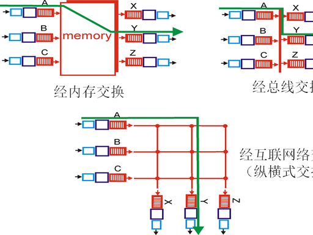
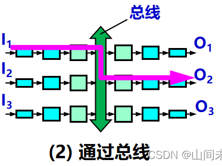
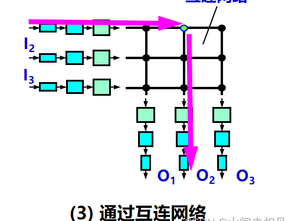
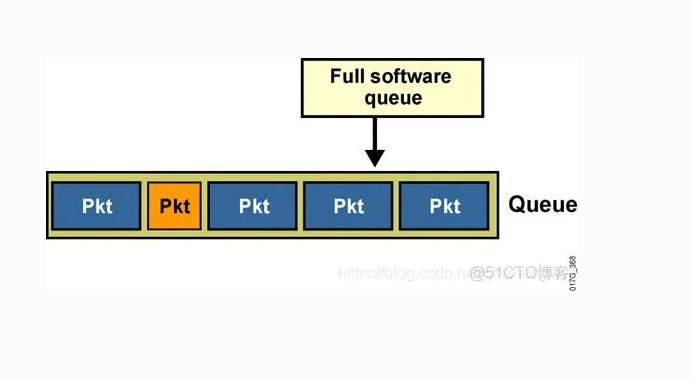
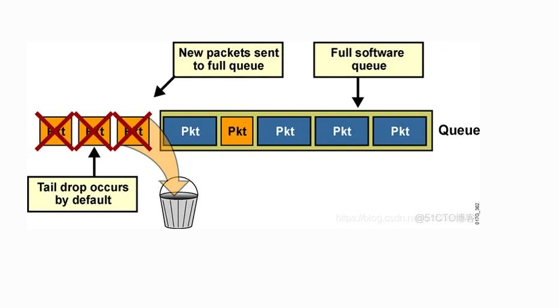
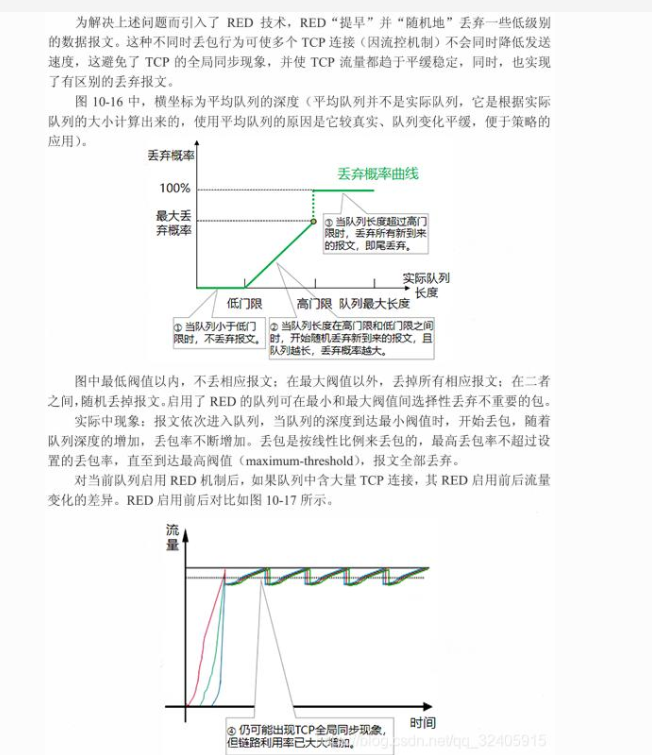
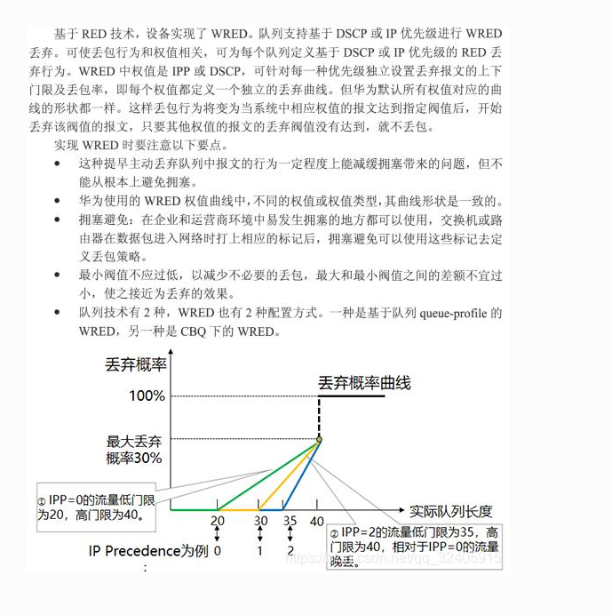
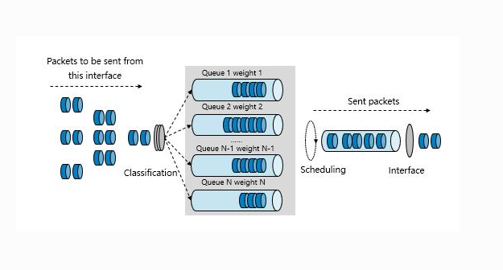

# 4.2 路由器内部工作原理

> 章级精读：[§4.2 四大件](../study.md#ch4-2) · [输入口与 MAC](../study.md#ch4-input-port-mac) · **交换结构**：[三种精读](#ch4-2-switching) · **队列丢包**：[缓冲/AQM](#ch4-2-queue) · [速记卡](#ch4-2-queue-exam)

## 一、路由器核心硬件组成

1. **输入端口**：物理层、数据链路层、**查转发表（FIB）**
2. **交换结构（Switching Fabric）**：内部高速转发，连接输入与输出端口
3. **输出端口**：分组缓存、调度、发送到链路
4. **路由处理器**：运行路由协议、计算路由、生成路由表（**控制平面**，非每包转发路径）

## 二、路由器完整转发流程（数据平面）

1. 端口接收链路帧 → 解封装拿到 IP 分组
2. 提取目的 IP 地址
3. 查询**转发表**（最长前缀匹配 LPM）
4. 通过交换结构转发到对应输出端口
5. 输出端口排队、调度、重新封装发送

→ [逐跳转发全流程](../study.md#ch4-packet-walkthrough)

<a id="ch4-2-switching"></a>

## 三、三种典型交换结构（路由器/交换机核心 · 必考）



<a id="ch4-2-switch-diagram"></a>

| 图 | 结构 |
|----|------|
| 上左 **memory** | 经**共享内存**拷贝 |
| 上右 **总线** | 经**共享总线** |
| 下 **网格** | **Crossbar** 互连网络 |

---

<a id="ch4-2-switch-memory"></a>

### 1）内存交换（共享内存）

**原理**

- 输入端口 → 复制到**共享内存** → **CPU 查路由** → 复制到输出端口缓存  
- 转发由 **CPU 集中控制**（非线速 ASIC 路径）

**特点**

| | 说明 |
|--|------|
| ✅ | 结构简单；**早期低速路由器**主流 |
| ❌ | 瓶颈：**内存带宽**（一次转发读+写两次）→ 速率 ≤ **M/2**（M = 内存每秒可处理分组数） |
| ❌ | 性能低、延迟大、难扩展 |

**适用**：早期低端路由器、低速设备。

---

<a id="ch4-2-switch-bus"></a>

### 2）总线交换（共享总线）



**原理**

- 所有端口挂在一条**共享总线**；输入端口经总线把数据送到输出端口  
- **同一时刻只能一对端口通信**，需**仲裁**避免冲突

**特点**

| | 说明 |
|--|------|
| ✅ | 比内存快、成本低、实现简单 |
| ❌ | **带宽瓶颈**：总线带宽 = 整机最大转发能力 |
| ❌ | 阻塞严重，端口多时冲突加剧 |

**适用**：中低端路由器、企业级交换机（教材常举 **≤32 Gbps** 量级）。

---

<a id="ch4-2-switch-crossbar"></a>

### 3）纵横矩阵交换（Crossbar / 交叉开关）



**原理**

- **N×N 网格**：N 条输入总线、N 条输出总线，交叉点为**可控开关（crosspoint）**  
- 可同时闭合**多个交叉点** → **多对端口并行转发**

**特点**

| | 说明 |
|--|------|
| ✅ | **无阻塞、并行高速**；带宽随端口扩展 |
| ✅ | 高吞吐、低时延，可达 **Tbps** 级 |
| ❌ | 结构复杂、成本高；需调度算法（如 **iSLIP**） |

**适用**：**高端核心路由器/交换机**、数据中心骨干（**2000 年后主流**）。

→ 章级读图：[§4.2 Crossbar](../study.md#ch4-2-crossbar)

---

<a id="ch4-2-switch-compare"></a>

### 4）对比速记表（考试常考）

| 结构 | 核心瓶颈 | 转发方式 | 性能 | 典型场景 |
|------|----------|----------|------|----------|
| **内存交换** | 内存带宽、CPU | 集中拷贝 | 低 | 早期低速路由器 |
| **总线交换** | 共享总线带宽 | 共享、串行 | 中 | 企业中端设备 |
| **Crossbar** | 调度算法（非带宽硬瓶颈） | 并行、矩阵 | 极高 | 核心/骨干高端设备 |

---

<a id="ch4-2-switch-exam"></a>

### 5）考试背诵极简版

#### 口诀

```text
内存最慢CPU转，总线共享抢带宽，
Crossbar并行无阻塞，高端设备它最行。
```

#### 30 字

**内存 CPU 拷贝慢；总线共享一对通；Crossbar 矩阵多流并行，核心路由器主流。**

#### 易错点

| 易混 | 纠正 |
|------|------|
| Crossbar = 一定无阻塞？ | **架构**支持多路并行；仍可能因**输出排队**等拥塞 |
| 背板带宽 = 各口速率相加？ | **否**；受交换结构与调度限制 |
| 三种都在现代高端机？ | 高端主流 **Crossbar**；内存/总线多见于低端或历史方案 |
| 交换结构 = 控制平面？ | **数据平面**转发路径；路由计算在 **CPU/控制平面** |

| 锚点 | 内容 |
|------|------|
| [#ch4-2-switch-memory](#ch4-2-switch-memory) | 内存交换 |
| [#ch4-2-switch-bus](#ch4-2-switch-bus) | 总线交换 |
| [#ch4-2-switch-crossbar](#ch4-2-switch-crossbar) | Crossbar |
| [#ch4-2-switch-exam](#ch4-2-switch-exam) | 口诀 / 30 字 |

<a id="ch4-2-queue"></a>

## 四、缓冲区与队列丢包（考试必背）

### 1）基本概念

| 概念 | 说明 |
|------|------|
| **缓冲区（Buffer）** | 路由器/交换机**输出端口**的**队列缓存**，暂存待转发分组 |
| **队列丢包** | **输入速率 > 输出转发速率** → 队列塞满 → **后续包被丢弃** |
| **核心原因** | **拥塞（Congestion）** → 队列溢出 → 丢包 |



---

<a id="ch4-2-tail-drop"></a>

### 2）尾部丢弃（Tail Drop，默认机制）

**定义**：队列满时，**所有新到数据包直接丢弃**（队尾丢弃），直到腾出空间。



| | 说明 |
|--|------|
| ✅ | 最简单、**默认**、开销低 |
| ❌ | **无差别丢弃**（不区分优先级） |
| ❌ | **TCP 全局同步**：多流同时丢包 → 同时降窗/慢启动 → 带宽**忽闲忽忙** |
| ❌ | **TCP 饿死**：UDP 占带宽，TCP 长期发不出去 |

一句话：**队列满，新来丢；简单粗暴，全局同步。**

---

<a id="ch4-2-aqm"></a>

### 3）主动队列管理（AQM）：RED / WRED

**核心思想**：**队列满之前先随机丢包**（提前预警），减轻全局同步，兼顾公平与优先级。

#### （1）RED（Random Early Detection）

监控**平均队列长度 avg_len**（对实际队列长度**平滑**，非瞬时快照），设**双门限**：

| 区间 | 行为 |
|------|------|
| avg < **min_th（低门限）** | **不丢** |
| min ≤ avg ≤ **max_th（高门限）** | **按概率随机丢**（队列越长，概率越高，上限为**最大丢弃概率**） |
| avg > max_th | **全部丢弃**（等同尾部丢弃） |



<a id="ch4-2-red-diagram"></a>

**读图（丢弃概率曲线）**

| 阶段 | 横轴（队列长度） | 纵轴（丢弃概率） |
|------|------------------|------------------|
| ① | < **低门限** | **0** |
| ② | 低～**高门限** | **线性上升**随机丢 |
| ③ | > **高门限** | **100%**（新包全丢） |

- 横轴常用 **avg_len**，避免瞬时抖动误触发  
- 目的：**提前、随机**丢包 → 多 TCP 流**错开**降窗，减轻**全局同步**；链路利用率更平稳

**作用**：不同 TCP 流随机丢 → **避免全局同步**；提前降速 → 延迟更稳。

#### （2）WRED（Weighted RED）

- **RED + QoS**：按 **IP Precedence / DSCP** 为不同优先级设**独立**低/高门限与丢弃概率  
- 高优先级（语音/视频）**晚丢、少丢**；低优先级（下载）**早丢、多丢**



<a id="ch4-2-wred-diagram"></a>

**读图（按优先级加权）**

| 优先级（例） | 低门限 | 高门限 | 含义 |
|--------------|--------|--------|------|
| **IPP=0**（低） | 较早（如 20） | 如 40 | **先开始**随机丢 |
| **IPP=2**（高） | 较晚（如 35） | 如 40 | **更晚**才丢，保护关键流 |
| 共同 | — | **高门限**处 | 丢弃概率达**最大丢弃概率**（图中例 30%） |

| | RED | WRED |
|--|-----|------|
| 优先级 | 无 | **有** |
| 配置 | 较简 | 较复杂（queue-profile / CBQ 等） |

---

<a id="ch4-2-wfq"></a>

### 4）队列调度：WFQ（加权公平队列）



<a id="ch4-2-wfq-diagram"></a>

**读图（输出端口流水线）**

```text
待发送包 → Classification（分类）→ Queue 1…N（各带 weight）→ Scheduling → Interface 发出
```

| 阶段 | 作用 |
|------|------|
| **Classification** | 按 IP/TOS/ACL 等把包送入**不同队列** |
| **Queue 1…N + weight** | 权重越大，**分得带宽越多** |
| **Scheduling** | 按权重**公平轮询**取包（防单流垄断） |
| **Interface** | 串行发到链路 |

| 项 | 说明 |
|----|------|
| **定位** | **拥塞管理（排队顺序）**；常与 RED/WRED（**丢包策略**）配合 |
| **原理** | 按**流**分队列；按**权重**分带宽；短包优先、防垄断 |
| **作用** | 公平性；关键流高权重**优先转发**；与 WRED 双重保护关键业务 |

---

<a id="ch4-2-queue-compare"></a>

### 5）对比总结（考试高频）

| 机制 | 类型 | 核心逻辑 | 优点 | 缺点 |
|------|------|----------|------|------|
| **Tail Drop** | 被动丢包 | 满了再丢，无差别 | 简单、低开销 | 全局同步、无优先级 |
| **RED** | AQM | 提前随机丢，双门限 | 防同步、延迟稳 | 无优先级 |
| **WRED** | AQM+QoS | 按优先级加权丢 | 同步+优先级 | 配置复杂 |
| **WFQ** | **调度** | 按流+权重分带宽 | 公平、低抖动 | 开销高于 FIFO |

> **易混**：RED/WRED 管**丢不丢**；WFQ 管**谁先谁后、占多少带宽**。

---

<a id="ch4-2-queue-exam"></a>

### 6）考试速记卡（默写）

#### 四句口诀

```text
尾丢满了才丢弃，全局同步是硬伤
RED提前随机丢，双门限防同步
WRED加权分优先级，关键业务有保障
WFQ按流加权排，公平调度防垄断
```

#### 30 字

**拥塞满队尾丢易全局同步；RED/WRED 提前随机丢；WFQ 按流加权排队，配合 WRED 保关键流。**

#### 易错点

| 易混 | 纠正 |
|------|------|
| RED = 调度算法？ | **AQM 丢包策略**；调度是 **WFQ/FIFO** 等 |
| WFQ 能避免丢包？ | 主要管**排队与带宽分配**；丢包仍靠 AQM |
| 缓冲越大越好？ | 过大 → **Bufferbloat**（时延膨胀）；见章级 [#ch4-2](../study.md#ch4-2) |
| 丢包只在输入口？ | 本节重点在**输出端口**队列溢出 |

| 锚点 | 内容 |
|------|------|
| [#ch4-2-tail-drop](#ch4-2-tail-drop) | 尾部丢弃 + 图 |
| [#ch4-2-red-diagram](#ch4-2-red-diagram) | RED 丢弃曲线 |
| [#ch4-2-wred-diagram](#ch4-2-wred-diagram) | WRED 按优先级 |
| [#ch4-2-wfq-diagram](#ch4-2-wfq-diagram) | WFQ 分类调度 |
| [#ch4-2-wfq](#ch4-2-wfq) | WFQ 原理 |
| [#ch4-2-queue-exam](#ch4-2-queue-exam) | 口诀 / 30 字 |

---

## 五、本节易错点（综合）

- **路由表 RIB**（控制平面生成）≠ **转发表 FIB**（数据平面转发用）
- 路由器隔离广播域、分隔冲突域；二层交换机**不能**隔离广播域

## 六、个人学习心得与补充

> 画图梳理路由器内部转发流水线；对照 [#ch4-2-tail-drop](#ch4-2-tail-drop) 理解 TCP 全局同步。
