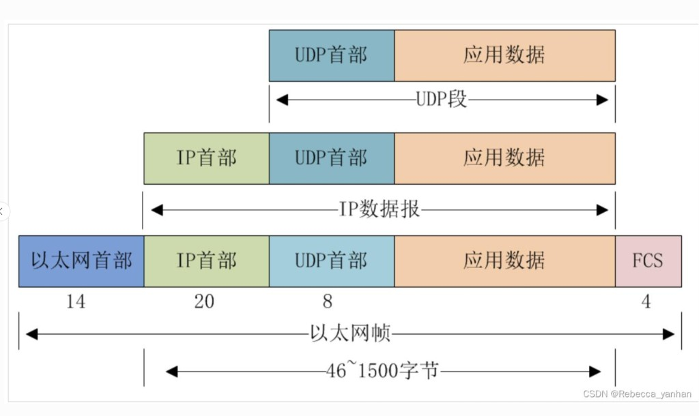
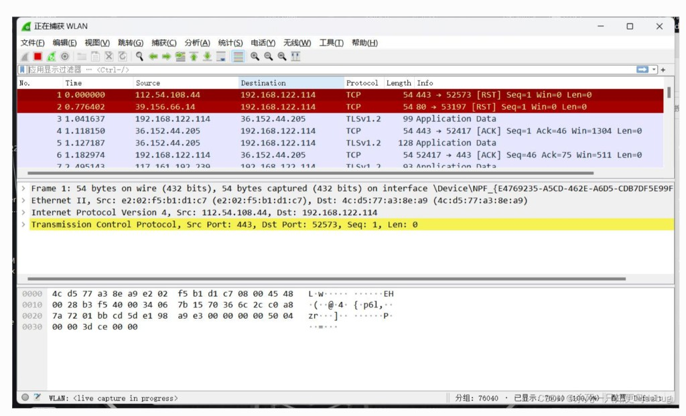
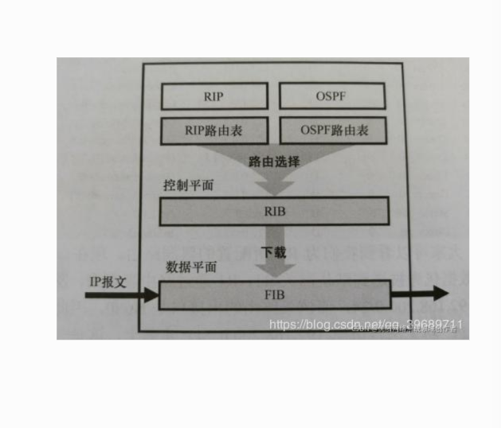
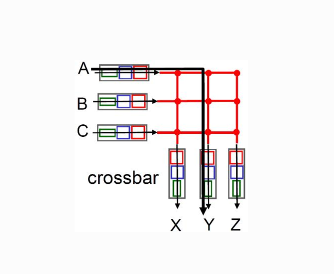
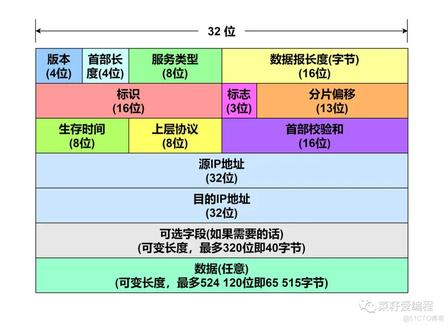

# 第 4 章：网络层 · 数据平面（Data Plane）

> 自顶向下第 8 版第 4 章**数据平面**精读。  
> **控制平面**（算路、RIB、下发 FIB）→ [../05_network_layer_control_plane/study.md#ch5-control-plane-basics](../05_network_layer_control_plane/study.md#ch5-control-plane-basics)

**数据平面** = **转发平面**：路由器/交换机内**高速执行**收包、查表、交换、发出；**不算端到端路径**（表项由控制平面事先下发）。

---

<a id="ch4-dp-topdown"></a>

## 总览 · 自顶向下口径

### 核心定位

| 项 | 要点 |
|----|------|
| **职责** | 收包 → 解析 → **查 FIB** → 从对应端口送出 |
| **载体** | **TCAM/ASIC** 等硬件，线速、海量流 |
| **特点** | **只执行**；规则已是**转发表 FIB** |

### 三块结构

```text
[ 输入端口 ] ──► [ 交换结构 ] ──► [ 输出端口 ]
```

#### 输入端口

> **输入端口 ≠ MAC**：G0/0 是**插孔**；MAC 是口上**门牌号**（L2 校验用）。

| 层 | 数据平面做什么 |
|----|----------------|
| 物理层 | 收电/光信号 |
| 链路层 | 对**目的 MAC** → 校验 → **剥帧头** |
| 网络层 | 读**目的 IP** → **LPM 查 FIB** |

→ [输入端口 vs MAC 专节](#ch4-input-port-mac) · [ARP 解析下一跳 MAC](../../tcpip_vol1_ed2_notes/03_network_layer/ch04_arp.md)

#### 查 FIB（核心）

1. 读**目的 IP**  
2. **最长前缀匹配 LPM**  
3. 得**出端口** + **下一跳 IP**  
4. 经交换结构送到输出口发出  

| 目标网段 | 下一跳 IP | 出端口 |
|----------|-----------|--------|
| 192.168.5.0/24 | 10.2.1.2 | 端口 2 |
| 192.168.7.0/24 | 10.3.1.2 | 端口 3 |

#### 交换结构

| 方式 | 要点 |
|------|------|
| 内存 | 慢，难线速 |
| 总线 | 共享，易堵 |
| **Crossbar** | 并行，高端主流 → [图](#ch4-2-crossbar) |

#### 输出端口

排队 → 调度（FIFO / 优先级 / **WFQ**）→ 封装链路头 → 发出

### 转发六步（背）

1. 入端口收包、解析目的 IP  
2. **查 FIB**  
3. 交换结构送到出端口  
4. 排队调度后发出  
5. 下一跳重复  

### 数据平面附带动作

- IP **首部校验**（坏包丢弃）  
- **TTL−1**；0 则丢（防环）  
- 简单 **ACL/QoS 过滤**（依设备）

### 易混（数据平面）

1. **只查 FIB**，不查 RIB/路由表  
2. **下一跳 IP** = 邻居路由器接口 IP  
3. **本口 IP** ≠ 下一跳 IP  
4. **MAC 只送到本口**；全程靠 **IP + FIB**

---

<a id="ch4-encapsulation"></a>

## 封装嵌套顺序（王道自下而上 · 仅 TCP / IP / MAC）

> **不是**「TCP 包住 IP」；**是 IP 包住 TCP，以太网帧再包住 IP**。  
> 传输层细节 → [第 3 章 TCP 首部](../03_transport_layer/study.md#ch3-1-tcp-header)

### 正确嵌套（由内到外）

```text
┌─────────────────────────────┐  最外层：以太网帧（MAC · 链路层）
│ 目的/源 MAC、类型等           │
│        ┌───────────────┐    │
│        │ IP 首部       │    │  中间层：IP 数据报（网络层）
│        │    ┌──────┐   │    │
│        │    │ TCP  │   │    │  最内层：TCP 报文段（运输层）
│        │    │ 首部 │   │    │  序号、ACK、端口…
│        │    │ 数据 │   │    │
│        │    └──────┘   │    │
│        └───────────────┘    │
│ FCS（帧校验）               │
└─────────────────────────────┘
```

| 顺序 | 说法 |
|------|------|
| **内 → 外** | TCP 报文段 → 加 IP 首部 → 加 MAC 帧头/尾 → **以太网帧** |
| **外 → 内** | 先剥 **MAC** → 再剥 **IP** → 才读到 **TCP** |

### 教材图：逐层「套壳」（王道自下而上）

下图以 **UDP** 为例，**TCP 同理**（仅运输层首部由 8B 换为约 20B）：**应用数据 → 加 UDP/TCP 首 → 成运输层段 → 加 IP 首 → 成 IP 数据报 → 加以太网首/尾 → 成以太网帧**。



| 层级 | PDU | 图中典型长度 |
|------|-----|----------------|
| 运输层 | UDP 段（换 TCP 即 TCP 段） | UDP 首 **8B** |
| 网络层 | IP 数据报 | IP 首 **20B** |
| 链路层 | 以太网帧 | 以太网首 **14B** + 载荷 **46~1500B** + FCS **4B** |

### 三步封装（发送端）

1. **TCP**：运输层 PDU（端口、序号、ACK、载荷）  
2. **+ IP 首部** → 整体成为 **IP 数据报**（IP **完整包住** TCP）  
3. **+ MAC 首部 + FCS** → 整体成为 **以太网帧**（MAC **完整包住** IP 包）

### 三步解封装（接收端）

1. 链路层：校验并**拆掉最外层 MAC 帧** → 得到 IP 数据报  
2. 网络层：**拆掉 IP 首部** → 得到 TCP 报文段（路由器常在此止步，不读 TCP）  
3. 运输层：**拆掉 TCP 首部** → 得到应用数据（本章不展开应用层）

### 易混：别把「谁在外」记反

| ❌ 错误直觉 | ✅ 实际 |
|------------|--------|
| TCP 在最外、MAC 在最内 | **MAC 帧在最外**（线上先看到、先被剥） |
| 「TCP 包着 IP」 | **IP 包着 TCP** |
| 路由器会解析 ACK、序号 | **只处理到 IP**；TCP 内容对中间路由器透明 |

### 分层谁看见什么

| 层 | PDU | 能看见 | 不会做的事 |
|----|-----|--------|------------|
| **MAC 帧** | 以太网帧 | 源/目的 **MAC** | 不解析 IP/TCP 内部字段 |
| **IP 数据报** | IP 包 | 源/目的 **IP**、协议号（如 6=TCP） | 不解析 TCP 序号、ACK |
| **TCP 报文段** | TCP 段 | 端口、序号、窗口… | 只在**终端**解完外层后读取 |

👉 与 [逐跳转发](#ch4-packet-walkthrough) 的关系：**每一跳只换最外层 MAC**；**IP 与内层 TCP 整块原样穿过路由器**。  
👉 链路层详解：[第 6 章 · 以太网帧≠IP 数据报](../06_link_layer_and_lan/study.md#ch6-frame-vs-ip)

---

<a id="ch4-encapsulation-wireshark"></a>

### Wireshark 抓包：线上真实顺序（外 → 内）

展开一棵树时，**从上到下 = 从外到内 = 先遇到 → 后剥开**：

```text
Frame（物理/捕获帧）
└─ Ethernet II                    ← 链路层 · MAC 帧
      Dst MAC / Src MAC / Type
   └─ Internet Protocol Version 4  ← 网络层 · IP 数据报
         Src IP / Dst IP / TTL / Protocol(6=TCP)
      └─ Transmission Control Protocol  ← 传输层 · TCP 段
            Src Port / Dst Port / Seq / Ack / Window …
         └─ [Data]                   ← 载荷（本章不展开应用层）
```

| Wireshark 层名 | 对应王道 | 关键字段 |
|----------------|----------|----------|
| **Ethernet II** | 链路层 | Dst/Src **MAC** |
| **Internet Protocol** | 网络层 | Src/Dst **IP** |
| **TCP** | 传输层 | **端口、Seq、ACK** |

一句话：**MAC 包着 IP，IP 包着 TCP**；**TCP 在最里面**。

**真实抓包**（Wireshark 三栏）：中间协议树 **Ethernet II → IPv4 → TCP**；底部十六进制**最前几字节 = 目的 MAC**，与树上 MAC 一致。



| 窗格 | 看什么 |
|------|--------|
| 上：包列表 | 一行摘要（Src/Dst IP、TCP、端口） |
| 中：协议树 | **先 MAC，再 IP，再 TCP**（展开顺序 = 解封装顺序） |
| 下：十六进制 | 线上字节从左到右：**MAC 头最先** |

实机练习 → [Wireshark 实验章](../99_practice_wireshark_lab/)。

---

<a id="ch4-encapsulation-diagram"></a>

### 一图汇总：王道自下而上 = 线上从外往内

> 教材叠层图见上 [教材图](#ch4-encapsulation)；Wireshark 实包见 [抓包图](#ch4-encapsulation-wireshark)。下框可整段复制作文字版。

```text
╔══════════════════════════════════════════════════════════════════════╗
║  记忆对齐：王道「下→上」= 线上「外→内」= Wireshark「树从上到下」      ║
╠══════════════════════════════════════════════════════════════════════╣
║                                                                      ║
║  ┏━━━━━━━━━━━━ 链路层 · 以太网帧（MAC）━━━━━━━━━━━━┓  ← 最外，先遇到  ║
║  ┃ 帧头 ~14B：Dst MAC · Src MAC · 类型(0x0800=IPv4)  ┃                ║
║  ┃ ┌────────── 网络层 · IP 数据报 ──────────┐      ┃                ║
║  ┃ ┃ 首部 ~20B：Src IP · Dst IP · TTL · 协议=6┃      ┃  ← 中间层      ║
║  ┃ ┃ ┌──────── 传输层 · TCP 段 ────────┐    ┃      ┃                ║
║  ┃ ┃ ┃ 首部 ~20B：端口·Seq·Ack·窗口   ┃    ┃      ┃  ← 最内层协议头  ║
║  ┃ ┃ ┃ ┌────── 载荷（应用数据）──────┐ ┃    ┃      ┃                ║
║  ┃ ┃ ┃ └────────────────────────────┘ ┃    ┃      ┃                ║
║  ┃ ┃ └──────────────────────────────────┘    ┃      ┃                ║
║  ┃ └──────────────────────────────────────────┘      ┃                ║
║  ┃ 帧尾 FCS ~4B（校验）                              ┃                ║
║  ┗━━━━━━━━━━━━━━━━━━━━━━━━━━━━━━━━━━━━━━━━━━━━━━━━━┛                ║
║                                                                      ║
║  线上字节（简化，左 → 右）：                                          ║
║  [ MAC 头 14 ][ IP 头 20 ][ TCP 头 20 ][ 数据 … ][ FCS 4 ]           ║
║                                                                      ║
║  发送：TCP → 套 IP → 套 MAC        接收：拆 MAC → 拆 IP → 读 TCP     ║
╚══════════════════════════════════════════════════════════════════════╝
```

| 层（王道自下而上） | PDU | 典型首部 | 认什么地址 |
|--------------------|-----|----------|------------|
| 链路层 | **以太网帧（MAC）** | 14B 头 + 4B FCS | **MAC** |
| 网络层 | **IP 数据报** | 20B（常见） | **IP** |
| 传输层 | **TCP 段** | 20B（常见） | **端口、Seq、ACK** |

### 极简背版

| | |
|--|--|
| 最外 | **MAC 帧**（先遇到、先拆） |
| 中间 | **IP 包**（跨网路由） |
| 最内 | **TCP**（最后才解析） |
| 发 | **TCP → 套 IP → 套 MAC** |
| 收 | **拆 MAC → 拆 IP → 看 TCP** |

---

<a id="ch4-packet-walkthrough"></a>

## 从零抠：一包数据怎么进路由器、怎么转出去（不跳步）

> 全程**只讲数据平面**；表项谁算出来见 [控制平面章](../05_network_layer_control_plane/study.md)。

### 先答三个零散疑问

| 疑问 | 答案 |
|------|------|
| 每个物理口都有独立 MAC？ | ✅ **是**，每个输入/输出口各有一个唯一 MAC |
| 数据平面只用转发表？ | ✅ **只查 FIB（转发表）**，不查路由表 |
| `192.168.x` / `10.x` 是路由器专属？ | ❌ 都是**私网地址**；公网不能直接用；`10.x` 常用于企业/运营商内网、路由器互联 |

---

### 第一步：主机怎么找到「第一台」路由器？

**设定**

| 角色 | 值 |
|------|-----|
| 你的电脑 | IP `192.168.1.100` |
| 网关（路由器 LAN 口 IP） | `192.168.1.1` |
| 路由器 LAN 口 MAC | `AA:AA:AA:AA:AA:01` |
| 目标服务器 | IP `200.200.200.200`（外网） |

**流程（L2 + L3 配合）**

1. 主机判断：目标 **不在** 本机网段 → **必须先发给网关**  
2. 主机查 **ARP**：网关 IP `192.168.1.1` → 得到 **网关 MAC** `AA:AA:…:01`  
3. 主机按 [内→外封装](#ch4-encapsulation)：**TCP 段 → 套 IP → 套 MAC** 成以太网帧：  
   - **最外层帧**：源 MAC = 你电脑网卡；目的 MAC = **路由器 LAN 口 MAC**  
   - **中间 IP 包**（包住 TCP）：源 IP = `192.168.1.100`，目的 IP = `200.200.200.200`（到终点不变）  
   - **最内层 TCP**：端口、序号等；路由器转发时**不拆读**  
4. 交换机按**目的 MAC** 把帧送到路由器 **LAN 输入口**

👉 **找路由器靠 MAC；决定发给路由器靠 IP 网关规则。**

---

### 第二步：帧进路由器输入口（数据平面入口）

1. **输入口**收到帧  
2. **链路层**：目的 MAC 是不是**本口 MAC**？是 → 收；否 → 丢  
3. **先拆最外层 MAC 帧头**（[外→内解封装](#ch4-encapsulation)）→ 链路层到此结束  
4. 露出 **IP 数据报**（内仍含完整 TCP，本步不碰），读出 **目的 IP = 200.200.200.200**

→ [输入端口 vs MAC](#ch4-input-port-mac)

---

### 第三步：数据平面只查【转发表 FIB】

| | 路由表 RIB | 转发表 FIB |
|--|------------|------------|
| 谁用 | **控制平面**（算路） | **数据平面**（转发） |
| 内容 | 协议、优先级、Cost… | **目的网段 → 出接口 + 下一跳 IP** |

**本机 FIB 示例**

| 目标网段 | 下一跳 IP | 本机出接口 |
|----------|-----------|------------|
| 192.168.1.0/24 | 直连 | LAN 口 |
| 0.0.0.0/0（默认） | `10.0.0.2` | WAN 口 |

1. 用 `200.200.200.200` 做 **LPM**  
2. 命中 **0.0.0.0/0** → 下一跳 **`10.0.0.2`**，从 **WAN 口** 出

---

### 第四步：怎么发给「第二台」路由器？

1. 已知下一跳 IP = **`10.0.0.2`**（运营商侧路由器接口）  
2. 本机 **ARP**：`10.0.0.2` → 得到**对端口的 MAC**  
3. **重新封装新的二层帧**（每跳必换 MAC）：  
   - 新 **源 MAC** = 本机 **WAN 口** MAC  
   - 新 **目的 MAC** = **第二台路由器输入口** MAC  
   - **IP 数据报（含内层 TCP）原样不动**；仅源/目的 **IP** 仍为 `192.168.1.100` → `200.200.200.200`  
4. 从 **WAN 口** 发出  

第二台路由器：**重复** 拆 MAC → 查 FIB → ARP 下一跳 → 换新 MAC → 再发……直到到达目标。

```text
每一跳路由器：
  收帧(对MAC) → 剥MAC → 查FIB(对IP) → ARP下一跳MAC → 封新MAC发出
  IP 包头从头到尾不变；MAC 每过一台路由器换一对
```

→ 链路层视角展开：[第 6 章 · 逐跳 IP/帧/MAC](../06_link_layer_and_lan/study.md#ch6-hop-ip-frame)

---

### 私网 IP：`10.x` 不是路由器专利

| 网段 | 常见用途 |
|------|----------|
| `192.168.0.0/16` | 家用、小局域网 |
| `10.0.0.0/8` | 大企业、**运营商内网**、**路由器之间**互联 |
| `172.16.0.0/12` | 企业内网 |

路由器口上可配**私网 IP** 或**公网 IP**，没有「路由器专属网段」。

---

### 五步串讲（背）

1. 主机去外网 → **网关 IP + 网关 MAC** → 帧到第一台路由器  
2. 路由器 **剥 MAC** → 数据平面 **查 FIB**  
3. 得到 **下一跳 IP** → **ARP** 得下一跳 **MAC**  
4. **换新 MAC 头** → 从出接口发出  
5. 每台路由器重复，直到终点  

---

### 终极总结表（不混）

| 东西 | 层/平面 | 作用 | 每跳变不变 |
|------|---------|------|------------|
| **MAC 帧头** | 链路层 | 只负责**这一跳**设备到设备 | **每过一台路由器必换** |
| **源/目的 IP** | 网络层 | **端到端**指路 | **全程不变** |
| **路由表 RIB** | 控制平面 | 算最优路（后台） | 慢速更新 |
| **转发表 FIB** | 数据平面 | **无脑高速转发** | **只查它** |

---

<a id="ch4-fib"></a>

## 转发表 FIB（数据平面唯一查表）

> 表项由控制平面生成并**下发**（不在此章展开 RIB/OSPF）。对比图下半 = 数据平面。



### 设备原样表头

| 目的 IP 前缀 | 子网掩码 | 出接口 | 下一跳地址 | 动作 |
|--------------|----------|--------|------------|------|
| 192.168.1.0 | 255.255.255.0 | Gi0/0 | 直连 | 转发 |
| 192.168.2.0 | 255.255.255.0 | Gi0/1 | 10.0.1.2 | 转发 |
| 0.0.0.0 | 0.0.0.0 | Gi0/3 | 10.0.0.1 | 默认转发 |

### ASIC 三要素

1. **目标网段**（LPM）  
2. **出接口**  
3. **下一跳地址**  

**FIB 没有**：协议、优先级、Cost（那些属于控制平面 RIB）

### 终极一句

```text
收包 → 提目的 IP → LPM 匹配 FIB → 从出接口发出
```

**包来了只认 FIB。**

---

<a id="ch4-2"></a>

## 4.2 路由器数据平面（四大件）

> 不含「路由选择处理器」算路细节 → [控制平面章](../05_network_layer_control_plane/study.md)

### 1）输入端口

- **LPM + TCAM** 线速查 **FIB**  
- **TTL−1**、首部校验  

<a id="ch4-input-port-mac"></a>

#### 输入端口 vs MAC

| | 端口 | MAC |
|--|------|-----|
| 是什么 | 物理网口 G0/x | 口上二层编号 |
| 作用 | 网线接入 | L2 帧**目的 MAC** 是否为本口 |

**门框 vs 门牌** → 进门后只认 **IP + FIB**。

### 2）交换结构

<a id="ch4-2-crossbar"></a>



**读图**：入端口缓冲 → **crosspoint** 接通 → 出端口（例 **A→Y**）。

### 3）输出端口

缓存排队；溢出 → **丢包**（尾部丢包）。

### 排队与 HOL

| 类型 | 考点 |
|------|------|
| **输入排队** | **HOL 排头阻塞** |
| **输出排队** | 超线速 → 尾部丢包 |

### 缓冲区（数据平面排队）

| 公式 | 说明 |
|------|------|
| B ≈ RTT × R | 直觉 |
| B ≈ RTT×R / √N | N 条流 |

过大 → **Bufferbloat**；过小 → 易丢。

### 调度（出端口数据平面）

**FIFO** · **优先级**（可能饿死）· **WFQ**（主流）

### 易错

- **转发表**在数据平面；**路由表**不在此查  
- **背板带宽** ≠ 各端口速率简单相加  

### 300 字背版

> **数据平面**：**输入口** LPM+TCAM 查 FIB、TTL−1；**Crossbar** 交换（内存慢/总线堵/交叉并行快）；**输出口** 排队+WFQ 再发。HOL、尾部丢包、Bufferbloat 要会名词。只查 **FIB**，不认 RIB。收包→目的 IP→匹配 FIB→出接口。

---

<a id="ch4-3"></a>

## 4.3 IP 与数据平面转发

IP 是数据平面**查表转发**的载荷与首部格式（编址细节见 [4.3 子目录](./4.3_ipv4_ipv6_nat/) · [tcpip ch05](../../tcpip_vol1_ed2_notes/03_network_layer/ch05_ip.md)）。

<a id="ch4-ipv4-header"></a>

### IPv4 数据报首部结构（32 位一行）



**整体**：**首部（20–60 字节）+ 数据（TCP/UDP/ICMP…）**；最常见固定首部 **20 字节**（无选项）。

#### 逐行对应（RFC 标准 · 每行 32 位）

| 行 | 字段（位宽） |
|----|----------------|
| 1 | **版本(4)** + **首部长度(4)** + **服务类型(8)** + **总长度(16)** |
| 2 | **标识(16)** + **标志(3)** + **片偏移(13)** |
| 3 | **TTL(8)** + **协议(8)** + **首部校验和(16)** |
| 4 | **源 IP(32)** |
| 5 | **目的 IP(32)** |
| 6 | **可选字段**（0–40 字节，可没有） |
| 7 | **上层数据**（TCP / UDP / ICMP …） |

| 字段 | 位数 | 要点 |
|------|------|------|
| 版本 | 4 | IPv4 = 4 |
| 首部长度 | 4 | 首部多少个 **32 位字**（×4 = 字节数） |
| 服务类型 | 8 | DSCP / 优先级等 |
| **总长度** | 16 | **首部 + 数据** 总字节数 |
| 标识 / 标志 / 分片偏移 | 16+3+13 | 分片与重组 |
| **TTL** | 8 | 每经一跳 **−1**，为 0 丢弃 |
| **协议** | 8 | 上层协议号（6=TCP，17=UDP） |
| **首部校验和** | 16 | 只校验首部，错则丢 |
| **源 IP / 目的 IP** | 各 32 | **端到端不变**（转发决策看目的 IP） |
| 选项 | 0~40B | 测试、安全等（可选） |
| **数据** | 变长 | 常为 TCP/UDP 段等 |

<a id="ch4-ipv4-wireshark"></a>

#### Wireshark 里「真实长什么样」

展开 **Internet Protocol Version 4** 与上图**逐字段对应**（线上真包）：

```text
Internet Protocol Version 4, Src: 192.168.1.100, Dst: 140.205.172.3
0100 .... = Version: 4
.... 0101 = Header Length: 20 bytes (5)    ← 5×4B = 20B 首部
Differentiated Services Field: 0x00
Total Length: 60                           ← 首部+数据总长度
Identification: 0x1234
Flags: 0x40 (Don't fragment)
Time to Live: 64                           ← 每跳路由器 TTL−1
Protocol: TCP (6)                          ← 内层是 TCP
Header Checksum: 0x5678
Source Address: 192.168.1.100              ← 端到端不变
Destination Address: 140.205.172.3
```

实机练习 → [Wireshark 实验章](../99_practice_wireshark_lab/) · 三层树形展开见 [#ch4-encapsulation-wireshark](#ch4-encapsulation-wireshark)

#### 与以太网帧的关系

```text
以太网帧 = 帧头(14B) + IP数据报(20B+数据) + FCS(4B)
```

→ 帧字段详图：[第 6 章 · 以太网帧结构](../06_link_layer_and_lan/study.md#ch6-ethernet-frame)（最小 64B / 最大 1518B，数据区 MTU 1500B）

| 谁看 | 看什么 |
|------|--------|
| **链路层**（交换机/网卡） | **MAC**；验 FCS |
| **网络层**（路由器） | 剥帧后看 **IP 数据报** 里的 **目的 IP**、TTL 等 |

👉 [Ethernet II 逐字节](../06_link_layer_and_lan/study.md#ch6-ethernet-frame) · [帧≠IP](../06_link_layer_and_lan/study.md#ch6-frame-vs-ip) · [TCP⊂IP⊂MAC 嵌套](#ch4-encapsulation) · [三层抓包图](#ch4-encapsulation-wireshark)

### 数据平面关心的 IPv4 首部

| 字段 | 数据平面动作 |
|------|----------------|
| **目的 IP** | **LPM 查 FIB** |
| **TTL** | **减 1**；为 0 **丢弃** |
| **首部校验和** | 校验，错则丢 |
| 协议 | 上交运输层（不属转发决策） |

### 分片（与转发）

- 路由器可在 DF=0 时**分片**（重组在目的主机）；工程上倾向 **PMTUD**、端上控制长度。  
- 详见 [ch10 UDP 分片](../../tcpip_vol1_ed2_notes/04_transport_layer/ch10_udp.md)

### CIDR 与 LPM

- `a.b.c.d/x`：**前缀越长越优先** → 转发表 **LPM** 硬件实现基础。

### NAT（数据平面执行）

在中间盒/路由器上**改写 IP/端口**属数据平面 **Match+Action**（策略由控制/管理面配置）。详见 [4.3 NAT](./4.3_ipv4_ipv6_nat/) · [tcpip ch07](../../tcpip_vol1_ed2_notes/03_network_layer/ch07_firewall_nat.md)

---

<a id="ch4-4"></a>

## 4.4 泛化转发与可编程数据平面

传统：**目的 IP → 出端口**。  
泛化：**Match + Action**（OpenFlow **流表** 在交换机**数据平面**执行）。

| 匹配（例） | 动作（例） |
|------------|------------|
| Dest IP = 10.1.1.1 | Forward Port 3 |
| Src IP = 172.16.0.0/16 | Drop |
| Dest Port = 80 | Rewrite + Forward |

流表项：**匹配字段** + **计数器** + **动作**（转发/丢弃/改字段）。

> 流表**谁下发**属控制/SDN → [5.4 SDN 控制器](../05_network_layer_control_plane/5.4_sdn_controller_plane/study.md)  
> 交换机**按表转发** = 本章数据平面。

---

<a id="ch4-5"></a>

## 4.5 中间盒（数据平面上的策略执行）

防火墙、**NAT**、负载均衡、DPI 等多在路径上**改包/丢包/选路** — 仍是数据平面行为，只是比纯 IP 转发更复杂。

可逐步与**可编程流表**融合（服务链、云原生网络）。

---

<a id="ch4-6"></a>

## 4.6 数据平面总结

**主链路**：入端口 → **LPM/FIB** → **交换结构** → **队列调度** → 出端口。

| 要点 | 内容 |
|------|------|
| 查什么 | **FIB**（或广义**流表**） |
| 硬件 | TCAM、Crossbar、线速 |
| 排队 | 输入/输出、HOL、Bufferbloat |
| 调度 | FIFO、WFQ |
| IP | TTL、校验、LPM |

**工程**：时延敏感流单独队列；缓冲勿盲目加大；关注背板是否线速。

**下一章**：[第 5 章 控制平面](../05_network_layer_control_plane/study.md) — 路由算法、OSPF、BGP、表项如何生成。

---

## 小节索引

| 目录 | 数据平面主题 |
|------|----------------|
| [4.1](./4.1_network_layer_overview/) | 定位、FIB、转发六步 |
| [4.2](./4.2_router_internal_working/) | 四大件、排队、调度 |
| [4.3](./4.3_ipv4_ipv6_nat/) | IP 首部、LPM、NAT 执行 |
| [4.4](./4.4_sdn_openflow/) | Match+Action、流表 |

*控制平面、RIB、OSPF/BGP、SDN 北向 API 见 `05_network_layer_control_plane/`。*
