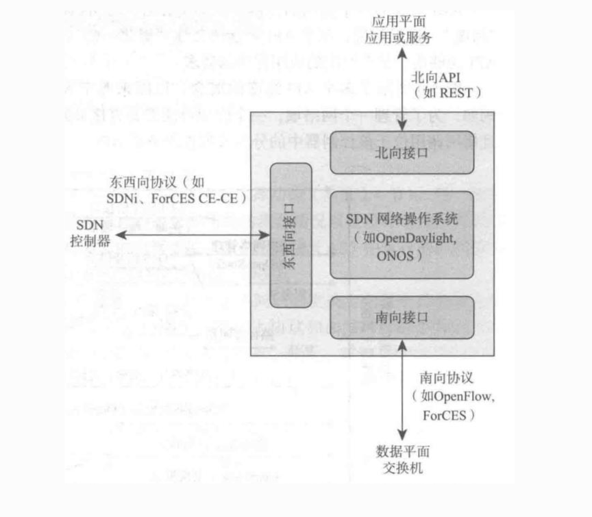

# 第4章 网络层：数据平面

网络层实现**源主机到目的主机**的端到端交付。自顶向下第 8 版强调**数据平面**与**控制平面**分离：**数据平面**做本地、高速的**转发**；**控制平面**做全局的**路由选择**与转发表生成。本章聚焦数据平面——路由器如何查表转发、IPv4/IPv6 与 NAT、以及 **SDN / 泛化转发** 与 **中间盒** 现实。

---

## 4.1 网络层概述

> **考点速背**：数据平面 = 转发（快/硬/局部）；控制平面 = 路由（慢/软/全局）；SDN = 控制集中 + 转发按流表执行。

### 一、数据平面（Data Plane / 转发平面）

| 项 | 要点 |
|----|------|
| **位置** | 路由器、交换机**内部**（每端口流水线） |
| **本质** | **高速执行层** — 只回答「这一包从哪口出」 |
| **核心动作** | **查表**（MAC / IP 最长前缀 / 流表）→ **排队调度** → 入端口 → 出端口 |
| **特点** | **局部**（不看全网）、**线速**（常 ASIC/NP）、**无全局最优** |
| **类比** | **立交桥**：车到跟前按**路牌**选出口，不重新规划全程 |
| **易混** | 数据平面**不算路**，只执行已下发的表项 |

### 二、控制平面（Control Plane）

| 项 | 要点 |
|----|------|
| **位置** | 传统：每台设备进程；**SDN**：逻辑上在**控制器** |
| **本质** | **决策大脑** — 回答「端到端该走哪条路」 |
| **核心动作** | 拓扑/邻居发现 → 跑 **OSPF / BGP / RIP** 等 → 算路径 → **写转发表/流表** |
| **特点** | **全局**（或域内全局）、**慢**（秒级收敛）、**策略与最优** |
| **类比** | **地图 App**：出发前规划**整条路线** |
| **易混** | 控制平面**不转发用户数据包**（除协议报文）；产出的是**表项** |

### 三、转发 vs 路由选择（必考对比）

| | **转发 Forwarding** | **路由选择 Routing** |
|--|---------------------|----------------------|
| **平面** | 数据平面 | 控制平面 |
| **关键词** | 查表、交换、Match+Action | 算路、协议、策略 |
| **范围** | **单设备、单跳** | **全网 / 端到端** |
| **速度** | 纳秒～微秒（硬件） | 毫秒～秒（软件） |
| **输入→输出** | 包 + 转发表 → 出端口 | 拓扑 + 策略 → **路由表/流表** |
| **谁做** | 每个路由器/交换机 | 路由协议或 SDN 控制器 |

**一句话**：**Forwarding 是“怎么做”；Routing 是“做什么表”。**

### 四、传统网络 vs SDN（转控分离）

#### 传统路由器/交换机

- **紧耦合**：每台设备同时跑 **控制**（OSPF/BGP…）+ **数据**（查表转发）。
- **缺点（面试可答）**：策略分散难统一、运维复杂、创新慢、全局优化难。

#### SDN（Software Defined Networking）

| 组件 | 职责 |
|------|------|
| **控制平面（上收）** | **集中控制器**：全网视图、统一算路、下发策略 |
| **数据平面（下沉）** | 交换机只做 **Match + Action**（OpenFlow **流表**） |
| **南向接口** | OpenFlow 等：控制器 ↔ 设备 |

- **泛化转发**：不限于「目的 IP」；可匹配五元组、VLAN、端口等 → 转发 / 丢弃 / **改字段**（NAT、LB）。
- **与 TCP/IP 卷1 ch7 中间盒**：企业 ACL/NAT 思维与可编程流表相通。

→ 详见 [§4.4](#ch4-4)

### 五、面试背版（约 100 字）

> **数据平面**在设备内高速**查表转发**，局部、硬件化，像立交选出口；**控制平面**用路由协议或控制器做**全网算路**，生成转发表，慢而全局，像地图规划路线。**转发**是执行，**路由**是决策。传统设备转控一体；**SDN** 把控制集中到控制器，交换机按 **Match+Action** 流表傻瓜转发，便于统一策略与可编程。

### 架构演进（小结）

传统：**转控耦合**；SDN：**转控分离** — 控制可外移，数据平面依流表高速执行。

### 因特网服务模型：尽力而为（Best-effort）

| 维度 | 尽力而为典型含义 |
|------|------------------|
| 带宽 | 不保证最小速率 |
| 丢包 | 拥塞时可能丢弃分组 |
| 时序 | 不保证按序（对单流 TCP 仍可由端系统恢复顺序） |
| 拥塞反馈 | IP 本身不向端系统提供通用实时拥塞信号（ECN 等为例外机制） |

设计哲学：**核心相对简单，复杂能力上移到边缘**（端系统、运输层、应用），换得**可扩展性**。

---

## 4.2 路由器工作原理

路由器需在接近**线路速率（Line Rate）**下处理海量分组，因而从查表到交换结构普遍走向**硬件并行**。

### 四大组成部分

1. **输入端口**  
   - 物理层与链路层终结。  
   - **最长前缀匹配（LPM）**：对目的 IP 在转发表中选**匹配前缀最长**的项。  
   - **TCAM** 等硬件：支持并行匹配，支撑高速查表（具体时序与功耗、掩码宽度相关，教学中常强调「硬件加速查表」）。

2. **交换结构（Switching Fabric）**  
   - **经内存**：受内存带宽限制，难达线速。  
   - **经总线**：共享介质，易争用。  
   - **经互联网络（如 Crossbar）**：多输入到多输出可**并行**（在无输出冲突时），吞吐潜力高。

3. **输出端口**  
   - 排队、调度，再经链路层/物理层发出。

4. **路由选择处理器（控制平面）**  
   - 运行 OSPF/BGP 或与 SDN 控制器交互，维护/下发转发表。

### 排队与丢包

- **输入排队**：交换结构慢于输入聚合速率时；可能出现 **HOL 阻塞**（排头分组阻塞后续分组）。  
- **输出排队**：交换结构向某输出端口的到达速率超过该端口线路速率时。

### 缓冲区大小（工程直觉）

教材与相关研究常讨论：对大量同步 TCP 流，**过大缓存**会加剧**缓冲区膨胀（Bufferbloat）**；合理缓冲应结合 **RTT、链路速率、流数** 等。常见教学用近似形式之一为：

`B ≈ (RTT · R_lnk) / √N`

其中 **B** 为建议缓冲量级，**R_lnk** 为瓶颈链路速率，**N** 为长期存在的并发流数量（**不同文献/厂商实现差异很大**，不宜当作唯一设计公式）。

### 分组调度

- **FIFO**：实现简单，缺乏区分。  
- **优先级队列**：低时延业务优先，但可能饿死低优先级。  
- **WFQ（加权公平排队）**：按权重分配服务时间，兼顾公平与差异化。

### 新手易错点

区分**交换结构容量（背板带宽）**与**各端口线路速率之和**；前者通常需足够大才能接近无阻塞或统计复用下的目标吞吐。

---

## 4.3 网际协议：IPv4、寻址、IPv6 及其他

IP 是异构网络互联的**编址与转发黏合层**。

### IPv4 数据报与分片

首部含版本、首部长度、总长度、标识、标志、片偏移、**TTL**、协议、首部检验和、源/目的地址等。

- **分片**：IPv4 允许在中间路由器分片（若 DF=0），但重组在**目的主机**，开销大；现代实践倾向 **PMTUD**（路径 MTU 发现）与**端上调整报文大小**，减少路径上分片。

### IPv4 编址与 CIDR

- **CIDR**：`a.b.c.d/x`，**x** 为前缀长度，灵活聚合路由。  
- **子网划分示例**：`192.168.1.0/24` 划分为两个 `/25`：  
  - `192.168.1.0/25`（主机位 .0–.127）  
  - `192.168.1.128/25`（.128–.255）

### DHCP

典型四消息：**Discover → Offer → Request → ACK**，实现「即插即用」地址与选项配置。

### NAT 与 IPv6

- **NAT**：多内网主机共享公网地址，缓解 IPv4 枯竭；但破坏**端到端透明**（穿透、日志、安全策略更复杂）。  
- **IPv6**：128 位地址；首部简化（如无首部检验和、分片主要在源端）；扩展首部链。  
- **过渡**：**隧道**将 IPv6 封装在 IPv4 载荷中穿越 IPv4 网络等。

---

## 4.4 泛化转发与 SDN

SDN 将转发从「仅按目的地址」推广为 **Match + Action（匹配 + 动作）**。

### SDN 三层架构（配图）

| 接口 | 连接谁 | 典型协议/API | 考点 |
|------|--------|--------------|------|
| **北向（Northbound）** | **应用平面**（业务/编排） | **REST** 等 API | 应用不直接碰交换机，只调控制器 |
| **南向（Southbound）** | **数据平面**（交换机） | **OpenFlow**、ForCES | 下发**流表** Match+Action |
| **东西向（East-West）** | 其他 **SDN 控制器** | SDNi、ForCES CE-CE | 多控制器集群、域间协调 |

**控制器内部**：**SDN 网络操作系统**（如 OpenDaylight、ONOS）= 拓扑、算路、策略引擎；夹在南北向接口之间。

**背一句**：上 **REST 收策略**，下 **OpenFlow 改表**，中间 **NOS 算路**；交换机仍在**数据平面**。

### OpenFlow 风格流表项（概念）

1. **匹配字段**：可含 L2/L3/L4 多字段（依规范与版本）。  
2. **计数器**：统计字节/分组数，用于监控与计费。  
3. **动作**：转发到端口、丢弃、**修改字段**（如改写 IP/MAC/NAT、负载均衡标签等）。

| 匹配（示例） | 动作（示例） | 功能直觉 |
|--------------|--------------|----------|
| Dest IP = 10.1.1.1 | Forward(Port 3) | 传统转发 |
| Src IP = 172.16.1.0/24 | Drop | 访问控制 |
| Dest Port = 80 | Rewrite & Forward | LB / NAT 类 |

---

## 4.5 中间盒（Middlebox）

第 8 版强调：除选路外，网络中还有大量**中间盒**执行安全、优化与策略功能，如防火墙、负载均衡、**NAT**、执行 **DPI** 的 IDS/IPS 等。

**与 SDN 的融合**：中间盒能力可逐步以**软件化、可编排**形式出现在可编程数据平面或旁路服务链中，便于在流量路径上插入策略。

**与端到端原则**：中间盒确实改变了「核心只负责 dumb 转发」的纯粹图景，但在企业网与运营商网络中已成为**现实组成部分**。

---

## 4.6 本章总结与最佳实践

**数据平面主链路（概念）**：端口入 → **LPM 查表** → **交换结构** → 队列与 **WFQ 等调度** → 链路出。

**工程备忘**

1. **为时延敏感流预留队列策略**：语音/视频会议等需与尽力而为流量区分。  
2. **掌握 LPM 与路由聚合**：大规模网络可扩展性的基础。  
3. **缓存克制**：警惕 Bufferbloat；缓冲并非越大越好。  
4. **硬件并行能力**：高阶设备关注交换矩阵与查表引擎能否支撑目标**线速**。

**下一章**：转发表的生成与全局路径逻辑属于**控制平面**（路由算法、OSPF、BGP 等）。

---

*本笔记整理自精读材料，可与教材第 4 章对照阅读。*
