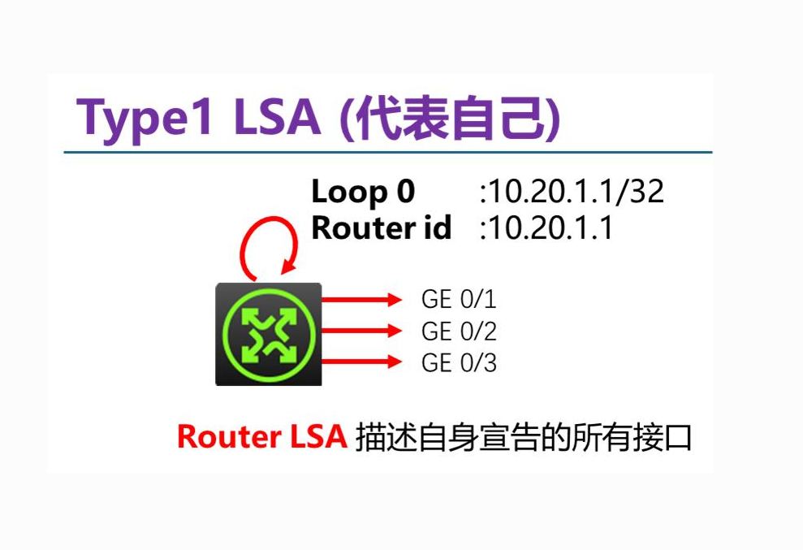
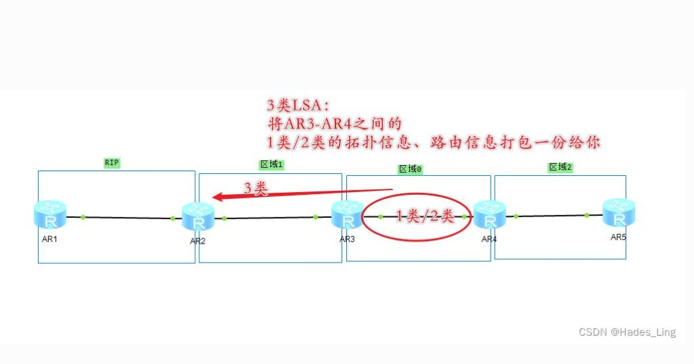

# 5.2 OSPF 自治系统内部路由

> 章级精读：[§5.3 OSPF](../study.md#ch5-3) · **LSA/LSDB**：[#ch5-2-lsa-dijkstra](#ch5-2-lsa-dijkstra) · [LSDB+SPF 三结论](#ch5-2-lsdb-spf-core) · [1～5 类 LSA](#ch5-2-lsa-types) · **三大概念**：[#ch5-2-ospf-simple](#ch5-2-ospf-simple) · [组播≠CIDR](#ch5-2-multicast-vs-cidr) · 域间：[5.3 BGP](../5.3_bgp_inter_as_routing/study.md)

## 本节核心目标

掌握 **LSA/LSDB 命名**、**LSDB 同图 + 本地 Dijkstra**、**OSPF≠SDN**、**1～5 类 LSA**；以及 **IP 89**、**Area 0**、邻居五步与 **Full** 邻接；能区分 **OSPF vs RIP**。**新手先读** [#ch5-2-lsdb-spf-core](#ch5-2-lsdb-spf-core) · [#ch5-2-lsa-dijkstra](#ch5-2-lsa-dijkstra) · [#ch5-2-lsa-types](#ch5-2-lsa-types) · [#ch5-2-ospf-simple](#ch5-2-ospf-simple)。

---

<a id="ch5-2-ospf-simple"></a>

## 〇、新手易懂：三大核心概念

> **89 识别 OSPF 包；Area 0 是主干道；LSA 泛洪同步同区域地图。**

---

<a id="ch5-2-ospf-ip89"></a>

### 1）IP 协议号 89

**通俗**：IP 首部有个**协议号**，告诉接收方「包里装的是哪种协议」。

| 编号 | 协议 |
|------|------|
| **6** | TCP |
| **17** | UDP |
| **1** | ICMP |
| **89** | **OSPF** |

- 组播收发（**广播网/以太网**上 Hello、LSAck 等仍用组播，**至今标配**）：
  - **224.0.0.5**（AllSPFRouters）— 所有 OSPF 路由器  
  - **224.0.0.6** — 只发给 **DR、BDR**

→ 考试精编：[#ch5-2-ospf-features](#ch5-2-ospf-features) · **224.0.0.5 与 CIDR 易混** → [#ch5-2-multicast-vs-cidr](#ch5-2-multicast-vs-cidr)

---

<a id="ch5-2-multicast-vs-cidr"></a>

#### 易混澄清：224.0.0.5 还在，没被 CIDR 取代

> **224.0.0.5 一直都在；CIDR 和组播是两回事，不是「有了 CIDR 就不用组播」。**

| | **224.0.0.5** | **CIDR** |
|---|---------------|----------|
| 是什么 | **D 类组播地址**（OSPF 专用） | **单播地址的 /前缀 记法** |
| 管什么 | **功能**：OSPF Hello/LSAck 发给所有路由器 | **记法**：如 `192.168.1.0/24` |
| 关系 | 可写成 `224.0.0.5/32`，**只是写法**，本质仍是**组播** | 只管**普通上网单播 IP**，**不管组播段** |

**224.0.0.0/4** 整段是**组播（D 类）**，与 CIDR 划分单播网段**各管各的、同时共存**。

**极简关系图**

```text
┌─────────────────┐   ┌──────────────────────┐   ┌─────────────────┐
│ 单播 + CIDR记法  │   │ 组播 224.0.0.5       │   │ OSPF 协议号 89  │
│ 192.168.1.0/24  │   │ D类 · OSPF Hello     │   │ IP首部字段=89   │
│ → 普通上网寻址   │   │ → 所有OSPF路由器听  │   │ → 识别OSPF报文  │
└─────────────────┘   └──────────────────────┘   └─────────────────┘
     记法/范围              组播功能                    封装识别
              三者不冲突，现代网络同时用
```

→ D 类组播背景：[4.3 有类编址 §D类](../../04_network_layer_data_plane/4.3_ipv4_ipv6_nat/study.md#ch4-3-classful) · CIDR：[4.3 CIDR 逻辑链](../../04_network_layer_data_plane/4.3_ipv4_ipv6_nat/study.md#ch4-3-cidr-chain)

---

<a id="ch5-2-ospf-area0-simple"></a>

### 2）Area 0 骨干区域

**通俗**：超大网络划成一块块 **Area**，**Area 0 = 城市主干道 / 中心骨干**。

| 规则 | 说明 |
|------|------|
| **必须直连** | 所有普通区域**必须连着 Area 0** |
| **中转互通** | 不同区域之间**只能经 Area 0** 转发 |
| **作用** | 防环路、缩小故障范围、减轻设备压力 |

```text
Area1 ──┐
Area2 ──┼── Area 0（骨干）── 区域间只走这里
Area3 ──┘
（非骨干之间不能直接「串门」）
```

→ 考试精编：[#ch5-2-ospf-area](#ch5-2-ospf-area)

---

<a id="ch5-2-ospf-lsa-flood"></a>

### 3）LSA 泛洪

**通俗**：**LSA = 链路状态信息**（周边线路、网段、快慢开销）；**泛洪 = 把网络地图同步给同区域所有路由器**。

| 步骤 | 动作 |
|------|------|
| 1 | 某路由器发现**线路变化** → 生成 LSA |
| 2 | 发给**邻居** |
| 3 | 邻居继续**转发**给其他邻居 |
| 4 | 最终**同区域所有路由器**拿到**相同拓扑地图（LSDB）** |

**关键特点**

| 特点 | 说明 |
|------|------|
| **范围** | **只在本 Area 内**传播，不跨区大范围扩散 |
| **触发** | **有变化才更新**，无变化不频繁发 |
| **算路** | 大家地图一样 → **各自独立**跑 **Dijkstra** 算最短路 |

→ 算法：[5.1 Dijkstra/LS](../5.1_routing_algorithm/study.md#ch5-1-ls) · **LSA 精编**：[#ch5-2-lsa-dijkstra](#ch5-2-lsa-dijkstra) · [1～5 类](#ch5-2-lsa-types) · 邻接五步：[#ch5-2-ospf-neighbor](#ch5-2-ospf-neighbor)

---

### 三者关联 + 组播（一句背）

**协议号 89 识别 OSPF 包 → Area 0 规整大网 → LSA 泛洪同步地图；以太网上 Hello 用组播 224.0.0.5（与 CIDR 单播记法并存）。**

| 点 | 记住 |
|----|------|
| **89** | IP 首部协议号，标识 OSPF |
| **Area 0** | 骨干，非骨干必须连它 |
| **LSA 泛洪** | 同区域同步 LSDB，各自 SPF |
| **224.0.0.5** | OSPF 组播地址，**没被淘汰** |

---

<a id="ch5-2-lsa-dijkstra"></a>

## 〇·二、LSA / LSDB / Dijkstra（精编 · 先读）

> **LSA = Link State Advertisement（链路状态通告）**  
> **LSDB = Link State Database（链路状态数据库）**  
> 易写错：口语里的 **LSD** 应写 **LSDB**。

**一句话**：OSPF 邻居互发 **LSA** → 本地存 **LSDB** → **Dijkstra** 算路由。

| 角色 | 记住 |
|------|------|
| **LSA** | 传递拓扑的**消息**（地图碎片） |
| **LSDB** | 所有 LSA 拼成的**全网地图** |
| **Dijkstra** | 在地图上**算最短路径**的算法 |

→ 1～5 类 LSA：[#ch5-2-lsa-types](#ch5-2-lsa-types) · 传递图：[#ch5-2-lsa-types-diagram](#ch5-2-lsa-types-diagram) · 例题：[#ch5-2-lsa-example](#ch5-2-lsa-example)

---

<a id="ch5-2-lsa-what"></a>

### 1）LSA 到底是什么？

**LSA = 一小段「自我介绍 / 拓扑描述」数据包。**

每台路由器把自己的情况写成 LSA 并**泛洪给同区域所有人**：

| 字段 | 内容 |
|------|------|
| 我是谁 | **Router ID** |
| 我有哪些接口 | 接口列表 |
| 连的是谁 | **邻居** Router ID |
| 链路好坏 | **带宽 / Metric（开销）** |
| 网段 | **前缀 + 掩码** |

**LSA 里只有「地图碎片」，没有「最终路由表」。**

| | **LSA** | **Dijkstra** |
|---|---------|--------------|
| 是什么 | 路由器**互相发的报文**（经 LSU 等） | **本机内部**跑的算路算法 |
| 写在报文里？ | **是**（链路状态描述） | **否** |
| 作用 | 描述**链路状态** | 用 LSDB 拼拓扑 → **算最短路** |

---

<a id="ch5-2-lsa-types"></a>

### 2）最常用的 1～5 类 LSA（必懂）

| 类型 | 名称 | 谁发 | 范围 | 内容 / 作用 |
|------|------|------|------|-------------|
| **Type 1** | **Router LSA** | **每台** OSPF 路由器 | **本区域** | 本机直连链路、接口、开销 → **区域内拓扑基础** |
| **Type 2** | **Network LSA** | 广播网（以太网）的 **DR** | **本区域** | 该网段上有哪些路由器（Router ID）→ **多路访问网当一个节点** |
| **Type 3** | **Summary LSA** | **ABR**（区域边界路由器） | **跨区域** | 其他区域的网段（前缀+掩码+开销）→ **区域间路由** |
| **Type 4** | **ASBR Summary** | **ABR** | 跨区域 | 怎么去 **ASBR**（引入外部路由的路由器）→ 「去外网先找 ASBR」 |
| **Type 5** | **External LSA** | **ASBR** | **整个 OSPF 域**（Stub/NSSA 除外） | 从静态/BGP/RIP 等**重分发**进来的外部路由 |

<a id="ch5-2-lsa-type1-img"></a>

**Type 1 配图** — Router LSA **代表自己**，描述 Router ID 与所有宣告接口：



**口诀**：**1 自报家门 · 2 DR 报网段 · 3 ABR 报他区网段 · 4 ABR 指路 ASBR · 5 ASBR 报外网**

→ ABR/ASBR：[#ch5-2-ospf-area](#ch5-2-ospf-area) · 传递拓扑：[#ch5-2-lsa-types-diagram](#ch5-2-lsa-types-diagram)

---

<a id="ch5-2-lsa-flow"></a>

### 3）LSA → LSDB → Dijkstra（核心链路）

1. **邻居之间：只交换 LSA** — 不传路由表，不传算法，只发 LSA 数据包  
2. **每台路由器：把收到的 LSA 存进 LSDB** — 同 Area 内 LSDB **内容完全一致**（同一版全网地图）  
3. **每台路由器：本地跑 Dijkstra** — 以**自己为起点**，在 LSDB 上算到各网段最短路 → 写入**本地路由表**（再下发 FIB）

**完整 5 步**

1. 每台路由器把**直连链路**打包成 LSA（多为 **Type 1**）  
2. **泛洪** LSA 给同区域所有邻居（经 **LSU** 等）  
3. 收齐全部 LSA → 拼成**一模一样的 LSDB**  
4. **各自独立**跑 **Dijkstra（SPF）**，以自己为根  
5. 结果写入本地路由表

| 传路由（DV 思路） | 传 LSA（OSPF/LS） |
|-------------------|-------------------|
| 易环路、信息失真 | 全网拓扑**一致** |
| 震荡大 | **各自独立算路**，稳定 |

| 步骤 | 比喻 |
|------|------|
| LSA | 每人画**自家门口**道路图 |
| 泛洪 | **交换地图碎片** |
| LSDB | 集齐碎片 → **全城完整地图** |
| Dijkstra | 站在自家门口，算去全城**怎么走最近** |

**小总结**：邻居**只交换 LSA**；**Dijkstra 只在本机跑**，靠统一 LSDB 出路由表。

→ 三结论精编：[#ch5-2-lsdb-spf-core](#ch5-2-lsdb-spf-core)

---

<a id="ch5-2-lsdb-spf-core"></a>

### 3·二、核心三结论（LSDB 共享 · 本地 SPF · 非 SDN）

> **同 Area LSDB 一样 · Dijkstra 各算各的 · 标准 OSPF 是分布式，不是 SDN**

| # | 结论 |
|---|------|
| **1** | 同 **Area** 内，收敛后每台路由器 **LSDB 内容完全一致** — 等价共享**同一套拓扑库** |
| **2** | **Dijkstra 仅单设备本地独立运算**；设备间**不同步**计算过程、中间值与结果 |
| **3** | **传统 OSPF = 分布式路由协议**；与 **SDN 控数分离架构机制本质不同**，**标准 OSPF 不属于 SDN** |

---

#### 1）LSDB 共享特性

| 点 | 说明 |
|----|------|
| **怎么同步** | 路由器间 **LSA 泛洪**；正常收敛后，同 Area 每台设备 LSDB **一模一样** |
| **比喻** | 全网共用**同一份拓扑图纸**；每台都拿到**完整全局链路信息**（本 Area 范围内） |
| **变化时** | 链路状态变 → 触发 **LSA 更新** → 全网同步刷新 LSDB |

> **多 Area 精确定义**：LSDB **按 Area 划分** — 同 Area 内一致；不同 Area 各自一份（本区 **Type 1/2** + 他区 **Type 3/4 摘要**），**不是**整个 OSPF 域所有路由器存完全相同的 LSDB。

---

#### 2）Dijkstra 的运行逻辑

| 点 | 说明 |
|----|------|
| **数据源** | LSDB 是**公共**拓扑库（同 Area 内相同） |
| **计算** | **计算动作各自独立** — 每台以**自身为根**单独跑 SPF |
| **结果** | 起点不同 → **SPF 树、路由表各不相同**（同一地图，不同「我在哪」） |
| **不同步** | 只同步**拓扑描述（LSA）**；**不传**计算步骤、运算中间值、算好的路由表 |

---

#### 3）与 SDN 的边界

| | **传统 OSPF** | **SDN** |
|---|---------------|---------|
| **架构** | **分布式** — 每台路由器自主收拓扑、自主算路、自主转发 | **控数分离** — 控制器集中收集拓扑、集中算路 |
| **算路位置** | **各设备本地** Dijkstra | **中心控制器**统一计算 |
| **下发** | 本地生成**路由表/FIB** | 经 **OpenFlow** 等下发**流表**给转发设备 |
| **关系** | **标准 OSPF 机制 ≠ SDN**；SDN 网里 OSPF 可作 underlay **协同**，但 OSPF 本身不是 SDN 范畴 |

→ SDN 对比：[5.4 传统 vs SDN 算路](../5.4_sdn_controller_plane/study.md#ch5-4-routing-compute)

---

#### 通俗对照

| 概念 | 比喻 |
|------|------|
| **LSDB** | **统一城市交通总图** — 同 Area 所有路口拿到**一模一样**的图纸 |
| **Dijkstra** | 每个人站在**自己所在路口**，独自查表规划去各地的最短路线 |
| **OSPF** | 大家**各自看图纸、自己规划** |
| **SDN** | **统一调度中心**看完图纸，给每个路口**下发通行指令** |

**5 行默写**

```text
同Area内LSDB一致，等价共享同一拓扑库；多Area各有一份LSDB。
Dijkstra仅本地独立算，不同步计算过程与结果；起点不同路由表不同。
只同步LSA拓扑，不传算好的路由表。
传统OSPF=分布式，各机自主收拓扑自主算路。
标准OSPF≠SDN；SDN=控制器集中算路下流表。
```

| 易混 | 纠正 |
|------|------|
| 全域 LSDB 都一样？ | **同 Area 内**一致；多 Area 时各 Area **LSDB 不同**（含不同摘要） |
| Dijkstra 结果也同步？ | **否**；只同步 **LSA/LSDB**，路由表**各自算** |
| OSPF 是 SDN？ | **否**；**分布式 IGP**；与 SDN **机制本质不同** |
| SDN 里还能跑 OSPF？ | 可以作 **underlay**，但 **OSPF 协议本身 ≠ SDN** |

---

<a id="ch5-2-lsa-example"></a>

### 4）极简例子：A、B、C 同在 Area 0

| 路由器 | 发出的 LSA |
|--------|------------|
| **A** | **Type 1**：我连 B、连 **10.1.1.0/24** |
| **B** | **Type 1**：我连 A、连 C |
| **C** | **Type 1**：我连 B、连 **10.2.2.0/24** |
| **DR**（以太网段） | **Type 2**：这个网段上有 A、B、C |

A、B、C 把所有 LSA 存进 **LSDB** → **三张一模一样的地图**。

各自跑 **Dijkstra**：

| 路由器 | 算出的最短路 |
|--------|--------------|
| **A** | 到 10.2.2.0 → **A→B→C** |
| **B** | 到 10.1.1.0 → **B→A**；到 10.2.2.0 → **B→C** |
| **C** | 到 10.1.1.0 → **C→B→A** |

---

<a id="ch5-2-lsa-types-diagram"></a>

### 5）1 / 2 / 3 类 LSA 传递拓扑图

**同区域内：Type 1 + Type 2**

```text
              [ 以太网广播段 · DR = B ]
             /         |         \
            A          B          C
            │          │          │
   Type1 ◄──┴──► 泛洪 ◄─┴─► 泛洪 ◄─┴──► Type1
   (各自发)              │
                         └── Type2（DR=B 发：网段上有 A、B、C）
                                    │
                    ┌───────────────┼───────────────┐
                    ▼               ▼               ▼
                 LSDB(A)         LSDB(B)         LSDB(C)    ← 内容相同
                    │               │               │
                    └─ Dijkstra(根=A/B/C) → 各自路由表 ──┘
```

**跨区域：Type 3（ABR 汇总）**

> **3 类 LSA**：ABR 把**本区域（或骨干）内**由 1/2 类拼出的拓扑/网段信息**打包摘要**，发给**其他区域**的路由器 — **不传逐跳细节**，只传「前缀 + 掩码 + 到 ABR 的开销」。

<a id="ch5-2-lsa-type3-img"></a>



| 图中 | 记住 |
|------|------|
| **Area 0（骨干）** | AR3–AR4 之间交换 **Type 1/2**，拼 Area 0 完整拓扑 |
| **ABR（AR3）** | 把 Area 0 的网段信息**汇总**成 **Type 3**，发给 **Area 1** |
| **Area 1 / Area 2** | 收到的是**摘要**，不是 Area 0 内部每一跳的 1/2 类细节 |
| **RIP 域（AR1）** | 非 OSPF 域；与 OSPF 互联常经 **ASBR + 重分发**（Type 5 等） |

```text
  Area 1                          Area 0（骨干）
  ┌─────────┐                    ┌─────────┐
  │ R1      │                    │         │
  │10.1.0.0 │── Type1 区域内 ──► │  ABR    │── Type3 Summary ──► Area 0 内路由器
  └─────────┘    泛洪             │ (边界)  │    「Area1 有 10.1.0.0/16，开销 x」
                                  └─────────┘
  Type3 不描述 Area1 内部逐跳拓扑，只传「前缀 + 到 ABR 的开销」
```

---

### 6）一句话记牢 + 易错

```text
LSA = 我描述我自己
LSDB = 所有人的描述拼成一张图
Dijkstra = 我在图上算最短路径
```

```text
  R1 ──LSA──► R2 ──LSA──► R3        （泛洪：只传链路状态，不传路由表）
   │           │           │
   └─ LSDB ────┴─ LSDB ────┴─ LSDB   （同 Area 内：三张表内容一致）

  R1 本地: LSDB + Dijkstra(根=R1) → R1 的路由表
  R2 本地: LSDB + Dijkstra(根=R2) → R2 的路由表   ← 同一地图，不同起点
  R3 本地: LSDB + Dijkstra(根=R3) → R3 的路由表
```

| 易混 | 纠正 |
|------|------|
| **LSD**？ | 应写 **LSDB**（Link State **Database**） |
| OSPF 邻居传路由表？ | **否**；传 **LSA**，路由**各自算** |
| Type 2 谁发？ | 广播网的 **DR**，不是每台都发 |
| Type 3 传完整拓扑？ | **否**；只传**网段摘要**（前缀+掩码+开销） |
| Dijkstra 在报文里跑？ | **否**；**本机 CPU** 跑 SPF |
| LSDB 每台不一样？ | **同 Area 内应一致** |
| 和 RIP 一样靠邻居跳数？ | **否**；RIP 是 **DV**，OSPF 是 **LS** |

→ LS 原理：[5.1 链路状态](../5.1_routing_algorithm/study.md#ch5-1-ls) · Full 后 SPF：[#ch5-2-ospf-neighbor](#ch5-2-ospf-neighbor)

---

<a id="ch5-2-ospf-basics"></a>

## 一、基础定位（必背）

**OSPF**（Open Shortest Path First，**开放式最短路径优先**）

| 项 | 说明 |
|----|------|
| **协议类型** | **IGP 内部网关协议** — 仅用于**同一 AS（自治系统）**内 |
| **底层算法** | **链路状态 LS**（非距离矢量）→ [5.1 LS 精编](../5.1_routing_algorithm/study.md#ch5-1-ls) |
| **开放性** | 标准开放，**全厂商互通** |

一句话：**AS 内用 LS 算最短路，开放标准，不靠邻居跳数传路由表。**

---

<a id="ch5-2-ospf-features"></a>

## 二、核心特点

| # | 特点 |
|---|------|
| 1 | 直接封装 **IP，协议号 89** — **不用 TCP/UDP** |
| 2 | 度量 **Cost（开销）**：**带宽越大，Cost 越小** |
| 3 | 支持 **区域（Area）** 分层组网 |
| 4 | 支持 **报文认证**、**等价路由负载分担（ECMP）** |
| 5 | 全网泛洪 **LSA（链路状态通告）**，同步 **链路状态数据库 LSDB** |

### 与常见协议封装对比（易考）

| 协议 | 类型 | 承载 |
|------|------|------|
| **OSPF** | IGP / LS | **IP 89** |
| **RIP** | IGP / DV | **UDP 520** |
| **BGP** | EGP | **TCP 179** |

---

<a id="ch5-2-ospf-area"></a>

## 三、OSPF 区域规划

| 区域 | 要求 |
|------|------|
| **Area 0 骨干区域** | **必设**；**不可拆分、不可缺失** |
| **非骨干区域** | 必须通过 **ABR** **直连 Area 0**；**非骨干之间不能直接互通** |
| **目的** | 缩小 **LSA 泛洪**范围 → 降 CPU/内存、**加快收敛** |

```text
非骨干 Area X ──ABR── Area 0（骨干）──ABR── 非骨干 Area Y
```

> 角色：**ABR**（区域边界路由器）、**ASBR**（连外部/其他 AS）— 见章级 [#ch5-3](../study.md#ch5-3)

---

<a id="ch5-2-ospf-neighbor"></a>

## 四、邻居与邻接建立（全过程 · 必考顺序）

| 步骤 | 报文/动作 | 作用 |
|------|-----------|------|
| 1 | **Hello** | 发现邻居、协商参数 → 建立**邻居关系**（2-Way） |
| 2 | **DBD**（Database Description） | 交换链路库**摘要**，比对 LSDB 版本 |
| 3 | **LSR**（Link State Request） | 请求缺失的 LSA |
| 4 | **LSU**（Link State Update） + **LSAck** | 发送完整 LSA 并**确认** |
| 5 | 数据库一致 → **Full（完全邻接）** | 本地运行 **Dijkstra（SPF）** → 生成**路由表** → 下发 **FIB** |

```text
Hello → DBD → LSR/LSU/LSAck → Full → SPF(Dijkstra) → 路由表
```

**记忆**：**你好（Hello）→ 对账（DBD）→ 要细节（LSR）→ 更新确认（LSU/LSAck）→ 满状态算路（Full+SPF）**

---

<a id="ch5-2-ospf-vs-rip"></a>

## 五、OSPF 对比 RIP 优势

| 维度 | OSPF（LS） | RIP（DV） |
|------|------------|-----------|
| 收敛 | **快** | 慢 |
| 环路/计数到无穷 | **无 DV 经典缺陷** | **易环路、坏消息慢** |
| 网络规模 | **大型、多层级** | 小规模为主 |
| 扩展 | **区域化**架构 | 扁平跳数限制（RIPv1/2 15 跳） |
| 算路依据 | **全网拓扑 + SPF** | **邻居跳数向量** |

---

<a id="ch5-2-ospf-exam"></a>

## 六、考试背诵极简版

### 口诀

```text
OSPF IGP同AS内，IP89不用TCP
LSA泛洪Area0骨干，Cost小带宽大
Hello DBD LSR LSU，Full后Dijkstra算路
链路状态非矢量，比RIP快无无穷
LSA通告LSDB库，12345类要分清
同Area LSDB同图，Dijkstra本地各算；OSPF分布式非SDN
```

### 30 字

**OSPF：AS 内 IGP、IP89、LSA+Area0、Hello→DBD→LSU→Full→SPF；非 DV，优于 RIP 收敛与扩展。**

### 考点速记

| 点 | 一句 |
|----|------|
| 类型 | **IGP**、**LS**、**AS 内** |
| 封装 | **IP 协议号 89** |
| 度量 | **Cost**（带宽↑ Cost↓） |
| 骨干 | **Area 0 必有**，非骨干经 ABR 连骨干 |
| 邻接 | **Hello → DBD → LSR/LSU/LSAck → Full → SPF** |
| LSA | **通告**拓扑；存 **LSDB**；**1 自报·2 DR·3 ABR 汇总·4 指 ASBR·5 外部** |
| LSDB+SPF | **同 Area LSDB 一致**；**Dijkstra 本地各算**；**不同步**算路结果 |
| vs SDN | **标准 OSPF = 分布式**；**≠ SDN** 集中控算 → [#ch5-2-lsdb-spf-core](#ch5-2-lsdb-spf-core) |
| vs RIP | OSPF=**LS**；RIP=**DV** |

### 易错点

| 易混 | 纠正 |
|------|------|
| OSPF 用 UDP？ | **否**；直接 **IP 89** |
| 224.0.0.5 被 CIDR 取代？ | **否**；组播**功能** vs CIDR **单播记法**，**并存** → [#ch5-2-multicast-vs-cidr](#ch5-2-multicast-vs-cidr) |
| OSPF = 距离矢量？ | **否**；**链路状态**，本地 **Dijkstra** |
| 非骨干 Area 能直连？ | **否**；必须经 **Area 0** |
| OSPF 靠邻居传路由表？ | **否**；靠 **LSA 泛洪拓扑**，本地算路 |
| LSD 还是 LSDB？ | **LSDB**（Database，不是 LSD） |
| Type 2 每台都发？ | **否**；广播网由 **DR** 发 |
| 全域 LSDB 完全相同？ | **同 Area 内**一致；多 Area **各有一份** LSDB |
| OSPF = SDN？ | **否**；**分布式 IGP**；SDN 是**集中控算+下流表** |
| 目录 5.2 vs 章 §5.3 | 目录 **5.2=OSPF 精读**；章 **§5.3=OSPF** 概述 |

---

## 七、学习补充

> 实操 **多区域 OSPF**；Wireshark 抓 **Hello、DBD、LSR、LSU、LSAck**（过滤 `ospf` 或 IP proto 89）。

| 锚点 | 内容 |
|------|------|
| [#ch5-2-lsa-dijkstra](#ch5-2-lsa-dijkstra) | LSA/LSDB/Dijkstra 精编 |
| [#ch5-2-lsdb-spf-core](#ch5-2-lsdb-spf-core) | LSDB 同图 + 本地 SPF + 非 SDN |
| [#ch5-2-lsa-types](#ch5-2-lsa-types) | 1～5 类 LSA |
| [#ch5-2-lsa-type1-img](#ch5-2-lsa-type1-img) | Type 1 Router LSA 配图 |
| [#ch5-2-lsa-type3-img](#ch5-2-lsa-type3-img) | Type 3 ABR 汇总配图 |
| [#ch5-2-lsa-types-diagram](#ch5-2-lsa-types-diagram) | 1/2/3 类传递拓扑图 |
| [#ch5-2-lsa-example](#ch5-2-lsa-example) | A/B/C 极简例题 |
| [#ch5-2-ospf-simple](#ch5-2-ospf-simple) | 三大概念通俗 |
| [#ch5-2-ospf-ip89](#ch5-2-ospf-ip89) | IP 协议号 89 |
| [#ch5-2-multicast-vs-cidr](#ch5-2-multicast-vs-cidr) | 224.0.0.5 vs CIDR |
| [#ch5-2-ospf-area0-simple](#ch5-2-ospf-area0-simple) | Area 0 骨干 |
| [#ch5-2-ospf-lsa-flood](#ch5-2-ospf-lsa-flood) | LSA 泛洪 |
| [#ch5-2-ospf-basics](#ch5-2-ospf-basics) | 定位 |
| [#ch5-2-ospf-features](#ch5-2-ospf-features) | 特点 / IP89 |
| [#ch5-2-ospf-area](#ch5-2-ospf-area) | Area 0 |
| [#ch5-2-ospf-neighbor](#ch5-2-ospf-neighbor) | 邻居五步 |
| [#ch5-2-ospf-vs-rip](#ch5-2-ospf-vs-rip) | vs RIP |
| [#ch5-2-ospf-exam](#ch5-2-ospf-exam) | 口诀 / 30 字 |
