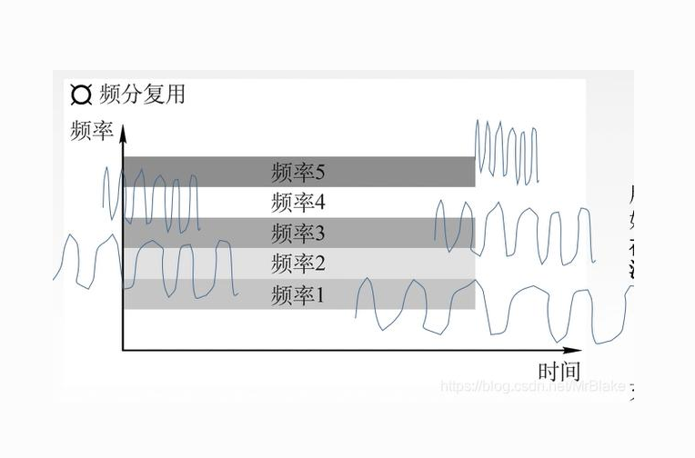
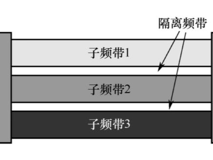
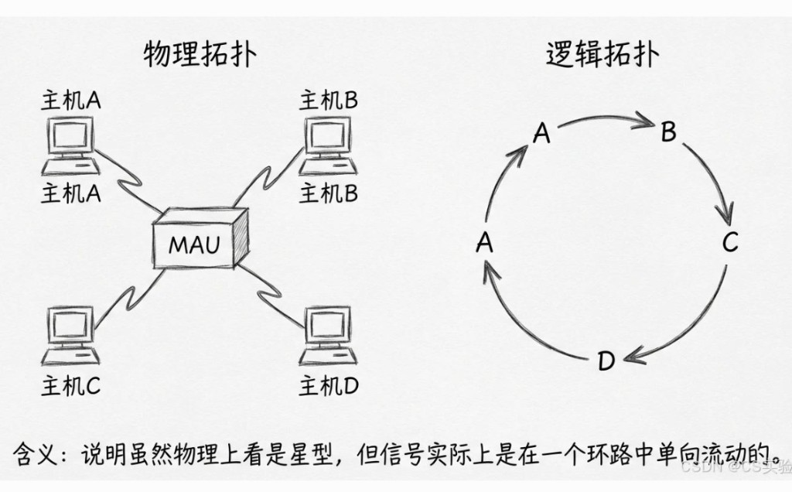

# 6.3 MAC 介质访问控制协议

> 章级精读：[§6.3](../study.md#ch6-3) · **三类对比**：[#ch6-3-compare](#ch6-3-compare) · **CSMA/CD vs CA**：[#ch6-csma](../study.md#ch6-csma)

## 本节核心目标

掌握 **MAC 三大类**（信道划分 / 随机接入 / 轮询）及典型协议；能背对比表；掌握 **CSMA/CD vs CSMA/CA**。

---

## 一、MAC 协议的核心问题

**多个主机共享同一信道时，规定谁什么时候可以发数据。**

> 属于链路层 **MAC 子层**：介质访问规则（与 [以太网成帧](../study.md#ch6-ethernet-frame) 是不同分工）。

---

## 二、MAC 协议分类（三大类）

| 类 | 核心思想 | 一句话 |
|----|----------|--------|
| **信道划分** | 资源**预先切分**，各用各的 | 固定分配，不打架，闲时浪费 |
| **随机接入** | **自由竞争**，冲突再重试 | 抢到就发，会打架，轻载快 |
| **轮询** | **中心/令牌**控制轮流发 | 排队发言，不打架，慢且怕故障 |

---

### 1. 信道划分（Channel Partitioning）

**核心**：把信道（时间/频率/编码）**预先切成固定小块**，每主机**独占一小块**，互不干扰。

| 协议 | 说明 |
|------|------|
| **TDMA** 时分 | 时间分帧、分**时隙**，每主机占固定时隙 |
| **FDMA** 频分 | 频率分**频段**，每主机占专属频段 |
| **CDMA** 码分 | 时间频率共享，靠**不同编码**区分（3G/4G 常用） |

| 图上要点 | 含义 |
|----------|------|
| **子频带 1/2/3** | 每用户独占一段**频率**，并行传、**无冲突** |
| **隔离频带** | 频段间留空档，防**串扰**（物理层划分） |
| 与 TDMA 区别 | FDM **同时**占不同频；TDMA **轮流**占同一频的不同时隙 |

→ 物理层多路复用也见 [1.3 网络核心](../../01_network_basics/1.3_network_core_switching/study.md)

| | |
|--|--|
| ✅ **优点** | **完全无冲突**、公平、稳定 |
| ❌ **缺点** | **利用率低**；主机空闲时资源仍被占，**浪费** |

**一句话**：**固定分配，各用各的，不打架，但闲时浪费**。

---

### 2. 随机接入（Random Access）

**核心**：**不划分信道**；所有主机**自由竞争**，想发就发；**冲突了再重试**。

| 协议 | 说明 |
|------|------|
| **ALOHA** | 想发就发；冲突后**随机时间**重传（纯 ALOHA、时隙 ALOHA） |
| **CSMA** | **先听后发**，空闲才发（仍可能冲突） |
| **CSMA/CD** | **先听后发 + 边发边听**；冲突立刻停、退避重发 → **有线以太网** |
| **CSMA/CA** | **先听 + 避让 + RTS/CTS**；无线难检测冲突 → **WiFi** |

| | |
|--|--|
| ✅ **优点** | **简单、轻载效率高**；谁有数据谁用 |
| ❌ **缺点** | **有冲突**；负载高时冲突多、性能降 |

**一句话**：**自由竞争，抢到就发，会打架，但轻载快**。

→ 专节：[§三 CSMA/CD vs CA](#ch6-3-csma-local)

---

### 3. 轮询（Taking Turns / Polling）

**核心**：**中心节点/令牌**控制；**轮流**获得发送权，同一时刻只有一个主机能发。

| 协议 | 说明 |
|------|------|
| **主从轮询 Polling** | 主节点挨个问从节点：「你要发吗？」 |
| **令牌环 Token Ring** | **令牌**在环上传；**拿到令牌才能发**，发完传给下一个 |

| 图上要点 | 含义 |
|----------|------|
| **物理拓扑** | 各主机连 **MAU**，外观像**星型** |
| **逻辑拓扑** | MAU 内部把端口串成**环**；数据/令牌 **A→B→C→D** 单向转 |
| 考点 | **物理≠逻辑**；轮询类 MAC 靠**令牌**控发，**无冲突** |

| | |
|--|--|
| ✅ **优点** | **无冲突、可控、有序**；高负载稳定 |
| ❌ **缺点** | **中心/令牌单点故障**（主挂了、令牌丢了 → 全网瘫）；**开销大、轻载延迟大** |

**一句话**：**排队轮流，按序发言，不打架，但慢且怕故障**。

---

### 4）三类快速对比（必背）

| 类型 | 核心 | 冲突 | 利用率 | 典型代表 |
|------|------|------|--------|----------|
| **信道划分** | 固定分配资源 | ❌ 无 | 低（闲时浪费） | TDMA、FDMA、CDMA |
| **随机接入** | 竞争、自由发 | ✅ 有 | 高（轻载） | ALOHA、**CSMA/CD**、**CSMA/CA** |
| **轮询** | 轮流/令牌 | ❌ 无 | 中（可控） | 令牌环、主从轮询 |

### 30 字

**划分无冲突浪费；随机竞争轻载快有冲突；轮询有序怕单点；以太网 CSMA/CD，WiFi CSMA/CA。**

---

### 5）易错点

| 易混 | 纠正 |
|------|------|
| MAC = 网络层？ | **二层 MAC 子层**；管**共享信道谁先发** |
| CSMA/CD 用于 WiFi？ | **否**；CD=**有线以太网**；WiFi 用 **CSMA/CA** |
| 信道划分利用率高？ | **否**；**无冲突但闲时浪费**，利用率常**低于**轻载随机接入 |
| 轮询无缺点？ | **有**；单点故障、轮询/传令牌**开销与延迟** |
| CDMA 是随机接入？ | **否**；CDMA 属**信道划分（码分）** |

---

## 三、CSMA/CD 与 CSMA/CA（考试重点）

> 章级展开：[§6.3 · #ch6-csma](../study.md#ch6-csma) · WiFi 细节 → [7.1 WiFi](../../07_wireless_mobile_network/7.1_wifi_802_11/study.md)

### CSMA/CD

**全称**：**载波监听多路访问 / 冲突检测**（Collision **Detection**）  
**场景**：传统**有线以太网**（Hub 共享介质时代；交换机全双工后冲突大减，原理仍要会）

| 步 | 做什么 |
|----|--------|
| 1 载波监听 | 发前先听，信道**空闲**才准备发 |
| 2 边发边检 | 发送同时**持续监听**线路 |
| 3 冲突判定 | 发现别人也在发 → **碰撞** |
| 4 停止发送 | 立刻停发，发**干扰信号**通知全网 |
| 5 退避重试 | **随机退避**一段时间后再试 |

**特点**：**边发边检**；靠有线**电气信号**识别碰撞。

### CSMA/CA

**全称**：**载波监听多路访问 / 冲突避免**（Collision **Avoidance**）  
**场景**：**无线 WiFi**（802.11）

| 步 | 做什么 |
|----|--------|
| 1 载波监听 | 先侦测信道 |
| 2 提前避让 | **不**边发边检；空闲后仍等**随机退避**（如 DIFS） |
| 3 预约信道 | 常配合 **RTS/CTS** 预留发送时间，减碰撞 |
| 4 接收确认 | 对方 **ACK**，表示本帧成功 |

**特点**：**先避让、再发**；无线难实时判碰撞，用预约 + ACK 规避。

### 核心区别（背）

| | CSMA/CD | CSMA/CA |
|--|---------|---------|
| 网络 | **有线**以太网 | **无线** WLAN |
| 策略 | **冲突检测**（撞了再处理） | **冲突避免**（尽量别撞） |
| 发送时 | 边发边听 | 不能可靠边发边检 |
| 典型手段 | 干扰信号 + 二进制指数退避 | DIFS + RTS/CTS + ACK |

### 补充关联

- 早期 **集线器 Hub**：整网一个碰撞域，全靠 **CSMA/CD** 协调。
- 现代 **交换机**：端口独立、常**全双工**，冲突**大幅减少**，但考试与链路层理解仍考 CSMA/CD 原理。
- WiFi → [7.1](../../07_wireless_mobile_network/7.1_wifi_802_11/study.md)；以太网帧 → [6.4](../6.4_ethernet_arp_switch_vlan/study.md)
- 802.11 有确认无连接 → [6.1 服务模型](../6.1_link_layer_service/study.md#ch6-1-wifi-ack)

---

## 四、本节核心考点

- **三类 MAC**：信道划分 / 随机接入 / 轮询 → [#ch6-3-compare](#ch6-3-compare)
- **CSMA/CD vs CSMA/CA**：检测 vs 避免、有线 vs 无线
- Hub vs 交换机对碰撞域的影响

---

## 五、锚点索引

| 锚点 | 内容 |
|------|------|
| [#ch6-3-mac-types](#ch6-3-mac-types) | 三大类总览 |
| [#ch6-3-partition](#ch6-3-partition) | 信道划分 TDMA/FDMA/CDMA |
| [#ch6-3-random](#ch6-3-random) | 随机接入 ALOHA/CSMA |
| [#ch6-3-polling](#ch6-3-polling) | 轮询/令牌环 |
| [#ch6-3-compare](#ch6-3-compare) | 必背对比表 |
| [#ch6-3-exam](#ch6-3-exam) | 易错点 |
| [#ch6-3-csma-local](#ch6-3-csma-local) | CSMA/CD vs CA |
| [#ch6-csma](../study.md#ch6-csma) | CSMA/CD vs CA 章级 |

---

## 六、个人学习心得与补充

> 对比 Hub（一域 CSMA/CD）与交换机（端口隔离）；Wireshark 看 WiFi **ACK** 帧理解 CSMA/CA。
