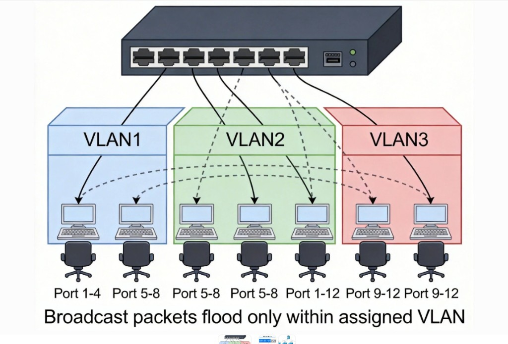
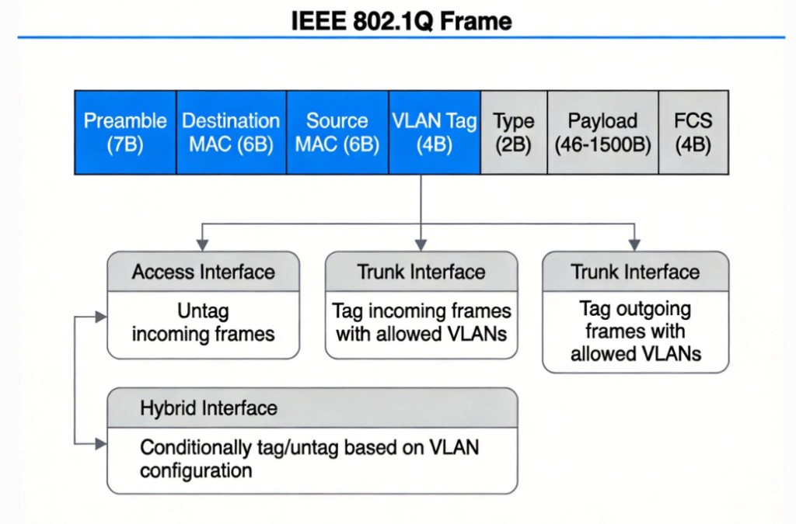
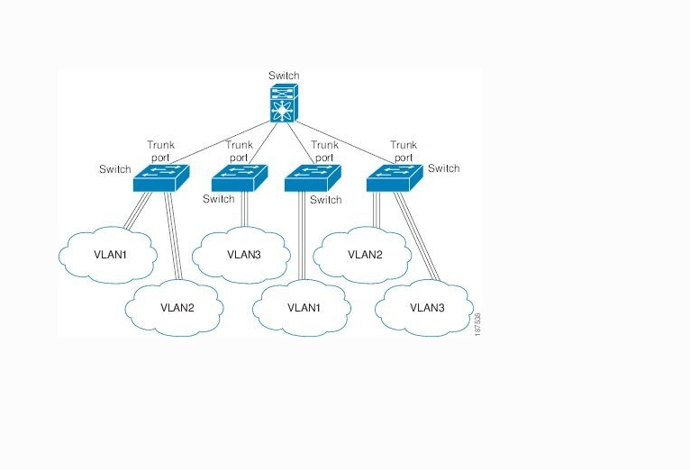

# 6.4 以太网、ARP、交换机与 VLAN

> 章级精读：[§6.4](../study.md#ch6-4) · **VLAN**：[#ch6-4-vlan](#ch6-4-vlan) · **ARP**：[#ch6-arp](../study.md#ch6-arp)

## 一、以太网（Ethernet）

> 帧与 IP 嵌套 → [§6.1 帧≠IP](../study.md#ch6-frame-vs-ip) · [帧结构图](../study.md#ch6-ethernet-frame)

- 目前局域网主流技术，基于 IEEE 802.3 / **Ethernet II**
- **Ethernet II 帧**（左→右）：前导 7 + SFD 1 + 目的/源 MAC 各 6 + 类型 2（`0x0800`=IPv4，**`0x0806`=ARP**）+ 数据 46–1500 + FCS 4
- **帧长**：最小 64B、最大 1518B（MTU **1500B**）
- 接收：**目的 MAC 匹配本口** → 验 FCS/帧长 → 剥帧上交网络层

---

## 二、ARP 地址解析协议

> 章级展开：[#ch6-arp](../study.md#ch6-arp)

### 基础定义

**ARP（Address Resolution Protocol）** 工作在**数据链路层与网络层之间**，核心：**把 IP 地址翻译成 MAC 地址**。

### 核心背景

| 层 | 地址 | 作用 |
|----|------|------|
| **网络层** | IP | 跨网段找到目标主机 |
| **链路层** | MAC | **局域网内**完成帧投递 |

同网段发数据前，必须知道对方 MAC → **ARP 完成转换**。

### 工作流程

1. 查本地 **ARP 缓存表**（IP↔MAC 映射）
2. **无记录** → 发 **ARP 广播请求**：「这个 IP 的 MAC 是什么？」
3. 网段内设备都收到，**仅 IP 匹配者** **单播应答** 自己的 MAC
4. 请求方写入缓存，后续直接用
5. 缓存有**老化时间**，过期后重新解析

### 报文格式（28 字节 + 以太网封装）

→ 完整表、请求/应答十六进制、Wireshark 树：[#ch6-arp-format](../study.md#ch6-arp-format)

| 要点 | 请求 | 应答 |
|------|------|------|
| 操作码 | `0001` | `0002` |
| 目标 MAC | **全 0** | 真实 MAC |
| 以太网目的 MAC | **广播** | 单播给请求方 |
| 帧类型 | **`0x0806`** | 同左 |

ARP **不是** IP 包；装在以太网帧 **Payload** 里。

### 关键附属机制

| 机制 | 说明 |
|------|------|
| **ARP 缓存** | 减广播；Windows `arp -a`，Linux `arp -n` |
| **免费 ARP** | 主动广播自身 IP-MAC；查 **IP 冲突**、刷新他机缓存 |
| **代理 ARP** | 路由器代应答；特殊跨子网「像同网段」场景 |
| **RARP** | MAC→IP；老旧无盘工作站（了解） |

### 常见问题与攻击

- **ARP 欺骗**：伪造应答，篡改他人缓存 → 流量劫持
- **IP 冲突**：多机同 IP → 解析混乱
- **防御**：**静态 ARP 绑定**（固定 IP-MAC）

### 简易举例

电脑 `192.168.1.10` 访问 `192.168.1.20`：

1. 查表无 `.20` 的 MAC  
2. **广播**询问  
3. `.20` **单播**回复 MAC  
4. 存缓存，封装以太网帧发送  

**跨子网**：IP 目的仍是远端主机，但帧的 **目的 MAC = 默认网关**（先 ARP 网关 IP）。

---

## 三、交换机（Switch）

- 数据链路层设备，按 **MAC** 转发帧
- **学习**源 MAC→端口 → **转发**到目的端口；未知则**泛洪**
- 隔离**冲突域**（相对 Hub），端口常全双工

## 四、VLAN 虚拟局域网

> **一个 VLAN = 一个广播域；802.1Q 用 4 字节 Tag（VID）标识；Access 接终端剥标，Trunk 交换机互联带标。**

---

### 1. 什么是 VLAN

**VLAN（Virtual Local Area Network，虚拟局域网）**：把**同一物理局域网**在**逻辑上**划成**多个独立广播域**。

| 规则 | 说明 |
|------|------|
| **同 VLAN** | 可直接**二层互通** |
| **不同 VLAN** | **二层隔离**；互通须 **三层设备**（路由器 / 三层交换机） |

**作用（必背）**

| | |
|--|--|
| ✅ **隔离广播域** | 广播只在本 VLAN 内，不扩散全网 |
| ✅ **提高安全** | 不同部门默认隔离 |
| ✅ **管理灵活** | 按部门/业务划分，**不受物理位置限制** |

**图上要点**：同一交换机物理相连，**VLAN2 的广播不会进 VLAN1/VLAN3** → **一个 VLAN = 一个广播域**。

---

### 2. 802.1Q 标签（VLAN 核心）

**802.1Q**：IEEE 标准，定义 VLAN **帧格式**与跨交换机转发。

**在以太网帧 MAC 头后插入 4 字节 Tag**：

| 字段 | 长度 | 说明 |
|------|------|------|
| **TPID** | 2B | 固定 **`0x8100`**，标识 802.1Q 帧 |
| **TCI** | 2B | 含 **PCP**（3bit QoS）、**DEI**（1bit）、**VID**（12bit **VLAN ID**） |

- **VID 范围**：**1–4094**（**0、4095 保留**）
- **一句话**：交换机靠 **VID** 识别帧属于哪个 VLAN

| 图上要点 | 含义 |
|----------|------|
| **Tag 位置** | 插在**源 MAC 之后、Type 之前** |
| **Access 口** | 收：**无标帧打 PVID**；发：**剥标**给终端 |
| **Trunk 口** | 收/发：**带允许 VLAN 的标签**（Native VLAN 除外见下） |

→ 以太网帧基础：[§6.1 帧≠IP](../study.md#ch6-frame-vs-ip)

---

### 3. 端口类型：Access / Trunk

#### Access 端口（接入端口）

| 项 | 说明 |
|----|------|
| **连接** | **PC、打印机**等终端 |
| **VLAN 数** | **只能 1 个 VLAN** |
| **收帧** | 无标签 → 打上本端口 **PVID**（Port VLAN ID） |
| **发帧** | **去掉标签**（终端不认 Tag） |

**口诀**：**单 VLAN，进打标，出剥标**

#### Trunk 端口（中继端口）

| 项 | 说明 |
|----|------|
| **连接** | **交换机之间**、连路由器 Trunk 子接口 |
| **VLAN 数** | **允许多个 VLAN** 通过 |
| **收帧** | 带 Tag → **保留** |
| **发帧** | **除 Native VLAN（常默认 VLAN 1）外都带 Tag** |

**口诀**：**多 VLAN，带标签，交换机互联**

**图上要点**：各接入交换机下都有 VLAN1/2/3 云；**Trunk 口**在交换机间传**带 Tag 的多 VLAN 流量**。

---

### 4. Access vs Trunk 对比（考试常考）

| 对比项 | **Access** | **Trunk** |
|--------|------------|-----------|
| 连接对象 | PC、终端 | **交换机**、路由器 |
| 所属 VLAN | **1 个** | **多个** |
| 发帧标签 | **不带标签** | **带标签**（Native VLAN 除外） |
| 核心作用 | 接入终端 | **跨交换机传递 VLAN** |

---

### 5. 关键结论 · 易错点

**必背 5 条**

1. **一个 VLAN = 一个广播域**
2. **802.1Q** 插 **4 字节 Tag**，**VID** 标识 VLAN（1–4094）
3. **Access**：接终端，单 VLAN，**出帧无标签**
4. **Trunk**：交换机互联，多 VLAN，**出帧带标签**
5. **VLAN 间默认二层隔离**，互通需**三层转发**

| 易混 | 纠正 |
|------|------|
| VLAN = 不同网段？ | **二层广播域**；同 VLAN 可同网段；跨 VLAN 要**路由** |
| 终端能收带 Tag 帧？ | **一般不能**；Access **出帧剥标** |
| Trunk 只传一个 VLAN？ | **否**；**多 VLAN** 带 Tag 同链路传 |
| VID=0 能用？ | **0/4095 保留**；可用 **1–4094** |
| VLAN 靠 IP 区分？ | **靠 802.1Q VID**；IP 是三层 |

### 考试标准段落（可直接默写）

> VLAN 将同一物理 LAN 逻辑划分为多个广播域。802.1Q 在以太网帧中插入 4 字节标签，TPID 为 0x8100，VID（12bit）标识 VLAN（1–4094）。Access 端口连接终端，只属于一个 VLAN，收帧打 PVID、发帧剥标签；Trunk 端口用于交换机互联，允许多 VLAN 通过，发帧带标签（Native VLAN 除外）。不同 VLAN 二层隔离，跨 VLAN 通信需三层设备转发。

### 30 字

**一 VLAN 一广播域；802.1Q 四字节 VID；Access 单 VLAN 剥标；Trunk 多 VLAN 带标跨交换机。**

---

## 五、本节核心考点

- ARP 流程、缓存、请求/应答、广播/单播
- 同网段 vs 跨子网（网关 MAC）
- 交换机自学习、**VLAN / Access / Trunk / 802.1Q**

## 六、锚点索引

| 锚点 | 内容 |
|------|------|
| [#ch6-4-vlan](#ch6-4-vlan) | VLAN 总览 |
| [#ch6-4-vlan-def](#ch6-4-vlan-def) | 定义与作用 |
| [#ch6-4-8021q](#ch6-4-8021q) | 802.1Q 帧 |
| [#ch6-4-access-trunk](#ch6-4-access-trunk) | Access / Trunk |
| [#ch6-4-vlan-compare](#ch6-4-vlan-compare) | 对比表 |
| [#ch6-4-vlan-exam](#ch6-4-vlan-exam) | 易错 · 默写段 |

---

## 七、个人学习心得与补充

> 可画带 VLAN 的组网图；`arp -a` 对照本机缓存
