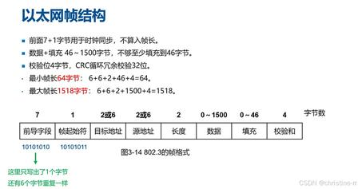

# 6.4 以太网、ARP、交换机与 VLAN

> 章级精读：[§6.4](../study.md#ch6-4) · **ARP 专节**：[#ch6-arp](../study.md#ch6-arp) · [TCP/IP ch04 ARP](../../tcpip_vol1_ed2_notes/03_network_layer/ch04_arp.md)

## 一、以太网（Ethernet）

> 帧与 IP 嵌套 → [§6.1 帧≠IP](../study.md#ch6-frame-vs-ip) · [帧结构图](../study.md#ch6-ethernet-frame)

- 目前局域网主流技术，基于 IEEE 802.3 / **Ethernet II**
- **Ethernet II 帧**（左→右）：前导 7 + SFD 1 + 目的/源 MAC 各 6 + 类型 2（`0x0800`=IPv4，**`0x0806`=ARP**）+ 数据 46–1500 + FCS 4
- **帧长**：最小 64B、最大 1518B（MTU **1500B**）
- 接收：**目的 MAC 匹配本口** → 验 FCS/帧长 → 剥帧上交网络层

---

## 二、ARP 地址解析协议

> 章级展开：[#ch6-arp](../study.md#ch6-arp)

### 基础定义

**ARP（Address Resolution Protocol）** 工作在**数据链路层与网络层之间**，核心：**把 IP 地址翻译成 MAC 地址**。

### 核心背景

| 层 | 地址 | 作用 |
|----|------|------|
| **网络层** | IP | 跨网段找到目标主机 |
| **链路层** | MAC | **局域网内**完成帧投递 |

同网段发数据前，必须知道对方 MAC → **ARP 完成转换**。

### 工作流程

1. 查本地 **ARP 缓存表**（IP↔MAC 映射）
2. **无记录** → 发 **ARP 广播请求**：「这个 IP 的 MAC 是什么？」
3. 网段内设备都收到，**仅 IP 匹配者** **单播应答** 自己的 MAC
4. 请求方写入缓存，后续直接用
5. 缓存有**老化时间**，过期后重新解析

### 报文格式（28 字节 + 以太网封装）

→ 完整表、请求/应答十六进制、Wireshark 树：[#ch6-arp-format](../study.md#ch6-arp-format)

| 要点 | 请求 | 应答 |
|------|------|------|
| 操作码 | `0001` | `0002` |
| 目标 MAC | **全 0** | 真实 MAC |
| 以太网目的 MAC | **广播** | 单播给请求方 |
| 帧类型 | **`0x0806`** | 同左 |

ARP **不是** IP 包；装在以太网帧 **Payload** 里。

### 关键附属机制

| 机制 | 说明 |
|------|------|
| **ARP 缓存** | 减广播；Windows `arp -a`，Linux `arp -n` |
| **免费 ARP** | 主动广播自身 IP-MAC；查 **IP 冲突**、刷新他机缓存 |
| **代理 ARP** | 路由器代应答；特殊跨子网「像同网段」场景 |
| **RARP** | MAC→IP；老旧无盘工作站（了解） |

### 常见问题与攻击

- **ARP 欺骗**：伪造应答，篡改他人缓存 → 流量劫持
- **IP 冲突**：多机同 IP → 解析混乱
- **防御**：**静态 ARP 绑定**（固定 IP-MAC）

### 简易举例

电脑 `192.168.1.10` 访问 `192.168.1.20`：

1. 查表无 `.20` 的 MAC  
2. **广播**询问  
3. `.20` **单播**回复 MAC  
4. 存缓存，封装以太网帧发送  

**跨子网**：IP 目的仍是远端主机，但帧的 **目的 MAC = 默认网关**（先 ARP 网关 IP）。

---

## 三、交换机（Switch）

- 数据链路层设备，按 **MAC** 转发帧
- **学习**源 MAC→端口 → **转发**到目的端口；未知则**泛洪**
- 隔离**冲突域**（相对 Hub），端口常全双工

## 四、VLAN 虚拟局域网

- 802.1Q 标签划分**广播域**
- **Access**：单 VLAN，出帧不带标签  
- **Trunk**：多 VLAN，帧带标签，交换机互联用

## 五、本节核心考点

- ARP 流程、缓存、请求/应答、广播/单播
- 同网段 vs 跨子网（网关 MAC）
- 交换机自学习、VLAN

## 六、个人学习心得与补充

> 可画带 VLAN 的组网图；`arp -a` 对照本机缓存
