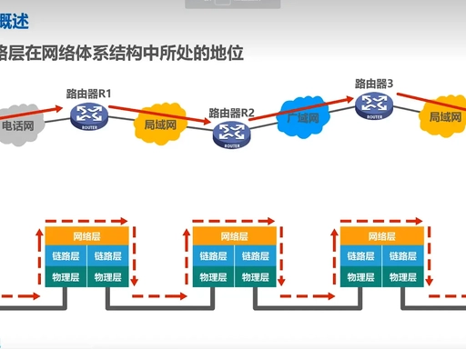
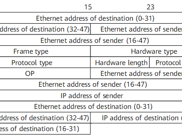
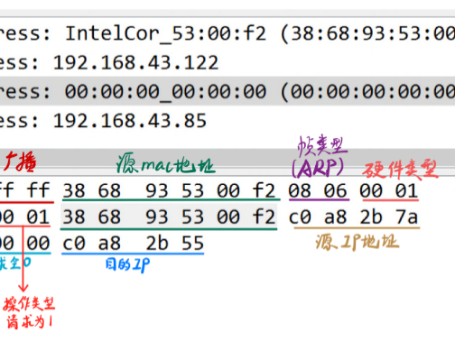

# 第6章：链路层和局域网

若说网络层提供连接全球的**逻辑蓝图**，链路层就是落地时的**砖瓦与焊接**：在每一段链路上以**帧**为单位传输，并通过交换与共享媒介访问，构建高性能局域网与数据中心网络。

---

<a id="ch6-1"></a>

## 6.1 链路层概述

网络层数据报在端到端路径上会经历多次**跳（Hop）**；每一跳都需将数据报封装为**链路层帧**，经适配器在特定链路上发送。

<a id="ch6-link-layer-hop"></a>



→ 小节背版：[6.1 链路层服务](./6.1_link_layer_service/study.md)（[通俗](./6.1_link_layer_service/study.md#ch6-1-simple) · [逐跳原理](../study.md#ch6-hop-ip-frame)）  
→ 数据平面逐跳实例：[第 4 章 · 一包怎么走](../04_network_layer_data_plane/study.md#ch4-packet-walkthrough)

<a id="ch6-hop-ip-frame"></a>

### 逐跳转发原理（最常考）

> **教材原句**：网络层数据报在端到端路径上会经历多次跳；每一跳都需将数据报封装为链路层帧，经适配器在特定链路上发送。

#### 1. 端到端是 IP 数据报，源/目 IP 全程不变

- 网络层 PDU = **IP 数据报（packet/datagram）**
- 源主机 → 多台路由器 → 目的主机：**源 IP、目的 IP 从头到尾不变**
- IP 负责 **端到端寻址**：我是谁、要去哪里

#### 2. 每一跳：解帧 → 路由 → 重封帧

**一跳** = 相邻两台设备之间的一段链路（主机–路由器、路由器–路由器）。

在**中间路由器**上固定五步：

| 步 | 层 | 做什么 |
|----|-----|--------|
| 1 | 物理 | 收比特流 → 链路层组帧 |
| 2 | 链路 | 验 FCS；目的 MAC 是否本口 → **剥帧头/尾**，IP 上交网络层 |
| 3 | 网络 | 读**目的 IP** → 查表 → **下一跳 IP + 出接口** |
| 4 | 链路 | **新帧**：出接口**源 MAC** + ARP 得**下一跳 MAC** + 原 IP 包 + 新 FCS |
| 5 | 物理 | 比特流发往下一跳 |

**结论**：每过一台路由器，**帧拆掉再打包**；**MAC 每跳变**，**IP 不变**。

#### 3. 极简示意图（主机 → R1 → R2 → 主机）

```text
                    IP 全程固定：192.168.1.100 ──────────────► 200.200.200.200
                    （内层 TCP 等也原样穿过路由器，此处省略）

  [主机]  ──跳1──►  [ R1 ]  ──跳2──►  [ R2 ]  ──跳3──►  [目的主机]
           帧①              帧②              帧③
  Dst MAC: R1_LAN    R2_WAN           服务器MAC
  Src MAC: 主机网卡   R1_WAN           R2_LAN
  载荷:     [ IP 包 ]  [ 同一 IP 包 ]   [ 同一 IP 包 ]

  适配器 NIC：每跳负责「比特流 ↔ 帧」；路由器内「上送网络层 / 再下封装」
```

| 视角 | 变不变 |
|------|--------|
| **源/目的 IP**（端到端） | **不变** |
| **源/目的 MAC**（本跳） | **每跳必换** |
| **帧** | **每跳重新封装** |

<a id="ch6-frame-vs-ip"></a>

### 核心结论：以太网帧 ≠ IP 数据报

> **以太网帧 ≠ IP 数据报**，二者是**封装嵌套**关系；链路层靠 **MAC** 识别本跳收不收，并用 **FCS** 等做差错校验。  
> 与 [第 4 章 TCP⊂IP⊂MAC](../04_network_layer_data_plane/study.md#ch4-encapsulation) 同一套嵌套，此处强调**链路层视角**。

#### 一、封装层级

| 单元 | 层 | 关系 |
|------|-----|------|
| **IP 数据报** | 网络层 | 端到端「货物」 |
| **以太网帧** | 链路层 | 本跳「箱子」 |

```text
┌─ 以太网帧（链路层）────────────────────┐
│ 帧头：目的MAC · 源MAC · 类型(如0x0800) │
│        ┌─ IP 数据报（网络层）────┐    │
│        │ 源IP · 目的IP · 载荷…   │    │
│        └─────────────────────────┘    │
│ 帧尾：FCS 校验                        │
└──────────────────────────────────────┘
```

- 嵌套：**以太网帧头 + IP 数据报 + 帧尾（FCS）**
- 口诀：**帧是箱子，IP 是箱内货物**

<a id="ch6-ethernet-frame"></a>

#### 以太网帧结构（Ethernet II · 从左到右 · 单位：字节）


> 抓包/WiFi 常见 **Ethernet II**（用**类型**字段）；教材 **802.3** 用**长度**字段 + 填充，最小帧规则相同。

| # | 字段 | 字节 | 要点 |
|---|------|------|------|
| 1 | **前导码 Preamble** | **7** | `10101010`… 同步时钟；**不计入** 64/1518 帧长 |
| 2 | **帧起始符 SFD** | **1** | `10101011` =「帧开始了」 |
| 3 | **目的 MAC** | **6** | 本跳接收方；链路层**先看这个** |
| 4 | **源 MAC** | **6** | 本跳发送方 |
| 5 | **类型 Type** | **2** | `0x0800` = 里面是 **IPv4 数据报**；`0x0806` = **ARP** |
| 6 | **数据 Payload** | **46–1500** | ⭐ **IP 数据报装在这里**（内可再套 TCP/UDP） |
| 7 | **FCS 校验** | **4** | **CRC**，帧损坏则丢弃 |

（802.3：第 5 字段为**长度**；数据不足 46B 时加 **Padding** 垫满。）

**一句话关系**

```text
以太网帧 = 帧头（MAC + 类型） + IP 数据报 + 帧尾（FCS）
```

| 谁 | 看什么 |
|----|--------|
| **交换机 / 网卡（链路层）** | 只认 **MAC** + FCS |
| **路由器（网络层）** | 剥帧头 → 取出 **IP 数据报** → 看 **目的 IP** |

**三层从外到内（一眼串起来）**

```text
┌─ Ethernet II 帧 ─────────────────────────────────────┐
│ DstMAC(6) SrcMAC(6) Type=0x0800(2)                  │
│   ┌─ IPv4 数据报 ─────────────────────────────┐    │
│   │ 源IP · 目的IP · TTL · 协议=6 …            │    │
│   │   ┌─ TCP 段 ──────────────────────┐      │    │
│   │   │ 端口 · Seq · Ack · 应用数据    │      │    │
│   │   └───────────────────────────────┘      │    │
│   └──────────────────────────────────────────┘    │
│ FCS(4)                                              │
└─────────────────────────────────────────────────────┘
```

→ 教材叠层图：[第 4 章 · TCP⊂IP⊂MAC](../04_network_layer_data_plane/study.md#ch4-encapsulation)  
→ 真实抓包树：[Wireshark Ethernet→IP→TCP](../04_network_layer_data_plane/study.md#ch4-encapsulation-wireshark)  
→ [IPv4 首部字段](../04_network_layer_data_plane/study.md#ch4-ipv4-header)

**帧长规则（背）**

| | 计算 |
|--|------|
| **最小帧** | 64 B = 6+6+2+**46**+4（不含前导 7 + SFD 1） |
| **最大帧** | 1518 B = 6+6+2+**1500**+4 → **MTU = 1500B** |
| 与 IP | 过大则 [分片/PMTUD](../04_network_layer_data_plane/study.md#ch4-3) |

#### 二、接收一帧时链路层做什么

**1. MAC 地址校验（先判收不收）**

- 帧头有**目的 MAC、源 MAC**
- 收到后比对**目的 MAC** 是否等于**本接口网卡 MAC**
  - **一致** → 收下，剥帧头/帧尾，把 **IP 数据报** 上交网络层
  - **不一致** → **直接丢弃**，不再向上处理
- 路由器：只认**入接口** MAC；转发后从出接口用**新 MAC** 再封帧

**2. 除 MAC 外的检查**

| 检查 | 作用 |
|------|------|
| **FCS** | 帧尾校验和，传输出错 → **丢帧** |
| **帧长** | 以太网规定合法长度区间，非法 → **丢帧** |

#### 三、主机 A → 主机 B（五步走）

1. 网络层组 **IP 数据报**（写源 IP、目的 IP）
2. 链路层把 IP 包塞进**以太网帧**（填 MAC、算 FCS）
3. 比特流送到下一跳
4. 下一跳：**比 MAC** → **验 FCS/帧长**
5. 无误 → **拆帧**，取出 IP 包继续（主机交付或路由器再路由）

#### 四、易混区分

| | IP | MAC | 以太网帧 |
|--|-----|-----|----------|
| 作用 | 端到端定位 | **本跳**相邻设备识别 | 本跳传输容器 |
| 是否每跳变 | **不变** | **每过路由器换** | **每跳重新封装** |
| 帧里还能装啥 | — | — | 除 IP 外还可装 **ARP** 等（类型字段区分） |

### 6.1.1 链路层提供的服务

- **成帧（Framing）**：将网络层数据报封装入帧并加控制字段。  
- **链路接入**：**MAC** 协议规定共享链路上的发送规则。  
- **可靠交付**：在易错链路（如部分无线链路）上可通过重传提高帧级完整性（依技术而定）。  
- **差错检测与流控**：检测比特差错，并协调收发速率。

### 链路层可靠 vs TCP 可靠（对比）

| 维度 | 链路层可靠性 | 运输层（TCP）可靠性 |
|------|----------------|---------------------|
| 范围 | 常理解为**逐跳**能力 | **端到端** |
| 动机 | 降低高误码链路上的重传代价（局部） | 弥补 IP 尽力而为，保证字节流语义（全局） |
| 实现侧重 | 常靠近硬件、低时延处理物理差错 | 窗口、重传、拥塞控制等端上协议栈 |

### 6.1.2 链路层在何处实现

核心逻辑多在**网络适配器（NIC）**中以硬件/固件实现，与物理层紧密协同。

**So What?** 链路与物理媒介的解耦，使同一主机栈可运行于以太网、Wi‑Fi、光纤等不同链路之上；升级网卡速率通常**无需**改动应用代码。

---

<a id="ch6-2"></a>

## 6.2 差错检测和纠正技术

物理信道存在干扰，需在**检测强度**与**计算/硬件成本**间权衡。

### 6.2.1 奇偶校验与检验和

- **奇偶校验**：一维仅能检单比特错误；二维可纠单比特，对长突发差错能力有限。  
- **检验和（Checksum）**：TCP/UDP 常用，偏软件实现友好；链路层常更强地依赖 **CRC**。

### 6.2.2 循环冗余校验（CRC）

CRC 是以太网等链路硬件的常见选择：用**生成多项式 G** 构造冗余位，使接收端做模 2 除法余数为 0 则大概率无错。

**示例（教学推导）**：设数据字 **D = 101110**，**G = 1001**（阶 **r = 3**）。

1. **D 后补 r 个 0**：`101110000`  
2. **模 2 除**（异或移位）：得余数 **R = 011**（与手算一致时）。  
3. **发送**：`101110011`（数据与余数拼接）。接收方用 **G** 整除，余数为 0 则通过检测。

**评价**：CRC 易用移位寄存器硬件实现，以较少冗余（如 CRC‑32）对随机/突发差错提供极强检测能力；纠错通常交给上层或重传。

---

<a id="ch6-3"></a>

## 6.3 多路访问链路和协议

广播/共享信道上多站竞争同一媒介，若无协调会产生**碰撞**。MAC 协议即「**交谈礼仪**」。

### 6.3.1 协议分类与 DOCSIS 直觉

- **信道划分（TDM/FDM/CDMA 等）**：静态分割，低碰撞；轻载时可能浪费。  
- **随机接入（CSMA/CD、CSMA/CA）**：轻载时延迟低；重载时冲突与退避增加。经典以太网曾用 **CSMA/CD**；**802.11** 常用 **CSMA/CA** 配合 ACK 等。  
- **DOCSIS（示意）**：电缆接入常在下行/上行用 **FDM** 分频道，上行结合**时隙**与随机接入以承载大量突发用户。

**性能直觉**：轻载随机接入快；重载或工业确定性场景倾向**预约/划分**类机制。

<a id="ch6-csma"></a>

### CSMA/CD 与 CSMA/CA（专节）

解决多设备**抢同一信道**发数据：二者都是 **MAC 子层**经典协议。

#### CSMA/CD — 载波监听 / **冲突检测**

- **场景**：传统**有线以太网**
- **流程**：① 发前**监听**信道 ② **边发边听** ③ 判碰撞 ④ **停发**+干扰信号 ⑤ **随机退避**重试
- **特点**：靠有线电气信号**检测**冲突；**检测**到了再处理

#### CSMA/CA — 载波监听 / **冲突避免**

- **场景**：**无线 WiFi**
- **流程**：① 监听 ② 空闲仍**随机等待** ③ **RTS/CTS** 预约 ④ **ACK** 确认
- **特点**：无线难边发边检；**提前避让**，尽量别撞

| 对比 | CSMA/CD | CSMA/CA |
|------|---------|---------|
| 介质 | 有线 | 无线 |
| 策略 | **Detection** 检测 | **Avoidance** 避免 |
| 关键词 | 边发边检、退避 | DIFS、RTS/CTS、ACK |

**工程补充**：早期 **Hub** 全网共享碰撞域 → 靠 CSMA/CD；**交换机**端口隔离 + 全双工 → 冲突大减，原理仍常考。

→ 小节背版：[6.3 MAC 协议](./6.3_mac_protocol/study.md) · WiFi：[7.1](./7.1_wifi_802_11/study.md)

---

<a id="ch6-4"></a>

## 6.4 交换局域网

从 **Hub** 的共享碰撞域，演进到**交换机**提供的**端口级隔离**与更高并发。

### 6.4.1 链路层寻址与 ARP

- **MAC**：平面、链路层寻址；**IP**：层次化、网络层寻址。  
- **跨子网通信（必记）**：主机 A 访问**不同子网**的 B 时，IP 目的为 **B**，但以太网帧的目的 MAC 常为**默认网关**的 MAC；由路由器继续转发。

<a id="ch6-arp"></a>

#### ARP 地址解析协议（专节）

**全称**：Address Resolution Protocol · 工作在**链路层与网络层之间**  
**作用**：**IP 地址 → MAC 地址**（同网段发帧前必做）

| 层 | 用什么 |
|----|--------|
| 网络层 | **IP** 跨网段寻路 |
| 链路层 | **MAC** 局域网内投递帧 |

**工作流程**

1. 查本地 **ARP 缓存**
2. 无记录 → **ARP 广播请求**（谁有这个 IP 的 MAC？）
3. 仅 IP 匹配主机 **单播应答**
4. 写入缓存，后续直接用
5. 条目**老化**后需重新解析

<a id="ch6-arp-format"></a>

**ARP 报文完整格式（固定 28 字节）**

 · 

| 字段 | 字节 | 含义 |
|------|------|------|
| 硬件类型 | 2 | 以太网 `0x0001` |
| 协议类型 | 2 | IPv4 `0x0800` |
| 硬件地址长度 | 1 | MAC = `6` |
| 协议地址长度 | 1 | IPv4 = `4` |
| **操作码** | 2 | **1=请求，2=应答** |
| 发送端 MAC | 6 | 发起方物理地址 |
| 发送端 IP | 4 | 发起方 IP |
| 目标 MAC | 6 | 请求填 **全 0**；应答填真实 MAC |
| 目标 IP | 4 | 要解析的 IP |

**外层以太网帧**（ARP 自身无帧头尾，靠以太网运送）

```text
以太网帧头：目的MAC | 源MAC | 类型 0x0806(ARP)
────────────────────
ARP 28 字节
────────────────────
FCS 4 字节
```

请求时以太网**目的 MAC = 广播** `ff:ff:ff:ff:ff:ff`；类型 **`0x0806`** 告诉交换机里面是 ARP。

**ARP 请求示例**（`192.168.1.10` 问 `192.168.1.20` 的 MAC）

```text
0001 0800 0604 0001
c83a352211aa
c0a8010a                    ← 192.168.1.10
000000000000                ← 目标 MAC 未知
c0a80114                    ← 192.168.1.20
```

| 片段 | 含义 |
|------|------|
| `0001` | 硬件类型 以太网 |
| `0800` | 协议 IPv4 |
| `06` / `04` | MAC 长 6 / IP 长 4 |
| `0001` | **ARP 请求** |
| `c83a…` | 本机 MAC |
| `c0a8010a` | 本机 IP |
| 全 0 MAC | 还不知道对方 |
| `c0a80114` | 待解析 IP |

**ARP 应答示例**

```text
0001 0800 0604 0002          ← 0002 = 应答
d47e895522bb                 ← 响应方 MAC（.20）
c0a80114
c83a352211aa                 ← 填回请求方 MAC
c0a8010a                     ← 请求方 IP
```

**Wireshark 展开样式**

```text
Address Resolution Protocol (request)
    Hardware type: Ethernet (1)
    Protocol type: IPv4 (0x0800)
    Opcode: request (1)
    Sender MAC: c8:3a:35:22:11:aa
    Sender IP: 192.168.1.10
    Target MAC: 00:00:00:00:00:00
    Target IP: 192.168.1.20

Address Resolution Protocol (reply)
    Opcode: reply (2)
    Sender MAC: d4:7e:89:55:22:bb    ← .20 的 MAC
    Sender IP: 192.168.1.20
    Target MAC: c8:3a:35:22:11:aa     ← 回给 .10
    Target IP: 192.168.1.10
```

| 机制 | 用途 |
|------|------|
| **ARP 缓存** | 减广播；`arp -a` / `arp -n` |
| **免费 ARP** | 主动广播自身映射；查 **IP 冲突**、刷新缓存 |
| **代理 ARP** | 路由器代答，特殊跨子网场景 |
| **RARP** | MAC→IP（老旧无盘，了解即可） |

**安全**：**ARP 欺骗**（伪造应答改缓存）→ 可 **静态 ARP 绑定** 防御

**举例**：`192.168.1.10` 访问 `192.168.1.20` → 缓存无 → 广播问 MAC → `.20` 单播回复 → 存表 → 封装帧发送

→ 背版：[6.4 小节](./6.4_ethernet_arp_switch_vlan/study.md) · 精读：[TCP/IP ch04 ARP](../../tcpip_vol1_ed2_notes/03_network_layer/ch04_arp.md) · [逐跳转发 ARP](../../04_network_layer_data_plane/study.md#ch4-packet-walkthrough)

### 6.4.2 交换机自学习

交换机根据入帧**源 MAC** 学习 **MAC→端口** 映射；未知目的则**泛洪**，已知则**单播**到对应端口。

| 步骤 | 事件 | 转发表（示意） |
|------|------|----------------|
| 1 | 初始 | 空 |
| 2 | A 从 Port1 发往 B | 泛洪；记录 A→Port1 |
| 3 | B 从 Port2 回 A | 单播到 Port1；记录 B→Port2 |

### 6.4.3 虚拟局域网（VLAN）

**802.1Q** 标签在逻辑上划分**广播域**，同一物理交换机上不同 VLAN 默认二层隔离，利于安全与广播范围控制。

---

<a id="ch6-5"></a>

## 6.5 链路虚拟化：MPLS

**MPLS** 在链路首部插入**短标签**，由标签交换路径（LSP）转发，转发平面可做**快速匹配**并与 IP 路由协同。

- **标签分发**：如 **LDP** 等在路由器间建立标签绑定。  
- **工程价值**：**流量工程（TE）**、绕开拥塞最短路径、**快速重路由（FRR）** 等运营商级能力。

---

<a id="ch6-6"></a>

## 6.6 数据中心网络

数据中心流量以**东西向**（服务器间）为主，对**无阻塞或高二分带宽**要求高。

- **传统分层树**：顶层易出现带宽瓶颈。  
- **Leaf‑Spine（叶脊）**：叶交换机与多台脊全连接，配合 **ECMP** 做多路径负载。  
- **设计目标**：高 **bisection bandwidth**、低时延、可扩展机柜/pod。

---

<a id="ch6-7"></a>

## 6.7 回顾：Web 页面请求的历程（微观串联）

1. **接入**：如 **DHCP** 获取地址；UDP 报文封装在以太网帧中发送。  
2. **DNS**：ARP 解析**网关 MAC**，DNS 查询经局域网到解析器再到权威（多跳）。  
3. **逐跳转发**：每跳解链路头、查 **IP**、再封装为下一段链路格式（以太网、PPPoE、**MPLS** 标签栈等）。  
4. **TCP + HTTP**：三次握手建连，HTTP 请求/响应在字节流上传输。

---

<a id="ch6-8"></a>

## 6.8 本章总结与最佳实践

1. **VLAN 与广播域**：控制广播范围；常见实践以**/24** 等为参考规模（具体依业务与组播策略而定）。  
2. **防环**：经典二层交换以太网依赖 **STP/RSTP** 等打破环路；**叶脊 + 三层路由 + ECMP** 的数据中心架构常**减少对二层 STP 的依赖**，避免 STP 阻塞上行带宽——「必须 STP」主要适用于**存在二层环路风险**的传统接入/汇聚设计。  
3. **链路聚合**：**LACP**（IEEE **802.1AX**，常口语称 802.3ad）捆绑多端口，提高带宽与冗余。

### 新手易错 Q&A

- **交换机 vs 路由器？**  
  - 交换机：主要基于 **MAC** 在二层转发（同广播域内学习/泛洪）；「即插即用」指二层自学习。  
  - 路由器：基于 **IP** 做三层转发与策略（ACL、NAT、BGP 等），连接不同子网。  

- **局域网内知道 IP 就够吗？**  
  - 在以太网上仍需 **MAC** 交付；**ARP**（或 IPv6 **ND**）把「下一跳 IP」解析为「下一跳 MAC」，是二三层黏合的关键步骤之一。

---

*本笔记整理自精读材料，可与教材第 6 章对照阅读。*
