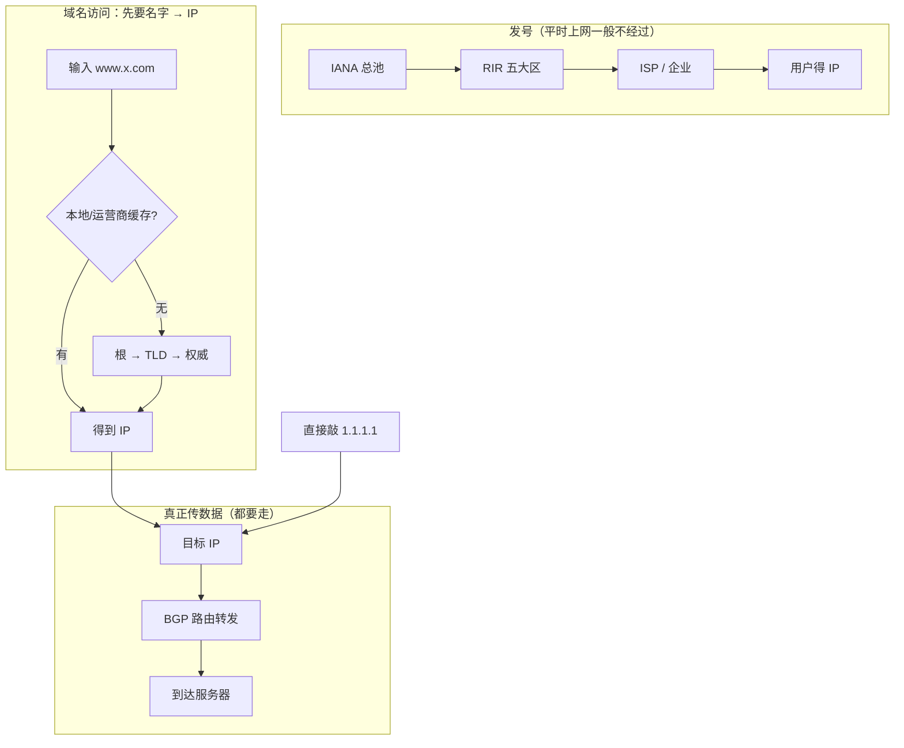

# 2.6 分配

> 章级精读：[../study.md#ch02-6](../study.md#ch02-6) · 站点规划：[2.7](./2.7-unicast-allocation.md)

## 本节核心目标

掌握 **全球 IP 空间的层级分配体系**、**和 DNS 的异同**（结构像、访问时不一样），以及 **WHOIS/RDAP 溯源**。

---

<a id="ch02-6-chain"></a>

## 一、层级结构（必考 · 记死这条链）

```text
IANA（全球池）→ RIR（5 大区域）→ LIR/ISP/大企业 → 终端用户/站点前缀
```

### 1）IANA（Internet Assigned Numbers Authority）

| 项 | 说明 |
|----|------|
| 角色 | 全球**顶级地址管家**（ICANN 运营） |
| 职责 | 管理 IPv4/IPv6 **总池**；分给 **5 个 RIR**（**不直接给 ISP/用户**）；兼管 AS 号、DNS 根、协议端口 |
| 粒度 | IPv4 典型 **`/8`**；IPv6 典型 **`/12` 或 `/23`** 等超大块 |

### 2）五大 RIR（Regional Internet Registry）

| 缩写 | 负责区域 | 备注 |
|------|----------|------|
| **APNIC** | **亚太**（中国、日本、韩国、澳洲等） | **中国 IP 查 APNIC** |
| **ARIN** | 北美（美、加等） | |
| **RIPE NCC** | 欧洲、中东、中亚 | |
| **LACNIC** | 拉美、加勒比 | |
| **AFRINIC** | 非洲 | |

### 3）LIR / ISP / 大型企业

- **LIR（Local Internet Registry）**：本地注册机构，多为 **ISP 或大企业**。
- 从 RIR 拿块，再分给：下游小 ISP、企业/机房、家庭用户（IPv4 常经 **NAT**）。

### 4）终端用户或站点前缀

- 企业/家庭：公网前缀（IPv6 常见 **`/56`、`/64`**）或内网 + NAT（IPv4）。
- **公网 IP 必须层层分配 → 全球唯一、不重叠**。

---

<a id="ch02-6-vs-dns"></a>

## 二、IANA 发 IP vs DNS 域名（大白话）

> **IP 分配体系 = DNS 域名体系：层级结构一模一样，都是从上往下分。**  
> **但「平时上网访问」时，走的完全不是一条路。**

### 1）结构对比：都是「总管家 → 大区 → 下面一层层分」

| | **IP 地址（IANA 体系）** | **DNS 域名** |
|---|--------------------------|--------------|
| 总管家 | **IANA**（全球 IP 总池） | **根服务器**（13 组逻辑根 A–M） |
| 下一层 | **5 个 RIR**（APNIC 等） | **顶级域**（`.com`、`.cn` …） |
| 再往下 | **ISP / 大企业（LIR）** | **二级域**（`baidu.com`） |
| 最底 | **用户 / 站点** | **具体主机**（`www.baidu.com`） |

```text
IP：  IANA → RIR → ISP → 用户
DNS： 根   → TLD → 权威 → 网站
```

→ DNS 细节：[自顶向下 §2.4 DNS](../../top_down/02_application_layer/2.4_dns_service/study.md)

### 2）访问时完全不一样（最易混）

#### 用 IP 直接访问（如 `1.1.1.1`）

- **全程不经过 IANA、不经过 RIR、不查 DNS 根**
- IANA 只管**地址怎么发出去**，**不管数据包怎么跑**
- 数据靠 **BGP 路由** 在运营商线路里一层层转发 → [2.4 CIDR+BGP](./2.4-cidr-aggregation.md#ch02-4-bgp)

**一句话：IANA 只管发 IP，不管传数据。**

#### 用域名访问（如 `www.baidu.com`）

1. **先 DNS 解析**：本地缓存 → 递归 DNS → 根 → `.com` → 百度权威 → **拿到 IP**
2. **再按 IP 走 BGP 路由** 访问（这一步和「直接敲 IP」一样）

### 3）根服务器每天这么多查询，会崩吗？

**一般不会**，三个原因：

| 原因 | 大白话 |
|------|--------|
| **多镜像** | 13 组逻辑根（A–M），全球**大量镜像**，流量分散 |
| **缓存** | 电脑、路由器、运营商 DNS **解析完会缓存**；绝大多数请求**到不了根** |
| **只指路** | 根只告诉你「`.com` 去问谁」，**不存网页内容**，负载很轻 |

### 4）极简流程图



### 5）五句逻辑（直接抄笔记）

1. **IANA 分配 IP**：从上到下发地址，只管**归属**，不管数据包怎么走。  
2. **DNS 解析域名**：根服务器从上到下**指路**，把域名翻译成 IP。  
3. **IP 访问**：直接 **BGP 路由**，全程**不经过** IANA、DNS 根。  
4. **域名访问**：先 **DNS**（可能查到根）→ 得 IP → 再 **BGP**。  
5. 根服务器不易崩：**多镜像 + 缓存 + 只指路不存内容**。

---

<a id="ch02-6-whois"></a>

## 三、WHOIS / RDAP 溯源

### WHOIS vs RDAP

| | WHOIS | RDAP |
|---|--------|------|
| 协议 | 传统，**TCP 43** | 现代（RFC 7480），**HTTPS + JSON** |
| 格式 | 文本，**各 RIR 不统一** | **结构化、统一、Unicode** |
| 现状 | 仍可用 | **五大 RIR 均支持，优先 RDAP** |

### 能查什么（溯源三要素）

1. **前缀归属**：网段 → 哪个组织/ISP、国家、联系人  
2. **滥用投诉**：**abuse** 邮箱（垃圾/攻击溯源）  
3. **路由溯源（BGP）**：由哪个 **AS** 宣告、是否在全球路由表、上游 ISP  

### 考试常考结论

> **分得地址块 ≠ 自动全网可达**  
> 还须 ISP 向上游 **aggregate（聚合）并 announce（BGP 宣告）**，路由才扩散到全球。

### 查询示例

```bash
# WHOIS（传统）
whois 203.0.113.0

# RDAP（推荐，JSON）
curl https://rdap.apnic.net/ip/203.0.113.0
```

→ CIDR 聚合 + BGP 大白话：[2.4 §三](./2.4-cidr-aggregation.md#ch02-4-bgp) · 控制平面详解：[§5.3](../../top_down/05_network_layer_control_plane/5.3_bgp_inter_as_routing/study.md)

---

<a id="ch02-6-exam"></a>

## 四、30 秒写卷子

**层级**  
**IANA → RIR（APNIC/ARIN/RIPE/LACNIC/AFRINIC）→ LIR/ISP → 用户**。IANA **只分大块给 RIR**；APNIC 管**亚太含中国**。

**IANA vs DNS**  
结构同：自上而下分 · 访问异：**IP 直接 BGP**；**域名先 DNS 再 BGP**；IANA/根**不管传包**

**WHOIS/RDAP**  
查**归属、abuse、Origin ASN/路由**；**RDAP** 优先（JSON）。**有地址还要 BGP 宣告才全球可达**。

---

## 五、自测（3 题）

1. 中国运营商拿到的 IPv4 块最初从谁分给 RIR？RIR 是？  
2. 企业从 ISP 领到 `/24` 后，为何外网仍可能 ping 不通？  
3. 访问 `8.8.8.8` 要不要先问 DNS 根？访问 `www.google.com` 呢？

<details>
<summary>答案</summary>

1. **IANA** 分给 **APNIC**（亚太 RIR），再由 APNIC 分给 ISP（LIR）。  
2. 可能 **未在上游 BGP 宣告**、防火墙、或仅内网/NAT 未映射；**分配 ≠ 路由可达**。  
3. **8.8.8.8**：**不要**（已是 IP，直接路由）。**www.google.com**：先要 **DNS 解析**（通常命中缓存，很少真打到根），得到 IP 后再路由。

</details>

---

## 与下一节关系

- **2.6**：**谁发号**（全球层级 + 溯源）  
- **2.7**：**站点怎么用号**（家庭/企业/多宿主、PI）→ [2.7](./2.7-unicast-allocation.md)

---

## 个人学习总结

（待填）
