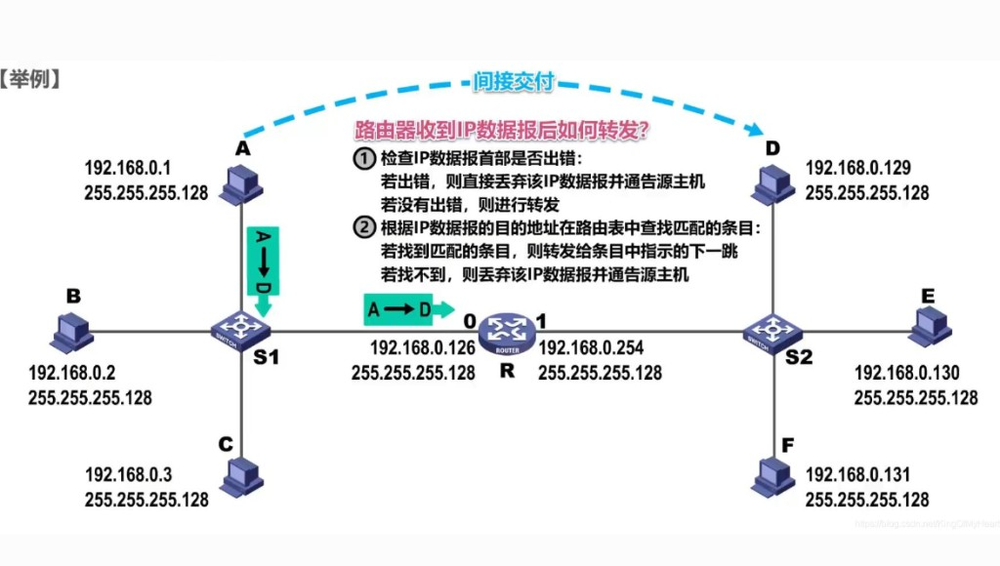

# 4.2 一个例子（直接交付与间接交付）

> 章级精读：[../study.md#ch04-2](../study.md#ch04-2) · 自顶向下：[§6.4 / §6.7](../../../top_down/06_link_layer_and_lan/study.md#ch6-4) · 抓包对照：[4.5](./4.5-arp-tcpdump-example.md) · Wireshark：[§7.1 ARP](../../../wireshark-packet-analysis/chapter-07-network-layer-proto/01-arp-protocol.md)

## 本节核心目标

区分 **直接交付**（同子网）与 **间接交付**（跨子网）；理解**每台设备 ARP 表不同**、**路由表 + ARP 表**如何定下一跳；掌握帧中 MAC 与 IP 各变什么。

---

<a id="ch04-2-per-device"></a>

## 零、每台设备的 ARP 表都不一样（先建立直觉）

**你的理解对：** 手机、电脑、路由器、交换机（三层）**各自有一份独立的 ARP 表**，内容**互不相同**。

| 要点 | 说明 |
|------|------|
| **ARP 表干什么** | 查「**本机当前这一跳**要发给谁的 MAC」 |
| **每台只关心直连下一跳** | 只解析**本机所在广播域/直连网段**里的 IP→MAC |
| **不会** | 跨网段去 ARP **远端主机**的 MAC |

### 多跳例子（表里各记各的）

链路：`手机 → R1 → R2 → 服务器`

| 设备 | 典型 IP | 本机 ARP 表里常见条目（示意） |
|------|---------|------------------------------|
| **手机** | 192.168.1.10 | `192.168.1.1`（网关 R1 内网口）→ **R1 内网 MAC** |
| **路由器 R1** | 内网 .1 / 外网 10.0.1.1 | `10.0.1.2`（下一跳 R2）→ **R2 对接口 MAC** |
| **路由器 R2** | 10.0.1.2 | `172.16.1.10`（服务器）→ **服务器 MAC** |

**一句**：大家 ARP 表不同，因为**每一跳要解析的「下一跳 IP」不同**。

---

<a id="ch04-2-route-arp"></a>

## 零附、怎么知道下一跳？路由表 + ARP 表

**两步配合，缺一不可：**

```text
路由表 → 算出「下一跳 IP」+ 从哪个网口出
ARP 表 → 把「下一跳 IP」翻译成「下一跳 MAC」
```

### 1）先查路由表（定「下一跳 IP」）

路由表 = 设备的**指路地图**。对**目标 IP** 匹配后得到：

- 从**哪个接口**出去  
- **下一跳设备的 IP**（或直连网段则下一跳就是目的主机本身）

| 场景 | 路由表结论 | 下一跳 IP 是谁 |
|------|------------|----------------|
| **同网段**（手机 ↔ 同 Wi‑Fi 电脑） | 目的与本机同一前缀 | **目标主机 IP** → ARP **直接问对方** |
| **跨网段**（手机 ↔ 外网服务器） | 目的不在本地 | **默认网关 IP** → ARP **只问网关** |
| **多级路由**（R1→R2） | R1 表里：去 `172.16.1.0/24` 经 `10.0.1.2` | R1 的下一跳 IP = **`10.0.1.2`（R2）** |

→ 路由基础：[ch05](../chapter05-ip-protocol/study.md)

### 2）再查 ARP 表（把下一跳 IP → MAC）

拿到路由表给出的**下一跳 IP** 后：

| ARP 缓存 | 动作 |
|----------|------|
| **命中** | 用缓存 MAC 封装以太网帧并发送 |
| **未命中** | 发 **ARP 广播** 问该 IP 的 MAC → 收应答 → **写入缓存** → 再发 IP 包 |

---

<a id="ch04-2-end-to-end"></a>

## 零附二、串一遍：手机访问远端服务器

**手机** `192.168.1.10` 访问 **服务器** `172.16.1.10`（经 R1、R2）

| 步 | 谁 | 做什么 |
|----|-----|--------|
| 1 | **手机** | 查**路由表**：跨网段 → 下一跳 = 网关 `192.168.1.1` |
| 2 | **手机** | 查 **ARP**：无网关 MAC → **ARP 广播**问 `192.168.1.1` |
| 3 | **R1** | ARP 应答；手机写入 ARP 表 |
| 4 | **手机** | 封装帧：**目的 MAC = R1**，**IP 目的仍 = 服务器** |
| 5 | **R1** | 剥 MAC → 查**路由表**：去 `172.16.1.0/24` 下一跳 `10.0.1.2` |
| 6 | **R1** | 查 **ARP** 得 R2 的 MAC → 转发（**改 MAC，IP 不变**） |
| 7 | **R2** | 同理 → 最终 **ARP 服务器 MAC** → 送达 |

### 关键小结（背）

1. 每台设备**独立 ARP 表**，只和**自己的直连邻居/下一跳**有关。  
2. **先路由表**（下一跳 **IP**）→ **再 ARP**（下一跳 **MAC**）。  
3. ARP **只解析直连网段**；跨网段**不**解析远端主机 MAC。→ 为何？[§零附三](#ch04-2-broadcast-boundary)

---

<a id="ch04-2-broadcast-boundary"></a>

## 零附三、ARP 只在同广播域：结论 + 两场景

### 先定结论

| # | 结论 |
|---|------|
| 1 | **ARP 仅 IPv4 + 同一广播域（同局域网）**；请求/应答是**二层广播**，**路由器不转发广播** → ARP **出不了当前网段** |
| 2 | 目标 IP **不在**本机局域网 → **不对远端 IP 发 ARP**，包交给**边缘路由器（网关）**转发 |

→ 与 [3.10 ARP 仅 LAN](../chapter03-link-layer/3.10-link-layer-security.md#ch03-10-arp-lan) 一致

### 场景 1：同网段（同广播域）

**例**：本机 `192.168.1.10` → 目标 `192.168.1.20`

| 步 | 动作 |
|----|------|
| 1 | **路由表**：同网段 → 下一跳 = **目标主机 IP** |
| 2 | **ARP 广播**问 `192.168.1.20` 的 MAC |
| 3 | 对方应答 → **二层直达**，**不经过路由器** |

→ 下文 [§一 直接交付](#ch04-2-direct)

### 场景 2：跨网段（不同广播域）

**例**：本机 `192.168.1.10` → 外网 `220.181.x.x`

| 步 | 动作 |
|----|------|
| 1 | **路由表**：跨网段 → 交给**默认网关** |
| 2 | **不会**对外网 IP 发 ARP；只 **ARP 网关 IP** → 得网关 MAC |
| 3 | 帧发给网关；**IP 目的仍是外网**；网关再按自己的路由表转发 |

→ 下文 [§二 间接交付](#ch04-2-indirect)

### 补充：路由器 = 广播域边界

| 点 | 说明 |
|----|------|
| **隔离广播** | 内网 ARP 广播到**路由器端口**即被挡住，**不会**漏到外网/别的 LAN |
| **多级路由** | 每一跳重复：**路由表定下一跳 IP** → **本端口所在广播域内 ARP** → 转发；ARP **始终只在当前直连段** |

### 一句话速记

> **跨网段 IP 不直接 ARP，全部先找网关；ARP 广播出不了当前局域网，路由器是广播域边界。**

---

## 拓扑示例（掩码 255.255.255.128，/25）

| 子网 | 网络号 | 主机 | 路由器接口 |
|------|--------|------|------------|
| 左 | `192.168.0.0/25` | A `.1`、B `.2`、C `.3` | R 接口 0 **`.126`**（左网网关） |
| 右 | `192.168.0.128/25` | D `.129`、E `.130`、F `.131` | R 接口 1 **`.254`**（右网网关） |

```text
判定：源IP & 掩码 = 源网络号；目的IP & 掩码 = 目的网络号
  · 两网络号相同 → 直接交付
  · 不同         → 间接交付
```

例：**A（.1）→ C（.3）** 同网 → 直接；**A（.1）→ D（.129）** 异网 → 间接。

---

<a id="ch04-2-direct"></a>

## 一、直接交付（同子网 / 同网段）

**核心**：源与目的在**同一 IP 前缀**，**不经过网关/路由器**，二层直达。


### 判定

- 源网络号 = 目的网络号 → **直接交付**

### 流程（ARP + 以太网）

1. 源主机查路由表：目的 IP 在**本地子网**。
2. 查本地 **ARP 缓存**：有无「目的 IP → MAC」。
3. 无则发 **ARP 广播**：「谁是 x.x.x.x？请回复 MAC」。
4. 目的主机 **ARP 单播应答**，带回自身 MAC。
5. 封装帧：**源 MAC = 本机，目的 MAC = 目标主机**；**IP 头源/目的 IP 不变**。
6. 交换机按 MAC **单播**转发，直达目标。

---

<a id="ch04-2-indirect"></a>

## 二、间接交付（跨子网 / 跨网段）

**核心**：源与目的**不在同一子网**，须经**默认网关 / 路由器**中转，**逐跳**转发。



### 判定

- 源网络号 ≠ 目的网络号 → **间接交付**

### 流程（ARP 网关 + 路由转发）

1. 源主机查路由表：目的不在本地子网 → 匹配**默认路由（网关）**。
2. **ARP 解析的是默认网关的 MAC**（不是目标主机 MAC）。
3. 封装帧：**源 MAC = 本机，目的 MAC = 网关**；**IP 头源/目的 IP 仍为目标主机 IP**（不变）。
4. 网关收帧：剥二层 → 查路由表 → 定下一跳。
5. **每一跳**：**MAC 重写**（源 = 本跳出接口 MAC，目的 = 下一跳 MAC）；**IP 全程不变**。
6. **最后一跳**：目的在路由器**直连子网** → 转为**直接交付**，ARP 解析目标主机 MAC 后送达。

### 路由器收到 IP 包后（图中文字）

1. **检查 IP 首部**有错 → 丢弃并通知源；无错则继续。
2. **查路由表**匹配目的 IP → 有则按表项**下一跳**转发；无则丢弃并通知源。

---

## 三、关键对比（一眼分清）

| 项目 | 直接交付（同子网） | 间接交付（跨子网） |
|------|-------------------|-------------------|
| 路径 | 源 → 目的（**无网关**） | 源 → 网关 → … → 目的 |
| **ARP 对象** | **目标主机** IP → MAC | **网关** IP → MAC |
| 帧**目的 MAC** | 目标主机 MAC | 网关 / 下一跳 MAC |
| **IP 头** | 源/目的 IP **不变** | 源/目的 IP **全程不变** |
| 典型场景 | 同办公室互传文件 | 访问外网（跨网段） |

---

## 四、一句话总结

- **ARP 只在本广播域**；路由器**挡广播** → [§零附三](#ch04-2-broadcast-boundary)  
- **每台设备 ARP 表不同**；**路由表定下一跳 IP，ARP 定下一跳 MAC**。  
- **同子网**：ARP **目标主机** MAC，二层直达。  
- **跨子网**：**不 ARP 远端**；只 ARP **网关/下一跳**；路由器**逐跳改 MAC、IP 不变**。

---

## 抓包验证

| 场景 | 看什么 | 工具 |
|------|--------|------|
| 同子网 ping 邻居 | ARP 问的是**邻居 IP**；以太网目的 MAC = **邻居 MAC** | `tcpdump -i eth0 arp` 或 Wireshark 过滤器 `arp` |
| 跨子网 ping 外网 | ARP 问的是**网关 IP**；以太网目的 MAC = **网关 MAC**；IP 目的仍是远端 | 先 `arp` 再 `icmp`；对照 [4.5](./4.5-arp-tcpdump-example.md)、[Wireshark §7.1](../../../wireshark-packet-analysis/chapter-07-network-layer-proto/01-arp-protocol.md) |

**易错**：跨子网时 **IP 目的地址始终是最终主机**，但**链路层目的 MAC 第一跳永远是网关**。
