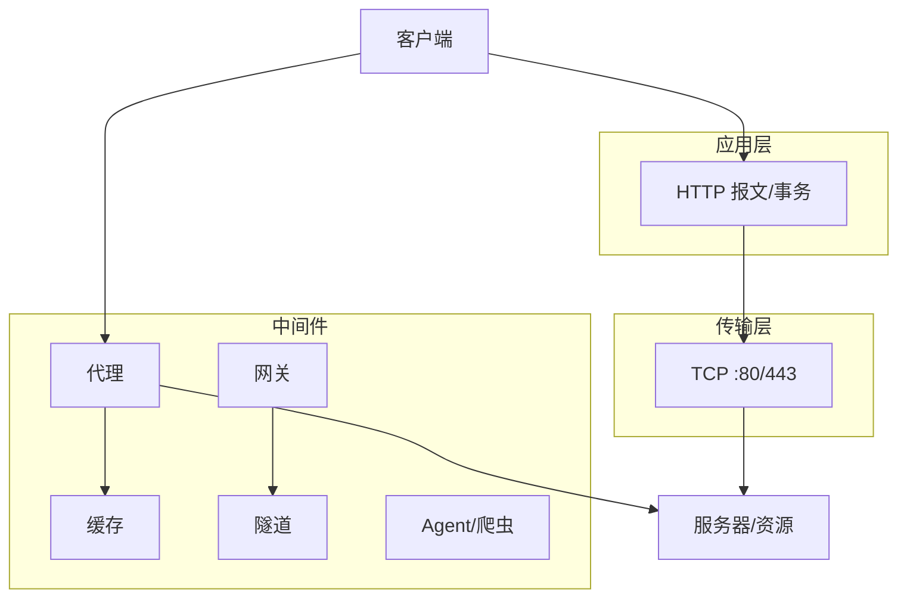

# 第1章 HTTP概述

> 全书：[../README.md](../README.md) · 下一章：[ch02 URL与资源](../chapter-02-url-and-resource/chapter-summary.md)

## 本章概述

HTTP 是万维网上的**应用层协议**：浏览器等**客户端**用**报文**向**服务器**要**资源**（URI 定位、MIME 描述），事务由**方法**与**状态码**表达结果，底下靠 **TCP/IP** 传输；除源站外还有**代理、缓存、网关、隧道、爬虫**等组件。全书以 **HTTP/1.1** 为主线。

---

## 知识框架

| 节 | 关键词 |
|----|--------|
|  **1.1** | 多媒体信使、可靠（TCP） |
|  **1.2** | C/S、请求/响应 |
|  **1.3** | 资源、MIME、URI/URL/URN |
|  **1.4** | 事务、GET/POST、状态码、多对象页面 |
|  **1.5** | 起始行、首部、空行、body |
|  **1.6** | DNS、端口 80、七步骤、Telnet |
|  **1.7** | 0.9→1.1、keep-alive |
|  **1.8** | 代理/缓存/网关/隧道/Agent |
|  **1.9** | 章末总结 |
|  **1.10** | RFC 索引 |

---

## 重点 & 难点

| 重点 | 易错 |
|------|------|
| **URI ⊃ URL** | 口语混用 URI/URL |
| **事务 vs 连接** | 一页 N 个事务；1.1 可一条连接多事务 |
| **首部文本 / body 二进制** | 忘记首部结束的空行 |
| **默认端口 80** | HTTPS 443 不在本章默认里 |

---

## 实操要点

- `curl -v` 看请求/响应行与首部  
- Telnet/`nc` 手发 `GET` + `Host` + 空行（[1.6](./06-connection.md#ch01-6-telnet)）  
- 浏览器 DevTools **Network**：一页多少请求  

---

## 小节索引

| 书节 | 文件 | 锚点 |
|------|------|------|
| 1.1 | [01-http-messenger.md](./01-http-messenger.md) | — |
| 1.2 | [02-web-client-server.md](./02-web-client-server.md) | — |
| 1.3 | [03-resource.md](./03-resource.md) | `#ch01-3-mime` |
| 1.4 | [04-transaction.md](./04-transaction.md) | `#ch01-4-methods` |
| 1.5 | [05-message.md](./05-message.md) | `#ch01-5-structure` |
| 1.6 | [06-connection.md](./06-connection.md) | `#ch01-6-seven` |
| 1.7 | [07-protocol-version.md](./07-protocol-version.md) | `#ch01-7-versions` |
| 1.8 | [08-web-component.md](./08-web-component.md) | `#ch01-8-proxy` |
| 1.9 | [09-conclusion.md](./09-conclusion.md) | — |
| 1.10 | [10-more-info.md](./10-more-info.md) | — |

### 与后续章节

- 资源定位 → [ch02](../chapter-02-url-and-resource/chapter-summary.md)  
- 报文语法 → [ch03](../chapter-03-http-message/chapter-summary.md)  
- 连接 → [ch04](../chapter-04-connection-management/chapter-summary.md)  
- 组件 → [ch06](../chapter-06-proxy/chapter-summary.md)–[ch09](../chapter-09-web-robot/chapter-summary.md)

---

## 自测

1. HTTP 在哪一层？谁保证按序无差错？  
2. URL 省略端口时 HTTP 用几号？  
3. 写出报文三段及空行作用。  
4. 代理与隧道的区别？  
5. HTTP/0.9 缺了哪些现代特性？

（答案散见各节「疑问与总结」）
