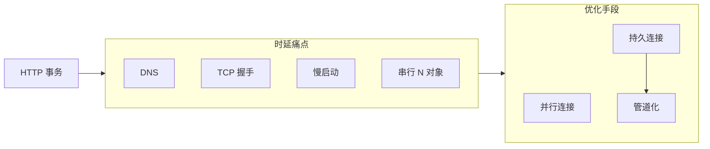

# 第4章 连接管理

> 全书：[../README.md](../README.md) · 前章：[ch03 报文](../chapter-03-http-message/chapter-summary.md) · 后章：[ch05 服务器](../chapter-05-web-server/chapter-summary.md)

## 本章概述

HTTP 跑在 **TCP** 之上：建连握手、慢启动、Nagle、TIME_WAIT 直接拖累事务时延。通过 **`Connection` 逐跳首部**、**并行**、**持久连接**、**管道** 与正确**关闭/截尾**策略优化；HTTP/1.1 **默认持久**，并限制每主机持久连接数。非幂等 **POST** 禁止盲目管道化与自动重试。

---

## 知识框架

| 节 | 关键词 |
|----|--------|
|  **4.1** | 时延分解、延迟 ACK、Nagle、TIME_WAIT |
|  **4.2** | 四元组、segment、Socket |
|  **4.3** | Connection 逐跳、哑代理、串行 |
|  **4.4** | 并行、带宽瓶颈 |
|  **4.5** | Keep-Alive、1.1 默认持久、哑代理 |
|  **4.6** | 管道、顺序、POST 禁管道 |
|  **4.7** | Content-Length、幂等重试、半关闭 |
|  **4.8** | 每主机 2 持久 / ~4 并行 |

---

## 重点 & 难点

| 易错点 | 正确理解 |
|--------|----------|
| `Connection` 可端到端转发 | **代理必须剥除**及所列首部 |
| 并行一定更快 | 带宽饱和时**无效**，还压服务器 |
| 1.1 要发 Keep-Alive 才持久 | **默认持久**，用 `Connection: close` 关闭 |
| 管道任意方法 | **非幂等 POST 禁止** |
| 关 socket 输入没事 | 可能 **RST** 丢对端已发响应 |
| 断连即 body 结束 | 无 **Content-Length/chunked** 不可信 |

---

## 实操要点

- Wireshark：同一页面多 TCP 流 vs 单流多 `HTTP` 请求  
- `curl -v` 看 `Connection:` 与是否复用  
- 压测时观察 **TIME_WAIT**、源端口耗尽（`ss -s` / `netstat`）  
- 对比首访与**复用连接**的 TTFB  

---

## 小节索引

| 书节 | 文件 |
|------|------|
| 4.1 | [01-connection-desire.md](./01-connection-desire.md) |
| 4.2 | [02-tcp-connection.md](./02-tcp-connection.md) |
| 4.3 | [03-http-connection.md](./03-http-connection.md) |
| 4.4 | [04-parallel-connection.md](./04-parallel-connection.md) |
| 4.5 | [05-persistent-connection.md](./05-persistent-connection.md) |
| 4.6 | [06-pipeline-connection.md](./06-pipeline-connection.md) |
| 4.7 | [07-close-connection.md](./07-close-connection.md) |
| 4.8 | [08-connection-limit.md](./08-connection-limit.md) |

### 交叉链接

- [ch01 §1.6 TCP 七步](../chapter-01-http-overview/06-connection.md)  
- [ch03 首部](../chapter-03-http-message/05-header.md)  
- [ch10 HTTP/2](../chapter-10-http-ng/chapter-summary.md)  
- [TCP/IP 慢启动/重传](../../TCP-IP-Volume1-Protocols/chapter14-tcp-timeout-retransmit/study.md)

---

## 自测

1. TCP 四元组是哪四个字段？  
2. 为何小页面 HTTP 时间一半花在 TCP 上？  
3. 代理为何必须删除 `Connection` 首部？  
4. HTTP/1.1 如何默认关闭持久连接？  
5. 为何不能对 POST 做管道化？  
6. TIME_WAIT 如何导致端口耗尽？
