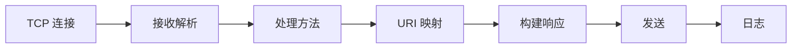

# 第5章 Web服务器

> 全书：[../README.md](../README.md) · 前章：[ch04 连接](../chapter-04-connection-management/chapter-summary.md) · 后章：[ch06 代理](../chapter-06-proxy/chapter-summary.md)

## 本章概述

Web 服务器实现 **HTTP + TCP + 资源管理**：从软件（Apache/Nginx）到嵌入式设备，处理事务都遵循 **七步**——建连、收请求、处理、映射资源、构建响应、发送、记日志。性能取决于 **并发 I/O 模型**；安全取决于 **docroot 边界、目录索引、访问控制**；持久连接要求 **精确的响应长度**。

---

## 知识框架

| 节 | 关键词 |
|----|--------|
|  **5.1** | 软件/设备/嵌入式 |
|  **5.2** | type-o-serve 调试 |
|  **5.3** | **七步模型** |
|  **5.4** | 反向 DNS、ident |
|  **5.5** | 解析、epoll/多线程 |
|  **5.6** | GET/POST body 规则 |
|  **5.7** | docroot、虚拟主机、CGI、SSI |
|  **5.8** | MIME、3xx |
|  **5.9** | Keep-Alive + Content-Length |
|  **5.10** | access log → ch21 |

---

## 重点 & 难点

| 易错 | 要点 |
|------|------|
| 生产开 HostnameLookups | **拖慢**，默认关 |
| 依赖 ident 识别用户 | 公网**不可靠** |
| GET 带 body | **违反语义** |
| 允许目录索引 | **泄露**目录结构 |
| Keep-Alive 无正确长度 | **整连接瘫痪** |

---

## 实操要点

- 本地起 `python -m http.server` 或 Nginx，对照七步  
- 故意错 `Content-Length` 观察浏览器挂起  
- 看 `access.log` 与 `error.log`  

---

## 小节索引

| 书节 | 文件 |
|------|------|
| 5.1 | [01-server-type.md](./01-server-type.md) |
| 5.2 | [02-type-o-serve.md](./02-type-o-serve.md) |
| 5.3 | [03-server-lifecycle.md](./03-server-lifecycle.md) |
| 5.4 | [04-accept-connection.md](./04-accept-connection.md) |
| 5.5 | [05-receive-request.md](./05-receive-request.md) |
| 5.6 | [06-process-request.md](./06-process-request.md) |
| 5.7 | [07-resource-mapping.md](./07-resource-mapping.md) |
| 5.8 | [08-build-response.md](./08-build-response.md) |
| 5.9 | [09-send-response.md](./09-send-response.md) |
| 5.10 | [10-logging.md](./10-logging.md) |

---

## 自测

1. 写出 Web 服务器处理事务的七步。  
2. 为何大站点禁用反向 DNS？  
3. 四种 I/O 模型各适合什么负荷？  
4. 如何防止 `../` 穿越 docroot？  
5. 持久连接上响应边界如何标明？
