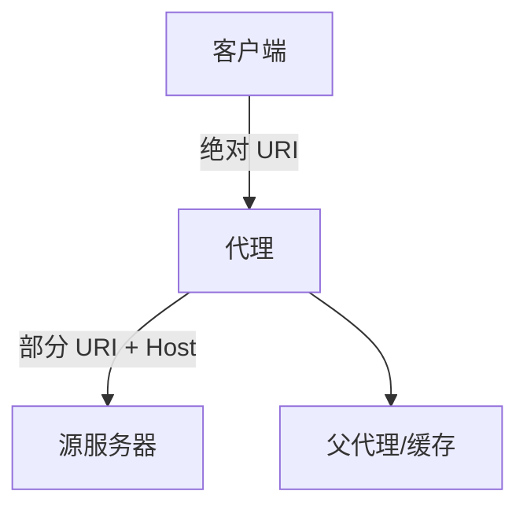

# 第6章 代理

> 全书：[../README.md](../README.md) · 前章：[ch05 服务器](../chapter-05-web-server/chapter-summary.md) · 后章：[ch07 缓存](../chapter-07-cache/chapter-summary.md)

## 本章概述

**HTTP 代理**同时扮演服务器与客户端；与**网关**（异构协议）相比现实中常重叠。用途涵盖过滤、认证、防火墙、**缓存**、**反向代理/CDN**、路由、转码、匿名。部署分出口/入口/反向/IX；流量通过 PAC、拦截、DNS、305 导入。请求 URI 对代理须为**绝对形式**；`Via`/`TRACE` 用于路径与环路；**407** 作代理认证；互操作要求**原样转发**未知首部。

---

## 知识框架

| 节 | 关键词 |
|----|--------|
|  **6.1** | 双重身份、私有/公共、代理 vs 网关 |
|  **6.2** | 八大场景、匿名 vs Cookie |
|  **6.3** | 出口/反向、父子链、四种引流 |
|  **6.4** | 手工、PAC、WPAD |
|  **6.5** | 绝对/部分 URI、Host、自动补全陷阱 |
|  **6.6** | Via、TRACE、Max-Forwards |
|  **6.7** | 407、Proxy-Authenticate |
|  **6.8** | 转发未知首部、OPTIONS/Allow |

---

## 重点 & 难点

| 易错 | 要点 |
|------|------|
| 代理与网关绝对二分 | 产品常兼协议转换 |
| 给代理发相对 URI | 需 **Host** 或拦截上下文 |
| 显式代理 + 短主机名 | 浏览器**不补全** |
| 删 Cookie 匿名 | 破坏会话站点 |
| 改 Allow / 首部顺序 | **禁止** |

---

## 实操要点

- 系统/浏览器代理 + PAC 文件  
- `curl -x http://proxy:port http://example.com/` 看绝对 URI  
- 响应里找 `Via:`  

---

## 小节索引

| 书节 | 文件 |
|------|------|
| 6.1 | [01-middleman.md](./01-middleman.md) |
| 6.2 | [02-why-use-proxy.md](./02-why-use-proxy.md) |
| 6.3 | [03-proxy-placement.md](./03-proxy-placement.md) |
| 6.4 | [04-client-proxy-settings.md](./04-client-proxy-settings.md) |
| 6.5 | [05-proxy-request-issues.md](./05-proxy-request-issues.md) |
| 6.6 | [06-trace-message.md](./06-trace-message.md) |
| 6.7 | [07-proxy-auth.md](./07-proxy-auth.md) |
| 6.8 | [08-proxy-interop.md](./08-proxy-interop.md) |

---

## 自测

1. 代理与网关协议层面的定义差异？  
2. 反向代理（替代物）主要服务谁？  
3. PAC 里 `DIRECT` 表示什么？  
4. 为何发给代理要用绝对 URI？  
5. `Via` 如何发现环路？  
6. 407 与 401 区别？
