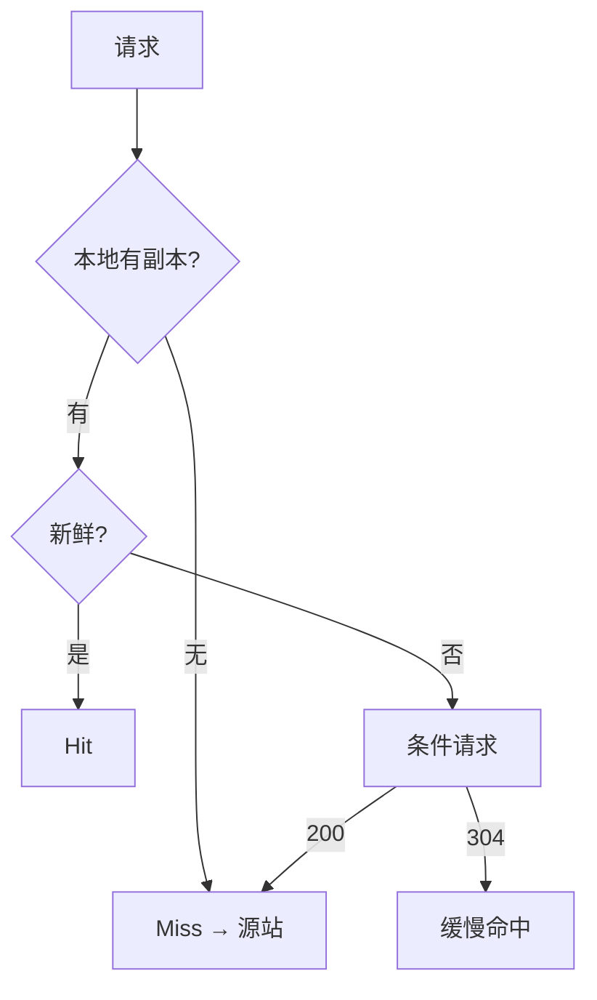

# 第7章 缓存

> 全书：[../README.md](../README.md) · 前章：[ch06 代理](../chapter-06-proxy/chapter-summary.md) · 后章：[ch08 网关](../chapter-08-gateway-tunnel-relay/chapter-summary.md)

## 本章概述

**Web 缓存**通过本地副本消除**冗余传输**、缓解**带宽瓶颈**与**Flash Crowds**、缩短**距离时延**。请求结果为 **Hit / Miss / 再验证（304）**；用**文档命中率**与**字节命中率**衡量。拓扑含**浏览器私有缓存**、**公有代理**、父子层次与 **ICP/HTCP** 网状。代理缓存处理 GET 有**七步**；新鲜度靠 **`max-age`/`Expires`** 与 **`If-Modified-Since`/`If-None-Match`**；**`no-store`/`no-cache`** 勿混；**Age** 与 **freshness_lifetime** 决定能否直接服务。广告 PV 与缓存冲突，**Meter（RFC 2227）** 试图折中。

---

## 知识框架

| 节 | 关键词 |
|----|--------|
|  **7.1** | 冗余传输 |
|  **7.2** | WAN vs LAN 带宽 |
|  **7.3** | Flash Crowds |
|  **7.4** | RTT、就近 |
|  **7.5** | Hit/Miss/304、Age |
|  **7.6** | 私有/公有、父子、ICP |
|  **7.7** | 缓存七步 |
|  **7.8** | max-age、ETag、IMS |
|  **7.9** | no-store/no-cache、试探过期 |
|  **7.10** | Apache、勿用 META |
|  **7.11** | age vs lifetime |
|  **7.12** | 广告、Meter |

---

## 重点 & 难点

| 易错 | 要点 |
|------|------|
| no-cache = 不缓存 | **须再验证后才能用** |
| no-store vs no-cache | store 禁止存；cache 可存但慎用 |
| 有 ETag 仍只用 IMS | 应 **`If-None-Match`** |
| 改响应 `Date` | **禁止**（创建时间） |
| META 控缓存 | **不可靠** |
| 304 算 Hit？ | **缓慢命中**，仍访问源站 |

---

## 实操要点

- 响应头：`Cache-Control`、`Age`、`ETag`、`Last-Modified`  
- `curl -I` + `If-None-Match` 测 304  
- 浏览器 DevTools「from disk cache」/「304」  

---

## 小节索引

| 书节 | 文件 |
|------|------|
| 7.1–7.4 | [01](./01-redundant-transfer.md)–[04](./04-distance-latency.md) |
| 7.5 | [05-hit-miss.md](./05-hit-miss.md) |
| 7.6 | [06-cache-topology.md](./06-cache-topology.md) |
| 7.7 | [07-cache-steps.md](./07-cache-steps.md) |
| 7.8 | [08-freshness-revalidation.md](./08-freshness-revalidation.md) |
| 7.9 | [09-cache-control.md](./09-cache-control.md) |
| 7.10 | [10-configure-cache.md](./10-configure-cache.md) |
| 7.11 | [11-freshness-algorithm.md](./11-freshness-algorithm.md) |
| 7.12 | [12-cache-ads.md](./12-cache-ads.md) |

---

## 自测

1. 文档命中率与字节命中率分别优化什么？  
2. `no-store` 与 `no-cache` 区别？  
3. 304 响应是否传输 body？  
4. 为何需要 ETag？  
5. `Age` 首部谁累加？  
6. 缓存为何损害广告 PV？
