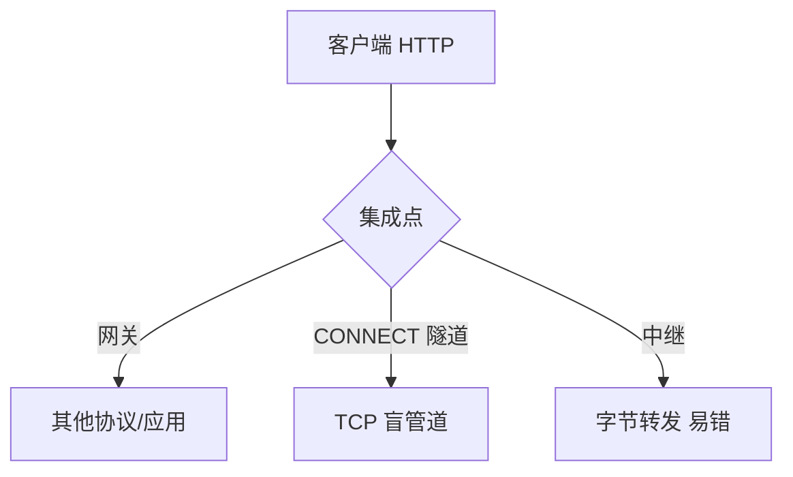

# 第8章 集成点：网关、隧道及中继

> 全书：[../README.md](../README.md) · 前章：[ch07 缓存](../chapter-07-cache/chapter-summary.md) · 后章：[ch09 机器人](../chapter-09-web-robot/chapter-summary.md)

## 本章概述

**网关**把 HTTP 接到其他协议或应用程序（**HTTP/\***、**\*/HTTP**）；**协议网关**含 FTP、SSL 卸载；**资源网关**经 **CGI/FastCGI/ISAPI** 生成动态内容。**SOAP** 代表 HTTP 上的程序间 XML 通信。**CONNECT 隧道**在防火墙上盲转发 TCP（尤其 **HTTPS**），代理不解密；与 **HTTPS 网关**（解密）相对。**盲中继**因不删 `Connection: Keep-Alive` 可导致**持久连接死锁**。

---

## 知识框架

| 节 | 关键词 |
|----|--------|
|  **8.1** | 翻译器、HTTP/*、*/HTTP |
|  **8.2** | FTP 网关、SSL 卸载、内网明文 |
|  **8.3** | CGI、FastCGI、ISAPI |
|  **8.4** | SOAP、Web 服务 |
|  **8.5** | CONNECT、200、SSL 隧道、443 限制 |
|  **8.6** | 盲中继、Keep-Alive 死锁 |
|  **8.7** | RFC、延伸阅读 |

---

## 重点 & 难点

| 易错 | 要点 |
|------|------|
| 代理 = 网关 | 代理常同协议；网关常**协议/应用转换** |
| SSL 隧道 vs SSL 网关 | 隧道**不解密**；网关**终止 TLS** |
| 卸载后内网 HTTP | **必须**保护网关↔源站链路 |
| 盲中继 + Keep-Alive | **死锁**；须删逐跳首部 |
| CONNECT 任意端口 | 应**限制**（如仅 443） |

---

## 实操要点

- `curl -v -x http://proxy:8080 https://example.com` 观察 **CONNECT**  
- 对比 Nginx `proxy_pass http://backend`（网关）与 `proxy_connect`（隧道）  

---

## 小节索引

| 书节 | 文件 |
|------|------|
| 8.1 | [01-gateway.md](./01-gateway.md) |
| 8.2 | [02-protocol-gateway.md](./02-protocol-gateway.md) |
| 8.3 | [03-resource-gateway.md](./03-resource-gateway.md) |
| 8.4 | [04-web-services.md](./04-web-services.md) |
| 8.5 | [05-tunnel.md](./05-tunnel.md) |
| 8.6 | [06-relay.md](./06-relay.md) |
| 8.7 | [07-more-info.md](./07-more-info.md) |

---

## 自测

1. HTTP/* 与 */HTTP 各表示什么？  
2. CGI 的性能瓶颈是什么？  
3. CONNECT 成功后代理还解析 HTTP 吗？  
4. SSL 隧道与 HTTPS 网关谁实现 TLS？  
5. 盲中继死锁的五步因果？  
6. 为何限制 CONNECT 端口？
