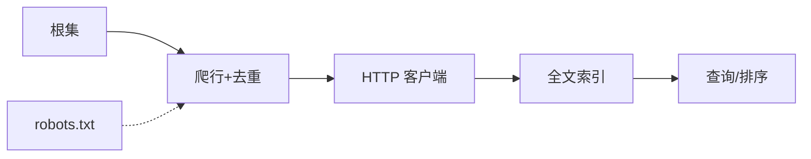

# 第9章 Web机器人

> 全书：[../README.md](../README.md) · 前章：[ch08 网关/隧道](../chapter-08-gateway-tunnel-relay/chapter-summary.md) · 后章：[ch10 HTTP-NG](../chapter-10-http-ng/chapter-summary.md)

## 本章概述

**Web 机器人**（爬虫）自动发 HTTP 事务：从**根集**出发，提取链接、**规范化 URL**、用散列表/位图/Bloom 等**去重**，防**环路/陷阱**，**BFS + 节流**。须发 **`User-Agent`/`Host`**，善用**条件请求**。不当爬虫可 **DoS**、404 风暴、抓敏感文件。**robots.txt** 与 **meta robots** 为自愿排除标准。业界要求**标识、限速、守 robots**。**搜索引擎** = 爬虫 + **倒排索引** + 查询网关 + **相关性排序**（链接流行度、反作弊）。

---

## 知识框架

| 节 | 关键词 |
|----|--------|
|  **9.1** | 根集、环路、规范化、陷阱、BFS、节流 |
|  **9.2** | User-Agent、Host、304、Refresh |
|  **9.3** | 失控、404、长 URL、敏感文件 |
|  **9.4** | robots.txt、Allow/Disallow、meta |
|  **9.5** | 礼貌指南 |
|  **9.6** | 倒排索引、PageRank、SEO 欺诈 |

---

## 重点 & 难点

| 易错 | 要点 |
|------|------|
| 爬虫不发 Host | 虚拟主机**内容错配** |
| URL 字符串不同 = 不同页 | 需**规范化**与别名处理 |
| robots 缓存太久 | 紧急规则延迟生效 |
| robots = 法律 | **自愿**；技术封禁另说 |
| 代理 vs 机器人 | 机器人是**客户端 Agent** |

---

## 实操要点

- `curl https://site/robots.txt`  
- 检查爬虫日志：同站 QPS、304 比例  
- DevTools 看 `User-Agent` 与响应差异  

---

## 小节索引

| 书节 | 文件 |
|------|------|
| 9.1 | [01-crawling.md](./01-crawling.md) |
| 9.2 | [02-robot-http.md](./02-robot-http.md) |
| 9.3 | [03-misbehaving-robots.md](./03-misbehaving-robots.md) |
| 9.4 | [04-robots-exclusion.md](./04-robots-exclusion.md) |
| 9.5 | [05-robot-guidelines.md](./05-robot-guidelines.md) |
| 9.6 | [06-search-engine.md](./06-search-engine.md) |

---

## 自测

1. 根集作用？环路三大危害？  
2. 为何要做 URL 规范化？  
3. 机器人为何必须发 Host？  
4. `Disallow: /private` 匹配规则？  
5. robots.txt 与 meta NOINDEX 区别？  
6. 倒排索引解决什么问题？
