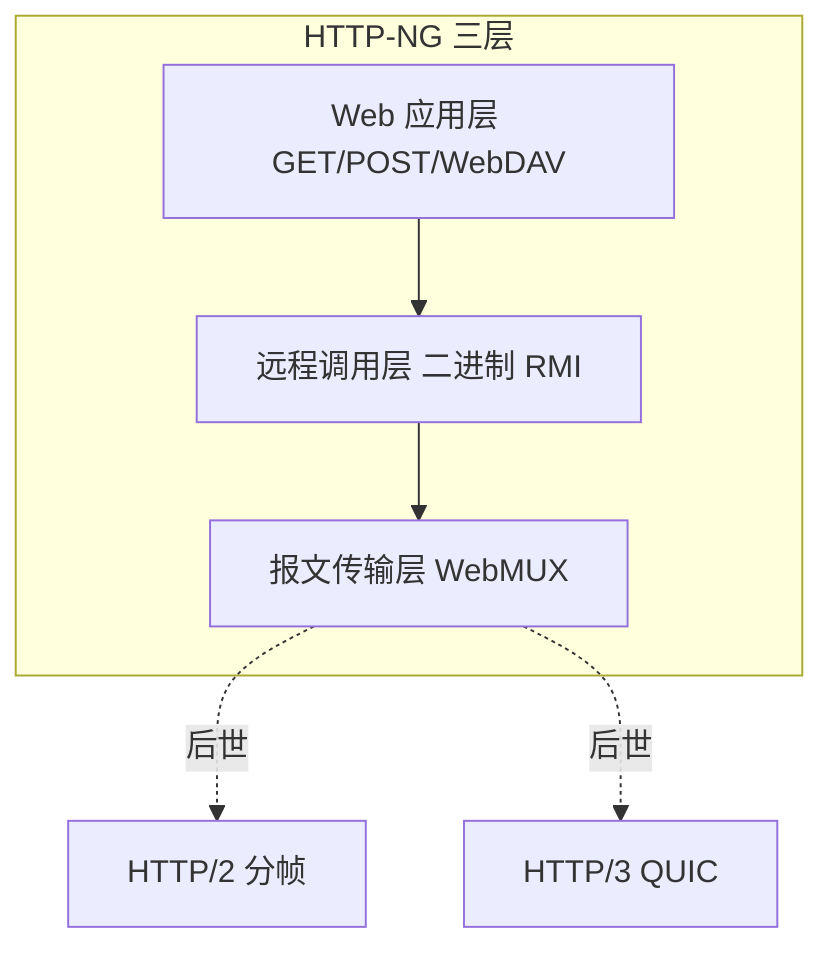

# 第10章 HTTP-NG

> 全书：[../README.md](../README.md) · 前章：[ch09 机器人](../chapter-09-web-robot/chapter-summary.md) · 后章：[ch11 Cookie](../chapter-11-client-id-cookie/chapter-summary.md)

## 本章概述

HTTP/1.x 面临**臃肿、难扩展、TCP 性能、栈耦合**等问题。1997 年 W3C **HTTP-NG** 试图三层重构：**报文传输（WebMUX）**、**远程调用（二进制协议）**、**Web 应用（HTTP 语义）**，并借鉴 **CORBA/DCOM** — 因**过复杂、破坏兼容**未普及。但其**多路复用、二进制、分段公平**等思想在 **SPDY/HTTP/2** 中重生；**HTTP/3/QUIC** 进一步解决传输依赖。

---

## 知识框架

| 节 | 关键词 |
|----|--------|
|  **10.1** | 复杂性、TCP、耦合 |
|  **10.2** | W3C、未采纳 |
|  **10.3** | 三层解耦 |
|  **10.4** | CORBA、过重 |
|  **10.5** | 多路复用、HOL |
|  **10.6** | RMI 层 |
|  **10.7** | HTTP 语义层 |
|  **10.8** | WebMUX |
|  **10.9** | 二进制线协议 |
|  **10.10** | 失败与遗产 → HTTP/2 |
|  **10.11** | W3C 草案 |

---

## 重点 & 难点

| 易错 | 要点 |
|------|------|
| HTTP-NG = HTTP/2 | NG **未标准化**；2/3 是不同路线 |
| NG 成功了吗 | **整体失败**，思想部分延续 |
| WebMUX 今天能用吗 | **历史草案** |
| 三层都要换吗 | 业界只接受了**传输层**类改进 |

---

## 实操要点

- 浏览器 DevTools 看 **h2** 协议  
- 对比 HTTP/1.1 多连接 vs HTTP/2 单连接多 Stream  

---

## 小节索引

| 书节 | 文件 |
|------|------|
| 10.1 | [01-problems.md](./01-problems.md) |
| 10.2 | [02-http-ng-activity.md](./02-http-ng-activity.md) |
| 10.3 | [03-modularity.md](./03-modularity.md) |
| 10.4 | [04-distributed-objects.md](./04-distributed-objects.md) |
| 10.5 | [05-message-transport.md](./05-message-transport.md) |
| 10.6 | [06-remote-invocation.md](./06-remote-invocation.md) |
| 10.7 | [07-web-application.md](./07-web-application.md) |
| 10.8 | [08-webmux.md](./08-webmux.md) |
| 10.9 | [09-binary-wire.md](./09-binary-wire.md) |
| 10.10 | [10-current-status.md](./10-current-status.md) |
| 10.11 | [11-more-info.md](./11-more-info.md) |

---

## 自测

1. HTTP-NG 想解决 HTTP/1 哪四类问题？  
2. 三层各负责什么？  
3. 为何分布式对象路线受阻？  
4. WebMUX 解决什么？  
5. HTTP-NG 与 HTTP/2 的关系？
