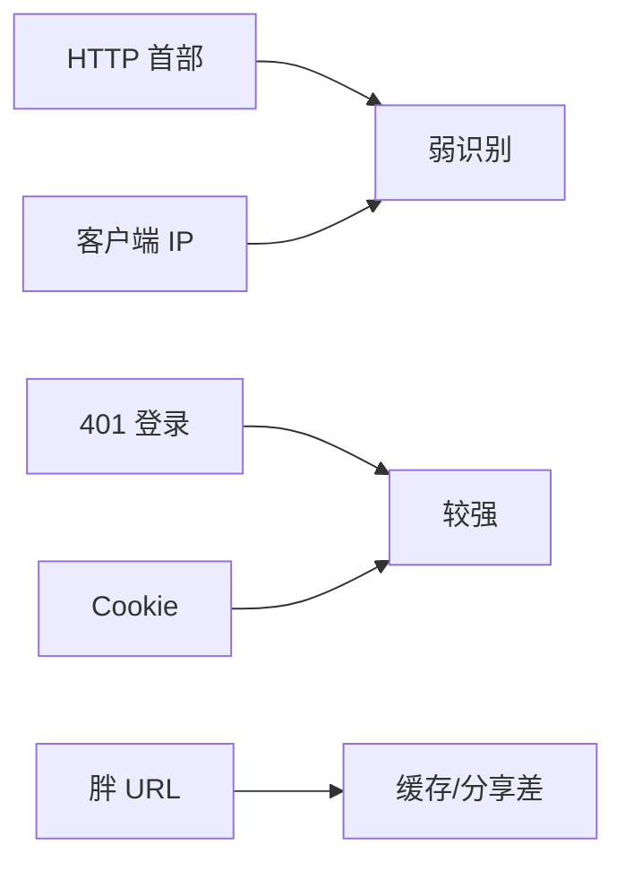

# 第11章 客户端识别与Cookie机制

> 全书：[../README.md](../README.md) · 前章：[ch10 HTTP-NG](../chapter-10-http-ng/chapter-summary.md) · 后章：[ch12 认证](../chapter-12-basic-auth/chapter-summary.md)

## 本章概述

HTTP **无状态**；识别用户靠：**首部**（From/UA/Referer，不可靠）、**IP**（NAT/代理/伪造）、**401 登录**、**胖 URL**（毁缓存、难分享）、**Cookie**（`Set-Cookie`/`Cookie`，Domain/Path 作用域）。须防 **Set-Cookie 响应被错误缓存**；第三方 Cookie 引发隐私争议。现代属性：`Secure`、`HttpOnly`、`SameSite`。

---

## 知识框架

| 节 | 关键词 |
|----|--------|
|  **11.1** | 无状态、五种技术 |
|  **11.2** | From、UA、Referer |
|  **11.3** | NAT、X-Forwarded-For |
|  **11.4** | 401、Authorization |
|  **11.5** | Fat URL、缓存失效 |
|  **11.6** | Session/Persistent、Domain/Path、缓存/隐私 |

---

## 重点 & 难点

| 易错 | 要点 |
|------|------|
| UA 当用户 ID | **可伪造、不唯一** |
| IP 当用户 ID | **共享、动态** |
| 缓存含 Set-Cookie 的页面 | **灾难性越权** |
| no-cache Cookie 响应 | 须显式 **Cache-Control** |
| Cookie v1 普及 | 生产以 **RFC 6265** 为准 |

---

## 实操要点

- DevTools：**Application → Cookies**  
- 看响应 `Set-Cookie` 的 Domain/Path/Max-Age  
- 对比登录前后 `Cookie` 请求头  

---

## 小节索引

| 书节 | 文件 |
|------|------|
| 11.1 | [01-personalization.md](./01-personalization.md) |
| 11.2 | [02-http-headers.md](./02-http-headers.md) |
| 11.3 | [03-client-ip.md](./03-client-ip.md) |
| 11.4 | [04-user-login.md](./04-user-login.md) |
| 11.5 | [05-fat-url.md](./05-fat-url.md) |
| 11.6 | [06-cookie.md](./06-cookie.md) |

---

## 自测

1. HTTP 为何说「无状态」？  
2. 五种识别技术各一句优缺点？  
3. 胖 URL 为何破坏公共缓存？  
4. Domain 与 Path 作用？  
5. 为何不能把带用户 Cookie 的响应共享缓存？
