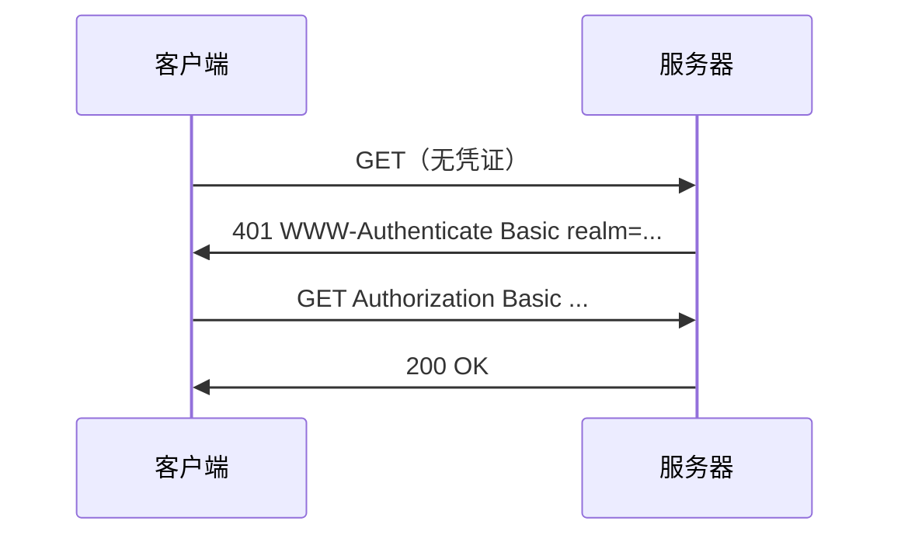

# 第12章 基本认证机制

> 全书：[../README.md](../README.md) · 前章：[ch11 Cookie](../chapter-11-client-id-cookie/chapter-summary.md) · 后章：[ch13 摘要认证](../chapter-13-digest-auth/chapter-summary.md)

## 本章概述

HTTP 用**质询/响应**保护资源：**401** + `WWW-Authenticate`（含 **realm**）→ 客户端 **`Authorization`**。**Basic** 将 `user:pass` 做 **Base-64**（非加密）；代理用 **407** / `Proxy-*` 首部。Basic 有明文、重放、无完整性等缺陷，**必须配 HTTPS** 或改用 Digest/Token。

---

## 知识框架

| 节 | 关键词 |
|----|--------|
|  **12.1** | 质询/响应、401、realm |
|  **12.2** | Basic、Base-64、407 代理 |
|  **12.3** | 重放、明文、HTTPS |
|  **12.4** | RFC 2617/7617 |

---

## 重点 & 难点

| 易错 | 要点 |
|------|------|
| Base-64 = 加密 | **可逆编码** |
| 401 vs 407 | 源站 vs **代理** |
| Basic 够安全吗 | **仅 HTTPS 下可接受** |
| realm 作用 | 区分**多套**凭据域 |

---

## 实操要点

- `curl -v -u user:pass https://example.com/`  
- 解码：`echo BASE64 | base64 -d`  

---

## 小节索引

| 书节 | 文件 |
|------|------|
| 12.1 | [01-authentication.md](./01-authentication.md) |
| 12.2 | [02-basic-auth.md](./02-basic-auth.md) |
| 12.3 | [03-security-flaws.md](./03-security-flaws.md) |
| 12.4 | [04-more-info.md](./04-more-info.md) |

---

## 自测

1. 认证四步各用什么状态码/首部？  
2. Basic Authorization 如何构成？  
3. 代理认证与源站认证首部有何不同？  
4. 为何 Base-64 不能防嗅探？  
5. 重放攻击是什么？
