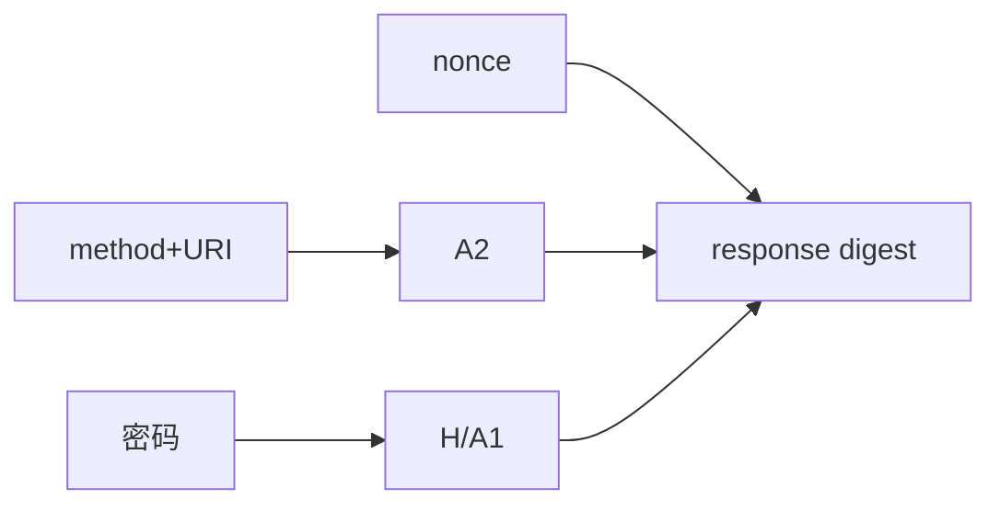

# 第13章 摘要认证

> 全书：[../README.md](../README.md) · 前章：[ch12 Basic](../chapter-12-basic-auth/chapter-summary.md) · 后章：[ch14 安全HTTP](../chapter-14-secure-http/chapter-summary.md)

## 本章概述

**摘要认证（Digest）** 不传密码，传 **MD5 等单向摘要**；**nonce** 防简单重放。计算含 **A1**（用户/realm/密码/nonce/cnonce）、**A2**（方法/URI/可选 body）、**qop**（`auth` / `auth-int`）。有 **`Authentication-Info`**（nextnonce、rspauth）。代理**改 URI** 会破坏摘要；带 `Authorization` 的响应**慎缓存**。仍面临降级、词典、MITM 等风险 → **必须 HTTPS**。

---

## 知识框架

| 节 | 关键词 |
|----|--------|
|  **13.1** | 不传密码、nonce、四步 |
|  **13.2** | A1、A2、KD、预授权、cnonce |
|  **13.3** | qop、auth-int、Authentication-Info |
|  **13.4** | 多重质询、URI 重写、缓存 |
|  **13.5** | 降级、词典、HTTPS |
|  **13.6** | RFC 2617/7616 |

---

## 重点 & 难点

| 易错 | 要点 |
|------|------|
| Digest = 加密 | **哈希指纹**，非 TLS |
| 无 nonce 就够 | 仍要防**重放** |
| 代理改 URI 没事 | **摘要会失败** |
| 有 Digest 不用 HTTPS | **仍要 TLS** |
| MD5 今天还上新系统吗 | **概念考试**；新系统用 HTTPS+Token |

---

## 实操要点

- 对比 401 里 `Basic` vs `Digest` 质询  
- `curl --digest -u user:pass -v URL`  

---

## 小节索引

| 书节 | 文件 |
|------|------|
| 13.1 | [01-digest-improvements.md](./01-digest-improvements.md) |
| 13.2 | [02-digest-computation.md](./02-digest-computation.md) |
| 13.3 | [03-qop-quality.md](./03-qop-quality.md) |
| 13.4 | [04-practical-issues.md](./04-practical-issues.md) |
| 13.5 | [05-security-considerations.md](./05-security-considerations.md) |
| 13.6 | [06-more-info.md](./06-more-info.md) |

---

## 自测

1. Digest 如何防「网络上发密码」？  
2. nonce 作用？  
3. A1 与 A2 各含什么？  
4. `auth-int` 多保护什么？  
5. 代理改 URI 为何导致失败？  
6. 为何仍需要 ch14 HTTPS？
