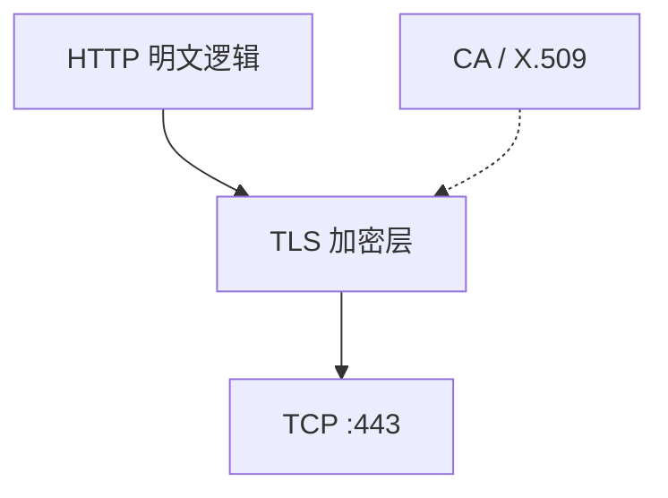

# 第14章 安全HTTP

> 全书：[../README.md](../README.md) · 前章：[ch13 Digest](../chapter-13-digest-auth/chapter-summary.md) · 后章：[ch15 实体](../chapter-15-entity-encoding/chapter-summary.md)

## 本章概述

**HTTPS** 在 HTTP 与 TCP 间插入 **TLS/SSL**：满足认证、完整性、加密等需求。**对称**加密快但密钥分发难（N²）；**公钥**解决分发，**混合加密**用握手传**会话密钥**再对称传数据。**数字签名**与 **X.509 证书（CA）** 验证服务器身份。默认 **`https://:443`**；证书验日期、CA、签名、**域名**；虚拟主机靠 **SNI**。经代理用 **CONNECT** 隧道。Basic/Digest 不能替代信道加密。

---

## 知识框架

| 节 | 关键词 |
|----|--------|
|  **14.1** | 安全属性、HTTPS 定位 |
|  **14.2** | 明文/密文、对称/非对称 |
|  **14.3** | DES/AES、128bit、N² 密钥 |
|  **14.4** | RSA、会话密钥、混合 |
|  **14.5** | 私钥签、公钥验 |
|  **14.6** | X.509、证书链 |
|  **14.7** | 握手、四步验证、SNI |
|  **14.8** | OpenSSL 步骤 |
|  **14.9** | CONNECT 隧道 |
|  **14.10** | RFC 2818/8446 |

---

## 重点 & 难点

| 易错 | 要点 |
|------|------|
| HTTPS = 另一种 HTTP 协议 | **HTTP over TLS**，语义不变 |
| 全程用公钥加密数据 | 仅握手；数据用**对称** |
| 有证书就绝对安全 | 还要验**域名、日期、CA** |
| 一 IP 多站一张证 | **SNI** 或多 IP |
| SSL 隧道 vs SSL 网关 | 隧道**不解密** → ch08 |

---

## 实操要点

- 浏览器查看证书链、有效期  
- `openssl s_client -connect host:443 -servername host`  
- Wireshark TLS 握手 + SNI  

---

## 小节索引

| 书节 | 文件 |
|------|------|
| 14.1–14.2 | [01](./01-protect-http.md)、[02](./02-digital-crypto.md) |
| 14.3–14.6 | [03](./03-symmetric-key.md)–[06](./06-digital-cert.md) |
| 14.7–14.9 | [07](./07-https-details.md)–[09](./09-proxy-tunnel.md) |
| 14.10 | [10-more-info.md](./10-more-info.md) |

---

## 自测

1. HTTPS 在协议栈插在哪一层？  
2. 为何需要混合加密？  
3. 证书验证四步？  
4. CONNECT 解决什么问题？  
5. SNI 解决什么？
