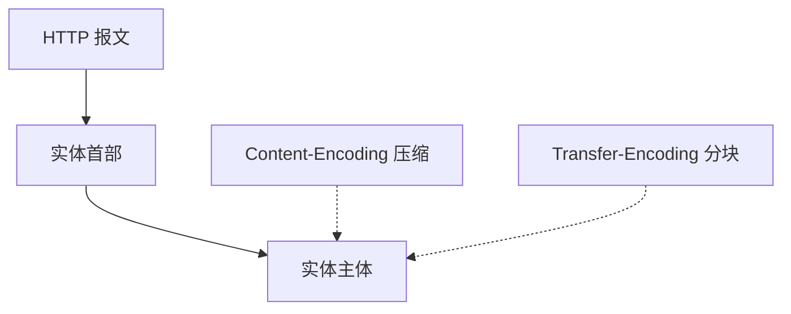

# 第15章 实体和编码

> 全书：[../README.md](../README.md) · 前章：[ch14 HTTPS](../chapter-14-secure-http/chapter-summary.md) · 后章：[ch16 国际化](../chapter-16-internationalization/chapter-summary.md)

## 本章概述

**实体** = 实体首部 + 主体（货物）；报文是「箱子」。**`Content-Length`** 指编码后大小；定长**五条规则**；**chunked** 用 0 块结束。**`Content-Type`** / **multipart**；**`Content-Encoding`**（gzip）vs **`Transfer-Encoding`**（chunked）。**ETag/Last-Modified** 与缓存新鲜度；**Range → 206**；**差异编码 226** 少见。与 [ch03 §3.6](../chapter-03-http-message/06-entity.md)、[ch07](../chapter-07-cache/chapter-summary.md) 紧密相关。

---

## 知识框架

| 节 | 关键词 |
|----|--------|
|  **15.1** | 箱子/货物、实体首部 |
|  **15.2** | Content-Length、五条规则 |
|  **15.3** | Content-MD5 |
|  **15.4** | MIME、charset、multipart |
|  **15.5** | gzip、Accept-Encoding |
|  **15.6** | chunked、Trailer |
|  **15.7** | 实例、IM |
|  **15.8** | ETag、Cache-Control |
|  **15.9** | Range、206 |
|  **15.10** | Delta、226 |
|  **15.11** | RFC |

---

## 重点 & 难点

| 易错 | 要点 |
|------|------|
| CL = 原始文件大小 | **内容编码后**的字节数 |
| TE 与 CL 同时存在 | **忽略 Content-Length** |
| Content-Encoding vs TE | **压内容** vs **怎么传** |
| chunked 结束 | **0 块**，非关连接 |
| 范围请求 | 需**同一实例** |

---

## 实操要点

- `curl -H "Accept-Encoding: gzip" -v`  
- `curl -H "Range: bytes=0-99" -D - -o /dev/null URL`  
- Wireshark：chunked 重组  

---

## 小节索引

| 书节 | 文件 |
|------|------|
| 15.1–15.6 | [01](./01-entity-cargo.md)–[06](./06-transfer-chunked.md) |
| 15.7–15.11 | [07](./07-instances.md)–[11](./11-more-info.md) |

---

## 自测

1. 实体首部与报文首部的空行分界？  
2. 定长五条优先级前三条？  
3. gzip 后 Content-Length 变吗？  
4. chunked 如何结束？  
5. 206 需要什么请求首部？
