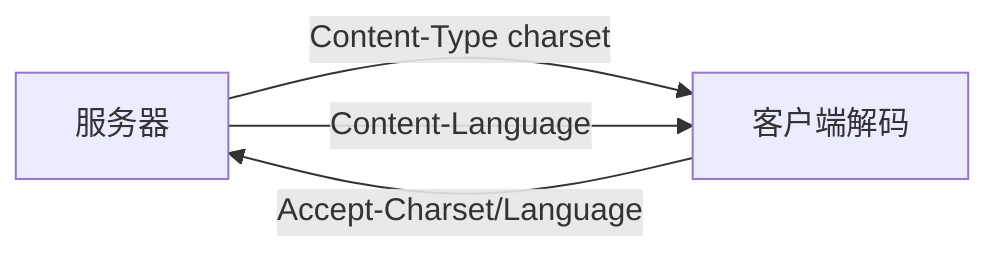

# 第16章 国际化

> 全书：[../README.md](../README.md) · 前章：[ch15 实体](../chapter-15-entity-encoding/chapter-summary.md) · 后章：[ch17 内容协商](../chapter-17-content-negotiation-transcode/chapter-summary.md)

## 本章概述

HTTP 实体是**二进制容器**；服务器用 **`Content-Type; charset`**、**`Content-Language`** 声明；客户端用 **`Accept-Charset`**、**`Accept-Language`**（**q 值**）协商。乱码多因 **charset 错**；MIME `charset` 实为编码方案+字符集。URI 仅 **ASCII + % 转义**；首部须 ASCII；DNS 用 **Punycode/IDN**。与 [ch17](../chapter-17-content-negotiation-transcode/chapter-summary.md) 紧密衔接。

---

## 知识框架

| 节 | 关键词 |
|----|--------|
|  **16.1** | 声明、Accept-*、q |
|  **16.2** | charset、META 降级 |
|  **16.3** | 字符/字形、UTF-8 |
|  **16.4** | en-US、Content-Language |
|  **16.5** | %转义、二次转义 |
|  **16.6** | 首部 ASCII、Punycode |

---

## 重点 & 难点

| 易错 | 要点 |
|------|------|
| charset = 字符集名字 | 是**解码算法**标签 |
| URI 直接 %D6 西欧字符 | 须 **UTF-8 字节再 %** |
| Content-Language = 正文语言 | 是**受众**语言 |
| 无 charset 头 | 默认常 iso-8859-1 |
| Accept-Charset 有响应首部 | **没有**；看 Content-Type |

---

## 实操要点

- 查看响应 `Content-Type; charset=utf-8`  
- 故意错 charset 观察乱码  
- `idn_to_ascii` / 浏览器看 `xn--` 域  

---

## 小节索引

| 书节 | 文件 |
|------|------|
| 16.1 | [01-intl-content-support.md](./01-intl-content-support.md) |
| 16.2 | [02-charset-http.md](./02-charset-http.md) |
| 16.3 | [03-charset-fundamentals.md](./03-charset-fundamentals.md) |
| 16.4 | [04-language-tags.md](./04-language-tags.md) |
| 16.5 | [05-intl-uri.md](./05-intl-uri.md) |
| 16.6 | [06-other-considerations.md](./06-other-considerations.md) |

---

## 自测

1. 服务器如何声明字符集与语言？  
2. `Accept-Language: fr, en;q=0.8` 含义？  
3. 字符与字形区别？  
4. URI 空格如何编码？  
5. IDN 与 Punycode 解决什么？
