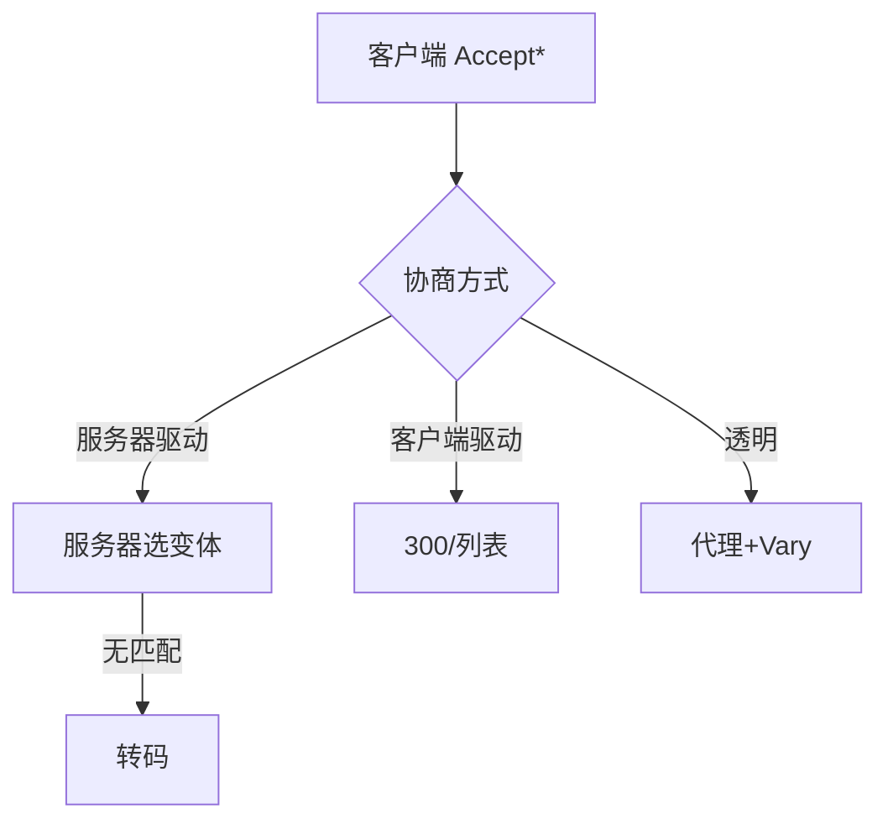

# 第17章 内容协商与转码

> 全书：[../README.md](../README.md) · 前章：[ch16 国际化](../chapter-16-internationalization/chapter-summary.md) · 后章：[ch18 托管](../chapter-18-web-hosting/chapter-summary.md)

## 本章概述

同一 URL 可有多个**变体**。协商方式：**客户端驱动**（300/列表，两次请求）、**服务器驱动**（**Accept\*** + **q**）、**透明协商**（代理 + **`Vary`**）。无匹配时可 **转码**（格式转换、信息综合、内容注入）。静态预生成 vs 边缘转码权衡。海量变体带来匹配与缓存成本。

---

## 知识框架

| 节 | 关键词 |
|----|--------|
|  **17.1** | 变体、三种协商 |
|  **17.2** | 300、两次请求 |
|  **17.3** | Accept、q、Apache |
|  **17.4** | Vary、Alternate |
|  **17.5** | 转码三类 |
|  **17.6** | 性能局限 |
|  **17.7** | RFC 2295/7231 |

---

## 重点 & 难点

| 易错 | 要点 |
|------|------|
| Accept 与 Content-Type 混用 | 请求 vs **响应** 首部 |
| q=0 | **拒绝**该选项 |
| Vary 越多越好 | **命中率**下降 |
| 转码 = 压缩 | 可能**改内容语义** |

---

## 实操要点

- 对比 `Accept-Language` 与 `Content-Language`  
- 看 CDN 响应 `Vary: Accept-Encoding`  
- `curl -H "Accept-Language: zh-CN" -I`  

---

## 小节索引

| 书节 | 文件 |
|------|------|
| 17.1 | [01-content-negotiation.md](./01-content-negotiation.md) |
| 17.2 | [02-client-driven-negotiation.md](./02-client-driven-negotiation.md) |
| 17.3 | [03-server-driven-negotiation.md](./03-server-driven-negotiation.md) |
| 17.4 | [04-transparent-negotiation.md](./04-transparent-negotiation.md) |
| 17.5 | [05-transcode.md](./05-transcode.md) |
| 17.6 | [06-next-steps.md](./06-next-steps.md) |
| 17.7 | [07-more-info.md](./07-more-info.md) |

---

## 自测

1. 三种协商各由谁选变体？  
2. `Accept-Language: fr;q=0` 含义？  
3. Vary 作用？  
4. 客户端驱动为何慢？  
5. 转码三类各举一例？
