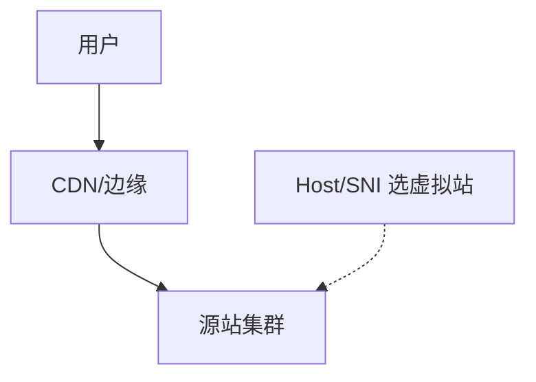

# 第18章 Web主机托管

> 全书：[../README.md](../README.md) · 前章：[ch17 内容协商](../chapter-17-content-negotiation-transcode/chapter-summary.md) · 后章：[ch19 发布](../chapter-19-publishing-system/chapter-summary.md)

## 本章概述

**主机托管**外包存储与管理；**专用托管**提供独享资源。**虚拟主机**多域共享一机：HTTP/1.0 无主机名 → 路径/端口/虚拟 IP 权宜；**HTTP/1.1 `Host`**（缺则 400）为最终解；**HTTPS** 配 **SNI**。可靠性靠**镜像集群**、**CDN**、**Surrogate** 与拦截缓存；加速靠**就近**与**压缩**（ch15）。

---

## 知识框架

| 节 | 关键词 |
|----|--------|
|  **18.1** | Hosting、Dedicated |
|  **18.2** | 虚拟 IP、**Host**、SNI |
|  **18.3** | 集群、CDN、Surrogate |
|  **18.4** | 近、gzip |
|  **18.5** | RFC 3040 |

---

## 重点 & 难点

| 易错 | 要点 |
|------|------|
| 1.0 请求只有路径 | 无法虚拟主机 |
| 无 Host 的 1.1 | **400** |
| 代理丢 Host | 打到错误虚拟站 |
| HTTPS 单 IP 多域 | 要 **SNI** |
| CDN = 只有缓存 | 含源站、反向代理 |

---

## 实操要点

- `curl -v -H "Host: other.example" http://IP/`  
- 看证书 SAN 与 SNI  
- 对比 CDN 与源站响应头 `Via`/`Age`  

---

## 小节索引

| 书节 | 文件 |
|------|------|
| 18.1 | [01-hosting-service.md](./01-hosting-service.md) |
| 18.2 | [02-virtual-hosting.md](./02-virtual-hosting.md) |
| 18.3 | [03-reliability.md](./03-reliability.md) |
| 18.4 | [04-performance.md](./04-performance.md) |
| 18.5 | [05-more-info.md](./05-more-info.md) |

---

## 自测

1. HTTP/1.0 虚拟主机为何困难？  
2. Host 首部四条硬性规则？  
3. 虚拟 IP 托管的局限？  
4. Surrogate 与源站关系？  
5. 加速两大手段？
