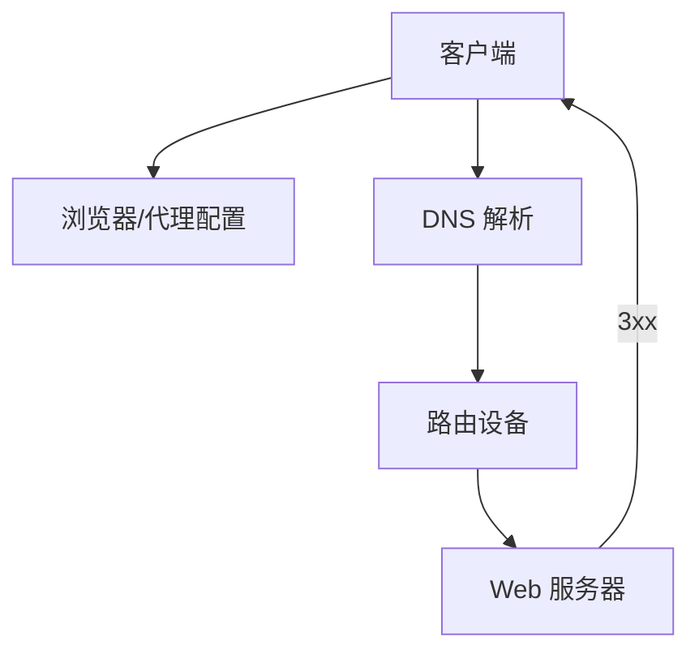

# 20.3 重定向协议概览

> 本章：[chapter-summary.md](./chapter-summary.md#ch20-3) · [ch04 连接](../chapter-04-connection-management/chapter-summary.md)

## 本节核心目标

建立**多层机制**全景：从浏览器配置到 HTTP 响应，报文如何被导向可用服务器。

---

## 共同目标

尽快把报文送到**可用 Web 服务器**。

---

## 五类机制（由近及远）

| 层级 | 机制 | 说明 |
|------|------|------|
| **应用** | 浏览器代理配置 | 报文先发给代理 |
| **应用** | **DNS** | 按地域/策略返回不同 IP |
| **网络** | 交换机/路由器 | 按 TCP/IP 选路 |
| **应用** | **HTTP 重定向** | 服务器用 3xx + `Location` 反弹 |
| **专用** | LB 设备协议 | MAC/NAT/WCCP 等（见 20.4–20.6） |

---

## 拓展（预留）

- **OSI 分层**：应用层（HTTP/DNS）→ 传输/网络层（IP 路由）→ 数据链路（MAC 转发）  

---

## 抓包/实操记录

（待填：`dig` 多次看 DNS 轮转）

---

## 疑问与总结

**重定向是跨层技术栈**；单一 302 只是其中一环。
