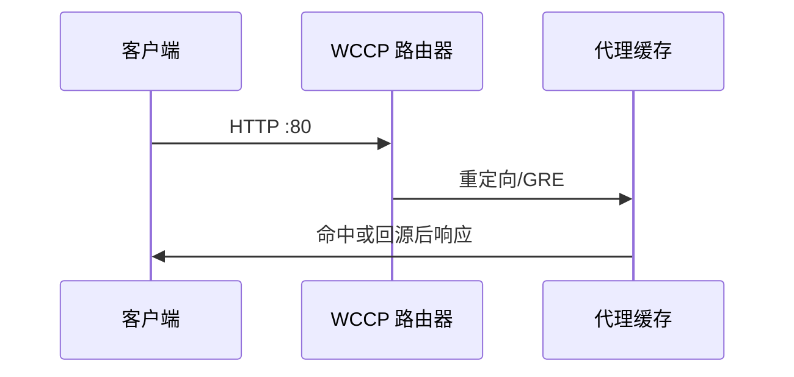

# 20.6 缓存重定向方法

> 本章：[chapter-summary.md](./chapter-summary.md#ch20-6) · [ch07 缓存拓扑](../chapter-07-cache/06-cache-topology.md#ch07-6-hierarchy)

## 本节核心目标

理解面向**缓存代理**的、**内容感知**的重定向 — **WCCP**。

---

## WCCP（Web 缓存协调协议）

Cisco 提出：让**路由器**把 Web 流量重定向到**代理缓存**。

### 工作流程

1. **WCCP 路由器**与缓存建**服务组**  
2. 检查 HTTP（常针对**端口 80**），把匹配流量导向缓存 IP  
3. 转发方式：**GRE 封装**（保留客户端源 IP）或 **IP MAC 转发**  
4. **心跳**检测成员；在缓存间做 LB  

---

## 拓展（预留）

- **iptables/Netfilter** 透明代理 vs WCCP 拦截差异  

---

## 抓包/实操记录

（待填）

---

## 疑问与总结

**WCCP = 在网络边缘把 HTTP 偷送到缓存**，客户端无感。
