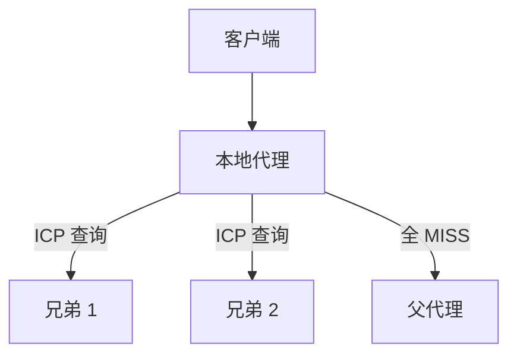

# 20.7 因特网缓存协议（ICP）

> 本章：[chapter-summary.md](./chapter-summary.md#ch20-7) · [ch07 兄弟缓存](../chapter-07-cache/06-cache-topology.md#ch07-6-mesh)

## 本节核心目标

理解 **ICP** 如何在兄弟缓存间做 **HIT/MISS** 查询与层次结构。

---

## 核心机制

| 步骤 | 说明 |
|------|------|
| **未命中** | 代理向**兄弟缓存**发 ICP 查询（含 **URL**） |
| **响应** | **HIT** / **MISS** |
| **选路** | 据响应选获取位置；全 MISS → 上交**父代理** |

---

## 层次结构

→ [ch07 网状/层次拓扑](../chapter-07-cache/06-cache-topology.md)

---

## 痛点（易错）

- 各代理**独立冗余**缓存同一对象  
- 兄弟间**大量复制**与 ICP 查询流量  
- 广域网高 RTT 下查询开销大  

---

## 拓展（预留）

- ICP 为何被 **Hash 分布**（CARP、一致性哈希）取代  

---

## 抓包/实操记录

（待填）

---

## 疑问与总结

**ICP = 用 URL 问邻居「你有没有」** — 简单但粗、冗余多。
