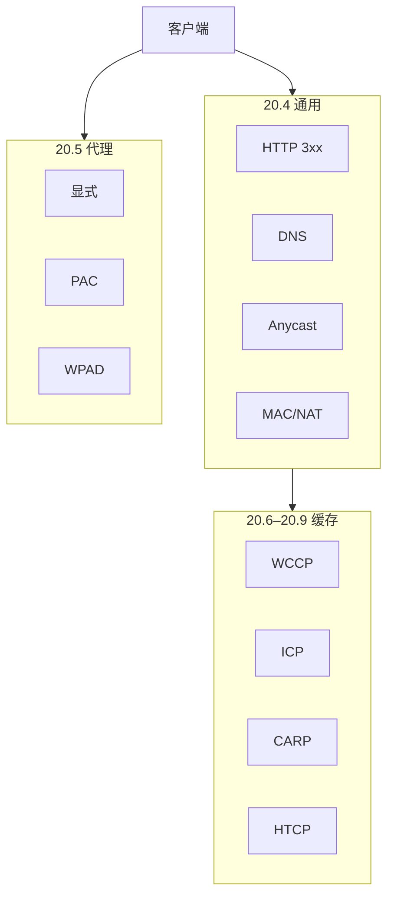

# 第20章 重定向与负载均衡

> 全书：[../README.md](../README.md) · 前章：[ch19 发布](../chapter-19-publishing-system/chapter-summary.md) · 后章：[ch21 日志](../chapter-21-log-tracking/chapter-summary.md)

## 本章概述

为满足**可靠、低时延、省带宽**，HTTP 流量经多层**重定向**导向最佳副本或代理。端点含服务器、代理、缓存、网关；机制从**浏览器/DNS/路由**到 **HTTP 3xx**、**DNS 轮转**、**任播**、**MAC/NAT**、**NECP**。代理发现：**显式 → PAC → WPAD**。缓存侧：**WCCP** 路由器引流；兄弟协作 **ICP**（URL 查询）→ **CARP**（Hash 去冗余）→ **HTCP**（首部级 + 策略）。

---

## 知识框架

| 节 | 关键词 |
|----|--------|
|  **20.1** | 可靠、时延、带宽；LB 共存 |
|  **20.2** | 服务器 vs 代理重定向 |
|  **20.3** | DNS、路由、HTTP 多层 |
|  **20.4** | 302、DNS RR、任播、MAC、NAT、NECP |
|  **20.5** | PAC、WPAD |
|  **20.6** | WCCP、GRE |
|  **20.7** | ICP HIT/MISS |
|  **20.8** | CARP 散列 |
|  **20.9** | HTCP、Vary |

---

## 重点 & 难点

| 易错 | 要点 |
|------|------|
| 重定向 = 302 | **跨层**总称 |
| DNS 轮转很均衡 | **缓存**导致单客户端粘在一台 |
| HTTP 302 最好 | 多 **RTT**、重定向机单点 |
| 完全 NAT | 源站**看不到**真实客户端 IP |
| ICP 够用了 | **Vary** 下会错误命中 → HTCP |
| CARP 加机器无痛 | 故障/扩缩容要**重算 Hash** |

---

## 实操要点

- `curl -I` 看重定向链与 `Location`  
- `dig` 多次观察多 A 记录与 TTL  
- 对比 PAC 中 `DIRECT` vs `PROXY`  

---

## 小节索引

| 书节 | 文件 |
|------|------|
| 20.1 | [01-why-redirect.md](./01-why-redirect.md) |
| 20.2 | [02-where-redirect.md](./02-where-redirect.md) |
| 20.3 | [03-redirect-overview.md](./03-redirect-overview.md) |
| 20.4 | [04-general-redirect-methods.md](./04-general-redirect-methods.md) |
| 20.5 | [05-proxy-redirect.md](./05-proxy-redirect.md) |
| 20.6 | [06-cache-redirect-wccp.md](./06-cache-redirect-wccp.md) |
| 20.7 | [07-icp.md](./07-icp.md) |
| 20.8 | [08-carp.md](./08-carp.md) |
| 20.9 | [09-htcp.md](./09-htcp.md) |

---

## 自测

1. 重定向要解决的三个目标？  
2. HTTP 302 重定向的两项主要缺点？  
3. DNS 轮转为何不「完美」？  
4. PAC 与 WPAD 区别？  
5. ICP vs CARP vs HTCP 各解决什么问题？
