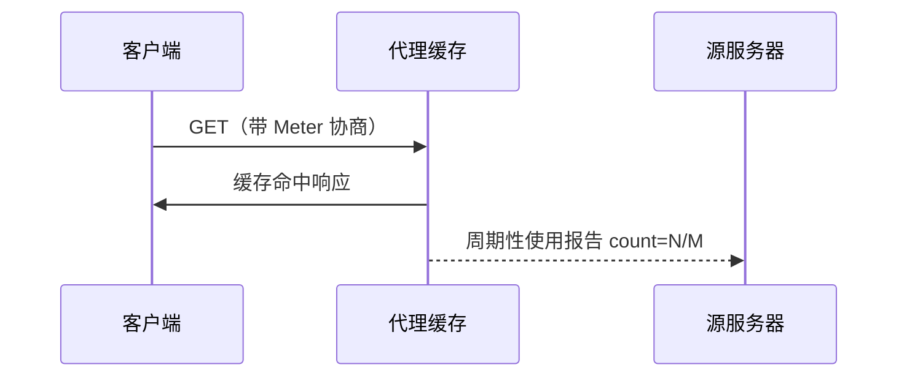

# 21.3 命中率测量

> 本章：[chapter-summary.md](./chapter-summary.md#ch21-3) · [ch07.12 缓存与广告](../chapter-07-cache/12-cache-ads.md#ch07-12-meter) · [ch07 命中率](../chapter-07-cache/05-hit-miss.md)

## 本节核心目标

理解缓存导致**源站日志不准**的问题，以及 **Hit-Metering（RFC 2227）** 与 **`Meter`** 首部。

---

## 问题：缓存遮蔽真实访问量

缓存拦截本发往源站的请求 → 源站 **PV/UV 统计偏低**。

内容方（尤其**按展示付费的广告**）需要准确计数。

→ [ch07.12 广告两难](../chapter-07-cache/12-cache-ads.md#ch07-12-dilemma)

---

## Cache Busting 恶性循环

发布者将页面标为**不可缓存**，强迫请求打到源站：

- ✓ 日志准确  
- ✗ 网络变慢、源站负荷上升、**缓存效益被摧毁**

→ [ch07.12 Cache Busting](../chapter-07-cache/12-cache-ads.md#ch07-12-busting)

---

## 命中率测量协议（RFC 2227）

HTTP 扩展：代理**周期性向源站汇报**缓存访问统计 — 在保持缓存性能的同时补全计数。

---

## 21.3.2 `Meter` 首部

客户端/缓存与服务器通过 **`Meter`** 交换使用情况指令。

### 缓存 → 服务器

| 指令 | 含义 |
|------|------|
| `will-report-and-limit` | 承诺汇报并遵守次数限制 |
| `count=N/M` | 汇报命中数 N、验证重用数 M 等 |

### 服务器 → 缓存

| 指令 | 含义 |
|------|------|
| `max-uses=N` | 汇报前最多服务 N 次 |
| `do-report` | 强制代理发送使用报告 |

---

## 拓展（预留）

- Meter **未广泛部署** → 业界改用 **Tracking Pixel**、**1×1 GIF**、**Beacon API** 绕过缓存统计  
- 与 ch07 广告章、前端埋点生态衔接  

---

## 抓包/实操记录

（待填：页面中 1×1 像素请求是否 `Cache-Control: no-store`）

---

## 疑问与总结

**Meter 试图调和「缓存提速」与「源站要数」— 现实中多靠前端埋点替代。**
