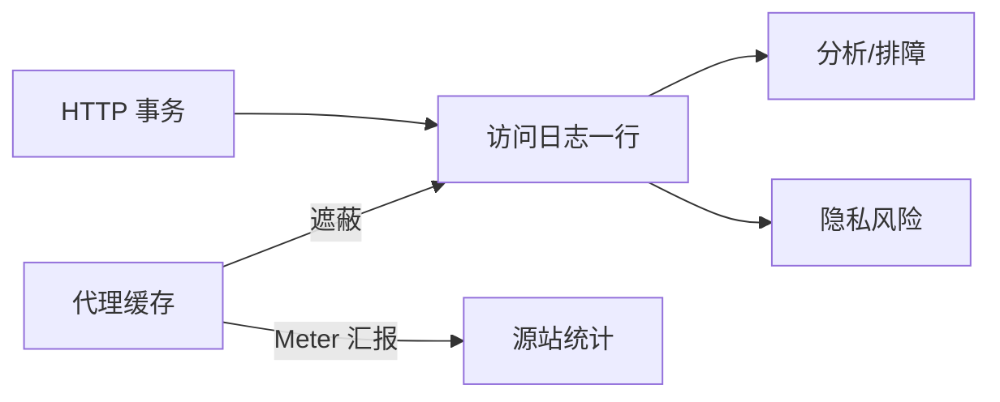

# 第21章 日志记录与使用情况跟踪

> 全书：[../README.md](../README.md) · 前章：[ch20 重定向](../chapter-20-redirect-load-balance/chapter-summary.md) · [ch05 服务器日志](../chapter-05-web-server/10-logging.md)

## 本章概述

服务器与代理为**排障、统计、安全、计费**记录 HTTP 事务**摘要**（非全量首部）。标准格式 **CLF / Combined** 便于分析工具接入；代理侧有 **Netscape Extended**、**Squid**（`TCP_HIT`/`TCP_MISS` 等）。缓存使源站 PV 失真 → **Cache Busting** 损害性能；**RFC 2227 Meter** 首部试图让代理周期性汇报命中。日志含 IP、Referer、User-Agent 等 → **隐私与合规**（告知、最小化、GDPR/CCPA）。

---

## 知识框架

| 节 | 关键词 |
|----|--------|
|  **21.1** | 方法、URL、状态码、Referer、UA |
|  **21.2** | CLF、Combined、Squid action-code |
|  **21.3** | Cache busting、Meter、RFC 2227 |
|  **21.4** | 透明记录、滥用、合规 |

---

## 重点 & 难点

| 易错 | 要点 |
|------|------|
| 日志记全部首部 | **一行摘要**即可 |
| Combined = CLF | Combined **多** Referer + UA |
| 缓存不影响统计 | 源站 **PV 偏低** |
| Cache busting 双赢 | **牺牲**缓存与性能换计数 |
| Meter 已普及 | **少见**；埋点/像素更常见 |
| 日志无害 | IP+Referer = **行为画像** |

---

## 实操要点

- 读一条 Apache **Combined** 日志各字段  
- 对照 Squid `TCP_HIT` / `TCP_MISS`  
- 检查站点是否用像素/beacon 补统计  

---

## 小节索引

| 书节 | 文件 |
|------|------|
| 21.1 | [01-log-content.md](./01-log-content.md) |
| 21.2 | [02-log-formats.md](./02-log-formats.md) |
| 21.3 | [03-hit-metering.md](./03-hit-metering.md) |
| 21.4 | [04-privacy.md](./04-privacy.md) |

---

## 自测

1. 日志四大用途？  
2. CLF 与 Combined 差哪两个字段？  
3. `TCP_REFRESH_MISS` 含义？  
4. Cache busting 为何是恶性循环？  
5. `Meter` 首部 `max-uses=N` 谁发给谁？
